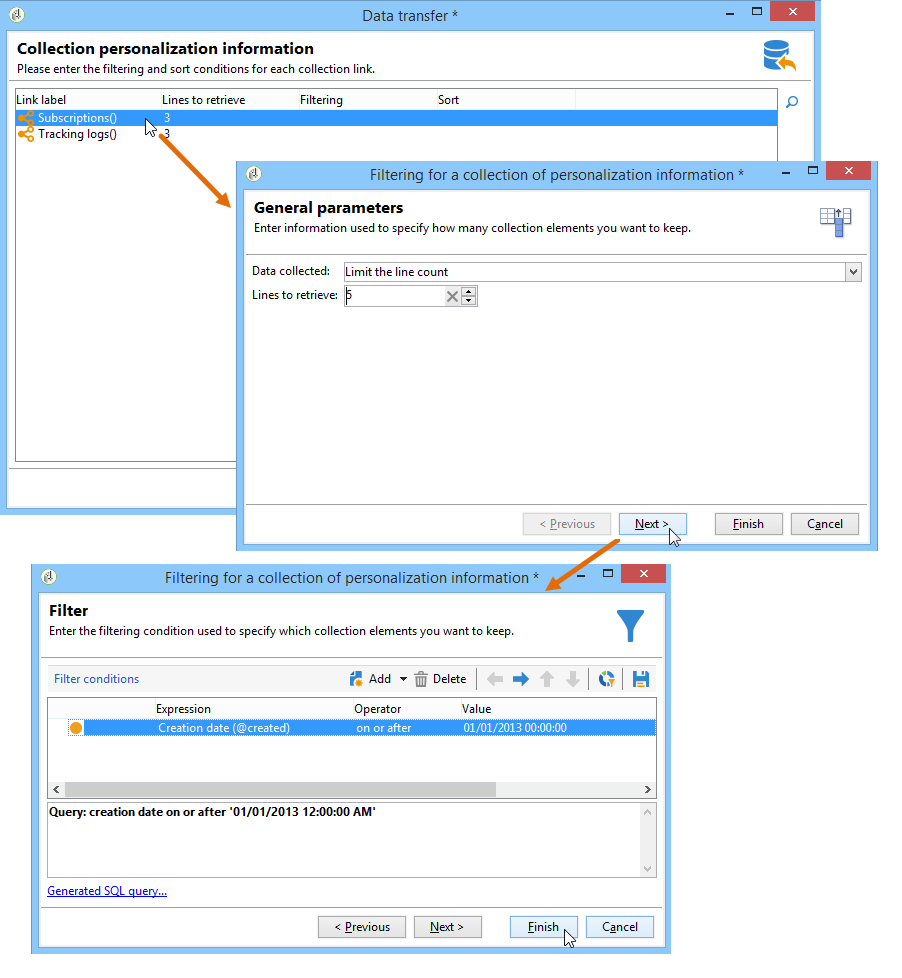

# 配置导出作业 {#executing-export-jobs}

导出作业允许您访问数据库并从数据库中提取数据：联系人、客户端、列表、区段等。

例如，使用营销活动跟踪数据（跟踪历史记录等）会很有用 在电子表格中。 输出数据可以是 txt、CSV、TAB 或 XML 格式。

导出助手允许您配置导出、定义其选项并启动执行。 它是一系列屏幕，其内容取决于导出类型（简单或多个）和操作员的权限。

创建新导出作业后，将显示导出助手（请参阅[创建导入和导出作业](../../platform/using/creating-import-export-jobs.md)）。

## 第1步 — 选择导出模板 {#step-1---choosing-the-export-template}

启动导出助理时，必须首先选择模板。 例如，要配置最近注册的收件人的导出，请按照以下步骤操作：

1. 选择&#x200B;**[!UICONTROL Profiles and Targets > Job > Generic imports and exports]**&#x200B;文件夹。
1. 点击 **New**，然后点击 **Export** 以创建导出模板。

   

1. 单击&#x200B;**[!UICONTROL Export template]**&#x200B;字段右侧的箭头以选择您的模板，或单击&#x200B;**[!UICONTROL Select link]**&#x200B;以浏览树。

   本机模板为&#x200B;**[!UICONTROL New text export]**。 不得修改此模板，但您可以复制它以配置新模板。 默认情况下，导出模板保存在&#x200B;**[!UICONTROL Resources > Templates > Job templates]**&#x200B;节点中。

1. 在&#x200B;**[!UICONTROL Label]**&#x200B;字段中输入导出名称。 您可以添加描述。
1. 选择导出类型。 有两种可能的导出类型：**[!UICONTROL Simple export]**&#x200B;用于仅导出一个文件，而&#x200B;**[!UICONTROL Multiple export]**&#x200B;用于从一种或多种类型的源文档在单次执行中导出多个文件。

## 第 2 步 - 要导出的文件类型 {#step-2---type-of-file-to-export}

选择要导出的文档类型，即要导出的数据模式。

默认情况下，从&#x200B;**[!UICONTROL Jobs]**&#x200B;节点启动导出时，数据来自收件人表。 从数据列表（从&#x200B;**[!UICONTROL right click > Export]**&#x200B;菜单）启动导出时，数据所属的表会自动填充到&#x200B;**[!UICONTROL Document type]**&#x200B;字段中。

* 默认情况下，**[!UICONTROL Download the file generated on the server after the export]**&#x200B;选项处于选中状态。 在&#x200B;**[!UICONTROL Local file]**&#x200B;字段中，填写要创建的文件的名称和路径，或单击字段右侧的文件夹浏览本地磁盘。 您可以取消选择此选项以输入服务器输出文件的访问路径和名称。

  >[!NOTE]
  >
  >始终在服务器上执行自动导入和导出作业。
  >
  >要仅导出部分数据，请单击&#x200B;**[!UICONTROL Advanced parameters]**&#x200B;并在相应的字段中输入要导出的行数。

* 您可以创建差异导出，以仅导出自上次执行以来修改的记录。 为此，请单击&#x200B;**[!UICONTROL Advanced parameters]**&#x200B;链接，单击&#x200B;**[!UICONTROL Differential export]**&#x200B;选项卡，然后选择&#x200B;**[!UICONTROL Activate differential export]**。

  

  必须输入上次修改的日期。 它可以从字段中检索或计算。

## 步骤3 — 定义输出格式 {#step-3---defining-the-output-format}

选择导出文件的输出格式。 可以使用以下格式：文本、固定列文本、CSV 和 XML。

* 对于&#x200B;**[!UICONTROL Text]**&#x200B;格式，选择分隔符以分隔列（制表符、逗号、分号或自定义）和字符串（单引号、双引号或无）。
* 对于&#x200B;**[!UICONTROL text]**&#x200B;和&#x200B;**[!UICONTROL CSV]**，您可以选择选项&#x200B;**[!UICONTROL Use first lines as column titles]**。
* 指示日期格式和数字格式。 为此，请单击相关字段的&#x200B;**[!UICONTROL Edit]**&#x200B;按钮并使用编辑器。
* 对于包含枚举值的字段，可以选择&#x200B;**[!UICONTROL Export labels instead of internal values of enumerations]**。 例如，标题可以以&#x200B;**1=Mr格式存储。**，**2=小姐**，**3=太太。**。 如果选择此选项，将导出 **Mr.****、Miss** 和 **Mrs.**。

## 第 4 步 - 数据选择 {#step-4---data-selection}

选择要导出的字段。 操作步骤：

1. 双击&#x200B;**[!UICONTROL Available fields]**&#x200B;列表中的所需字段以将其添加到&#x200B;**[!UICONTROL Output columns]**&#x200B;部分。
1. 使用清单右侧的箭头定义输出文件中字段的顺序。

   

1. 单击&#x200B;**[!UICONTROL Add]**&#x200B;按钮以调用函数。 有关详细信息，请参阅[函数列表](../../platform/using/defining-filter-conditions.md#list-of-functions)。

## 步骤5 — 对列排序 {#step-5---sorting-columns}

选择列的排序顺序。

## 第 6 步 - 筛选条件 {#step-6---filter-conditions-}

可添加筛选条件以避免导出所有数据。 此筛选的配置与投放助手中的收件人定位相同。 请参见[此页面](../../delivery/using/steps-defining-the-target-population.md)。

## 第 7 步 – 设定数据格式 {#step-7---data-formatting}

您可以修改输出文件的字段顺序和标签，并将转换应用于源数据。

* 要更改要导出的列的顺序，请选择相关列，然后使用表右侧的蓝色箭头。
* 要更改字段的标签，请单击&#x200B;**[!UICONTROL Label]**&#x200B;列中与要修改的字段匹配的单元格，然后输入新标签。 按键盘上的Enter进行确认。
* 要将案例转换应用于字段的内容，请从&#x200B;**[!UICONTROL Transformation]**&#x200B;列中选择它。 您可以选择：

   * 切换到小写
   * 切换到大写
   * 首字母大写

  

* 如果要创建新的计算字段（例如，包含姓氏+名字的列），请单击&#x200B;**[!UICONTROL Add a calculated field]**。 有关详细信息，请参阅[计算字段](../../platform/using/executing-import-jobs.md#calculated-fields)。

如果要导出元素集合（例如，收件人的订阅，它们所属的清单等），则必须指定要导出的集合中的元素数量。

## 第 8 步 - 数据预览 {#step-8---data-preview}

单击&#x200B;**[!UICONTROL Start the preview of the data]**&#x200B;预览导出结果。 默认情况下，会显示前200行。 要更改此值，请单击&#x200B;**[!UICONTROL Lines to display]**&#x200B;字段右侧的箭头。

单击助理器底部的选项卡，从列结果预览切换到XML结果。 您还可以查看生成的 SQL 查询。

## 步骤9 — 启动导出 {#step-9---launching-the-export}

单击&#x200B;**[!UICONTROL Start]**&#x200B;启动数据导出。

然后，您可以监视导入作业的执行（请参阅[监视作业执行](../../platform/using/monitoring-jobs-execution.md)）。
