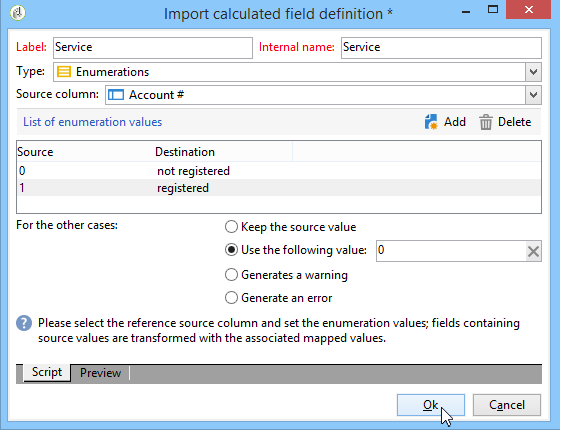
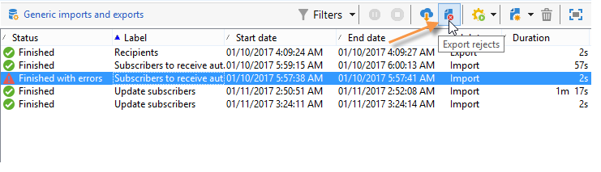

# 配置导入作业 {#executing-import-jobs}

Adobe Campaign允许您以文本、CSV、TAB或XML格式将数据从一个或多个文件导入数据库。 这些文件与表（主表或链接的表）相关联，并且源文件的每个字段与数据库的字段相关联。

>[!NOTE]
>
>您可以导入数据，而无需使用 **[!UICONTROL Import a list]** 函数。 然后，可通过以下方式将数据专门用于工作流中 **[!UICONTROL Read list]** 对象。 有关详细信息，请参见[此页面](../../workflow/using/read-list.md)。

导入向导允许您配置导入、定义导入的选项（如数据转换）并启动执行。 它是一系列屏幕，其内容取决于导入类型（简单或多个）和操作员权限。

创建新导入作业后，将显示导入向导(请参阅 [创建导入和导出作业](../../platform/using/creating-import-export-jobs.md).

>[!NOTE]
>
>如果使用 IIS Web 服务器，则可能需要通过配置授权上传大文件 (> 28 MB)。有关更多信息，请参见[此章节](../../installation/using/integration-into-a-web-server-for-windows.md#changing-the-upload-file-size-limit)。

## 源文件 {#source-file}

在源文件中，每行与一条记录重合。记录中的数据由分隔符（空格、制表符、字符等）分隔。这意味着以列的形式检索数据，并且每列与数据库的字段相关联。

## 步骤1 — 选择导入模板 {#step-1---choosing-the-import-template}

启动导入向导时，首先必须选择模板。例如，要配置导入收到简报的收件人，请按照以下步骤操作：

1. 选择 **[!UICONTROL Profiles and Targets > Job > Generic imports and exports]** 文件夹。
1. 点击 **New**，然后点击 **Import** 以创建导入模板。

   

1. 单击右侧的箭头 **[!UICONTROL Import template]** 字段以选择您的模板，或单击 **[!UICONTROL Select link]** 以浏览树。

   本地模板为 **[!UICONTROL New text import]**. 不得修改此模板，但您可以根据您的要求复制它以配置新模板。默认情况下，导入模板保存在 **[!UICONTROL Profiles and targets > Templates > Job templates]** 节点。

1. 在中为此导入输入一个名称 **[!UICONTROL Label]** 字段。 您可以添加描述。
1. 在相应字段中选择导入类型。有两种可能的导入类型： **[!UICONTROL Simple import]** 仅导入一个文件，并且 **[!UICONTROL Multiple import]** 以在一次执行中导入多个文件。

   对于多次导入，请选择 **[!UICONTROL Multiple import]** 从 **[!UICONTROL Import type]** 导入向导第一个屏幕中的下拉列表。

   

1. 通过单击指定要导入的字段 **[!UICONTROL Add]**.

   

   每次添加文件时， **[!UICONTROL File to import]** 将显示向导。 请参阅部分 [步骤2 — 源文件选择](#step-2---source-file-selection) 并按照向导中的步骤将导入选项定义为简单导入。

   >[!NOTE]
   >
   >Multiple import 应仅用于满足特定需求，不是建议的选项。

### 高级参数 {#advanced-parameters}

此 **[!UICONTROL Advanced parameters]** 链接可让您访问以下选项：

* **[!UICONTROL General]** 选项卡

   * **[!UICONTROL Stop execution if there are too many rejects]**

      默认选中此选项。如果要继续执行导入而不考虑拒绝次数，可以取消选择。默认情况下，如果拒绝前 100 行，则停止执行。

   * **[!UICONTROL Trace mode]**

      选择此选项可追踪每行的导入执行情况。

   * **[!UICONTROL Start the job in a detached process]**

      默认选中此选项。它允许您分离导入的执行，使其不会影响数据库中正在进行的其他作业。

   * **[!UICONTROL Do not update enumerations]**

      选择此选项可避免扩大数据库中的枚举值清单。参见 [管理明细列表](../../platform/using/managing-enumerations.md).

* **[!UICONTROL Variables]** 选项卡

   您可以定义与可在查询编辑器和计算字段中访问的作业关联的变量。要创建变量，请单击 **[!UICONTROL Add]** 并使用变量编辑器。

   >[!IMPORTANT]
   >
   >此 **[!UICONTROL Variables]** 选项卡仅用于工作流类型编程，且仅应由专家用户配置。

## 第 2 步 - 源文件选择 {#step-2---source-file-selection}

源文件可以是文本格式（txt、csv、tab、固定列）或 xml。

默认情况下， **[!UICONTROL Upload file on the server]** 已选中。 单击右侧的文件夹 **[!UICONTROL Local file]** 字段，以浏览本地磁盘并选择要导入的文件。 您可以取消选择此选项以输入访问路径以及要在服务器上导入的文件名。

指定文件后，可通过单击在窗口的下部查看其数据 **[!UICONTROL Auto-detect format]**. 此预览显示源文件的前 200 行。

使用此视图上方提供的选项配置导入。通过这些选项定义的参数将传输到预览中。可以使用以下选项：

* **[!UICONTROL Click here to change the file format...]** 用于检查文件格式并微调配置。
* **[!UICONTROL Update on server...]** 用于将本地文件传输到服务器。 此选项仅在以下情况下可用 **[!UICONTROL Upload file on the server]** 已选中。
* **[!UICONTROL Download]** 仅当文件已上载到服务器上时可用。
* **[!UICONTROL Auto-detect format]** 用于重新初始化数据源的格式。 利用此选项，可将原始格式重新应用到已通过 **[!UICONTROL Click here to change the file format...]** 选项。
* 此 **[!UICONTROL Advanced parameters]** 链接允许您筛选源数据并访问高级选项。 在此屏幕中，您可以选择仅导入部分文件。您还可以定义筛选器，例如，根据相应行的值仅导入“潜在客户”或“客户”类型的用户。这些选项仅供专业 JavaScript 用户使用。

### 更改文件格式 {#changing-the-file-format}

此 **[!UICONTROL Click here to change the file format...]** 选项允许您设置源文件数据的格式，尤其是指定列分隔符和每个字段的数据类型。 此配置通过以下窗口执行：

此步骤允许您描述应如何读取文件字段的值。例如，在日期的情况下，日期或日期+时间数据可以与某种格式（dd/mm/yyyy、mm/dd/yy 等）相关联。如果输入数据与预期格式不匹配，则在导入期间将发生拒绝。

您可以在窗口下部的预览区域中查看配置结果。

单击 **[!UICONTROL OK]** 要保存格式，请单击 **[!UICONTROL Next]** 以显示下一步。

## 第 3 步 - 字段映射 {#step-3---field-mapping}

然后，您必须选择目标模式并将每列的数据映射到数据库中的字段。

* 此 **[!UICONTROL Destination schema]** 字段允许您选择数据将导入到的架构。 此信息是强制性的。单击 **[!UICONTROL Select link]** 图标以选择其中一个现有架构。 单击 **[!UICONTROL Edit link]** 以显示所选表的内容。
* 中央表显示源文件中定义的所有字段。选择要导入的字段以将目标文件与它们相关联。可以手动或自动映射这些字段。

   要手动映射字段，请点击复选框以选择源字段，然后点击第二列以激活与所选字段映射的单元格。接下来，单击 **[!UICONTROL Edit expression]** 图标以显示当前表格的所有字段。 选择目标字段并单击 **[!UICONTROL OK]** 以验证映射。

   要自动关联源字段和目标字段，请单击 **[!UICONTROL Guess the destination fields]** 字段列表右侧的图标。 如果需要，可以修改建议的字段。

   >[!IMPORTANT]
   >
   >在继续执行下一步之前，务必验证此操作的结果。

* 您可以将转换应用于导入的字段。要执行此操作，请单击 **[!UICONTROL Transformation]** 与相关字段相关的列，并选择要应用的转换。

   

   >[!IMPORTANT]
   >
   >转换在导入时应用。但是，如果已定义了对目标字段的约束（在上面的示例中为 @lastname 字段），则这些约束优先。

* 您可以使用位于中央表右侧的相应图标添加计算字段。通过计算字段，您可以执行复杂的转换，添加虚拟列或合并多列的数据。有关各种可能性的详细信息，请参见以下部分。

### 计算字段 {#calculated-fields}

计算字段是添加到源文件并从其他列计算所得到的新列。然后，计算字段可以与 Adobe Campaign 数据库的字段相关联。但是，在计算字段中无法进行对帐操作。

有四种类型的计算字段：

* **[!UICONTROL Fixed string]**：对于源文件的所有行，计算字段的值都相同。 允许您设置插入或更新的记录的字段值。例如，您可以为所有导入的记录将标记设置为“是”。
* **[!UICONTROL String with JavaScript tags]**：计算字段的值是包含JavaScript命令的字符串。
* **[!UICONTROL JavaScript expression]**：计算字段的值是JavaScript函数的计算结果。 返回的值可以是数字、日期等。
* **[!UICONTROL Enumeration]**：字段的值根据源文件中包含的值进行属性。 编辑器允许您指定源列并输入枚举值清单，如以下示例所示：

   

   此 **[!UICONTROL Preview]** 选项卡用于查看定义的配置的结果。 在此， **[!UICONTROL Subscription]** 已添加列。 该值通过 **Status** 字段计算。

   

## 第 4 步 – 调解 {#step-4---reconciliation}

导入向导的调解步骤允许您定义将文件中的数据与数据库中的现有数据进行调解的模式，并设置文件数据和数据库数据之间的优先级规则。配置窗口如下所示：

屏幕的中央部分包含一个树状结构，其中包含要导入数据的 Adobe Campaign 数据库的字段和表。

每个节点（表或字段）都有特殊选项。点击清单中的相关节点时，其参数和简要说明将显示在下方。为每个元素定义的行为会显示在相应的 **[!UICONTROL Behavior]** 列。

### 操作类型 {#types-of-operation}

对于与导入相关的每个表，都必须定义操作类型。以下操作可用于数据库的主要元素：

* **[!UICONTROL Update or insertion]**：如果记录存在于数据库中，则更新记录，否则创建记录。
* **[!UICONTROL Insertion]**：将记录插入数据库。
* **[!UICONTROL Update]**：仅更新现有记录（忽略其他记录）。
* **[!UICONTROL Reconciliation only]**：在数据库中查找记录，但不执行更新。 例如，允许您根据文件列关联要导入的收件人文件夹，而不更新文件夹中的数据。
* **[!UICONTROL Deletion]**：用于销毁数据库中的记录。

导入所涉及的表中的每个字段都有以下选项：

* **[!UICONTROL Update (empty) if source value is empty]**：在更新时，如果源文件中的字段为空，则字段中的值将删除数据库值。 否则，保留数据库字段。
* **[!UICONTROL Update only if destination is empty]**：除非数据库字段为空，否则源文件中的值不会覆盖数据库字段中的值。 在这种情况下，它采用源文件的值。
* **[!UICONTROL Update the field only when the record is inserted]**：在更新或插入操作期间，将只导入新的源文件记录。

>[!NOTE]
>
>除非在没有重复数据删除的情况下插入，否则合并关键项的定义始终是&#x200B;**强制**&#x200B;的。

### 合并关键项 {#reconciliation-keys}

必须至少填写一个合并关键项才能管理重复数据删除。

合并关键项是用于标识记录的一组字段。例如，要导入收件人，协调键值可以是帐号、“email”字段或“Last name， First name， Company”字段等。

在这种情况下，要查明文件的某一行是否与数据库中的现有收件人匹配，导入引擎会将该文件的值与该键的所有字段的数据库值进行比较。当字段特定于记录时，可以执行源数据和目标数据之间的精细比较，从而保证导入后数据的完整性。可以为同一个表填写第二个合并关键项；它用于第一个关键项为空的行。

避免选择在导入期间可能被修改的字段；如果发生这种情况，引擎可能会创建额外的记录。

>[!NOTE]
>
>对于收件人导入，所选文件夹的标识符将隐含地添加到密钥中。
>
>因此，仅对此文件夹执行调解（除非未选择任何文件夹）。

### 重复数据删除 {#deduplication}

>[!NOTE]
>
>“double”是指在要导入的文件中存在两次或更多次的项目。
>
>“duplicate”是指同时存在于要导入的文件和数据库中的项目。

此 **[!UICONTROL Management of doubles]** 字段用于配置重复数据删除。 重复数据删除涉及&#x200B;**源文件**&#x200B;中多次出现的记录（或多文件导入时的源文件），即合并关键项的字段相同的行。

* 中的重复管理 **[!UICONTROL Update]** 模式（默认模式）不执行重复数据删除。 因此，最后一条记录具有优先权（因为它更新了先前记录的数据）。在此模式下不执行重复计数。
* 中的重复管理 **[!UICONTROL Ignore]** 模式或 **[!UICONTROL Reject entity]** 从导入中排除重复项。 在这种情况下，不会导入任何记录。
* In **[!UICONTROL Reject entity]** 模式)下，不会导入元素，并且会在导入日志中生成错误。
* In **[!UICONTROL Ignore]** 模式)下，不会导入元素，但不会保留任何错误痕迹。 此模式可让您优化性能。

>[!IMPORTANT]
>
>重复数据删除仅在内存中执行。因此，采用重复数据删除的导入存在大小限制。限制取决于几个参数（应用程序服务器的容量、活动、密钥中的字段数等）。重复数据删除的最大大小为 1,000,000 行。

重复数据删除涉及源文件和数据库中都存在的记录。它只涉及更新操作(即 **[!UICONTROL Update and insertion]** 或 **[!UICONTROL Update]**)。 此 **[!UICONTROL Duplicate management]** 选项允许您更新或忽略记录（如果记录同时位于源文件和数据库中）。 此 **[!UICONTROL Update or insert based on origin]** 选项属于可选模块，无法在标准上下文中使用。

选项 **[!UICONTROL Reject]** 和 **[!UICONTROL Ignore]** 如上所述运行。

### 发生错误时 {#behavior-in-the-event-of-an-error}

大多数数据传输操作会产生各种类型的错误（行格式不一致、电子邮件地址无效等）。 导入引擎生成的所有错误和所有警告都将存储并链接到导入实例。

欲了解这些拒绝的详细信息，请参阅 **[!UICONTROL Rejects]** 选项卡。

有两种类型的拒绝(类型显示在 **[!UICONTROL Connector]** column)：

* 拒绝文本连接器涉及在处理文件行时发生的错误（计算字段、数据分析等）。在这种情况下，如果发生错误，则始终拒绝整行。
* 数据库连接器拒绝涉及数据调解或写入数据库期间发生的错误。在导入到多个表的情况下，拒绝只涉及记录的一部分（例如，对于收件人和相关事件的导入，错误可以阻止更新事件而不拒绝收件人）。

在数据调解页面中，您可以按字段和逐个表定义所需的错误管理类型字段。

* **[!UICONTROL Ignore and log a warning]**：除生成错误的字段外，所有字段均已导入数据库。
* **[!UICONTROL Reject parent element]**：拒绝记录的整行，而不仅仅是导致错误的字段。
* **[!UICONTROL Reject all elements]**：导入停止并拒绝记录的所有元素。

   

导入实例的拒绝屏幕中的树状结构指示哪些字段被拒绝以及错误发生的位置。

您可以通过以下方式生成包含这些记录的文件 **[!UICONTROL Export rejects]** 图标：

## 第 5 步 - 导入收件人时的附加步骤 {#step-5---additional-step-when-importing-recipients}

导入向导的下一步允许您选择或创建将导入数据的文件夹，自动将导入的收件人映射到（新的或现有的）清单，将收件人订阅映射到服务。

>[!NOTE]
>
>在仅导入收件人时以及使用预设的 Adobe Campaign 收件人表 (**nms:recipient**) 时，将出现此步骤。

* 单击 **[!UICONTROL Edit]** 用于选择要与收件人关联或订阅的文件夹、列表或服务的链接。

   1. 导入到文件夹中

      此 **[!UICONTROL Edit...]** 链接 **[!UICONTROL Import into a folder]** 部分允许您选择或创建收件人将导入到的文件夹。 默认情况下，如果未定义分区，则会将数据导入到操作员的预设文件夹中。

      >[!NOTE]
      >
      >操作员的预设文件夹是操作员具有写访问权限的第一个文件夹。了解详情，请参阅 [文件夹访问管理](../../platform/using/access-management-folders.md).

      要选择导入文件夹，请单击 **[!UICONTROL Folder]** 字段并选择相关的文件夹。 您还可以使用 **[!UICONTROL Select link]** 图标，以在新窗口中显示树或创建新文件夹。

      

      要创建新文件夹，请选择要从中添加文件夹的节点，然后按鼠标右键。选择 **[!UICONTROL Create a new 'Recipients' folder]**。

      

      该文件夹会添加到当前节点下方。输入新文件夹的名称，按Enter进行确认，然后单击 **[!UICONTROL OK]**.

      

   1. 与清单相关联

      此 **[!UICONTROL Edit...]** 中的链接 **[!UICONTROL Add recipients to a list]** 部分允许您选择或创建收件人将导入到的列表。

      

      您可以通过单击 **[!UICONTROL Select link]**，则 **[!UICONTROL Create]**. 有关列表创建和管理的信息，请参见 [本节](../../platform/using/creating-and-managing-lists.md).

      

      您可以决定将收件人添加到清单中已存在的收件人，或者使用新收件人重新创建清单。在这种情况下，如果清单已包含收件人，则它们将被删除并被导入的收件人替换。

   1. 订阅服务

      要将所有导入的收件人订阅信息服务，请单击 **[!UICONTROL Edit...]** 链接 **[!UICONTROL Subscribe recipients to a service]** 部分，以选择或创建收件人将订阅的信息服务。 您可以选择 **[!UICONTROL Send a confirmation message]** 选项：此消息的内容在与订阅服务关联的投放模板中定义。

      

      您可以通过单击为这些收件人创建新服务 **[!UICONTROL Select link]** 然后 **[!UICONTROL Create]** 图标。 [这部分](../../delivery/using/managing-subscriptions.md)介绍了信息服务的管理。

* 使用 **[!UICONTROL Origin]** 字段，用于将有关收件人来源的信息添加到其用户档案。 此信息在多次导入的框架内特别有用。

单击 **[!UICONTROL Next]** 以验证此步骤并显示以下步骤。

## 步骤6 — 启动导入 {#step-6---launching-the-import}

向导的最后一步允许您启动数据导入。要执行此操作，请单击 **[!UICONTROL Start]** 按钮。

然后，您可以监视导入作业的执行(请参阅 [监测作业执行](../../platform/using/monitoring-jobs-execution.md).
