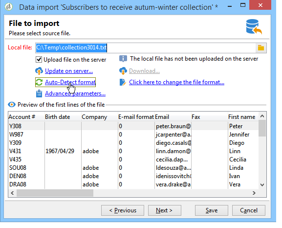

# 配置导入作业 {#executing-import-jobs}

Adobe Campaign允许您以文本、CSV、TAB或XML格式将数据从一个或多个文件导入数据库。 这些文件与表（主表或链接的表）相关联，并且源文件的每个字段与数据库的字段相关联。

>[!NOTE]
>
>您可以使用&#x200B;**[!UICONTROL Import a list]**&#x200B;函数导入数据，而无需将其与数据库数据进行映射。 然后，可以通过&#x200B;**[!UICONTROL Read list]**&#x200B;对象在工作流中专门使用该数据。 有关详细信息，请参见[此页面](../../workflow/using/read-list.md)。

导入助手允许您配置导入、定义其选项（如数据转换）并启动执行。 它是一系列屏幕，其内容取决于导入类型（简单或多个）和操作员权限。

创建新导入作业后，将显示导入助手（请参阅[创建导入和导出作业](../../platform/using/creating-import-export-jobs.md)）。

>[!NOTE]
>
>如果您使用IIS Web服务器，则可能需要配置以授权上载大文件(>28 MB)。 有关更多信息，请参见[此章节](../../installation/using/integration-into-a-web-server-for-windows.md#changing-the-upload-file-size-limit)。

## 源文件 {#source-file}

在源文件中，每行都与记录一致。 记录中的数据由分隔符（空格、制表符、字符等）分隔。 这意味着以列的形式检索数据，并且每列与数据库的字段相关联。

## 第1步 — 选择导入模板 {#step-1---choosing-the-import-template}

启动导入助理时，必须首先选择模板。 例如，要配置导入收到简报的收件人，请按照以下步骤操作：

1. 选择&#x200B;**[!UICONTROL Profiles and Targets > Job > Generic imports and exports]**&#x200B;文件夹。
1. 点击 **New**，然后点击 **Import** 以创建导入模板。

   

1. 单击&#x200B;**[!UICONTROL Import template]**&#x200B;字段右侧的箭头以选择您的模板，或单击&#x200B;**[!UICONTROL Select link]**&#x200B;以浏览树。

   本机模板为&#x200B;**[!UICONTROL New text import]**。 不得修改此模板，但您可以复制此模板，以根据您的要求配置新模板。 默认情况下，导入模板保存在&#x200B;**[!UICONTROL Profiles and targets > Templates > Job templates]**&#x200B;节点中。

1. 在&#x200B;**[!UICONTROL Label]**&#x200B;字段中输入此导入的名称。 您可以添加描述。
1. 在相应的字段中选择导入类型。 有两种可能的导入类型：**[!UICONTROL Simple import]**&#x200B;用于仅导入一个文件，而&#x200B;**[!UICONTROL Multiple import]**&#x200B;用于在单次执行中导入多个文件。

   对于多次导入，从导入助理第一个屏幕中的&#x200B;**[!UICONTROL Import type]**&#x200B;下拉列表中选择&#x200B;**[!UICONTROL Multiple import]**。

   

1. 通过单击&#x200B;**[!UICONTROL Add]**&#x200B;指定要导入的字段。

   

   每次添加文件时，都会显示&#x200B;**[!UICONTROL File to import]**&#x200B;助理的屏幕。 请参阅第[步 — 选择Source文件](#step-2---source-file-selection)部分，并按照助手中的步骤将导入选项定义为简单导入。

   >[!NOTE]
   >
   >Multiple import 应仅用于满足特定需求，不是建议的选项。

### 高级参数 {#advanced-parameters}

**[!UICONTROL Advanced parameters]**&#x200B;链接允许您访问以下选项：

* **[!UICONTROL General]**&#x200B;选项卡

   * **[!UICONTROL Stop execution if there are too many rejects]**

     默认情况下，该选项处于选中状态。 如果要继续执行导入，而不考虑拒绝的次数，则可以取消选择它。 默认情况下，如果拒绝前 100 行，则停止执行。

   * **[!UICONTROL Trace mode]**

     选择此选项可追踪每行的导入执行情况。

   * **[!UICONTROL Start the job in a detached process]**

     默认情况下，该选项处于选中状态。 它允许您分离导入的执行，使其不会影响数据库中正在进行的其他作业。

   * **[!UICONTROL Do not update enumerations]**

     选择此选项可避免扩充数据库中的枚举值列表。 请参阅[管理枚举](../../platform/using/managing-enumerations.md)。

* **[!UICONTROL Variables]**&#x200B;选项卡

  您可以定义与作业关联的变量，该变量可在查询编辑器和计算字段中访问。 要创建变量，请单击&#x200B;**[!UICONTROL Add]**&#x200B;并使用变量编辑器。

  >[!IMPORTANT]
  >
  >**[!UICONTROL Variables]**&#x200B;选项卡仅供工作流类型编程使用，且仅应由专家用户配置。

## 第 2 步 - 源文件选择 {#step-2---source-file-selection}

源文件可以是文本格式（txt、csv、tab、固定列）或 xml。

默认情况下，已选择&#x200B;**[!UICONTROL Upload file on the server]**。 单击&#x200B;**[!UICONTROL Local file]**&#x200B;字段右侧的文件夹以浏览本地磁盘并选择要导入的文件。 您可以取消选择此选项以输入访问路径以及要在服务器上导入的文件名。

指定文件后，您可以通过单击&#x200B;**[!UICONTROL Auto-detect format]**&#x200B;在窗口的下半部分查看其数据。 此预览显示源文件的前 200 行。

使用此视图上方提供的选项配置导入。 通过这些选项定义的参数将被传输到预览中。 可以使用以下选项：

* **[!UICONTROL Click here to change the file format...]**&#x200B;允许您检查文件格式并微调配置。
* **[!UICONTROL Update on server...]**&#x200B;允许您将本地文件传输到服务器。 仅当选择&#x200B;**[!UICONTROL Upload file on the server]**&#x200B;时，此选项才可用。
* 仅当文件已上载到服务器上时，**[!UICONTROL Download]**&#x200B;才可用。
* **[!UICONTROL Auto-detect format]**&#x200B;用于重新初始化数据源的格式。 此选项允许您将原始格式重新应用到已通过&#x200B;**[!UICONTROL Click here to change the file format...]**&#x200B;选项设置格式的数据。
* **[!UICONTROL Advanced parameters]**&#x200B;链接允许您筛选源数据并访问高级选项。 在此屏幕中，您可以选择仅导入部分文件。 您还可以定义过滤器，例如根据相应行的值仅导入“Prospect”或“Customer”类型的用户。 这些选项仅供专业 JavaScript 用户使用。

### 更改文件格式 {#changing-the-file-format}

**[!UICONTROL Click here to change the file format...]**&#x200B;选项允许您设置源文件数据的格式，特别是指定列分隔符和每个字段的数据类型。 此配置通过以下窗口执行：

此步骤允许您描述应如何读取文件字段的值。 例如，在日期的情况下，日期或日期+时间数据可以与格式（dd/mm/yyyy、mm/dd/yy等）关联。 如果输入数据与预期格式不匹配，则在导入期间将发生拒绝。

您可以在窗口下部的预览区域中查看配置结果。

单击&#x200B;**[!UICONTROL OK]**&#x200B;保存格式，然后单击&#x200B;**[!UICONTROL Next]**&#x200B;显示下一步。

## 第 3 步 - 字段映射 {#step-3---field-mapping}

然后，您必须选择目标模式并将每列的数据映射到数据库中的字段。

* **[!UICONTROL Destination schema]**&#x200B;字段允许您选择将在其中导入数据的架构。 此信息是必填的。 单击&#x200B;**[!UICONTROL Select link]**&#x200B;图标以选择现有架构之一。 单击&#x200B;**[!UICONTROL Edit link]**&#x200B;以显示选定表的内容。
* 中央表显示源文件中定义的所有字段。 选择要导入的字段，以将目标文件与其关联。 可以手动或自动映射这些字段。

  要手动映射字段，请单击复选框以选择源字段，然后单击第二列以激活与所选字段对应的单元格。 接下来，单击&#x200B;**[!UICONTROL Edit expression]**&#x200B;图标以显示当前表的所有字段。 选择目标字段并单击&#x200B;**[!UICONTROL OK]**&#x200B;以验证映射。

  要自动关联源字段和目标字段，请单击字段列表右侧的&#x200B;**[!UICONTROL Guess the destination fields]**&#x200B;图标。 如果需要，可以修改建议的字段。

  >[!IMPORTANT]
  >
  >在继续执行下一步之前，务必验证此操作的结果。

* 您可以对导入的字段应用转换。 为此，请单击&#x200B;**[!UICONTROL Transformation]**&#x200B;列中与该字段相关的单元格，然后选择要应用的转换。

  

  >[!IMPORTANT]
  >
  >转换在导入时应用。 但是，如果已定义了对目标字段的约束（在上面的示例中为 @lastname 字段），则这些约束优先。

* 您可以使用位于中央表格右侧的相应图标来添加计算字段。 计算字段允许您执行复杂的转换、添加虚拟列或合并多个列的数据。 有关各种可能性的详细信息，请参见以下部分。

### 计算字段 {#calculated-fields}

计算字段是添加到源文件的新列，并从其他列计算。 然后，计算字段可以与Adobe Campaign数据库的字段关联。 但是，在计算字段中无法进行对帐操作。

有四种类型的计算字段：

* **[!UICONTROL Fixed string]**：对于源文件的所有行，计算字段的值都相同。 用于设置插入或更新记录的字段的值。 例如，您可以为所有导入的记录将标记设置为“是”。
* **[!UICONTROL String with JavaScript tags]**：计算字段的值是包含JavaScript命令的字符串。
* **[!UICONTROL JavaScript expression]**：计算字段的值是JavaScript函数求值的结果。 返回的值可以是数字、日期等。
* **[!UICONTROL Enumeration]**：字段的值是根据源文件中包含的某个值而归因的。 编辑器允许您指定源列并输入枚举值清单，如以下示例所示：

  

  **[!UICONTROL Preview]**&#x200B;选项卡允许您查看定义的配置的结果。 此处添加了&#x200B;**[!UICONTROL Subscription]**&#x200B;列。 该值通过 **Status** 字段计算。

  

## 第 4 步 – 调解 {#step-4---reconciliation}

通过import assistant的协调步骤，可定义文件数据与数据库中现有数据的协调模式，并设置文件数据与数据库数据之间的优先级规则。 配置窗口如下所示：

屏幕的中央部分包含一个树状结构，其中包含要导入数据的 Adobe Campaign 数据库的字段和表。

每个节点（表或字段）都有特殊选项可用。 当您单击列表中相关的节点时，其参数和简要说明将显示如下。 为每个元素定义的行为将显示在相应的&#x200B;**[!UICONTROL Behavior]**&#x200B;列中。

### 操作类型 {#types-of-operation}

对于导入涉及的每个表，必须定义操作的类型。 以下操作可用于数据库的主要元素：

* **[!UICONTROL Update or insertion]**：如果记录存在于数据库中，则更新该记录，否则创建该记录。
* **[!UICONTROL Insertion]**：将记录插入到数据库中。
* **[!UICONTROL Update]**：仅更新现有记录（忽略其他记录）。
* **[!UICONTROL Reconciliation only]**：在数据库中查找记录，但不执行更新。 例如，允许您根据文件列关联要导入的收件人文件夹，而不更新文件夹中的数据。
* **[!UICONTROL Deletion]**：用于销毁数据库中的记录。

导入所涉及的表中的每个字段都有以下选项：

* **[!UICONTROL Update (empty) if source value is empty]**：在更新时，如果源文件中的字段为空，则字段中的值将删除数据库值。 否则，保留数据库字段。
* **[!UICONTROL Update only if destination is empty]**：源文件中的值不会覆盖数据库字段中的值，除非数据库字段为空。 在这种情况下，它采用源文件的值。
* **[!UICONTROL Update the field only when the record is inserted]**：在更新或插入操作期间，将只导入新的源文件记录。

>[!NOTE]
>
>除非在没有重复数据删除的情况下插入，否则合并关键项的定义始终是&#x200B;**强制**&#x200B;的。

### 合并关键项 {#reconciliation-keys}

必须至少填写一个合并关键项才能管理重复数据删除。

协调键值是用于标识记录的一组字段。 例如，要导入收件人，协调键值可以是帐号、“电子邮件”字段或“姓氏、名字、公司”字段等。

在这种情况下，为了确定文件行是否与数据库中的现有收件人匹配，导入引擎会将文件的值与数据库中键的所有字段的值进行比较。 当字段特定于记录时，可以执行源数据和目标数据之间的精细比较，以确保导入后数据的完整性。 可以为同一个表填写第二个合并关键项；它用于第一个关键项为空的行。

避免选择在导入期间可能被修改的字段；如果发生这种情况，引擎可能会创建额外的记录。

>[!NOTE]
>
>对于收件人导入，所选文件夹的标识符将隐含地添加到密钥中。
>
>因此，仅对此文件夹执行调解（除非未选择任何文件夹）。

### 重复数据删除 {#deduplication}

>[!NOTE]
>
>“double”是指在要导入的文件中存在两次或更多次的项目。
>
>“duplicate”是指同时存在于要导入的文件和数据库中的项目。

**[!UICONTROL Management of doubles]**&#x200B;字段允许您配置重复数据删除。 重复数据删除涉及&#x200B;**源文件**&#x200B;中多次出现的记录（或多文件导入时的源文件），即合并关键项的字段相同的行。

* **[!UICONTROL Update]**&#x200B;模式（默认模式）下的重复管理不执行重复数据删除。 因此，最后一条记录具有优先权（因为它更新了先前记录的数据）。 在此模式下不执行重复计数。
* **[!UICONTROL Ignore]**&#x200B;模式或&#x200B;**[!UICONTROL Reject entity]**&#x200B;模式下的重复管理会从导入中排除重复项。 在这种情况下，不会导入任何记录。
* 在&#x200B;**[!UICONTROL Reject entity]**&#x200B;模式下，未导入该元素，并在导入日志中生成错误。
* 在&#x200B;**[!UICONTROL Ignore]**&#x200B;模式下，未导入该元素，但不保留任何错误痕迹。 此模式可让您优化性能。

>[!IMPORTANT]
>
>仅在内存中执行重复数据删除。 因此，带重复数据删除的导入的大小受到限制。 此限制取决于多个参数（应用程序服务器的容量、活动、键中的字段数等）。 重复数据删除的最大大小为 1,000,000 行。

重复数据删除涉及源文件和数据库中都存在的记录。 它只涉及与更新有关的操作（即&#x200B;**[!UICONTROL Update and insertion]**&#x200B;或&#x200B;**[!UICONTROL Update]**）。 **[!UICONTROL Duplicate management]**&#x200B;选项允许您更新或忽略记录（如果它同时位于源文件和数据库中）。 **[!UICONTROL Update or insert based on origin]**&#x200B;选项属于可选模块，无法在标准上下文中使用。

选项&#x200B;**[!UICONTROL Reject]**&#x200B;和&#x200B;**[!UICONTROL Ignore]**&#x200B;按上述方式运行。

### 发生错误时 {#behavior-in-the-event-of-an-error}

大多数数据传输操作会产生各种类型的错误（行格式不一致、电子邮件地址无效等）。 导入引擎生成的所有错误和所有警告都将存储并链接到导入实例。

可以通过&#x200B;**[!UICONTROL Rejects]**&#x200B;选项卡查看这些拒绝的详细信息。

有两种类型的拒绝（该类型显示在&#x200B;**[!UICONTROL Connector]**&#x200B;列中）：

* 文本连接器的拒绝涉及在处理文件行（计算字段、数据分析等）时发生的错误。 在这种情况下，如果发生错误，则始终拒绝整行。
* 数据库连接器拒绝涉及数据协调或写入数据库期间发生的错误。 在导入到多个表的情况下，拒绝只涉及记录的一部分（例如，对于收件人和相关事件的导入，错误可以阻止更新事件而不拒绝收件人）。

在数据调解页面中，您可以按字段和逐个表定义所需的错误管理类型字段。

* **[!UICONTROL Ignore and log a warning]**：已将所有字段导入数据库，但生成错误的字段除外。
* **[!UICONTROL Reject parent element]**：记录的整行都遭到拒绝，不仅是因为导致错误的字段。
* **[!UICONTROL Reject all elements]**：导入停止，记录的所有元素都被拒绝。

  

导入实例的拒绝屏幕中的树状结构指示哪些字段被拒绝以及错误发生的位置。

您可以通过&#x200B;**[!UICONTROL Export rejects]**&#x200B;图标生成包含这些记录的文件：

## 第 5 步 - 导入收件人时的附加步骤 {#step-5---additional-step-when-importing-recipients}

在import assistant的下一个步骤中，您可以选择或创建数据将导入到的文件夹，自动将导入的收件人映射到（新的或现有的）列表，并将收件人订阅服务。

>[!NOTE]
>
>在仅导入收件人时以及使用预设的 Adobe Campaign 收件人表 (**nms:recipient**) 时，将出现此步骤。

* 单击&#x200B;**[!UICONTROL Edit]**&#x200B;链接以选择要与收件人关联或订阅的文件夹、列表或服务。

   1. 导入到文件夹中

      **[!UICONTROL Import into a folder]**&#x200B;部分的&#x200B;**[!UICONTROL Edit...]**&#x200B;链接允许您选择或创建收件人将导入到的文件夹。 默认情况下，如果未定义分区，则会将数据导入到操作员的预设文件夹中。

      >[!NOTE]
      >
      >运算符的默认文件夹是运算符具有写入权限的第一个文件夹。 在[文件夹访问管理](../../platform/using/access-management-folders.md)中了解详情。

      要选择导入文件夹，请单击&#x200B;**[!UICONTROL Folder]**&#x200B;字段右侧的箭头，然后选择相关的文件夹。 您还可以使用&#x200B;**[!UICONTROL Select link]**&#x200B;图标在新窗口中显示树或创建新文件夹。

      

      要创建新文件夹，请选择要从中添加文件夹的节点，然后右键单击。 选择 **[!UICONTROL Create a new 'Recipients' folder]**。

      

      该文件夹将添加到当前节点的下方。 输入新文件夹的名称，按Enter进行确认，然后单击&#x200B;**[!UICONTROL OK]**。

      

   1. 与清单相关联

      **[!UICONTROL Add recipients to a list]**&#x200B;部分中的&#x200B;**[!UICONTROL Edit...]**&#x200B;链接允许您选择或创建收件人将导入到的列表。

      

      您可以单击&#x200B;**[!UICONTROL Select link]**，然后单击&#x200B;**[!UICONTROL Create]**&#x200B;为这些收件人创建新列表。 列表的创建和管理在[此部分](../../platform/using/creating-and-managing-lists.md)中介绍。

      

      您可以决定将收件人添加到列表中已存在的收件人，或者使用新收件人重新创建列表。 在这种情况下，如果清单已包含收件人，则它们将被删除并被导入的收件人替换。

   1. 订阅服务

      若要为所有导入的收件人订阅信息服务，请单击&#x200B;**[!UICONTROL Subscribe recipients to a service]**&#x200B;部分的&#x200B;**[!UICONTROL Edit...]**&#x200B;链接，以选择或创建收件人将订阅的信息服务。 您可以选择&#x200B;**[!UICONTROL Send a confirmation message]**&#x200B;选项：此消息的内容在与订阅服务关联的投放模板中定义。

      

      您可以通过单击&#x200B;**[!UICONTROL Select link]**，然后单击&#x200B;**[!UICONTROL Create]**&#x200B;图标为这些收件人创建新服务。 [这部分](../../delivery/using/managing-subscriptions.md)介绍了信息服务的管理。

* 使用&#x200B;**[!UICONTROL Origin]**&#x200B;字段将有关收件人来源的信息添加到其用户档案。 此信息在多次导入的框架内特别有用。

单击&#x200B;**[!UICONTROL Next]**&#x200B;以验证此步骤并显示以下步骤。

## 步骤6 — 启动导入 {#step-6---launching-the-import}

利用该助理的最后一步可以启动数据导入。 为此，请单击&#x200B;**[!UICONTROL Start]**&#x200B;按钮。

然后，您可以监视导入作业的执行（请参阅[监视作业执行](../../platform/using/monitoring-jobs-execution.md)）。
