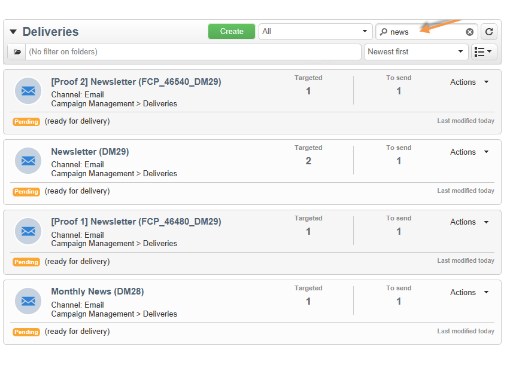

# 筛选选项{#filtering-options}

## 关于筛选{#about-filtering}

默认情况下，Adobe Campaign会显示数据库中有关操作员具有读取权限的所有数据。

此数据可通过浏览器窗口上部分的选项过滤。

有多种方法可过滤要显示的数据。 如有必要，可以将这些参数结合使用：

* 对文件夹进行筛选，请参阅[按文件夹](#filter-by-folder)进行筛选，
* 按状态筛选，请参阅[按状态筛选](#filter-by-status),
* 数据排序，请参见[按](#order-by)排序，
* 搜索，请参阅[快速搜索](#quick-search)。

## 按文件夹{#filter-by-folder}筛选

单击&#x200B;**[!UICONTROL Folder]**&#x200B;图标以选择包含要显示的数据的文件夹。

将仅显示文件夹中的用户档案：

使用文件夹选择字段右侧的十字可返回到默认显示模式。

## 按状态{#filter-by-status}筛选

根据显示的信息类型，您可以按状态或按状态应用过滤器。 例如，对于投放，您可以选择仅显示已完成的投放，如下所示：

## 按{#order-by}排序

您可以通过“每个文件夹”筛选字段右侧的下拉列表选择页面上提供数据的排序顺序。 此字段的内容取决于页面上的数据类型。

例如，您可以按优先级、创建日期或字母顺序对任务进行排序。

## 快速搜索{#quick-search}

使用搜索字段可快速访问要查找的项目：输入要显示的项目的标签或内部名称中包含的字符，然后确认对页面上的数据应用自动过滤器。

要再次显示所有项目，请单击交叉点以删除搜索字段的内容。
