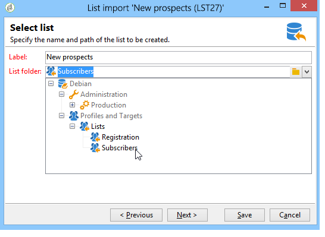
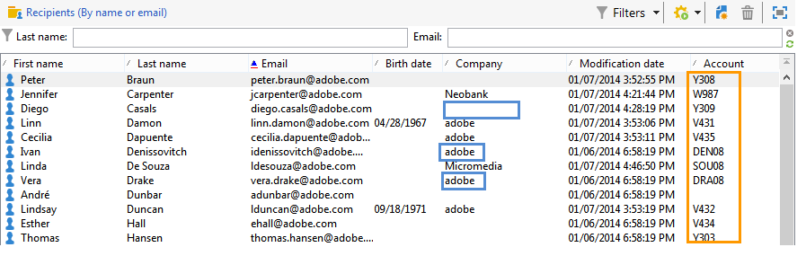

# 通用导入范例 {#import-operations-samples}

## 从收件人清单导入 {#example--import-from-a-list-of-recipients}

要从清单概述创建和提供收件人清单，请应用以下步骤：

1. 创建清单

   * 单击Adobe Campaign主页&#x200B;**[!UICONTROL Profiles and targets]**&#x200B;菜单中的&#x200B;**[!UICONTROL Lists]**&#x200B;链接。
   * 单击&#x200B;**[!UICONTROL Create]**，然后单击&#x200B;**[!UICONTROL Import a list]**&#x200B;按钮。

1. 选择要导入的文件

   单击&#x200B;**[!UICONTROL Local file]**&#x200B;字段右侧的文件夹，然后选择包含要导入的列表的文件。

   

1. 清单名称和存储

   输入列表的名称，然后选择应保存的目录。

   

1. 启动导入

   单击&#x200B;**[!UICONTROL Next]**，然后单击&#x200B;**[!UICONTROL Start]**&#x200B;以开始导入列表。

   

## 从文本文件导入新记录 {#example--import-new-records-from-a-text-file-}

要将存储在文本文件中的新收件人配置文件导入 Adobe Campaign 数据库，请使用以下步骤：

1. 选择模板

   * 在Adobe Campaign主页中，单击&#x200B;**[!UICONTROL Profiles and targets]**&#x200B;链接，然后单击&#x200B;**[!UICONTROL Jobs]**。 在作业列表上方，单击&#x200B;**[!UICONTROL New import]**。
   * 默认情况下，保持选中&#x200B;**[!UICONTROL New text import]**&#x200B;模板。
   * 更改标签和描述。
   * 选择 **[!UICONTROL Simple import]**。
   * 保留默认作业文件夹。
   * 单击&#x200B;**[!UICONTROL Advanced parameters]**&#x200B;并选择&#x200B;**[!UICONTROL Tracking mode]**&#x200B;选项，以查看执行期间导入的详细信息。

1. 选择要导入的文件

   单击&#x200B;**[!UICONTROL Local file]**&#x200B;字段右侧的文件夹，然后选择要导入的文件。

   

1. 关联字段

   单击&#x200B;**[!UICONTROL Guess the destination fields]**&#x200B;图标可自动映射源架构和目标架构。 在单击&#x200B;**[!UICONTROL Next]**&#x200B;之前，请查看此窗口中的信息。

   

1. 协调

   * 转到 **Recipients (nms:recipient)** 表。
   * 选择&#x200B;**[!UICONTROL Insertion]**&#x200B;操作，并保留其他字段中的默认值。

      

1. 导入收件人

   * 如有必要，请为要导入的记录指定一个文件夹。

      

1. 启动导入

   * 单击 **[!UICONTROL Start]**。

      在编辑器的中心区域，您可以检查导入操作是否成功并查看已处理的记录数。

      

      **[!UICONTROL Tracking]**&#x200B;模式允许您跟踪源文件中每个记录的导入详细信息。 为此，请在主页中单击&#x200B;**[!UICONTROL Profiles and Targets]**，然后单击&#x200B;**[!UICONTROL Processes]**，选择相关导入，并查找&#x200B;**[!UICONTROL General]**、**[!UICONTROL Journal]**&#x200B;和&#x200B;**[!UICONTROL Rejects]**&#x200B;选项卡。

      * 检查导入进度

         

      * 处理每条记录的查看

         

## 更新并插入收件人 {#example--update-and-insert-recipients}

我们希望更新数据库中的现有记录，并从文本文件中创建新记录。以下是该过程的示例：

1. 选择模板

   重复上面示例 2 中描述的步骤。

1. 要导入的文件

   选择要导入的文件。

   在我们的示例中，文件第一行的概述显示该文件包含三个记录的更新和一个记录的创建。

   

1. 关联字段

   执行上面示例 2 中的过程。

1. 协调

   * 默认情况下保持选中&#x200B;**[!UICONTROL Update or insert]**。
   * 将选项&#x200B;**[!UICONTROL Management of duplicates]**&#x200B;保留在&#x200B;**[!UICONTROL Update]**&#x200B;模式下，以便使用文本文件中的数据修改数据库中的现有记录。
   * 选择字段&#x200B;**[!UICONTROL Birth date]**、**[!UICONTROL Name]**&#x200B;和&#x200B;**[!UICONTROL Company]** ，并为它们分配协调键值。

      

1. 启动导入

   * 单击 **[!UICONTROL Start]**。

      在追踪窗口中，您可以检查导入是否成功并查看已处理的记录数。

      

   * 查看收件人表以检查此操作已修改记录。

      

## 使用外部文件的值丰富该值 {#example--enrich-the-values-with-those-of-an-external-file}

我们希望通过文本文件修改数据库表中的某些字段，且优先考虑数据库中包含的值。

在此示例中，您可以看到文本文件中的某些字段具有值，而数据库中的相应字段为空。其他字段包含与数据库中包含的值不同的值。

* 要导入的文本文件的内容。

   

* 导入前的数据库状态

   

应用以下步骤：

1. 选择模板

   执行上面示例 2 中的过程。

1. 要导入的文件

   选择要导入的文件。

1. 关联字段

   执行上面示例 2 中的过程。

   在预览文件的第一行时，您可以看到该文件包含某些记录的更新。

1. 协调

   * 转到表并选择&#x200B;**[!UICONTROL Update]**&#x200B;操作。
   * 为&#x200B;**[!UICONTROL Management of doubles]**&#x200B;字段选择选项&#x200B;**[!UICONTROL Reject entity]**。
   * 将选项&#x200B;**[!UICONTROL Management of duplicates]**&#x200B;保留在&#x200B;**[!UICONTROL Update]**&#x200B;模式下，以便使用文本文件中的数据修改数据库中的现有记录。
   * 将光标放在&#x200B;**[!UICONTROL Last name (@lastName)]**&#x200B;节点上，然后选择&#x200B;**[!UICONTROL Update only if destination is empty]**&#x200B;选项。
   * 对&#x200B;**[!UICONTROL Company (@company)]**&#x200B;节点重复此操作。
   * 为字段&#x200B;**[!UICONTROL Birth date]**、**[!UICONTROL E-mail]**&#x200B;和&#x200B;**[!UICONTROL First name]**&#x200B;分配协调键值。

      

1. 启动导入

   单击 **[!UICONTROL Start]**。

   查看收件人表以确认导入已修改记录。

   

   只有空值被文本文件中的值替换，但数据库中的现有值未被导入文件中的值覆写。

## 使用外部文件更新并丰富值 {#example--update-and-enrich-the-values-from-those-in-an-external-file}

我们希望使用文本文件修改数据库表中的某些字段，优先套用文本文件中包含的值。

在此示例中，您将看到文本文件中的某些字段具有空值，而数据库中的相应字段不为空。其他字段包含与数据库中的值不同的值。

* 要导入的文本文件的内容。

   

* 导入前的数据库状态

   

1. 选择模板

   执行上面示例 2 中的过程。

1. 要导入的文件

   选择要导入的文件。

   在预览文件的第一行时，您可以看到该文件包含空字段和某些记录的更新。

1. 关联字段

   执行上面示例 2 中的过程。

1. 协调

   * 转到表并选择&#x200B;**[!UICONTROL Update]**。
   * 为&#x200B;**[!UICONTROL Management of doubles]**&#x200B;字段选择选项&#x200B;**[!UICONTROL Reject entity]**。
   * 将&#x200B;**[!UICONTROL Management of duplicates]**&#x200B;选项保留在&#x200B;**[!UICONTROL Update]**&#x200B;模式下，用文本文件中的数据修改数据库中的现有记录。
   * 将光标放在&#x200B;**[!UICONTROL Account number (@account)]**&#x200B;节点上，然后选择选项&#x200B;**[!UICONTROL Take empty values into account]**。
   * 选择字段&#x200B;**[!UICONTROL Birth date]**、**[!UICONTROL E-mail]**&#x200B;和&#x200B;**[!UICONTROL First name]** ，并为它们分配协调键值。

      

1. 启动导入

   * 单击 **[!UICONTROL Start]**。
   * 查看收件人表以检查操作已修改的记录。

      

      空文本文件的值已覆写数据库中的值。数据库中的现有值已更新为导入文件中的值，与步骤4中为重复项选择的&#x200B;**[!UICONTROL Update]**&#x200B;选项保持一致。
