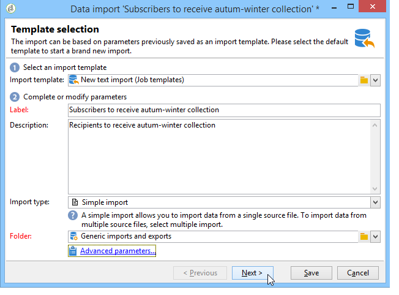
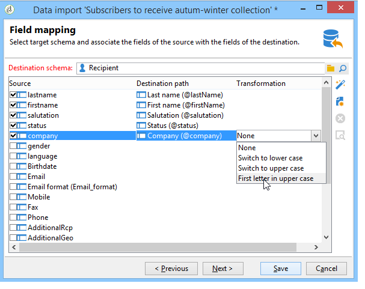
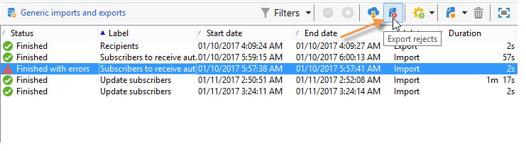
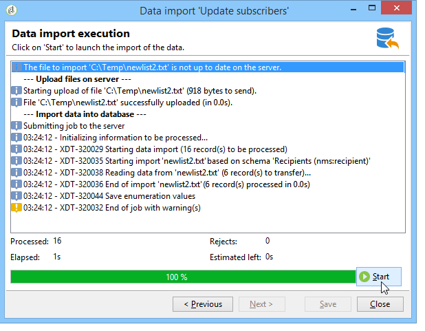
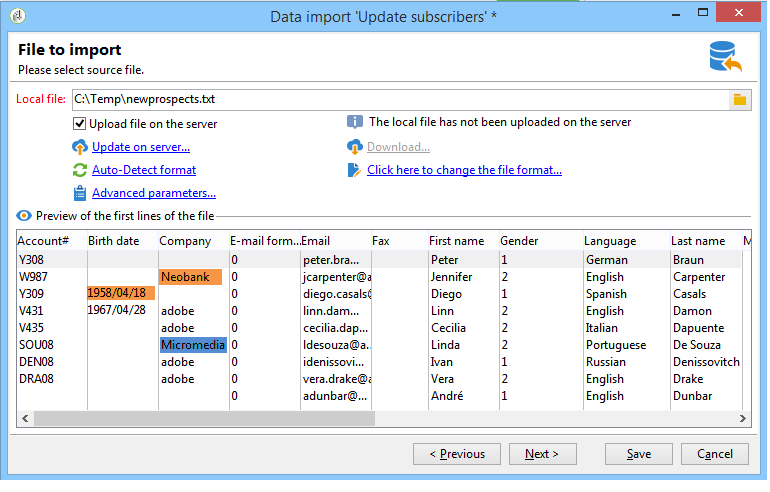
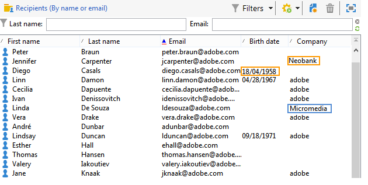

# 导入数据{#importing-data}

Adobe Campaign 允许您以文本、CSV、TAB 或 XML 格式从一个或多个文件将数据导入数据库。这些文件与表（主表或链接的表）相关联，并且源文件的每个字段与数据库的字段相关联。可以保存导入配置以便重复使用，让您可以计划导入任务以自动执行复制操作。

>[!NOTE]
>
>You can import data without mapping it with the database data using the **[!UICONTROL Import a list]** function.
>
>The data can then be used exclusively in workflows via the **[!UICONTROL Read list]** object. 有关详细信息，请参见[此页面](../../workflow/using/read-list.md)。
>
>有关详细信息，请观看[导入用户档案](https://docs.adobe.com/content/help/en/campaign-learn/campaign-classic-tutorials/getting-started/importing-profiles.html)视频。

## 要导入的数据的结构 {#structure-of-the-data-to-import}

在源文件中，每行与一条记录重合。记录中的数据由分隔符（空格、制表符、字符等）分隔。这意味着以列的形式检索数据，并且每列与数据库的字段相关联。

## 导入向导 {#import-wizard}

导入向导允许您配置导入，定义其选项（例如数据转换）和启动执行。它是一系列屏幕，其内容取决于导入类型（简单或多个）和操作员权限。

>[!NOTE]
>
>如果使用 IIS Web 服务器，则可能需要通过配置授权上传大文件 (> 28 MB)。
>
>有关更多信息，请参见[此章节](../../installation/using/integration-into-a-web-server-for-windows.md#changing-the-upload-file-size-limit)。

### 第1步 - 选择导入模板 {#step-1---choosing-the-import-template}

启动导入向导时，首先必须选择模板。例如，要配置导入收到简报的收件人，请按照以下步骤操作：

1. 选择文 **[!UICONTROL Profiles and Targets > Job > Generic imports and exports]** 件夹。
1. 点击 **New**，然后点击 **Import** 以创建导入模板。

   

1. Click the arrow to the right of the **[!UICONTROL Import template]** field to select your template, or click **[!UICONTROL Select link]** to browse the tree.

   本机模板为 **[!UICONTROL New text import]**。 不得修改此模板，但您可以根据您的要求复制它以配置新模板。默认情况下，导入模板保存在节 **[!UICONTROL Profiles and targets > Templates > Job templates]** 点中。

1. Enter a name for this import in the **[!UICONTROL Label]** field. 您可以添加描述。
1. 在相应字段中选择导入类型。导入有两种可能类型： **[!UICONTROL Simple import]** 只导入一个文件，并 **[!UICONTROL Multiple import]** 在一次执行中导入多个文件。

   For a multiple import, select **[!UICONTROL Multiple import]** from the **[!UICONTROL Import type]** drop-down list in the first screen of the import wizard.

   

1. Specify the fields you want to import by clicking **[!UICONTROL Add]**.

   

   Each time a file is added, the screen of the **[!UICONTROL File to import]** wizard is displayed. See section [Step 2 - Source file selection](#step-2---source-file-selection) and follow the steps in the wizard to define the import options as for a simple import.

   >[!NOTE]
   >
   >Multiple import 应仅用于满足特定需求，不是建议的选项。

#### 高级参数 {#advanced-parameters}

The **[!UICONTROL Advanced parameters]** link lets you access the following options:

* **[!UICONTROL General]** 选项卡

   * **[!UICONTROL Stop execution if there are too many rejects]**

      默认选中此选项。如果要继续执行导入而不考虑拒绝次数，可以取消选择。默认情况下，如果拒绝前 100 行，则停止执行。

   * **[!UICONTROL Trace mode]**

      选择此选项可追踪每行的导入执行情况。

   * **[!UICONTROL Start the job in a detached process]**

      默认选中此选项。它允许您分离导入的执行，使其不会影响数据库中正在进行的其他作业。

   * **[!UICONTROL Do not update enumerations]**

      选择此选项可避免扩大数据库中的枚举值清单。请参阅 [管理明细列表](../../platform/using/managing-enumerations.md)。

* **[!UICONTROL Variables]** 选项卡

   您可以定义与可在查询编辑器和计算字段中访问的作业关联的变量。To create a variable, click **[!UICONTROL Add]** and use the variable editor.

   >[!CAUTION]
   >
   >The **[!UICONTROL Variables]** tab is for Workflow-type programming use only, and should be configured by expert users only.

### 第 2 步 - 源文件选择 {#step-2---source-file-selection}

源文件可以是文本格式（txt、csv、tab、固定列）或 xml。

By default, **[!UICONTROL Upload file on the server]** is selected. Click the folder to the right of the **[!UICONTROL Local file]** field to browse the local disk and select the file to import. 您可以取消选择此选项以输入访问路径以及要在服务器上导入的文件名。

When the file has been specified, you can view its data in the lower section of the window by clicking **[!UICONTROL Auto-detect format]**. 此预览显示源文件的前 200 行。

使用此视图上方提供的选项配置导入。通过这些选项定义的参数将传输到预览中。可以使用以下选项：

* **[!UICONTROL Click here to change the file format...]** 允许您检查文件格式并微调配置。
* **[!UICONTROL Update on server...]** 允许您将本地文件传输到服务器。 此选项仅在选中时 **[!UICONTROL Upload file on the server]** 可用。
* **[!UICONTROL Download]** 仅当文件已上载到服务器上时才可用。
* **[!UICONTROL Auto-detect format]** 用于重新初始化数据源的格式。 This option lets you reapply the original formats to data that has been formatted via the **[!UICONTROL Click here to change the file format...]** option.
* The **[!UICONTROL Advanced parameters]** link lets you filter the source data and access advanced options. 在此屏幕中，您可以选择仅导入部分文件。您还可以定义筛选器，例如，根据相应行的值仅导入“潜在客户”或“客户”类型的用户。这些选项仅供专业 JavaScript 用户使用。

#### 更改文件格式 {#changing-the-file-format}

The **[!UICONTROL Click here to change the file format...]** option lets you format the data of the source file, and in particular to specify the column separator and the type of data for each field. 此配置通过以下窗口执行：

此步骤允许您描述应如何读取文件字段的值。例如，在日期的情况下，日期或日期+时间数据可以与某种格式（dd/mm/yyyy、mm/dd/yy 等）相关联。如果输入数据与预期格式不匹配，则在导入期间将发生拒绝。

您可以在窗口下部的预览区域中查看配置结果。

Click **[!UICONTROL OK]** to save the formatting, then click **[!UICONTROL Next]** to display the next step.

### 第 3 步 - 字段映射 {#step-3---field-mapping}

然后，您必须选择目标模式并将每列的数据映射到数据库中的字段。

* The **[!UICONTROL Destination schema]** field lets you select the schema in which the data will be imported. 此信息是强制性的。Click the **[!UICONTROL Select link]** icon to select one of the existing schemas. Click **[!UICONTROL Edit link]** to display the content of the selected table.
* 中央表显示源文件中定义的所有字段。选择要导入的字段以将目标文件与它们相关联。可以手动或自动映射这些字段。

   要手动映射字段，请点击复选框以选择源字段，然后点击第二列以激活与所选字段映射的单元格。Next, click the **[!UICONTROL Edit expression]** icon to display all the fields of the current table. Select the destination field and click **[!UICONTROL OK]** to validate the mapping.

   To associate the source fields and destination fields automatically, click the **[!UICONTROL Guess the destination fields]** icon to the right of the list of fields. 如果需要，可以修改建议的字段。

   >[!CAUTION]
   >
   >在继续执行下一步之前，务必验证此操作的结果。

* 您可以将转换应用于导入的字段。To do this, click in the cell of the **[!UICONTROL Transformation]** column that relates to the field concerned, and select the transformation to be applied.

   

   >[!CAUTION]
   >
   >转换在导入时应用。但是，如果已定义了对目标字段的约束（在上面的示例中为 @lastname 字段），则这些约束优先。

* 您可以使用位于中央表右侧的相应图标添加计算字段。通过计算字段，您可以执行复杂的转换，添加虚拟列或合并多列的数据。有关各种可能性的详细信息，请参见以下部分。

#### 计算字段 {#calculated-fields}

计算字段是添加到源文件并从其他列计算所得到的新列。然后，计算字段可以与 Adobe Campaign 数据库的字段相关联。但是，在计算字段中无法进行对帐操作。

有四种类型的计算字段：

* **[!UICONTROL Fixed string]**:对于源文件的所有行，计算字段的值都相同。 允许您设置插入或更新的记录的字段值。例如，您可以为所有导入的记录将标记设置为“是”。
* **[!UICONTROL String with JavaScript tags]**:计算字段的值是包含JavaScript命令的字符串。
* **[!UICONTROL JavaScript expression]**:计算字段的值是评估JavaScript函数的结果。 返回的值可以是数字、日期等。
* **[!UICONTROL Enumeration]**:根据源文件中包含的值将字段的值归因。 编辑器允许您指定源列并输入枚举值清单，如以下示例所示：

   

   The **[!UICONTROL Preview]** tab lets you view the result of the defined configuration. Here, the **[!UICONTROL Subscription]** column has been added. 该值通过 **Status** 字段计算。

   

### 第 4 步 – 调解 {#step-4---reconciliation}

导入向导的调解步骤允许您定义将文件中的数据与数据库中的现有数据进行调解的模式，并设置文件数据和数据库数据之间的优先级规则。配置窗口如下所示：

屏幕的中央部分包含一个树状结构，其中包含要导入数据的 Adobe Campaign 数据库的字段和表。

每个节点（表或字段）都有特殊选项。点击清单中的相关节点时，其参数和简要说明将显示在下方。The behavior defined for each element is displayed in the corresponding **[!UICONTROL Behavior]** column.

#### 操作类型 {#types-of-operation}

对于与导入相关的每个表，都必须定义操作类型。以下操作可用于数据库的主要元素：

* **[!UICONTROL Update or insertion]**:如果记录存在于数据库中，则更新该记录，如果不存在，则创建该记录。
* **[!UICONTROL Insertion]**:将记录插入数据库。
* **[!UICONTROL Update]**:仅更新现有记录（忽略其他记录）。
* **[!UICONTROL Reconciliation only]**:在数据库中查找记录，但不执行更新。 例如，允许您根据文件列关联要导入的收件人文件夹，而不更新文件夹中的数据。
* **[!UICONTROL Deletion]**:允许您销毁数据库中的记录。

导入所涉及的表中的每个字段都有以下选项：

* **[!UICONTROL Update (empty) if source value is empty]**:在更新事件中，如果源文件中的字段为空，则字段中的值将删除数据库值。 否则，保留数据库字段。
* **[!UICONTROL Update only if destination is empty]**:除非数据库字段为空，否则源文件中的值不会覆盖数据库字段中的值。 在这种情况下，它采用源文件的值。
* **[!UICONTROL Update the field only when the record is inserted]**:在更新或插入操作期间，将只导入新的源文件记录。

>[!NOTE]
>
>除非在没有重复数据删除的情况下插入，否则合并关键项的定义始终是&#x200B;**强制**&#x200B;的。

#### 合并关键项 {#reconciliation-keys}

必须至少填写一个合并关键项才能管理重复数据删除。

合并关键项是用于标识记录的一组字段。例如，要导入收件人，合并关键项可以是账号，“电子邮件”字段或“姓氏、名字、公司”字段等。

在这种情况下，要查明文件的某一行是否与数据库中的现有收件人匹配，导入引擎会将该文件的值与该键的所有字段的数据库值进行比较。当字段特定于记录时，可以执行源数据和目标数据之间的精细比较，从而保证导入后数据的完整性。可以为同一个表填写第二个合并关键项；它用于第一个关键项为空的行。

避免选择在导入期间可能被修改的字段；如果发生这种情况，引擎可能会创建额外的记录。

>[!NOTE]
>
>对于收件人导入，所选文件夹的标识符将隐含地添加到密钥中。
>
>因此，仅对此文件夹执行调解（除非未选择任何文件夹）。

#### 重复数据删除 {#deduplication}

>[!NOTE]
>
>“double”是指在要导入的文件中存在两次或更多次的项目。
>
>“duplicate”是指同时存在于要导入的文件和数据库中的项目。

The **[!UICONTROL Management of doubles]** field lets you configure the deduplication of data. 重复数据删除涉及&#x200B;**源文件**&#x200B;中多次出现的记录（或多文件导入时的源文件），即合并关键项的字段相同的行。

* Duplicate management in **[!UICONTROL Update]** mode (the default mode) does not perform deduplication. 因此，最后一条记录具有优先权（因为它更新了先前记录的数据）。在此模式下不执行重复计数。
* 重复管理 **[!UICONTROL Ignore]** 模式或 **[!UICONTROL Reject entity]** 从导入中排除重复。 在这种情况下，不会导入任何记录。
* In **[!UICONTROL Reject entity]** mode, the element is not imported, and an error is generated in the import logs.
* In **[!UICONTROL Ignore]** mode, the element is not imported, but no trace of the error is kept. 此模式可让您优化性能。

>[!CAUTION]
>
>重复数据删除仅在内存中执行。因此，采用重复数据删除的导入存在大小限制。限制取决于几个参数（应用程序服务器的容量、活动、密钥中的字段数等）。重复数据删除的最大大小为 1,000,000 行。

重复数据删除涉及源文件和数据库中都存在的记录。它只涉及更新操作(即 **[!UICONTROL Update and insertion]** 或 **[!UICONTROL Update]**)。 The **[!UICONTROL Duplicate management]** option lets you update or ignore the record if it is in both the source file and the database. The **[!UICONTROL Update or insert based on origin]** option belongs to the optional module and cannot be used in a standard context.

上述选 **[!UICONTROL Reject]** 项 **[!UICONTROL Ignore]** 及操作如下。

#### 发生错误时的行为 {#behavior-in-the-event-of-an-error}

大多数数据传输操作会产生各种类型的错误（不一致的行格式，无效的电子邮件地址等）。导入引擎生成的所有错误和所有警告都将存储并链接到导入实例。

Details of these rejects can be viewed via the **[!UICONTROL Rejects]** tab.

There are two types of rejects (the type is displayed in the **[!UICONTROL Connector]** column):

* 拒绝文本连接器涉及在处理文件行时发生的错误（计算字段、数据分析等）。在这种情况下，如果发生错误，则始终拒绝整行。
* 数据库连接器拒绝涉及数据调解或写入数据库期间发生的错误。在导入到多个表的情况下，拒绝只涉及记录的一部分（例如，对于收件人和相关事件的导入，错误可以阻止更新事件而不拒绝收件人）。

在数据调解页面中，您可以按字段和逐个表定义所需的错误管理类型字段。

* **[!UICONTROL Ignore and log a warning]**:除生成错误的字段外，所有字段都会导入到数据库。
* **[!UICONTROL Reject parent element]**:记录的整行将被拒绝，而不仅仅是导致错误的字段。
* **[!UICONTROL Reject all elements]**:导入停止，并拒绝记录的所有元素。

   

导入实例的拒绝屏幕中的树状结构指示哪些字段被拒绝以及错误发生的位置。

You can generate a file containing these records via the **[!UICONTROL Export rejects]** icon:

### 第 5 步 - 导入收件人时的附加步骤 {#step-5---additional-step-when-importing-recipients}

导入向导的下一步允许您选择或创建将导入数据的文件夹，自动将导入的收件人映射到（新的或现有的）清单，将收件人订阅映射到服务。

>[!NOTE]
>
>在仅导入收件人时以及使用预设的 Adobe Campaign 收件人表 (**nms:recipient**) 时，将出现此步骤。

* Click the **[!UICONTROL Edit]** links to select the folder, the list, or the service to which you want to associate or subscribe the recipients.

   1. 导入到文件夹中

      The **[!UICONTROL Edit...]** link of the **[!UICONTROL Import into a folder]** section lets you select or create the folder into which the recipients will be imported. 默认情况下，如果未定义分区，则会将数据导入到操作员的预设文件夹中。

      >[!NOTE]
      >
      >操作员的预设文件夹是操作员具有写访问权限的第一个文件夹。请参阅 [文件夹访问管理](../../platform/using/access-management.md#folder-access-management)。

      To select the import folder, click the arrow to the right of the **[!UICONTROL Folder]** field and select the folder concerned. You can also use the **[!UICONTROL Select link]** icon to display the tree in a new window or create a new folder.

      

      要创建新文件夹，请选择要从中添加文件夹的节点，然后按鼠标右键。选择 **[!UICONTROL Create a new 'Recipients' folder]**。

      

      该文件夹会添加到当前节点下方。Enter the name of the new folder, hit Enter to confirm, and then click **[!UICONTROL OK]**.

      

   1. 与清单相关联

      The **[!UICONTROL Edit...]** link in the **[!UICONTROL Add recipients to a list]** section lets you select or create a list into which the recipients will be imported.

      

      You can create a new list for these recipients by clicking **[!UICONTROL Select link]**, then **[!UICONTROL Create]**. 创建和管理列表在创建和管 [理列表中介绍](../../platform/using/creating-and-managing-lists.md)。

      

      您可以决定将收件人添加到清单中已存在的收件人，或者使用新收件人重新创建清单。在这种情况下，如果清单已包含收件人，则它们将被删除并被导入的收件人替换。

   1. 订阅服务

      To subscribe all imported recipients to an information service, click the **[!UICONTROL Edit...]** link of the **[!UICONTROL Subscribe recipients to a service]** section in order to select or create the information service which the recipients will be subscribed to. You can select the **[!UICONTROL Send a confirmation message]** option: The content of this message is defined in the delivery template associated with the subscription service.

      

      You can create a new service for these recipients by clicking **[!UICONTROL Select link]** and then the **[!UICONTROL Create]** icon. [这部分](../../delivery/using/managing-subscriptions.md)介绍了信息服务的管理。

* Use the **[!UICONTROL Origin]** field to add information about the origin of recipients to their profiles. 此信息在多次导入的框架内特别有用。

Click **[!UICONTROL Next]** to validate this step and display the following step.

### 第 6 步 - 启动导入 {#step-6---launching-the-import}

向导的最后一步允许您启动数据导入。To do this, click the **[!UICONTROL Start]** button.

### 作业状态 {#job-statuses}

作业状态表示作业的当前状态。每个状态都由一个特殊的图标和标签表示。此信息显示在作业列表中。状态及其图标如下：

* **正在编辑**

   正在创建作业。

* **正在执行**

   此作业正在执行。

* **取消**

   Click the **[!UICONTROL Cancel]** button: the job in progress is cancelled.

* **正在取消**

   取消命令已接收并且正在取消作业。

* **正在暂停**

   Click **[!UICONTROL Pause]**: the job is being suspended.

* **已暂停**

   单击 **[!UICONTROL Pause]**:作业被暂停。 It can be restarted by clicking **[!UICONTROL Start]**.

* **已完成**

   作业的执行已完成。

* **已完成且存在错误**

   由于技术错误，该作业未执行。

* **正在关闭服务器**

   正在进行的作业因 Adobe Campaign 服务器已关闭而中断。

## 一般导入范例 {#generic-import-samples}

### Example: Import from a list of recipients {#example--import-from-a-list-of-recipients}

要从清单概述创建和提供收件人清单，请应用以下步骤：

1. 创建清单

   * 单击 **[!UICONTROL Lists]** Adobe Campaign主页 **[!UICONTROL Profiles and targets]** 菜单中的链接。
   * 单击该 **[!UICONTROL Create]** 按钮，然后 **[!UICONTROL Import a list]** 单击该按钮。

1. 选择要导入的文件

   Click the folder to the right of the **[!UICONTROL Local file]** field and select the file containing the list to import.

   

1. 清单名称和存储

   输入列表的名称，然后选择应保存的目录。

   

1. 启动导入

   单 **[!UICONTROL Next]** 击，然 **[!UICONTROL Start]** 后开始导入列表。

   

### 示例：从文本文件导入新记录 {#example--import-new-records-from-a-text-file-}

要将存储在文本文件中的新收件人配置文件导入 Adobe Campaign 数据库，请使用以下步骤：

1. 选择模板

   * 在Adobe Campaign主页中，单 **[!UICONTROL Profiles and targets]** 击链接，然后 **[!UICONTROL Jobs]**。 Above the list of jobs, click **[!UICONTROL New import]**.
   * 默认情况下， **[!UICONTROL New text import]** 保持选中该模板。
   * 更改标签和描述。
   * 选择 **[!UICONTROL Simple import]**。
   * 保留默认作业文件夹。
   * Click **[!UICONTROL Advanced parameters]** and select the **[!UICONTROL Tracking mode]** option to view the details of your import during execution.

1. 选择要导入的文件

   Click the folder to the right of the **[!UICONTROL Local file]** field and select the file you want to import.

   

1. 关联字段

   Click the **[!UICONTROL Guess the destination fields]** icon to map the source and destination schemas automatically. Check the information in this window before clicking **[!UICONTROL Next]**.

   

1. 协调

   * 转到 **Recipients (nms:recipient)** 表。
   * Select the **[!UICONTROL Insertion]** operation and leave the default values in the other fields.

      

1. 导入收件人

   * 如有必要，请为要导入的记录指定一个文件夹。

      

1. 启动导入

   * 单击 **[!UICONTROL Start]**.

      在编辑器的中心区域，您可以检查导入操作是否成功并查看已处理的记录数。

      

      The **[!UICONTROL Tracking]** mode lets you track the details of the import for each record in the source file. 为此，请在主页中单 **[!UICONTROL Profiles and Targets]** 击 **[!UICONTROL Processes]**，然后选择相关导入，并查 **[!UICONTROL General]**&#x200B;找、 **[!UICONTROL Journal]** 和 **[!UICONTROL Rejects]** 选项卡。

      * 检查导入进度

         

      * 处理每条记录的查看

         

### Example: Update and insert recipients {#example--update-and-insert-recipients}

我们希望更新数据库中的现有记录，并从文本文件中创建新记录。以下是该过程的示例：

1. 选择模板

   重复上面示例 2 中描述的步骤。

1. 要导入的文件

   选择要导入的文件。

   在我们的示例中，文件第一行的概述显示该文件包含三个记录的更新和一个记录的创建。

   

1. 关联字段

   执行上面示例 2 中的过程。

1. 协调

   * 默认 **[!UICONTROL Update or insert]** 情况下保持选中状态。
   * Keep the option **[!UICONTROL Management of duplicates]** in **[!UICONTROL Update]** mode so that existing records in the database will be modified with data from the text file.
   * 选择字段 **[!UICONTROL Birth date]**, **[!UICONTROL Name]** 然后 **[!UICONTROL Company]** 为它们分配合并关键项。

      

1. 启动导入

   * 单击 **[!UICONTROL Start]**.

      在追踪窗口中，您可以检查导入是否成功并查看已处理的记录数。

      

   * 查看收件人表以检查此操作已修改记录。

      

### Example: Enrich the values with those of an external file {#example--enrich-the-values-with-those-of-an-external-file}

我们希望通过文本文件修改数据库表中的某些字段，且优先考虑数据库中包含的值。

在此示例中，您可以看到文本文件中的某些字段具有值，而数据库中的相应字段为空。其他字段包含与数据库中包含的值不同的值。

* 要导入的文本文件的内容。

   

* 导入前的数据库状态

   

应用以下步骤：

1. 选择模板

   执行上面示例 2 中的过程。

1. 要导入的文件

   选择要导入的文件。

1. 关联字段

   执行上面示例 2 中的过程。

   在预览文件的第一行时，您可以看到该文件包含某些记录的更新。

1. 协调

   * Go to the table and select the **[!UICONTROL Update]** operation.
   * 选择字段 **[!UICONTROL Reject entity]** 的选 **[!UICONTROL Management of doubles]** 项。
   * Keep the option **[!UICONTROL Management of duplicates]** in **[!UICONTROL Update]** mode so that existing records in the database will be modified with data from the text file.
   * 将光标放在节 **[!UICONTROL Last name (@lastName)]** 点上并选择 **[!UICONTROL Update only if destination is empty]** 选项。
   * 为节点重复此 **[!UICONTROL Company (@company)]** 操作。
   * 为字段分配合并关键项 **[!UICONTROL Birth date]**, **[!UICONTROL E-mail]** 然后 **[!UICONTROL First name]**。

      

1. 启动导入

   单击 **[!UICONTROL Start]**.

   查看收件人表以确认导入已修改记录。

   

   只有空值被文本文件中的值替换，但数据库中的现有值未被导入文件中的值覆写。

### Example: Update and enrich the values from those in an external file {#example--update-and-enrich-the-values-from-those-in-an-external-file}

我们希望使用文本文件修改数据库表中的某些字段，优先套用文本文件中包含的值。

在此示例中，您将看到文本文件中的某些字段具有空值，而数据库中的相应字段不为空。其他字段包含与数据库中的值不同的值。

* 要导入的文本文件的内容。

   

* 导入前的数据库状态

   

1. 选择模板

   执行上面示例 2 中的过程。

1. 要导入的文件

   选择要导入的文件。

   在预览文件的第一行时，您可以看到该文件包含空字段和某些记录的更新。

1. 关联字段

   执行上面示例 2 中的过程。

1. 协调

   * Go to the table and select **[!UICONTROL Update]**.
   * 选择字段 **[!UICONTROL Reject entity]** 的选 **[!UICONTROL Management of doubles]** 项。
   * Leave the option **[!UICONTROL Management of duplicates]** in **[!UICONTROL Update]** mode for existing records in the database to be modified with data from the text file.
   * 将光标放在节 **[!UICONTROL Account number (@account)]** 点上并选择选项 **[!UICONTROL Take empty values into account]**。
   * 选择字段 **[!UICONTROL Birth date]**, **[!UICONTROL E-mail]** 然后 **[!UICONTROL First name]** 为它们分配合并关键项。

      

1. 启动导入

   * 单击 **[!UICONTROL Start]**.
   * 查看收件人表以检查操作已修改的记录。

      

      空文本文件的值已覆写数据库中的值。The existing values in the database were updated with those in the import file in keeping with the **[!UICONTROL Update]** option selected for duplicates in step 4.

## 从工作流程导入数据 {#importing-data-from-a-workflow}

工作流程可以用来自动执行某些导入过程。无论是从本地文件还是从 SFTP 导入数据，都可以使用工作流程来标准化数据管理过程。

要了解有关从工作流程导入数据的更多信息，请参见[此部分](../../workflow/using/importing-data.md)。
