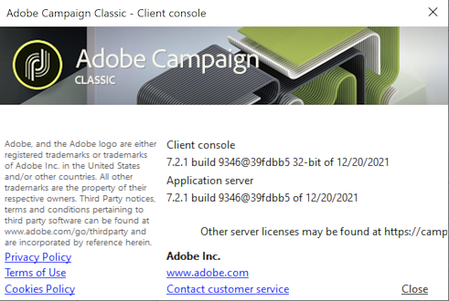

# 启动 Adobe Campaign {#launching-adobe-campaign}

Campaign客户端控制台是一个富客户端，可让您连接到Campaign应用程序服务器。 在[此页面](../../installation/using/installing-the-client-console.md)中了解如何下载和配置客户端控制台。

>[!CAUTION]
>
>在[兼容性矩阵](../../rn/using/compatibility-matrix.md#ClientConsoleoperatingsystems)中检查您的系统和工具与Adobe Campaign客户端控制台的兼容性

## 启动Adobe Campaign {#starting-adobe-campaign}

您可以通过选择&#x200B;**[!UICONTROL Start / All Programs / Adobe Campaign v.X / Adobe Campaign client console]**&#x200B;来启动Adobe Campaign。

您可以利用客户端控制台连接窗口选择或配置现有数据库，并使用用户名和密码连接系统：

## 连接到 Adobe Campaign {#connecting-to-adobe-campaign}

### 与您的Adobe ID连接

Campaign 用户使用其 Adobe ID，通过 Adobe 身份管理系统 (IMS) 连接到 Adobe Campaign 控制台。他们可以在所有 Adobe 解决方案中使用相同的 ID。将 Adobe Campaign 与其他解决方案配合使用时，可以保存该连接。在此页面[上了解有关Adobe IMS &#x200B;](https://helpx.adobe.com/cn/enterprise/using/identity.html)的更多信息。

要配置Campaign Classic v7与Adobe Identity Management服务(IMS)的连接，请参阅[此页面](../../integrations/using/about-adobe-id.md)。

配置完成后，请参阅[Campaign v8（控制台）文档](https://experienceleague.adobe.com/en/docs/campaign/campaign-v8/new/connect){target=_blank}以了解如何使用Adobe ID连接到Campaign。

### 使用登录/密码连接

您还可以使用专用登录/密码进行连接。 此连接称为Campaign“本机身份验证”：

1. 在&#x200B;**[!UICONTROL Login]**&#x200B;字段中输入操作员帐户标识符。

   您的 Adobe Campaign 平台管理员会为您提供标识符。

1. 在&#x200B;**[!UICONTROL Password]**&#x200B;字段中输入您的密码。

   第一次访问数据库时，您的口令是管理员提供给您的口令。 连接后，可通过&#x200B;**[!UICONTROL Tools > Change password...]**&#x200B;菜单更改密码。 有关操作员和连接的详细信息可在[访问管理](../../platform/using/access-management.md)中获得。

1. 单击 **[!UICONTROL LOG IN]** 确认。

现在可以访问 [Adobe Campaign 工作区](../../platform/using/adobe-campaign-workspace.md)了。

## 设置连接 {#setting-up-connections}

您可以通过输入区上方的链接来访问服务器连接设置。

请参阅[Campaign v8 （控制台）文档](https://experienceleague.adobe.com/en/docs/campaign/campaign-v8/new/connect#create-your-connection){target=_blank}以了解如何设置连接。

## 操作员和权限 {#operators-and-permissions}

有权访问软件的操作员的标识符和密码及其相应权限由Adobe Campaign系统管理员在Adobe Campaign树的&#x200B;**[!UICONTROL Administration > Access management > Operators]**&#x200B;节点中定义。

[访问管理](../../platform/using/access-management.md)部分中详细介绍了此功能。

## 获取Adobe Campaign版本 {#getting-your-campaign-version}

**[!UICONTROL Help > About...]**&#x200B;菜单允许您访问以下信息：

* Campaign客户端控制台和应用程序服务器的&#x200B;**版本**&#x200B;编号
* Campaign客户端控制台和应用程序服务器的&#x200B;**内部版本**&#x200B;编号
* 用于联系 Adobe 客户关怀团队的链接
* 指向 Adobe 隐私政策、使用条款和 Cookie 政策的链接

每当您联系Adobe客户关怀团队时，都需要提供Adobe Campaign客户端控制台和应用程序服务器的版本号和内部版本号。

