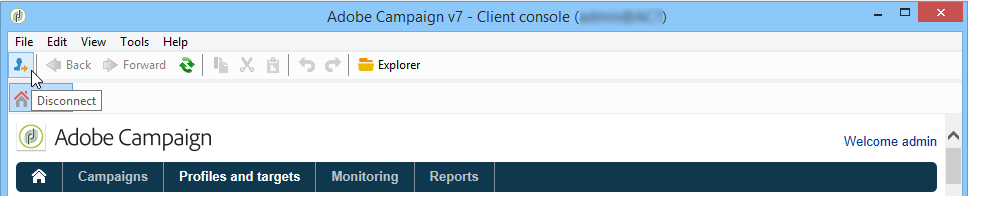

# 启动 Adobe Campaign{#launching-adobe-campaign}

Campaign客户端控制台是一个富客户端，可让您连接到Campaign应用程序服务器。 在[此页面](../../installation/using/installing-the-client-console.md)中了解如何下载和配置客户端控制台。

>[!CAUTION]
>
>在[兼容性矩阵](../../rn/using/compatibility-matrix.md#ClientConsoleoperatingsystems)中检查您的系统和工具与Adobe Campaign客户端控制台的兼容性

## 启动Adobe Campaign {#starting-adobe-campaign}

您可以通过选择&#x200B;**[!UICONTROL Start / All Programs / Adobe Campaign v.X / Adobe Campaign client console]**&#x200B;来启动Adobe Campaign。

您可以利用客户端控制台连接窗口选择或配置现有数据库，并使用用户名和密码连接系统：

## 连接到 Adobe Campaign {#connecting-to-adobe-campaign}

您可以使用您的Adobe ID连接到Adobe Campaign。 有关详细信息，请参见[此页面](../../integrations/using/about-adobe-id.md)。

您也可以使用专用的登录名/密码进行连接：

1. 在&#x200B;**[!UICONTROL Login]**&#x200B;字段中输入操作员帐户标识符。

   您的 Adobe Campaign 平台管理员会为您提供标识符。

1. 在&#x200B;**[!UICONTROL Password]**&#x200B;字段中输入您的密码。

   第一次访问数据库时，您的口令是管理员提供给您的口令。 连接后，可通过&#x200B;**[!UICONTROL Tools > Change password...]**&#x200B;菜单更改密码。 有关操作员和连接的详细信息可在[访问管理](../../platform/using/access-management.md)中获得。

1. 单击&#x200B;**[!UICONTROL LOG IN]**&#x200B;确认。<!--You can also press the **Enter** key to launch connection.-->

现在可以访问 [Adobe Campaign 工作区](../../platform/using/adobe-campaign-workspace.md)了。

**[!UICONTROL Sign in screen]**&#x200B;上提供了一些键盘快捷键：
* 可通过&#x200B;**Tab**&#x200B;键（从上到下）或&#x200B;**Tab** + **Shift**&#x200B;键（从下到上）选择所有可操作项。
* 要启动连接，还可以按&#x200B;**Enter**&#x200B;键。
* 您可以使用&#x200B;**Escape**&#x200B;键将&#x200B;**[!UICONTROL Login]**&#x200B;和&#x200B;**[!UICONTROL Password]**&#x200B;字段重置为上一次成功的连接值。

## 设置连接 {#setting-up-connections}

您可以通过输入区上方的链接来访问服务器连接设置。

在&#x200B;**[!UICONTROL Connections]**&#x200B;窗口中，单击&#x200B;**[!UICONTROL Add > Connection]**。

然后，您必须定义连接设置。 操作步骤：

1. 输入&#x200B;**[!UICONTROL Label]**&#x200B;为数据库连接指定名称。

1. 在&#x200B;**[!UICONTROL URL]**&#x200B;字段中添加应用程序服务器的地址。 如果您不知道连接 URL，请联系管理员。

1. 检查&#x200B;**[!UICONTROL Connect with an Adobe ID]**，让操作员使用其Adobe ID连接到控制台。 有关详细信息，请参见[此页面](../../integrations/using/about-adobe-id.md)。

1. 单击&#x200B;**[!UICONTROL OK]**&#x200B;进行验证。

## 操作员和权限 {#operators-and-permissions}

有权访问软件的操作员的标识符和密码及其相应权限由Adobe Campaign系统管理员在Adobe Campaign树的&#x200B;**[!UICONTROL Administration > Access management > Operators]**&#x200B;节点中定义。

[访问管理](../../platform/using/access-management.md)部分中详细介绍了此功能。

## 断开与Adobe Campaign的连接 {#disconnecting-from-adobe-campaign}

要中断 Adobe Campaign 的连接，请使用图标栏中的第一个图标。

>[!NOTE]
>
>您也可以关闭应用程序，无需先行注销。

## 获取Adobe Campaign版本 {#getting-your-campaign-version}

**[!UICONTROL Help > About...]**&#x200B;菜单允许您访问以下信息：

* Campaign客户端控制台和应用程序服务器的&#x200B;**版本**&#x200B;编号
* Campaign客户端控制台和应用程序服务器的&#x200B;**内部版本**&#x200B;编号
* 用于联系 Adobe 客户关怀团队的链接
* 指向 Adobe 隐私政策、使用条款和 Cookie 政策的链接

每当您联系Adobe客户关怀团队时，都需要提供Adobe Campaign客户端控制台和应用程序服务器的版本号和内部版本号。

**相关主题**：

* [Adobe Campaign帮助和支持选项](../../support.md)
* [Adobe Campaign软件分发](https://experience.adobe.com/#/downloads/content/software-distribution/cn/campaign.html)
* [Adobe Experience Cloud支持和专家讲座](https://helpx.adobe.com/cn/enterprise/admin-guide.html/enterprise/using/support-for-experience-cloud.ug.html)
