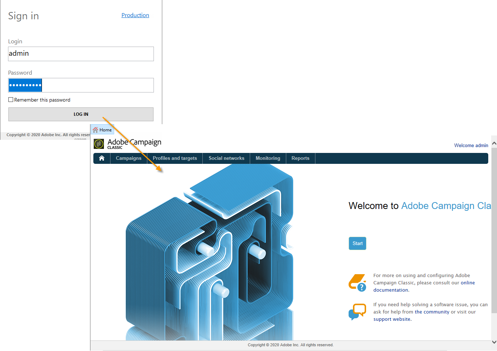

# 启动 Adobe Campaign{#launching-adobe-campaign}

Campaign客户端控制台为

>[!CAUTION]
>
>在[兼容性矩阵](../../rn/using/compatibility-matrix.md#ClientConsoleoperatingsystems)中检查您的系统和工具与Adobe Campaign客户端控制台的兼容性

## 启动Adobe Campaign {#starting-adobe-campaign}

您可以通过选择&#x200B;**[!UICONTROL Start / All Programs / Adobe Campaign v.X / Adobe Campaign client console]**&#x200B;来启动Adobe Campaign。

您可以利用客户端控制台连接窗口选择或配置现有数据库，并使用用户名和密码连接系统：

## 连接到Adobe Campaign {#connecting-to-adobe-campaign}

您可以使用 Adobe ID 连接到 Adobe Campaign。有关详细信息，请参见[此页面](../../integrations/using/about-adobe-id.md)。

您也可以使用专用的登录名/密码进行连接：

1. 在 **[!UICONTROL Login]** 字段中输入操作员帐户标识符。

   您的 Adobe Campaign 平台管理员会为您提供标识符。

1. 在 **[!UICONTROL Password]** 字段中输入您的密码。

   首次访问数据库时，您的密码是由管理员为您提供的。连接后，即可通过&#x200B;**[!UICONTROL Tools > Change password...]**&#x200B;菜单更改密码。 [访问管理](../../platform/using/access-management.md)中提供了有关运算符和连接的详细信息。

1. 单击&#x200B;**[!UICONTROL LOG IN]**&#x200B;以确认。<!--You can also press the **Enter** key to launch connection.-->

现在可以访问 [Adobe Campaign 工作区](../../platform/using/adobe-campaign-workspace.md)了。

**[!UICONTROL Sign in screen]**&#x200B;上提供了一些键盘快捷键：
* 所有可用项目都可通过&#x200B;**Tab**&#x200B;键（从上到下）或&#x200B;**Tab** + **Shift**&#x200B;键（从下到上）进行选择。
* 要启动连接，还可以按&#x200B;**Enter**&#x200B;键。
* 您可以使用&#x200B;**Escape**&#x200B;键将&#x200B;**[!UICONTROL Login]**&#x200B;和&#x200B;**[!UICONTROL Password]**&#x200B;字段重置为最后一个成功的连接值。

## 设置连接 {#setting-up-connections}

您可以通过输入区上方的链接来访问服务器连接设置。

在&#x200B;**[!UICONTROL Connections]**&#x200B;窗口中，单击&#x200B;**[!UICONTROL Add > Connection]**。

然后您必须定义连接设置。操作步骤：

1. 输入 **[!UICONTROL Label]**，为数据库连接命名。

1. 在 **[!UICONTROL URL]** 字段中，添加应用程序服务器的地址。如果您不知道连接 URL，请联系管理员。

1. 检查&#x200B;**[!UICONTROL Connect with an Adobe ID]**，以了解运算符是否使用其Adobe ID连接到控制台。 有关详细信息，请参见[此页面](../../integrations/using/about-adobe-id.md)。

1. 单击&#x200B;**[!UICONTROL OK]**&#x200B;以验证。

## 操作员和权限 {#operators-and-permissions}

具有软件访问权及其相关权限的操作员的标识符与密码是由 Adobe Campaign 系统管理员在 Adobe Campaign 树状结构的 **[!UICONTROL Administration > Access management > Operators]** 节点中定义的。

[访问管理](../../platform/using/access-management.md)部分详细介绍了此功能。

## 断开与Adobe Campaign的连接 {#disconnecting-from-adobe-campaign}

要中断 Adobe Campaign 的连接，请使用图标栏中的第一个图标。

>[!NOTE]
>
>您也可以关闭应用程序，无需先行注销。

## 获取Adobe Campaign版本 {#getting-your-campaign-version}

**[!UICONTROL Help > About...]**&#x200B;菜单允许您访问以下信息：

* **** Campaign客户端控制台和应用程序服务器的版本号
* **** Campaign客户端控制台和应用程序服务器的版本号
* 用于联系 Adobe 客户关怀团队的链接
* 指向 Adobe 隐私政策、使用条款和 Cookie 政策的链接

每当您联系Adobe客户关怀团队时，都需要提供Adobe Campaign客户端控制台和应用程序服务器的版本号和内部版本号。

如果您在[Campaign [!DNL Gold Standard] version](../../rn/using/gold-standard.md)上运行，则还需要共享&#x200B;**[!UICONTROL About]**&#x200B;框中显示的SHA/1字符。 例如，对于Gold **Standard 10版本**，内部版本号将显示&#x200B;**内部版本9032@efd8a94**，如下所示：

在本文](../../rn/using/gs-overview.md)中了解有关[!DNL Gold Standard] [的更多信息。

**相关主题**：

* [Adobe Campaign帮助和支持选项](../../support.md)
* [Adobe Campaign Software Distribution](https://experience.adobe.com/#/downloads/content/software-distribution/cn/campaign.html)
* [Adobe Experience Cloud支持和专家会议](https://helpx.adobe.com/cn/enterprise/admin-guide.html/enterprise/using/support-for-experience-cloud.ug.html)
