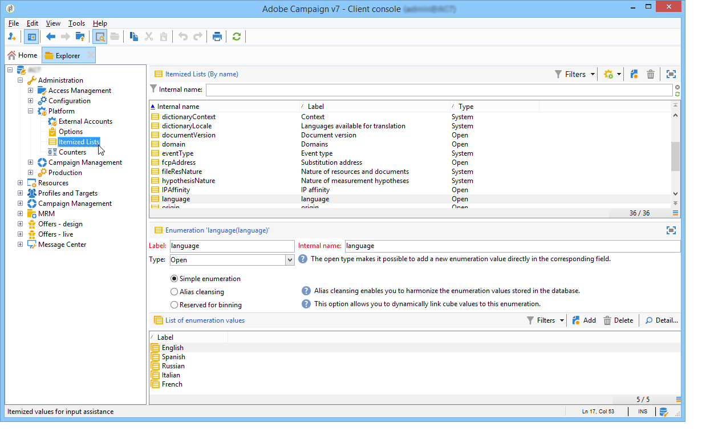
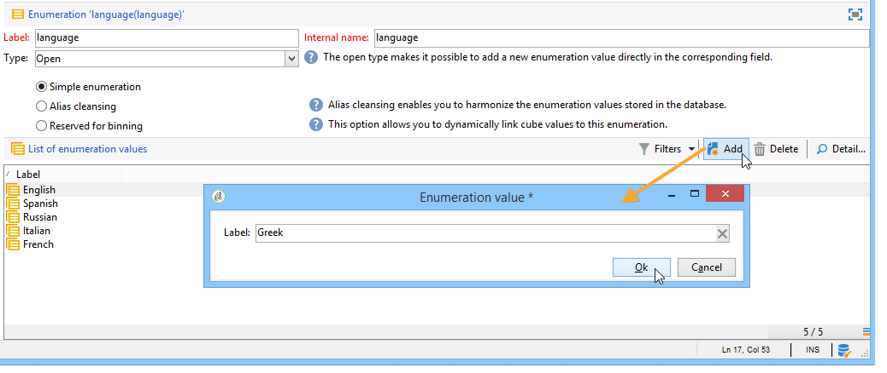

# 管理明细列表{#managing-enumerations}

枚举（也称为“明细列表”）是系统建议用于填充某些字段的值列表。 通过枚举，您可以标准化这些字段的值，并帮助在查询中输入或使用数据。

值列表将显示为一个下拉列表，您可以从中选择要在字段中输入的值。 下拉列表还可以启用预测输入，其中运算符输入前几个字母，应用程序填充其余字母。

某些控制台字段已使用这种类型的枚举定义。 如果可以通过在相应字段中直接输入来添加值，则枚举称为“打开”。

## 访问值 {#access-to-values}

此类字段的值已定义，通过树的&#x200B;**[!UICONTROL Administration > Platform > Enumerations]**&#x200B;节点对这些字段执行整体管理（添加/删除值）。

* 上半部分提供了已定义明细列表的字段列表。
* 下部分列出了建议的值。 这些值将在使用此字段的编辑器中重复。

  

  要创建新的枚举值，请单击&#x200B;**[!UICONTROL Add]**。

  

  如果选择&#x200B;**[!UICONTROL Open]**&#x200B;选项，则用户可以直接在相应字段中添加新的明细列表值。 确认消息允许您创建此值。

  

* 如果选择&#x200B;**[!UICONTROL Closed]**&#x200B;选项，用户将无法创建新值，而只能从可用值中进行选择。

## 标准化数据 {#standardizing-data}

### 关于别名清理 {#about-alias-cleansing}

在明细列表字段中，可以输入除枚举值之外的值。 它们可以按原样存储，也可以进行清理。

>[!CAUTION]
>
>数据清理是影响数据库中数据的关键过程。 Adobe Campaign会执行批量数据更新，这可能会导致某些值被删除。 因此，此操作是为专家用户保留的。

然后，输入的值将为：

* 已添加到明细列表值：在这种情况下，必须选择&#x200B;**[!UICONTROL Open]**&#x200B;选项，
* 或自动替换为相应的别名：在这种情况下，必须在明细列表的&#x200B;**[!UICONTROL Alias]**&#x200B;选项卡中定义此用例，
* 或存储在别名列表中：稍后将为其分配别名。

  >[!NOTE]
  >
  >如果您需要使用数据清理功能，请选择明细列表中的&#x200B;**[!UICONTROL Alias cleansing]**&#x200B;选项。

### 使用别名 {#using-aliases}

选项&#x200B;**[!UICONTROL Alias cleansing]**&#x200B;允许对选定的明细列表使用别名。 选择此选项时，**[!UICONTROL Alias]**&#x200B;选项卡将显示在窗口的底部。

#### 创建别名 {#creating-an-alias}

要创建别名，请单击&#x200B;**[!UICONTROL Add]**。

输入要转换的别名以及要应用的值，然后单击&#x200B;**[!UICONTROL Ok]**。

在确认此操作之前，请检查参数。

>[!CAUTION]
>
>一旦确认此阶段，可能无法恢复之前输入的值：已替换这些值。

因此，当用户在“公司”字段(在Adobe Campaign控制台中或表单中)中输入值&#x200B;**NEILSEN**&#x200B;时，该值将自动被值&#x200B;**NIELSEN Ltd**&#x200B;替换。 值替换由&#x200B;**别名清理**&#x200B;工作流执行。 请参阅[运行数据清理](#running-data-cleansing)。

#### 将值转换为别名 {#converting-values-into-aliases}

要将枚举值转换为别名，请右键单击值列表并选择&#x200B;**[!UICONTROL Convert values into aliases...]**。

选择要转换的值，然后单击&#x200B;**[!UICONTROL Next]**。

单击&#x200B;**[!UICONTROL Start]**&#x200B;运行转换。

执行完成后，别名将添加到别名列表中。

#### 检索别名点击 {#retrieving-alias-hits}

用户输入的值可以转换为别名。 实际上，当用户输入的值未包含在明细列表中时，该值存储在&#x200B;**[!UICONTROL Alias]**&#x200B;选项卡中。

**别名清理**&#x200B;技术工作流每晚恢复这些值，以更新明细列表。 请参阅[运行数据清理](#running-data-cleansing)

如有必要，**[!UICONTROL Hits]**&#x200B;列可以显示输入此值的次数。 计算此值既耗时，又占用内存。 有关详细信息，请参阅[计算条目发生次数](#calculating-entry-occurrences)。

### 运行数据清理 {#running-data-cleansing}

数据清理由&#x200B;**[!UICONTROL Alias cleansing]**&#x200B;技术工作流执行。 为执行期间应用为枚举定义的配置。 请参阅[别名清理工作流](#alias-cleansing-workflow)。

可通过&#x200B;**[!UICONTROL Cleanse values...]**&#x200B;链接触发清理。

通过&#x200B;**[!UICONTROL Advanced parameters...]**&#x200B;链接，可设置考虑收集值的开始日期。

单击&#x200B;**[!UICONTROL Start]**&#x200B;按钮以运行数据清理。

#### 计算条目出现次数 {#calculating-entry-occurrences}

明细列表的&#x200B;**[!UICONTROL Alias]**&#x200B;子选项卡可以显示输入的所有值中某个别名的发生次数。 此信息是估计值，将显示在&#x200B;**[!UICONTROL Hits]**&#x200B;列中。

>[!CAUTION]
>
>计算别名条目发生次数可能需要较长时间。 因此，使用此函数时应谨慎。

您可以通过&#x200B;**[!UICONTROL Cleanse values...]**&#x200B;链接手动运行点击计算。 为此，请单击&#x200B;**[!UICONTROL Advanced parameters...]**&#x200B;链接并选择所需的选项。

* **[!UICONTROL Update the number of alias hits]**：允许您更新基于输入日期已计算的点击。
* **[!UICONTROL Recalculate the number of alias hits from the start]**：允许您在整个Adobe Campaign平台上运行计算。

您还可以创建一个专用工作流，以便计算在给定时间段自动运行，例如每周运行一次。

为此，请创建&#x200B;**[!UICONTROL Alias cleansing]**&#x200B;工作流的副本，更改调度程序并在&#x200B;**[!UICONTROL Enumeration value cleansing]**&#x200B;活动中使用以下设置：

* **-updateHits**&#x200B;以更新别名点击数，
* **-updateHits：full**&#x200B;以重新计算所有别名点击。

#### 别名清理工作流 {#alias-cleansing-workflow}

**别名清理**&#x200B;工作流运行枚举值清理。 默认情况下，此工作流每日执行。

通过&#x200B;**[!UICONTROL Administration > Production > Technical workflows]**&#x200B;节点访问。

