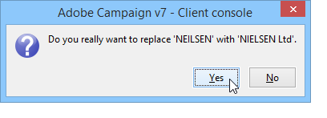

# 管理明细列表{#managing-enumerations}

## 关于明细列表{#about-enumerations}

明细列表(也称为“明细列表”)是系统建议用于填充某些字段的值列表。 明细列表允许您标准化这些字段的值，并帮助您输入数据或在查询中使用数据。

值的列表显示为下拉列表，您可以从中选择要在字段中输入的值。 下拉列表还支持预测输入，操作员输入前几个字母，应用程序填充其余字母。

某些控制台字段已用此类型的明细列表进行定义。 明细列表称为“open”（打开），如果您可以通过直接输入相应字段来添加值。

## 访问值{#access-to-values}

定义此类型字段的值，并通过树的&#x200B;**[!UICONTROL Administration > Platform > Enumerations]**&#x200B;节点对这些字段（添加／删除值）进行整体管理。

* 上部分优惠一列表已定义明细列表的字段。
* 下部分列表建议的值。 这些值将在使用此字段的编辑器中重复。

   

   要创建新明细列表值，请单击&#x200B;**[!UICONTROL Add]**。

   

   如果选择&#x200B;**[!UICONTROL Open]**&#x200B;选项，则用户可以直接在相应字段中添加新的逐项列表值。 通过确认消息可以创建此值。

   

* 如果选择&#x200B;**[!UICONTROL Closed]**&#x200B;选项，则用户将无法创建新值，而只能从可用值中进行选择。

## 标准化数据{#standardizing-data}

### 关于别名清理{#about-alias-cleansing}

在明细列表字段中，您可以输入除明细列表值以外的值。 可以按原样存储，也可以清除。

>[!CAUTION]
>
>数据清理是影响数据库中数据的关键过程。 Adobe Campaign进行大量数据更新，这可能导致某些值被删除。 因此，此操作为专家用户保留。

输入值为：

* 已添加到明细列表值：在这种情况下，必须选择&#x200B;**[!UICONTROL Open]**&#x200B;选项，
* 或自动替换为其相应别名：在这种情况下，必须在明细列表的&#x200B;**[!UICONTROL Alias]**&#x200B;选项卡中定义此情况，
* 或存储在别名列表中：稍后将为其分配别名。

   >[!NOTE]
   >
   >如果需要使用清理功能，请在明细列表中选择&#x200B;**[!UICONTROL Alias cleansing]**&#x200B;选项。

### 使用别名{#using-aliases}

选项&#x200B;**[!UICONTROL Alias cleansing]**&#x200B;允许对选定的明细列表使用别名。 选择此选项后，窗口底部将显示&#x200B;**[!UICONTROL Alias]**&#x200B;选项卡。

#### 创建别名{#creating-an-alias}

要创建别名，请单击&#x200B;**[!UICONTROL Add]**。

输入要转换的别名和要应用的值，然后单击&#x200B;**[!UICONTROL Ok]**。

在确认此操作之前检查参数。

>[!CAUTION]
>
>一旦此阶段被确认，以前输入的值可能无法恢复：他们被替换了。

因此，当用户在“公司”字段(在Adobe Campaign控制台或表单中)输入值&#x200B;**NEILSEN**&#x200B;时，它将自动被值&#x200B;**NIELSEN Ltd**&#x200B;替换。 值替换由&#x200B;**别名清理**&#x200B;工作流执行。 请参阅[运行清理](#running-data-cleansing)。

#### 将值转换为别名{#converting-values-into-aliases}

要将明细列表值转换为别名，请右键单击值列表，然后选择&#x200B;**[!UICONTROL Convert values into aliases...]**。

选择要转换的值，然后单击&#x200B;**[!UICONTROL Next]**。

单击&#x200B;**[!UICONTROL Start]**&#x200B;以运行转换。

执行完成后，别名将添加到别名列表。

#### 检索别名命中{#retrieving-alias-hits}

用户输入的值可以转换为别名。 实际上，当用户输入一个未包含在项目化列表中的值时，该值将存储在&#x200B;**[!UICONTROL Alias]**&#x200B;选项卡中。

**别名清理**&#x200B;技术工作流每晚都会恢复这些值，以更新逐项列表。 请参阅[运行清理](#running-data-cleansing)

如有必要，**[!UICONTROL Hits]**&#x200B;列可显示输入此值的次数。 计算此值既耗时又耗内存。 有关详细信息，请参阅[计算条目出现次数](#calculating-entry-occurrences)。

### 运行清理{#running-data-cleansing}

数据清理由&#x200B;**[!UICONTROL Alias cleansing]**&#x200B;技术工作流执行。 为明细列表定义的配置在执行过程中应用。 请参阅[别名清理工作流](#alias-cleansing-workflow)。

清理可以通过&#x200B;**[!UICONTROL Cleanse values...]**&#x200B;链接触发。

通过&#x200B;**[!UICONTROL Advanced parameters...]**&#x200B;链接，可设置从开始将收集的值考虑在内的日期。

单击&#x200B;**[!UICONTROL Start]**&#x200B;按钮以运行数据清理。

#### 计算条目出现次数{#calculating-entry-occurrences}

明细列表的&#x200B;**[!UICONTROL Alias]**&#x200B;子选项卡可显示所有输入值中别名的出现次数。 此信息是估计值，将显示在&#x200B;**[!UICONTROL Hits]**&#x200B;列中。

>[!CAUTION]
>
>计算别名条目出现可能需要很长时间。 因此，在使用此函数时应谨慎。

您可以通过&#x200B;**[!UICONTROL Cleanse values...]**&#x200B;链接手动运行命中计算。 为此，请单击&#x200B;**[!UICONTROL Advanced parameters...]**&#x200B;链接并选择所需的选项。

* **[!UICONTROL Update the number of alias hits]**:这允许您根据输入的日期更新已计算的命中数。
* **[!UICONTROL Recalculate the number of alias hits from the start]**:允许您在整个Adobe Campaign平台上运行计算。

您还可以创建专用工作流，以便计算在给定期间自动运行，例如每周运行一次。

为此，请创建&#x200B;**[!UICONTROL Alias cleansing]**&#x200B;工作流的副本，更改调度程序，并在&#x200B;**[!UICONTROL Enumeration value cleansing]**&#x200B;活动中使用以下设置：

* **-** updateHits以更新别名点击数，
* **-updateHits:full** 以重新计算所有别名点击。

#### 别名清理工作流{#alias-cleansing-workflow}

**别名清理**&#x200B;工作流运行明细列表值清理。 默认情况下，它每天执行。

它通过&#x200B;**[!UICONTROL Administration > Production > Technical workflows]**&#x200B;节点访问。

