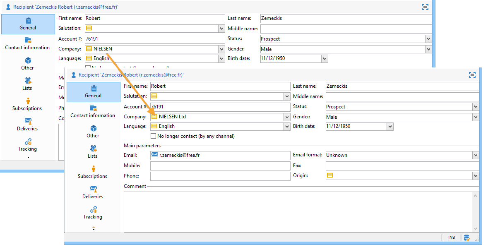

# 管理明细列表{#managing-enumerations}

枚举（也称为“明细列表”）是系统建议用于填充某些字段的值列表。 通过枚举，您可以标准化这些字段的值，并帮助进行数据输入或在查询中使用。

值列表将显示为下拉列表，您可以从中选择要在字段中输入的值。 下拉列表还可以启用预测输入，其中运算符输入前几个字母，应用程序填充其余字母。

某些控制台字段已使用此类枚举进行定义。 如果可以通过在相应字段中直接输入来添加值，则枚举称为“打开”。

## 访问值 {#access-to-values}

此类字段的值已定义，并且这些字段的整体管理（添加/删除值）是通过 **[!UICONTROL Administration > Platform > Enumerations]** 树节点。

* 上半部分提供了已定义明细列表的字段列表。
* 下部分列出了建议值。 将在使用此字段的编辑器中重复这些值。

   

   要创建新的枚举值，请单击 **[!UICONTROL Add]**.

   

   如果 **[!UICONTROL Open]** 选项时，用户可以直接在相应字段中添加新的明细列表值。 确认消息允许您创建此值。

   

* 如果 **[!UICONTROL Closed]** 选项时，用户将无法创建新值，而只能从可用的值中进行选择。

## 标准化数据 {#standardizing-data}

### 关于别名清理 {#about-alias-cleansing}

在明细列表字段中，您可以输入除枚举值之外的值。 它们可以按原样存储或清除。

>[!CAUTION]
>
>数据清理是影响数据库中数据的关键过程。 Adobe Campaign会执行批量数据更新，这可能会导致某些值被删除。 因此，此操作是为专家用户保留的。

然后，输入的值将为：

* 已添加到明细列表值：在本例中， **[!UICONTROL Open]** 必须选择选项，
* 或自动替换为相应的别名：在这种情况下，必须在 **[!UICONTROL Alias]** 选项卡中列出的所有项目，
* 或存储在别名列表中：稍后将为其分配一个别名。

   >[!NOTE]
   >
   >如果需要使用数据清理功能，请选择 **[!UICONTROL Alias cleansing]** 项列表中的选项。

### 使用别名 {#using-aliases}

选项 **[!UICONTROL Alias cleansing]** 使为选定的明细列表使用别名成为可能。 如果选择该选项， **[!UICONTROL Alias]** 选项卡显示在窗口底部。

#### 创建别名 {#creating-an-alias}

要创建别名，请单击 **[!UICONTROL Add]**.

输入要转换的别名以及要应用的值，然后单击 **[!UICONTROL Ok]**.

在确认此操作之前，请检查参数。

>[!CAUTION]
>
>一旦此阶段得到确认，以前输入的值可能无法恢复：它们已被替换。

因此，当用户输入值时 **NEILSEN** 在“company”字段(在Adobe Campaign控制台或表单中)中，该值将自动被替换为值 **NIELSEN有限公司**. 值替换由 **别名清理** 工作流。 请参阅 [运行数据清理](#running-data-cleansing).

#### 将值转换为别名 {#converting-values-into-aliases}

要将枚举值转换为别名，请右键单击值列表并选择 **[!UICONTROL Convert values into aliases...]**.

选择要转换的值，然后单击 **[!UICONTROL Next]**.

单击 **[!UICONTROL Start]** 运行转换。

执行完成后，别名将添加到别名列表中。

#### 检索别名点击 {#retrieving-alias-hits}

用户输入的值可以转换为别名。 实际上，当用户输入的值未包含在明细列表中时，该值将存储在 **[!UICONTROL Alias]** 选项卡。

此 **别名清理** 技术工作流每晚恢复这些值以更新明细列表。 请参阅 [运行数据清理](#running-data-cleansing)

如有必要， **[!UICONTROL Hits]** 列可以显示输入此值的次数。 计算此值既耗时，又占用内存。 有关更多信息，请参阅 [计算条目发生次数](#calculating-entry-occurrences).

### 运行数据清理 {#running-data-cleansing}

数据清理是由 **[!UICONTROL Alias cleansing]** 技术工作流。 为执行期间应用为枚举定义的配置。 请参阅 [别名清理工作流](#alias-cleansing-workflow).

清理可以通过以下方式触发： **[!UICONTROL Cleanse values...]** 链接。

此 **[!UICONTROL Advanced parameters...]** 通过链接，可设置从收集的值开始被考虑的日期。

单击 **[!UICONTROL Start]** 按钮以运行数据清理。

#### 计算条目发生次数 {#calculating-entry-occurrences}

此 **[!UICONTROL Alias]** 明细列表的子选项卡可以显示输入的所有值中某个别名的出现次数。 此信息为估计值，将显示在 **[!UICONTROL Hits]** 列。

>[!CAUTION]
>
>计算别名条目发生次数可能需要较长时间。 因此，使用此函数时应谨慎。

您可以通过手动运行点击计算 **[!UICONTROL Cleanse values...]** 链接。 要执行此操作，请单击 **[!UICONTROL Advanced parameters...]** 链接并选择所需的选项。

* **[!UICONTROL Update the number of alias hits]**：通过此选项可根据输入的日期更新已计算的点击量。
* **[!UICONTROL Recalculate the number of alias hits from the start]**：用于在整个Adobe Campaign平台上运行计算。

您还可以创建一个专用工作流，以便计算在给定时段自动运行，例如每周运行一次。

为此，请创建 **[!UICONTROL Alias cleansing]** 工作流，更改调度程序并使用 **[!UICONTROL Enumeration value cleansing]** 活动：

* **-updateHits** 要更新别名点击数，请执行以下操作：
* **-updateHits：full** 以重新计算所有别名点击。

#### 别名清理工作流 {#alias-cleansing-workflow}

此 **别名清理** 工作流运行枚举值清理。 默认情况下，此工作流每日执行。

可通过 **[!UICONTROL Administration > Production > Technical workflows]** 节点。

