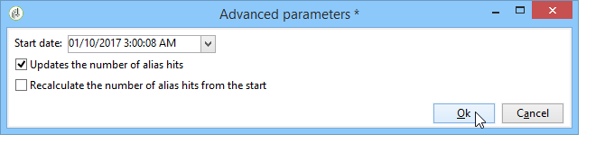

# 管理枚举{#managing-enumerations}

## 关于枚举 {#about-enumerations}

枚举（也称为“分项列表”）是系统建议用于填充某些字段的值列表。 通过枚举，您可以标准化这些字段的值，并帮助输入数据或在查询中使用。

值列表将显示为下拉列表，您可以从中选择要在字段中输入的值。 下拉列表还支持预测输入，操作员输入前几个字母，应用程序填充其余字母。

某些控制台字段已使用此类型的枚举进行定义。 如果可以通过在相应字段中直接输入来添加值，则枚举称为“open”。

## 访问值 {#access-to-values}

定义此类型字段的值，并通过树的节点对这些字段进行整体管理(添加／删除 **[!UICONTROL Administration > Platform > Enumerations]** 值)。

* 上部部分提供已为其定义分项列表的字段列表。
* 下节列出建议的值。 这些值将在使用此字段的编辑器中重复。

   

   要创建新的枚举值，请单击 **[!UICONTROL Add]**。

   

   如果选 **[!UICONTROL Open]** 择了此选项，则用户可以直接在相应字段中添加新的分项列表值。 此时会显示一条确认消息，允许您创建此值。

   

* 如果选 **[!UICONTROL Closed]** 择此选项，用户将无法创建新值，而只是从可用值中进行选择。

## 标准化数据 {#standardizing-data}

### 关于别名清除 {#about-alias-cleansing}

在分项列表字段中，您可以输入除枚举值之外的值。 这些文件可以按原样存储，也可以清除。

>[!CAUTION]
>
>数据清理是影响数据库中数据的关键过程。 Adobe Campaign会进行大量数据更新，这可能导致某些值被删除。 因此，此操作为专家用户保留。

输入的值为：

* 已添加到分项列表值：在这种情况下，必 **[!UICONTROL Open]** 须选择此选项，
* 或自动替换为其相应别名：在这种情况下，必须在分项列表的选 **[!UICONTROL Alias]** 项卡中定义此情况，
* 或存储在别名列表中：稍后会为其分配别名。

   >[!NOTE]
   >
   >如果需要使用数据清理功能，请在分项列 **[!UICONTROL Alias cleansing]** 表中选择选项。

### 使用别名 {#using-aliases}

通过该 **[!UICONTROL Alias cleansing]** 选项，可以对选定的分项列表使用别名。 选择此选项后，窗 **[!UICONTROL Alias]** 口底部将显示选项卡。

#### 创建别名 {#creating-an-alias}

要创建别名，请单击 **[!UICONTROL Add]**。

输入要转换的别名和要应用的值，然后单击 **[!UICONTROL Ok]**。

在确认此操作之前检查参数。

>[!CAUTION]
>
>一旦此阶段被确认，之前输入的值可能无法恢复：他们被替换了。

因此，当用户在“公司”字段（在Adobe Campaign控制台或表单中）中输入值 **NEILSEN** 时，它将自动替换为值 **NIELSEN Ltd**。值替换由别名清除工 **作流执行** 。 请参阅运 [行数据清理](#running-data-cleansing)。

#### 将值转换为别名 {#converting-values-into-aliases}

要将枚举值转换为别名，请右键单击值列表并选择 **[!UICONTROL Convert values into aliases...]**。

选择要转换的值，然后单击 **[!UICONTROL Next]**。

单击 **[!UICONTROL Start]** 以运行转换。

执行完成后，别名即添加到别名列表。

#### 检索别名点击 {#retrieving-alias-hits}

用户输入的值可以转换为别名。 实际上，当用户输入的值不包括在项目化列表中时，该值将存储在选项卡 **[!UICONTROL Alias]** 中。

别名清 **理技术工作流** ，每晚都会恢复这些值，以更新逐项列表。 请参阅运 [行数据清理](#running-data-cleansing)

如有必要， **[!UICONTROL Hits]** 该列可显示输入值的次数。 计算此值既耗时又耗内存。 有关此问题的详细信息，请参阅 [计算条目发生次数](#calculating-entry-occurrences)。

### 运行数据清理 {#running-data-cleansing}

数据清理由技术工作 **[!UICONTROL Alias cleansing]** 流执行。 执行过程中将应用为枚举定义的配置。 请参阅别名 [清除工作流](#alias-cleansing-workflow)。

清洁可通过该链接触 **[!UICONTROL Cleanse values...]** 发。

通过 **[!UICONTROL Advanced parameters...]** 该链接，您可以设置开始将收集的值考虑在内的日期。

单击该 **[!UICONTROL Start]** 按钮以运行数据清理。

#### 计算条目发生次数 {#calculating-entry-occurrences}

分 **[!UICONTROL Alias]** 项列表的子选项卡可显示所有输入值中别名的出现次数。 此信息是估计值，将显示在列 **[!UICONTROL Hits]** 中。

>[!CAUTION]
>
>计算别名条目出现次数可能需要很长时间。 因此，在使用此函数时应谨慎行事。

您可以通过链接手动运行命中计 **[!UICONTROL Cleanse values...]** 算。 为此，请单击链 **[!UICONTROL Advanced parameters...]** 接并选择所需的选项。

* **[!UICONTROL Update the number of alias hits]**:这允许您根据输入的日期更新已计算的点击量。
* **[!UICONTROL Recalculate the number of alias hits from the start]**:允许您在整个Adobe Campaign平台上运行计算。

您还可以创建专用工作流，以便计算在给定时间段内自动运行，例如每周运行一次。

为此，请创建工作流的副本， **[!UICONTROL Alias cleansing]** 更改调度程序并在活动中使用以下 **[!UICONTROL Enumeration value cleansing]** 设置：

* **-updateHits** ，用于更新别名点击数，
* **-updateHits:full** ，重新计算所有别名点击。

#### 别名清除工作流 {#alias-cleansing-workflow}

别名清 **除工作流** ，运行枚举值清除。 默认情况下，它每天执行。

它通过节点 **[!UICONTROL Administration > Production > Technical workflows]** 访问。

