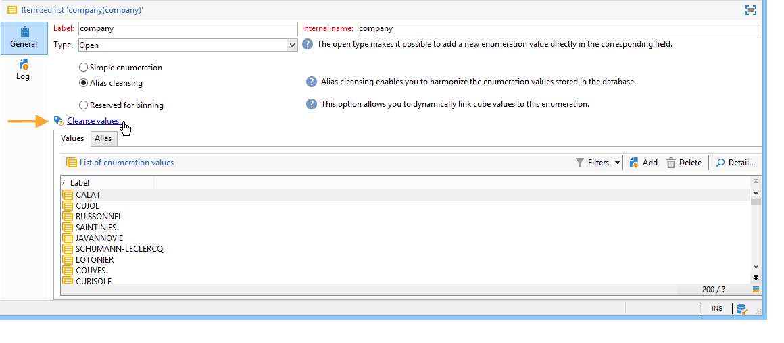

# 管理枚举{#managing-enumerations}

明细列表（也称为“明细列表”）是系统建议用于填充某些字段的值列表。 枚举可让您标准化这些字段的值，并有助于数据输入或在查询中使用。

值列表将显示为一个下拉列表，您可以从中选择要在字段中输入的值。 下拉列表还支持预测输入，在该输入中，运算符会输入前几个字母，应用程序会填入其余字母。

已使用此类枚举定义了一些控制台字段。 如果可以通过在相应字段中直接输入来添加值，则枚举称为“open”。

## 访问值 {#access-to-values}

已定义此类型字段的值，并通过 **[!UICONTROL Administration > Platform > Enumerations]** 树的节点。

* 上部分提供已定义明细列表的字段列表。
* 下部分列出了建议的值。 这些值将在使用此字段的编辑器中重复。

   

   要创建新的枚举值，请单击 **[!UICONTROL Add]**.

   

   如果 **[!UICONTROL Open]** 选项时，用户可以直接在相应字段中添加新的项目化列表值。 利用确认消息，可创建此值。

   

* 如果 **[!UICONTROL Closed]** 选项时，用户将无法创建新值，而只是从可用值中进行选择。

## 标准化数据 {#standardizing-data}

### 关于别名清理 {#about-alias-cleansing}

在明细列表字段中，可以输入除枚举值以外的值。 这些文件可以按原样存储，也可以清洗。

>[!CAUTION]
>
>数据清理是影响数据库中数据的关键过程。 Adobe Campaign会进行批量数据更新，这可能会导致某些值被删除。 因此，此操作是专家用户专用的。

输入的值为：

* 已添加到明细列表值：在本例中， **[!UICONTROL Open]** 选项，
* 或自动替换为其相应别名：在这种情况下，必须在 **[!UICONTROL Alias]** 的
* 或存储在别名列表中：稍后将为其分配别名。

   >[!NOTE]
   >
   >如果您需要使用数据清理功能，请选择 **[!UICONTROL Alias cleansing]** 选项。

### 使用别名 {#using-aliases}

选项 **[!UICONTROL Alias cleansing]** 可以为选定的分项列表使用别名。 选择此选项后， **[!UICONTROL Alias]** 选项卡。

#### 创建别名 {#creating-an-alias}

要创建别名，请单击 **[!UICONTROL Add]**.

输入要转换的别名和要应用的值，然后单击 **[!UICONTROL Ok]**.

在确认此操作之前，请检查参数。

>[!CAUTION]
>
>此阶段确认后，以前输入的值可能无法恢复：他们被替换了。

因此，当用户输入值时 **尼尔森** 在“公司”字段(在Adobe Campaign控制台或表单中)中，该字段将自动替换为值 **NIELSEN有限公司**. 值替换由 **别名清理** 工作流。 请参阅 [运行数据清理](#running-data-cleansing).

#### 将值转换为别名 {#converting-values-into-aliases}

要将枚举值转换为别名，请右键单击值列表，然后选择 **[!UICONTROL Convert values into aliases...]**.

选择要转换的值，然后单击 **[!UICONTROL Next]**.

单击 **[!UICONTROL Start]** 以运行转化。

执行完成后，别名将添加到别名列表。

#### 检索别名点击量 {#retrieving-alias-hits}

用户输入的值可以转换为别名。 实际上，当用户输入的值未包含在明细列表中时，该值将存储在 **[!UICONTROL Alias]** 选项卡。

的 **别名清理** 技术工作流每晚都会取回这些值，以更新明细列表。 请参阅 [运行数据清理](#running-data-cleansing)

如有必要， **[!UICONTROL Hits]** 列可显示输入此值的次数。 计算此值既会耗时又会耗时内存。 有关更多信息，请参阅 [计算登入发生次数](#calculating-entry-occurrences).

### 运行数据清理 {#running-data-cleansing}

数据清理由 **[!UICONTROL Alias cleansing]** 技术工作流。 为枚举定义的配置在执行期间应用。 请参阅 [别名清理工作流](#alias-cleansing-workflow).

清理可通过 **[!UICONTROL Cleanse values...]** 链接。

的 **[!UICONTROL Advanced parameters...]** 链接允许您设置开始考虑收集值的日期。

单击 **[!UICONTROL Start]** 按钮来运行数据清理。

#### 计算登入发生次数 {#calculating-entry-occurrences}

的 **[!UICONTROL Alias]** 明细列表的子选项卡可显示所有输入值中别名出现的次数。 此信息是估计值，将显示在 **[!UICONTROL Hits]** 列。

>[!CAUTION]
>
>计算别名条目发生次数可能需要很长时间。 因此，使用此函数时应谨慎。

您可以通过 **[!UICONTROL Cleanse values...]** 链接。 为此，请单击 **[!UICONTROL Advanced parameters...]** 链接，然后选择所需的选项。

* **[!UICONTROL Update the number of alias hits]**:这允许您根据输入的日期更新已计算的点击量。
* **[!UICONTROL Recalculate the number of alias hits from the start]**:允许您在整个Adobe Campaign平台上运行计算。

您还可以创建专用工作流，以便计算在给定时间段内自动运行，例如每周运行一次。

为此，请创建 **[!UICONTROL Alias cleansing]** 工作流中，更改调度程序，并在 **[!UICONTROL Enumeration value cleansing]** 活动：

* **-updateHits** 要更新别名点击数，
* **-updateHits:full** 重新计算所有别名点击。

#### 别名清理工作流 {#alias-cleansing-workflow}

的 **别名清理** 工作流运行枚举值清理。 默认情况下，每天执行一次。

可通过 **[!UICONTROL Administration > Production > Technical workflows]** 节点。

