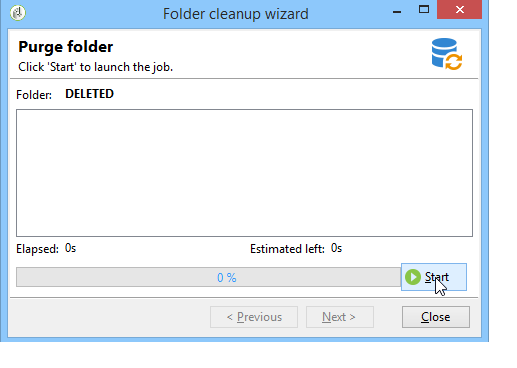

# 管理用户档案{#managing-profiles}

## 收件人树状结构 {#recipient-tree}

要使用高级收件人管理功能，需编辑 Adobe Campaign 树状结构。为此可单击工具栏中的 **[!UICONTROL Explorer]** 按钮。

默认情况下，收件人存储在 Adobe Campaign 树状结构的 **[!UICONTROL Profiles and targets]** 节点中。在相同的节点中，您可以创建一个或多个文件夹和子文件夹来存储收件人用户档案。

每个节点都与一个文件夹保持一致。必须将每个文件夹的数据都视为彼此分开的。也就是说，对于多个收件人文件夹，很难管理重复的项目。

>[!NOTE]
>
>要显示数据库中所有收件人的列表，您必须创建一个视图。在[文件夹和视图](../../platform/using/access-management-folders.md)中了解更多信息。

## 移动收件人 {#moving-recipients}

您可以选择一个或多个收件人、从收件人列表拖动收件人，并将它们放在想要的文件夹中。警告消息会要求您确认此操作。

## 复制收件人 {#copying-a-recipient}

您可以在所需的收件人上单击鼠标右键，然后选择 **[!UICONTROL Copy]**，复制同一文件夹中的收件人。

## 删除收件人 {#deleting-recipients}

要删除收件人，请将它们移到指定的文件夹中，然后清空此文件夹的內容。在此情况下，**強烈建议您不要使用** **[!UICONTROL Delete]** 选项。

要清空文件夹，请在所需的文件夹上单击鼠标右键，然后从菜单中选择 **[!UICONTROL Actions > Purge folder]**。

单击 **[!UICONTROL Start]** 执行该操作。窗口的中间会显示进度状态，如下所示：

