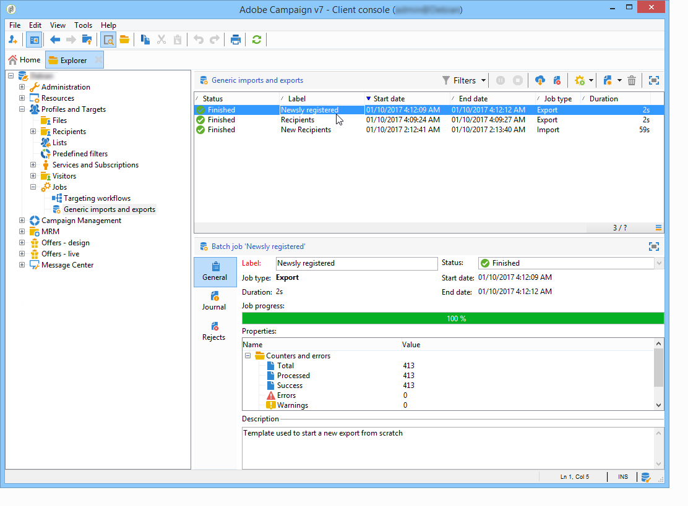

# 监测作业执行 {#monitoring-job-execution}

您可以直接从导入/导出作业列表中跟踪导入和导出作业的执行情况。

* **[!UICONTROL Journal]**&#x200B;选项卡允许您查看有关执行的日志消息。
* **[!UICONTROL Rejects]**&#x200B;选项卡包含被拒绝的记录。 请参阅[此小节](../../platform/using/executing-import-jobs.md#behavior-in-the-event-of-an-error)。

在&#x200B;**[!UICONTROL General]**&#x200B;选项卡中，**[!UICONTROL Status]**&#x200B;字段表示作业的当前状态。

每个状态都由一个特殊的图标和标签表示。 状态及其图标如下：

* **正在编辑**

  正在创建作业。

* **正在执行**

  此作业正在执行。

* **取消**

  单击&#x200B;**[!UICONTROL Cancel]**&#x200B;按钮：正在执行的作业已取消。

* **正在取消**

  取消命令已接收并且正在取消作业。

* **正在暂停**

  单击&#x200B;**[!UICONTROL Pause]**：作业正在挂起。

* **已暂停**

  单击&#x200B;**[!UICONTROL Pause]**：作业已挂起。 单击&#x200B;**[!UICONTROL Start]**&#x200B;可重新启动它。

* **已完成**

  作业的执行已完成。

* **已完成，出现错误**

  由于技术错误，该作业未执行。

* **服务器正在关闭**

  正在进行的作业因 Adobe Campaign 服务器已关闭而中断。
