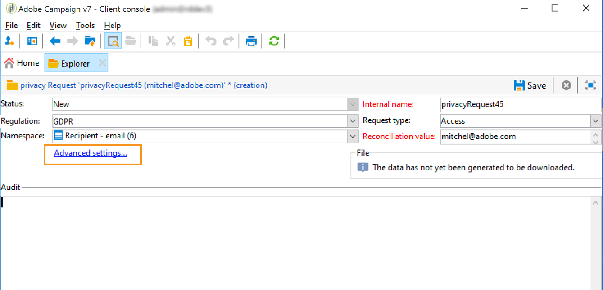

# 创建和管理隐私请求 {#privacy-request-ui}


此部分说明如何创建访问和删除请求，以及 Adobe Campaign 如何处理这些请求。

## 创建隐私请求 {#create-privacy-request-ui}

**Adobe Campaign 界面**&#x200B;允许您创建隐私请求并跟踪其演变。要创建新的隐私请求，请按照以下说明操作：

1. 访问 **[!UICONTROL Administration]** > **[!UICONTROL Platform]** > **[!UICONTROL Privacy Requests]** 下的隐私请求文件夹。

   

1. 在此屏幕中，可以查看当前所有的隐私请求、其状态和日志。单击 **[!UICONTROL New]** 以创建隐私请求。

   

1. 选择 **[!UICONTROL Regulation]**（GDPR、CCPA、PDPA 或 LGPD）、**[!UICONTROL Request type]**（访问或删除），选择 **[!UICONTROL Namespace]** 并输入 **[!UICONTROL Reconciliation value]**。如果您使用电子邮件作为命名空间，请键入数据主体的电子邮件。

   

隐私技术工作流每天运行一次，并处理每个新请求：

* 删除请求：清除存储在 Adobe Campaign 中的收件人数据。
* 访问请求：生成存储在 Adobe Campaign 中的收件人数据，并作为 XML 文件在请求屏幕的左侧提供访问。


## 表格列表 {#list-of-tables}

执行删除或访问隐私请求时，Adobe Campaign 会根据所有具有指向收件人表（自有类型）链接的表中的 **[!UICONTROL Reconciliation value]** 搜索所有数据主体数据。

以下是执行隐私请求时考虑的现成表列表：

* 收件人 (recipient)
* 收件人投放日志 (broadLogRcp)
* 收件人跟踪日志 (trackingLogRcp)
* 归档的事件投放日志 (broadLogEventHisto)
* 收件人列表内容 (rcpGrpRel)
* 访客优惠建议 (propositionVisitor)
* 访客 (visitor)
* 订阅历史记录 (subHisto)
* 订阅 (subscription)
* 收件人优惠建议 (propositionRcp)

如果您创建的自定义表单具有指向收件人表（自有类型）的链接，则也会考虑这些资源。例如，如果您具有链接到收件人表的事务表和链接到该事务表的事务详细信息表，则这两个表都将被考虑在内。

>[!IMPORTANT]
>
>如果使用用户档案删除工作流执行隐私批量请求，请考虑以下说明：
>* 通过工作流删除用户档案不会处理子表。
>* 您需要处理所有子表的删除工作。
>* Adobe 建议您创建一个 ETL 工作流，该工作流会在“隐私访问”表中添加要删除的行，并让 **[!UICONTROL Delete privacy requests data]** 工作流执行删除工作。出于性能考虑，我们建议每天最多删除 200 个用户档案。

## 隐私请求状态 {#privacy-request-statuses}

以下是隐私请求的不同状态：

* **[!UICONTROL New]** / **[!UICONTROL Retry pending]**：进行中，工作流尚未处理请求。
* **[!UICONTROL Processing]** / **[!UICONTROL Retry in progress]**：工作流正在处理请求。
* **[!UICONTROL Delete pending]**：工作流已识别要删除的所有收件人数据。
* **[!UICONTROL Delete in progress]**：工作流正在处理删除。
* **[!UICONTROL Delete Confirmation Pending]**（在两步流程模式下删除请求）：工作流已处理访问请求。需要手动确认以执行删除。该按钮的可用期限为 15 天。
* **[!UICONTROL Complete]**：请求的处理已完成，并且没有错误。
* **[!UICONTROL Error]**：工作流遇到错误。原因显示在 **[!UICONTROL Request status]** 列的隐私请求列表中。例如，**[!UICONTROL Error data not found]** 表示在数据库中找不到与数据主体的 **[!UICONTROL Reconciliation value]** 匹配的收件人数据。

## 两步流程 {#two-step-process}

默认情况下，将激活&#x200B;**两步流程**。使用此模式创建新的删除请求时，Adobe Campaign 始终会先执行访问请求。这样您可以在确认删除之前确认数据。

您可以从隐私请求版本屏幕更改此模式。单击 **[!UICONTROL Advanced settings]**.



激活两步流程模式后，新的删除请求的状态将更改为 **[!UICONTROL Confirm Delete Pending]**。从隐私请求屏幕下载生成的 XML 文件并确认数据。要确认清除数据，请单击 **[!UICONTROL Confirm delete data]** 按钮。


## JSSP URL {#jspp-url}

处理访问请求时，Adobe Campaign 会生成一个 JSSP，它会从数据库中检索收件人数据并将其导出到存储在本地计算机上的 XML 文件中。JSSP URL 定义如下：

```
"$(serverUrl)+'/nms/gdpr.jssp?id='+@id"
```

其中 @id 是隐私请求 ID。

此 URL 存储在 **[!UICONTROL Privacy Requests (gdprRequest)]** 模式的 **[!UICONTROL "File location" (@urlFile)]** 字段中。

这项信息在数据库中保存 90 天。技术工作流清理请求后，信息就会从数据库中删除，URL 就会过期。从网页下载数据之前，请检查 URL 是否仍然有效。

以下是数据主体的数据文件示例：


数据控制者可以轻松创建包含相应 JSSP URL 的 Web 应用程序，以便让数据主体的数据文件可以从网页中访问。


以下是一个您可以在 Web 应用程序 **[!UICONTROL Page]** 活动中用作示例的代码片断。


```
<!DOCTYPE html PUBLIC "-//W3C//DTD XHTML 1.0 Transitional//EN" "http://www.w3.org/TR/xhtml1/DTD/xhtml1-transitional.dtd"> <html xmlns="http://www.w3.org/1999/xhtml"> <head> <meta http-equiv="Content-Language" content="en"> <meta http-equiv="Content-Type" content="text/html; charset=utf-8" /> <link rel="stylesheet" type="text/css" href="/nl/webForms/landingPage.css"/> <title>Clickthrough</title> <style type="text/css" media="all"> /* override formulary area */ .formulary { top: 200px; position: absolute; left: 0; } </style> </head> <body style="" class="">
<center>
<div id="wrap">
<div id="header">
<div class="header-title center-title">DOWNLOAD GDPR DATA</div>
<div class="formulary center-formulary"><form>
<div class="button large-button"><a href=[SERVER_URL]/nms/gdpr.jssp?id=13000" data-nl-type="externalLink">CLICK TO DOWNLOAD</a></div>
</form></div>
</div>
<div id="content">
<div class="row">
<div class="info">
<div class="desc">
<div class="title">EFFICIENCY</div>
<div class="desc">Our service is guaranteed to improve your efficiency. Increase performance and use our high-technology service to implement even the most ambitious of projects.</div>
</div>
</div>
</div>
</div>
<div id="footer">
<div style="text-align: center;">
<div style="float: left;"><a href="#">Contact us</a></div>
<div style="float: right;">&copy; Copyrights</div>
<div><a href="#"></a> <a href="#"></a> <a href="#"></a> <a href="#"></a></div>
</div>
</div>
</div>
</center>
</body> </html>
```

由于访问数据主体的数据文件受到限制，因此必须禁用网页匿名访问。只有拥有 **[!UICONTROL Privacy Data Right]** 指明权限的操作员才能登录页面并下载数据。
