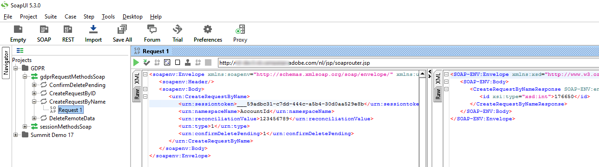
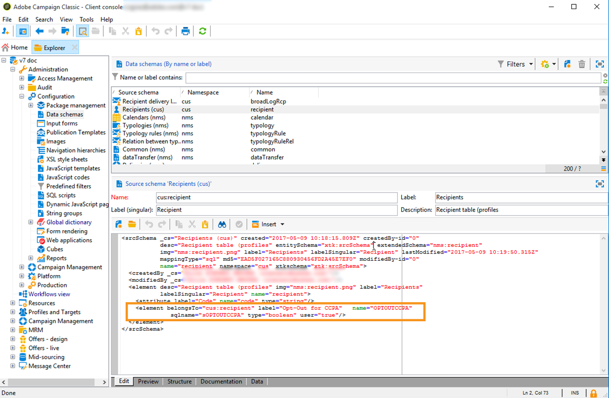

# 管理隐私请求 {#privacy-requests}

有关隐私管理的一般演示文稿，请参阅[此部分](../../platform/using/privacy-management.md)。

此信息适用于 GDPR、CCPA、PDPA 和 LGPD。有关这些法规的更多信息，请参阅[此部分](../../platform/using/privacy-management.md#privacy-management-regulations)。

[此部分](#sale-of-personal-information-ccpa)中说明了特定于 CCPA 的个人信息销售的选择退出。

<!--Installation procedures described in this document are applicable starting Campaign Classic 18.4 (build 8931+). If you are running on a previous version, refer to this [technote](https://helpx.adobe.com/campaign/kb/how-to-install-gdpr-package-on-legacy-versions.html).-->

## 关于隐私请求 {#about-privacy-requests}

为了帮助您促进隐私就绪，Adobe Campaign 允许您处理访问和删除请求。**访问权**&#x200B;和&#x200B;**被遗忘权**（删除请求）在[此部分](../../platform/using/privacy-management.md#right-access-forgotten)中进行了描述。

我们来了解如何创建访问和删除请求，以及 Adobe Campaign 如何处理这些请求。

### 原则 {#principles}

Adobe Campaign 为数据控制者提供两种执行隐私访问和删除请求的方法：

* 通过 **Adobe Campaign 界面**：数据控制者在 Adobe Campaign 中为每项隐私请求创建新的隐私请求。请参阅[此小节](#create-privacy-request-ui)。
* 通过 **API**：Adobe Campaign 提供一个 API，允许使用 SOAP 自动处理隐私请求。请参阅[此小节](#automatic-privacy-request-api)。

>[!NOTE]
>
>有关个人数据以及管理数据的不同实体（数据控制者、数据处理方和数据主体）的更多信息，请参阅[个人数据和角色](../../platform/using/privacy-and-recommendations.md#personal-data)。

### 先决条件 {#prerequesites}

Adobe Campaign 为数据控制者提供用于创建和处理 Adobe Campaign 中存储的数据的隐私请求的工具。但是，数据控制者负责处理与数据主体（电子邮件、客户关怀或 Web 门户）的关系。

因此，作为数据控制者，您的职责是确认发出请求的数据主体的身份，并确认返回给请求者的数据与数据主体有关。

### 安装隐私包{#install-privacy-package}

要使用此功能，您需要通过 **[!UICONTROL Tools]** > **[!UICONTROL Advanced]** > **[!UICONTROL Import package]** > **[!UICONTROL Adobe Campaign Package]**&#x200B;菜单安装 **[!UICONTROL Privacy Data Protection Regulation]** 包。有关如何安装隐私包的更多信息，请参阅[有详细说明的文档](../../installation/using/installing-campaign-standard-packages.md)。

在 **[!UICONTROL Administration]** > **[!UICONTROL Platform]** 下创建了两个专用于隐私的新文件夹：

* **[!UICONTROL Privacy Requests]**：您将在此处创建隐私请求并跟踪其演变。
* **[!UICONTROL Namespaces]**：您将在此处定义用于识别 Adobe Campaign 数据库中的数据主体的字段。


在&#x200B;**[!UICONTROL Administration]** > **[!UICONTROL Production]** > **[!UICONTROL Technical workflows]** 中，每天运行三个技术工作流以处理隐私请求。


* **[!UICONTROL Collect privacy requests]**：此工作流会生成存储在 Adobe Campaign 中的收件人数据，并在隐私请求屏幕中提供下载。
* **[!UICONTROL Delete privacy requests data]**：此工作流会删除存储在 Adobe Campaign 中的收件人数据。
* **[!UICONTROL Privacy request cleanup]**：此工作流会清除 90 天以前的访问请求文件。

在&#x200B;**[!UICONTROL Administration]** > **[!UICONTROL Access Management]** > **[!UICONTROL Named rights]** 中，已添加 **[!UICONTROL Privacy Data Right]** 指明权限。数据控制者必须具有这项指明权限才能使用隐私工具。这使得他们可以创建新请求、跟踪其演变、使用 API 等。


### 命名空间 {#namesspaces}

在创建隐私请求之前，您需要定义将要使用的命名空间。这是将用于识别 Adobe Campaign 数据库中的数据主体的键。

开箱即用的三种命名空间：电子邮件、电话和手机。如果您需要其他命名空间（例如，收件人自定义字段），则可以从 **[!UICONTROL Administration]** > **[!UICONTROL Platform]** > **[!UICONTROL Namespaces]** 创建新命名空间。

## 创建隐私请求 {#create-privacy-request-ui}

**Adobe Campaign 界面**&#x200B;允许您创建隐私请求并跟踪其演变。要创建新的隐私请求，请按照以下说明操作：

1. 访问 **[!UICONTROL Administration]** > **[!UICONTROL Platform]** > **[!UICONTROL Privacy Requests]** 下的隐私请求文件夹。

   

1. 在此屏幕中，可以查看当前所有的隐私请求、其状态和日志。单击 **[!UICONTROL New]** 以创建隐私请求。

   

1. 选择 **[!UICONTROL Regulation]**（GDPR、CCPA、PDPA 或 LGPD）、**[!UICONTROL Request type]**（访问或删除），选择 **[!UICONTROL Namespace]** 并输入 **[!UICONTROL Reconciliation value]**。如果您使用电子邮件作为命名空间，请键入数据主体的电子邮件。

   

隐私技术工作流每天运行一次，并处理每个新请求：

* 删除请求：清除存储在 Adobe Campaign 中的收件人数据。
* 访问请求：生成存储在 Adobe Campaign 中的收件人数据，并作为 XML 文件在请求屏幕的左侧提供访问。


### 表列表 {#list-of-tables}

执行删除或访问隐私请求时，Adobe Campaign 会根据所有具有指向收件人表（自有类型）链接的表中的 **[!UICONTROL Reconciliation value]** 搜索所有数据主体数据。

以下是执行隐私请求时考虑的现成表列表：

* 收件人 (recipient)
* 收件人投放日志 (broadLogRcp)
* 收件人跟踪日志 (trackingLogRcp)
* 归档的事件投放日志 (broadLogEventHisto)
* 收件人列表内容 (rcpGrpRel)
* 访客优惠建议 (propositionVisitor)
* 访客 (visitor)
* 订阅历史记录 (subHisto)
* 订阅 (subscription)
* 收件人优惠建议 (propositionRcp)

如果您创建的自定义表单具有指向收件人表（自有类型）的链接，则也会考虑这些资源。例如，如果您具有链接到收件人表的事务表和链接到该事务表的事务详细信息表，则这两个表都将被考虑在内。

>[!IMPORTANT]
>
>如果使用用户档案删除工作流执行隐私批量请求，请考虑以下说明：
>* 通过工作流删除用户档案不会处理子表。
>* 您需要处理所有子表的删除工作。
>* Adobe 建议您创建一个 ETL 工作流，该工作流会在“隐私访问”表中添加要删除的行，并让 **[!UICONTROL Delete privacy requests data]** 工作流执行删除工作。出于性能考虑，我们建议每天最多删除 200 个用户档案。


### 隐私请求状态 {#privacy-request-statuses}

以下是隐私请求的不同状态：

* **[!UICONTROL New]** / **[!UICONTROL Retry pending]**：进行中，工作流尚未处理请求。
* **[!UICONTROL Processing]** / **[!UICONTROL Retry in progress]**：工作流正在处理请求。
* **[!UICONTROL Delete pending]**：工作流已识别要删除的所有收件人数据。
* **[!UICONTROL Delete in progress]**：工作流正在处理删除。
* **[!UICONTROL Delete Confirmation Pending]**（在两步流程模式下删除请求）：工作流已处理访问请求。需要手动确认以执行删除。该按钮的可用期限为 15 天。
* **[!UICONTROL Complete]**：请求的处理已完成，并且没有错误。
* **[!UICONTROL Error]**：工作流遇到错误。原因显示在 **[!UICONTROL Request status]** 列的隐私请求列表中。例如，**[!UICONTROL Error data not found]** 表示在数据库中找不到与数据主体的 **[!UICONTROL Reconciliation value]** 匹配的收件人数据。

### 两步流程{#two-step-process}

默认情况下，将激活&#x200B;**两步流程**。使用此模式创建新的删除请求时，Adobe Campaign 始终会先执行访问请求。这样您可以在确认删除之前确认数据。

您可以从隐私请求版本屏幕更改此模式。单击 **[!UICONTROL Advanced settings]**.


激活两步流程模式后，新的删除请求的状态将更改为 **[!UICONTROL Confirm Delete Pending]**。从隐私请求屏幕下载生成的 XML 文件并确认数据。要确认清除数据，请单击 **[!UICONTROL Confirm delete data]** 按钮。


### JSSP URL {#jspp-url}

处理访问请求时，Adobe Campaign 会生成一个 JSSP，它会从数据库中检索收件人数据并将其导出到存储在本地计算机上的 XML 文件中。JSSP URL 定义如下：

```
"$(serverUrl)+'/nms/gdpr.jssp?id='+@id"
```

其中 @id 是隐私请求 ID。

此 URL 存储在 **[!UICONTROL Privacy Requests (gdprRequest)]** 模式的 **[!UICONTROL "File location" (@urlFile)]** 字段中。

这项信息在数据库中保存 90 天。技术工作流清理请求后，信息就会从数据库中删除，URL 就会过期。从网页下载数据之前，请检查 URL 是否仍然有效。

以下是数据主体的数据文件示例：


数据控制者可以轻松创建包含相应 JSSP URL 的 Web 应用程序，以便让数据主体的数据文件可以从网页中访问。


以下是一个您可以在 Web 应用程序 **[!UICONTROL Page]** 活动中用作示例的代码片断。


```
<!DOCTYPE html PUBLIC "-//W3C//DTD XHTML 1.0 Transitional//EN" "http://www.w3.org/TR/xhtml1/DTD/xhtml1-transitional.dtd"> <html xmlns="http://www.w3.org/1999/xhtml"> <head> <meta http-equiv="Content-Language" content="en"> <meta http-equiv="Content-Type" content="text/html; charset=utf-8" /> <link rel="stylesheet" type="text/css" href="/nl/webForms/landingPage.css"/> <title>Clickthrough</title> <style type="text/css" media="all"> /* override formulary area */ .formulary { top: 200px; position: absolute; left: 0; } </style> </head> <body style="" class="">
<center>
<div id="wrap">
<div id="header">
<div class="header-title center-title">DOWNLOAD GDPR DATA</div>
<div class="formulary center-formulary"><form>
<div class="button large-button"><a href=[SERVER_URL]/nms/gdpr.jssp?id=13000" data-nl-type="externalLink">CLICK TO DOWNLOAD</a></div>
</form></div>
</div>
<div id="content">
<div class="row">
<div class="info">
<div class="desc">
<div class="title">EFFICIENCY</div>
<div class="desc">Our service is guaranteed to improve your efficiency. Increase performance and use our high-technology service to implement even the most ambitious of projects.</div>
</div>
</div>
</div>
</div>
<div id="footer">
<div style="text-align: center;">
<div style="float: left;"><a href="#">Contact us</a></div>
<div style="float: right;">&copy; Copyrights</div>
<div><a href="#"></a> <a href="#"></a> <a href="#"></a> <a href="#"></a></div>
</div>
</div>
</div>
</center>
</body> </html>
```

由于访问数据主体的数据文件受到限制，因此必须禁用网页匿名访问。只有拥有 **[!UICONTROL Privacy Data Right]** 指明权限的操作员才能登录页面并下载数据。

## 自动隐私请求流程{#automatic-privacy-request-api}

Adobe Campaign 提供了一个 **API**，您可使用它设置一个自动隐私请求流程。

使用 API 时，一般隐私处理流程与[使用 ](#create-privacy-request-ui) 界面的流程相同。唯一的区别是创建隐私请求。会向 Campaign 发送包含请求信息的 POST，而不是在 Adobe Campaign 中创建请求。对于每个请求，将在 **[!UICONTROL Privacy Requests]** 屏幕中添加一个新条目。然后，隐私技术工作流会处理该请求，与处理使用界面添加的请求的方式相同。

如果您使用 API 提交隐私请求，我们建议您在第一次删除请求时，使&#x200B;**两步流程**&#x200B;保持激活状态，以便测试返回的数据。测试完成后，您可以取消激活两步流程，以便自动运行删除请求进程。

**[!UICONTROL CreateRequestByName]** JS API 的定义如下。

>[!NOTE]
>
>如果您使用的是 **gdprRequest** API，您仍可以使用它，但建议使用新的 **privacyRequest** API。

>[!IMPORTANT]
>
>使用 API 需要 **[!UICONTROL Privacy Data Right]** 指明权限。

```
<method library="nms:gdpr.js" name="CreateRequestByName" static="true">
 <help>Create a new GDPR Request using namespace internal name</help>
 <parameters>
  <param name="namespaceName" type="string" desc="Namespace internal name"/>
  <param name="reconciliationValue" type="string" desc="Reconciliation value"/>
  <param name="type" type="long" desc="Reconciliation value"/>
  <param name="confirmDeletePending" type="boolean" desc="Request confirm before deleting data"/>
  <param name="regulation" type="long" desc="regulation of newly created request"/>
  <param name="id" type="long" inout="out" desc="ID of newly created request"/>
 </parameters>
</method>
```

>[!NOTE]
>
>“regulation”字段仅在您使用 Campaign Classic 20.2（内部版本 9178+）时可用。
>
>如果您要迁移到 20.2，并且您已经在使用这个 API，则必须添加如上所示的“regulation”字段。如果您使用的是以前的版本，则可以继续使用这个 API，而无须添加“regulation”字段。

### 从外部调用 API{#invoking-api-externally}

下方是一个示例，说明如何从外部调用 API（通过 API 进行身份验证，并具体说明隐私 API 的详细信息）。有关隐私 API 的更多信息，请查阅 [API 文档](https://docs.adobe.com/content/help/en/campaign-classic/technicalresources/api/s-nms-privacyRequest.html)。您还可以查阅 [Web 服务调用文档](../../configuration/using/web-service-calls.md)。

首先，您需要通过 API 执行身份验证：

1. 通过以下 URL 下载 **xtk:session** WSDL：**`<server url>`/nl/jsp/schemawsdl.jsp?schema=xtk:session**。

1. 使用“登录”方法，将用户名和密码作为请求中的参数传递。您会获得一个包含会话令牌的响应。以下是使用 SoapUI 的示例。

   

1. 使用返回的会话令牌作为所有子序列 API 调用的身份验证。令牌会在 24 小时后失效。

然后调用隐私 API：

1. 从以下 URL 下载 WSDL：**`<server url>`/nl/jsp/schemawsdl.jsp?schema=nms:privacyRequest**。

1. 使用 **[!UICONTROL CreateRequestByName]** 创建特定的隐私请求。

   以下是使用 **[!UICONTROL CreateRequestByName]** 的示例。请注意，我们使用上述会话令牌作为身份验证的方式。响应是已创建请求的 ID。

   

   为了帮助您执行上述步骤，请考虑以下事项：

   * 您可以使用 **nms:gdprRequest** 模式上的 **queryDef** 来查看访问请求的状态。
   * 您可以使用 **nms:gdprRequestData** 模式上的 **queryDef** 来获取访问请求的结果。
   * 为了能够从 **&quot;$(serverUrl)&#39;/nms/gdpr.jssp?id=&#39;@id&quot;** 下载 XML 文件，您必须登录并从已列入允许列表的 IP 访问它。为此，请创建一个允许您访问 JSSP 生成的文件的 Web 应用程序。

### 从 JS 调用 API{#invoking-api-from-js}

下面是在 Campaign Classic 中从 JS 调用 API 的示例。

>[!NOTE]
>
>“regulation”字段仅在您使用 Campaign Classic 20.2（内部版本 9178+）时可用。
>
>如果您要迁移到 20.2，并且您已经在使用这个 API，则必须添加“regulation”字段。如果您使用的是以前的版本，则可以继续使用这个 API，而无须添加“regulation”字段。

* 如果您&#x200B;**使用的是以前的版本（带有 GDPR 包）**，则可以继续使用 API 而无须添加如下所述的“regulation”字段：

   ```
   loadLibrary("nms:gdpr.js");
   /**************************** 
   This code calls an API to create new Privay request on the DB.
   It requires 4 parameters below.
   Feel free to change parameter values.
   ****************************/
   // 1. Namespace internal name
   var namespaceName = "defaultNamespace1";
   // 2. Reconciliation value for privacy request
   var reconciliationValue = "example@adobe.com";
   // 3. Privacy request type
   // GDPR_REQUEST_TYPE_ACCESS = 1;
   // GDPR_REQUEST_TYPE_DELETE = 2;
   var requestType = GDPR_REQUEST_TYPE_ACCESS;
   // 4. Confirm deleting data required.
   // value : true or false
   var ConfirmDeletePending = true;
   // BEGIN
   var requestId = nms.privacyRequest.CreateRequestByName(namespaceName, reconciliationValue, requestType, ConfirmDeletePending);
   // User can use a simple queryDef with requestID as a parameter to check request status.
   ```

* 如果您要&#x200B;**迁移到 20.2**，并且您已经在使用这个 API，则必须添加如下所示的“regulation”字段：

   ```
   loadLibrary("nms:gdpr.js");
   /**************************** 
   This code calls an API to create new Privay request on the DB.
   It requires 5 parameters below.
   Feel free to change parameter values.
   ****************************/
   // 1. Namespace internal name
   var namespaceName = "defaultNamespace1";
   // 2. Reconciliation value for privacy request
   var reconciliationValue = "example@adobe.com";
   // 3. Privacy request type
   // PRIVACY_REQUEST_TYPE_ACCESS = 1;
   // PRIVACY_REQUEST_TYPE_DELETE = 2;
   var requestType = PRIVACY_REQUEST_TYPE_ACCESS;
   // 4. Confirm deleting data required.
   // value : true or false
   var ConfirmDeletePending = true;
   // 5. Specify which regulation applies to newly created request. This is mandatory parameter.
   // GDPR = 1
   // CCPA = 2
   // PDPA = 3
   // LGPD = 4
   var regulation = 1;
   // BEGIN
   var requestId = nms.privacyRequest.CreateRequestByName(namespaceName, reconciliationValue, requestType, ConfirmDeletePending, regulation);
   // User can use a simple queryDef with requestID as a parameter to check request status.
   ```

* 如果您&#x200B;**使用的是 Campaign Classic 20.2（内部版本 9178+）或更高版本**，则如下所示的“regulation”字段为可选字段：

   ```
   loadLibrary("nms:gdpr.js");
   /**************************** 
   This code calls an API to create new Privay request on the DB.
   It requires 5 parameters below.
   Feel free to change parameter values 
   ****************************/
   // 1. Namespace internal name
   var namespaceName = "defaultNamespace1";
   // 2. Reconciliation value for privacy request
   var reconciliationValue = "example@adobe.com";
   // 3. Privacy request type
   // PRIVACY_REQUEST_TYPE_ACCESS = 1;
   // PRIVACY_REQUEST_TYPE_DELETE = 2;
   var requestType = PRIVACY_REQUEST_TYPE_ACCESS;
   // 4. Confirm deleting data required.
   // value : true or false
   var ConfirmDeletePending = true;
   // 5. Specify which regulation applies to newly created request. This is optional parameter.
   // GDPR = 1
   // CCPA = 2
   // PDPA = 3
   // LGPD = 4
   var regulation = 1;
   // BEGIN
   var requestId = nms.privacyRequest.CreateRequestByName(namespaceName, reconciliationValue, requestType, ConfirmDeletePending, regulation);
   // User can use a simple queryDef with requestID as a parameter to check request status.
   ```

## 选择退出个人信息销售 (CCPA) {#sale-of-personal-information-ccpa}

**加州消费者隐私法案** (CCPA) 为加利福尼亚州居民提供了与其个人信息有关的新权利，并要求在加利福尼亚开展业务的特定实体承担数据保护责任。

访问和删除请求的配置和使用对于 GDPR 和 CCPA 均通用。此部分介绍特定于 CCPA 的个人数据销售的选择退出。

除了 Adobe Campaign 提供的[同意管理](../../platform/using/privacy-management.md#consent-management)工具外，您还可以跟踪消费者是否已选择退出个人信息销售。

消费者通过您的系统决定不允许将其个人信息销售给第三方。在 Adobe Campaign 中，您将能够存储和跟踪此信息。

为使此功能正常工作，您需要扩展用户档案表并添加 **[!UICONTROL Opt-Out for CCPA]** 字段。

>[!IMPORTANT]
>
>作为数据控制者，您负责接收数据主体的请求并跟踪 CCPA 的请求日期。作为技术提供商，我们仅提供选择退出的方式。有关您作为数据控制者的角色的更多信息，请参阅[个人数据和角色](../../platform/using/privacy-and-recommendations.md#personal-data)。

### 先决条件{#ccpa-prerequisite}

要利用此信息，您需要在 Adobe Campaign Classic 中创建此字段。为此，您将向 **[!UICONTROL Recipient]** 表添加一个布尔字段。创建新字段后，Campaign API 会自动支持该字段。

如果您使用自定义收件人表，也需要执行此操作。

有关如何创建新字段的更多详细信息，请参阅[模式版文档](../../configuration/using/about-schema-edition.md)。

>[!IMPORTANT]
>
>修改模式是一项敏感操作，必须仅由专家用户执行。

1. 转至&#x200B;**[!UICONTROL Tools]** > **[!UICONTROL Advanced]** > **[!UICONTROL Add new fields]**，选择 **[!UICONTROL Recipients]** 作为 **[!UICONTROL Document type]** 并单击 **[!UICONTROL Next]**。有关向表单添加字段的更多信息，请参阅[此小节](../../configuration/using/new-field-wizard.md)。

   

1. 对于 **[!UICONTROL Field type]**，选择 **[!UICONTROL SQL field]**。对于“标签”，请使用 **[!UICONTROL Opt-Out for CCPA]**。选择 **[!UICONTROL 8-bit integer (boolean)]** 类型并定义以下唯一 **[!UICONTROL Relative path]**：@OPTOUTCCPA。单击 **[!UICONTROL Finish]**。

   

   这将扩展或创建 **[!UICONTROL Recipient (cus)]** 模式。单击它可验证该字段是否已正确添加。

   

1. 单击资源管理器的 **[!UICONTROL Configuration]** > **[!UICONTROL Input forms]** 节点。在“通用包” **[!UICONTROL Recipient (nms)]** 下，添加一个 `<input>` 元素，并使用步骤 2 中定义的相对路径作为 xpath 值。有关识别表单的更多信息，请参阅[此小节](../../configuration/using/identifying-a-form.md)。

   ```
   <input  colspan="2" type="checkbox" xpath="@OPTOUTCCPA"/>
   ```

   

1. 断开并重新连接。按照下一节中描述的步骤，验证字段在收件人的详细信息中是否可用。

### 使用情况 {#usage}

数据控制者负责填写字段值，并遵循关于数据销售的 CCPA 准则和规则。

要填写值，可以使用以下几种方法：

* 通过编辑收件人的详细信息，使用 Campaign 的界面
* 使用 API
* 通过数据导入工作流

然后，您应确保永远不要向已选择退出的任何第三方销售用户档案的个人信息。

1. 要更改选择退出状态，请转到 **[!UICONTROL Profiles and Target]** > **[!UICONTROL Recipients]** 并选择收件人。在 **[!UICONTROL General]** 选项卡中，您会看到在上一节中配置的字段。

   

1. 配置收件人列表以显示选择退出列。要了解如何配置列表，请参阅[有详细说明的文档](../../platform/using/adobe-campaign-workspace.md#configuring-lists)。

   

1. 您可以单击该列，以根据选择退出信息对收件人进行排序。您还可以创建一个筛选器以仅显示已选择退出的收件人。有关创建筛选器的更多信息，请参阅[此小节](../../platform/using/creating-filters.md)。

   
