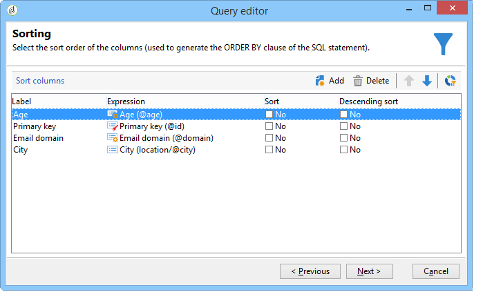
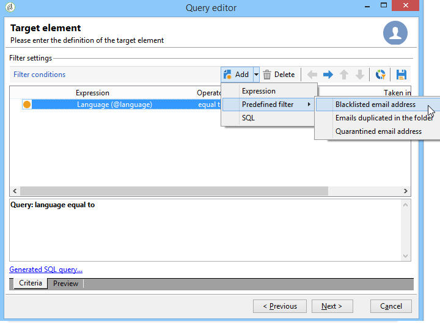

# 创建查询的步骤{#steps-to-create-a-query}

在Adobe Campaign中构建查询的步骤如下所示：

1. 选择工作表。 请参阅 [第1步 — 选择表](#step-1---choose-a-table).
1. 选择要提取的数据。 请参阅 [步骤2 — 选择要提取的数据](#step-2---choose-data-to-extract).
1. 定义数据排序顺序。 请参阅 [步骤3 — 排序数据](#step-3---sort-data).
1. 筛选数据。 请参阅 [第4步 — 筛选数据](#step-4---filter-data).
1. 设置数据格式。 请参阅 [步骤5 — 设置数据格式](#step-5---format-data).
1. 显示结果。 请参阅 [步骤6 — 预览数据](#step-6---preview-data).

>[!NOTE]
>
>所有这些步骤在通用查询编辑器中均可用。 在另一个上下文中创建查询时，可能会省略一些步骤。\
>中显示了查询活动 [本节](../../workflow/using/query.md).

## 第1步 — 选择表 {#step-1---choose-a-table}

选择包含要查询的数据的表 **[!UICONTROL Document type]** 窗口。 如有必要，请使用过滤器字段或 **[!UICONTROL Filters]** 按钮。

## 步骤2 — 选择要提取的数据 {#step-2---choose-data-to-extract}

在 **[!UICONTROL Data to extract]** 窗口中，选择要显示的数据：这些字段将构成输出列。

例如，选择 **[!UICONTROL Age]**， **[!UICONTROL Primary key]**， **[!UICONTROL Email domain]** 和 **[!UICONTROL City]**. 结果将根据此选择进行组织。 使用窗口右侧的蓝色箭头可更改列顺序。

可以通过将公式插入表达式中或对聚合函数运行进程来编辑表达式。 要执行此操作，请单击 **[!UICONTROL Expression]** 列字段，然后选择 **[!UICONTROL Edit expression]**.

可以分组输出列数据：要执行此操作，请选中 **[!UICONTROL Yes]** 在 **[!UICONTROL Group]** 列 **[!UICONTROL Data to extract]** 窗口。 此函数围绕选中的分组轴生成结果。 有关分组查询的示例，请参见 [本节](../../workflow/using/querying-delivery-information.md).

* 此 **[!UICONTROL Handle groupings (GROUP BY + HAVING)]** 函数允许您“分组依据”并选择已分组的内容（“具有”）。 此函数应用于输出列中的所有字段。 例如，此选项允许您对输出列的所有选择进行分组，并恢复特定类型的信息，例如介于35和50之间的收件人。

  如需详细信息，请参阅[此小节](../../workflow/using/querying-using-grouping-management.md)。

* 此 **[!UICONTROL Remove duplicate rows (DISTINCT)]** 函数允许您删除在输出列中获得的相同结果的重复项。 例如，如果选择输出列中的“姓氏”、“名字”和“电子邮件”字段进行人口普查，则数据相同的联系人将被删除，因为这意味着同一联系人已在数据库中输入多次：只考虑一个结果。

## 步骤3 — 排序数据 {#step-3---sort-data}

此 **[!UICONTROL Sorting]** 窗口允许您对列内容进行排序。 使用箭头可更改列顺序：

* 此 **[!UICONTROL Sorting]** 列允许进行简单的排序，并按A到Z或升序排列列内容。
* 此 **[!UICONTROL Descending sort]** 将内容从Z到A并按降序排列。 这对于查看记录销售额非常有用，例如：最高数字显示在列表顶部。

在此示例中，数据根据收件人年龄按升序排序。

## 第4步 — 筛选数据 {#step-4---filter-data}

利用查询编辑器，可筛选数据以优化搜索。

提供的过滤器取决于查询涉及的表。

一旦您选择 **[!UICONTROL Filtering conditions]** 您将访问 **[!UICONTROL Target elements]** 部分：用于定义如何过滤要收集的数据。

* 要创建新筛选器，请选择创建要验证的公式所需的字段、运算符和值，以便选择数据。 可以合并多个条件(有关更多信息，请参阅 [定义筛选条件](../../platform/using/defining-filter-conditions.md))。
* 要使用先前保存的筛选器，请通过单击 **[!UICONTROL Add]** 按钮，单击 **[!UICONTROL Predefined filter]** 选择您想要的。

  

* 在中创建的过滤器 **[!UICONTROL Generic query editor]** 在其他查询应用程序中可用，反之亦然。 要保存过滤器，请单击 **[!UICONTROL Save]** 图标。

  >[!NOTE]
  >
  >有关创建和使用过滤器的更多信息，请参阅 [筛选选项](../../platform/using/filtering-options.md).

如以下示例所示，要恢复所有说英语的收件人，请选择“recipient language（收件人语言）” **等于** EN”。

>[!NOTE]
>
>通过在以下位置键入以下公式，可以直接访问某个选项： **值** 字段： **$(options：OPTION_NAME)**.

单击 **[!UICONTROL Preview]** 选项卡以查看筛选条件的结果。 在这种情况下，所有说英语的收件人都会显示其姓名、名字和电子邮件地址。

熟悉SQL语言的用户可以单击 **[!UICONTROL Generate SQL query]** 以查看SQL中的查询。

## 步骤5 — 设置数据格式 {#step-5---format-data}

配置限制筛选器后，您将访问 **[!UICONTROL Data formatting]** 窗口。 通过此窗口，您可以重新排列输出列、转换数据以及更改列标签的大写/小写。 它还允许您使用计算字段将公式应用于最终结果。

>[!NOTE]
>
>有关计算字段类型的更多信息，请参阅 [创建计算字段](../../platform/using/defining-filter-conditions.md#creating-calculated-fields).

未选中的列将不会显示在数据预览窗口中。

此 **[!UICONTROL Transformation]** 列用于将列标签更改为大写或小写。 选择列并单击 **[!UICONTROL Transformation]** 列。 您可以选择：

* **[!UICONTROL Switch to lower case]**，
* **[!UICONTROL Switch to upper case]**，
* **[!UICONTROL First letter in upper case]**.

## 步骤6 — 预览数据 {#step-6---preview-data}

此 **[!UICONTROL Data preview]** 窗口是最后一个阶段。 单击 **[!UICONTROL Start the preview of the data]** 以获取查询结果。 它以列或XML格式提供。 单击 **[!UICONTROL Generated SQL queries]** 选项卡以查看SQL格式的查询。

在此示例中，数据根据收件人年龄按升序排序。

>[!NOTE]
>
>默认情况下，中仅显示前200行 **[!UICONTROL Data preview]** 窗口。 若要更改此值，请在 **[!UICONTROL Lines to display]** 框并单击 **[!UICONTROL Start the preview of the data]**.
