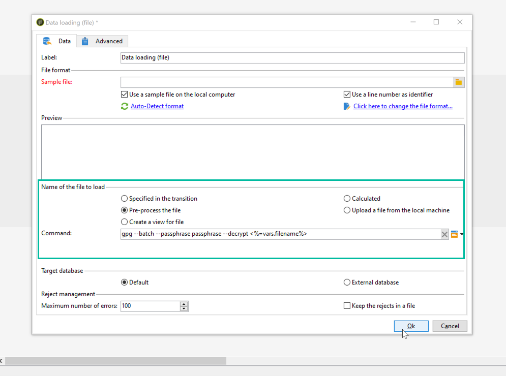

# 解压缩或解密文件 {#unzipping-or-decrypting-a-file-before-processing}

Adobe Campaign允许您导入压缩或加密文件。 在阅读文档之前 [数据加载（文件）](../../workflow/using/data-loading--file-.md) 活动，您可以定义解压缩或解密文件的预处理。

要做到这一点，请执行以下操作：

1. 使用 [控制面板](https://experienceleague.adobe.com/docs/control-panel/using/instances-settings/gpg-keys-management.html#decrypting-data) 以生成公钥/私钥对。

   >[!NOTE]
   >
   >所有管理员用户都可访问控制面板。[此页面](https://experienceleague.adobe.com/docs/control-panel/using/discover-control-panel/managing-permissions.html?lang=zh-Hans#discover-control-panel)详细介绍了授予用户管理员访问权限的步骤。
   >
   >请注意，您的实例必须托管在AWS上，并使用进行升级 [最新GA版本](../../rn/using/rn-overview.md). 在[本节](../../platform/using/launching-adobe-campaign.md#getting-your-campaign-version)中了解如何确认您的版本。要检查您的实例是否托管在 AWS 上，请按照[此页面](https://experienceleague.adobe.com/docs/control-panel/using/faq.html?lang=zh-Hans)中详述的步骤操作。

1. 如果您安装的Adobe Campaign由Adobe托管，请联系 [Adobe客户关怀](https://helpx.adobe.com/cn/enterprise/admin-guide.html/enterprise/using/support-for-experience-cloud.ug.html) 在服务器上安装必要的实用程序。
1. 如果内部部署了Adobe Campaign，请在应用程序服务器上安装要使用的实用程序（例如：GPG、GZIP）以及必需的密钥（加密密钥）。

然后，您可以在工作流中使用所需的预处理命令：

1. 添加和配置 **[!UICONTROL File transfer]** 活动。
1. 添加 **[!UICONTROL Data loading (file)]** 活动，并定义文件格式。
1. 勾选 **[!UICONTROL Pre-process the file]** 选项。
1. 指定要应用的预处理命令。
1. 添加其他活动以管理来自文件的数据。
1. 保存并执行工作流。

以下用例中将显示一个示例。

**相关主题：**

* [数据加载（文件）活动](../../workflow/using/data-loading--file-.md).
* [压缩或加密文件](../../workflow/using/how-to-use-workflow-data.md#zipping-or-encrypting-a-file).

## 用例：导入使用控制面板生成的密钥加密的数据 {#use-case-gpg-decrypt}

在此使用案例中，我们将构建一个工作流，以使用在控制面板中生成的密钥导入已在外部系统中加密的数据。

 [在视频中发现此功能](#video)

执行此用例的步骤如下：

1. 使用控制面板生成密钥对（公共/私有）。 有关详细步骤，请参阅 [控制面板文档](https://experienceleague.adobe.com/docs/control-panel/using/instances-settings/gpg-keys-management.html#decrypting-data).

   * 公共密钥将与外部系统共享，外部系统将使用它来加密要发送到Campaign的数据。
   * Campaign Classic将使用私钥对传入的加密数据进行解密。

   

1. 在外部系统中，使用从控制面板下载的公钥对数据进行加密后导入Campaign Classic中。

1. 在Campaign Classic中，构建一个工作流以导入加密数据，并使用已通过控制面板安装的私钥对其进行解密。 为此，我们将构建一个工作流，如下所示：

   

   * **[!UICONTROL File transfer]** 活动：将文件从外部源传输到Campaign Classic。 在本例中，我们要从SFTP服务器传输文件。
   * **[!UICONTROL Data loading (file)]** 活动：将数据从文件加载到数据库中，并使用控制面板中生成的私钥对其进行解密。

1. 打开 **[!UICONTROL File transfer]** 活动，然后指定要从中导入加密的.gpg文件的外部帐户。

   

   有关如何配置活动的全局概念，请参见 [本节](../../workflow/using/file-transfer.md).

1. 打开 **[!UICONTROL Data loading (file)]** 活动，然后根据需要进行配置。 有关如何配置活动的全局概念，请参见 [本节](../../workflow/using/data-loading--file-.md).

   为活动添加预处理阶段，以便解密传入数据。 要执行此操作，请选择 **[!UICONTROL Pre-process the file]** 选项，然后将此解密命令复制并粘贴到 **[!UICONTROL Command]** 字段：

   `gpg --batch --passphrase passphrase --decrypt <%=vars.filename%>`

   

   >[!CAUTION]
   >
   >在本例中，我们使用控制面板默认使用的密码短语“passphrase”。
   >
   >如果您过去通过客户关怀请求在实例上安装了GPG密钥，则密码可能已更改，并且默认情况下与密码不同。

1. 单击 **[!UICONTROL OK]** 以确认活动配置。

1. 您现在可以运行工作流。 执行后，您可以在工作流日志中签入是否已执行解密，以及是否已导入文件中的数据。

   

## 教程视频 {#video}

本视频说明如何使用GPG密钥解密数据。

>[!VIDEO](https://video.tv.adobe.com/v/36482?quality=12)

提供了其他Campaign Classic操作方法视频 [此处](https://experienceleague.adobe.com/docs/campaign-classic-learn/tutorials/overview.html?lang=zh-Hans).
