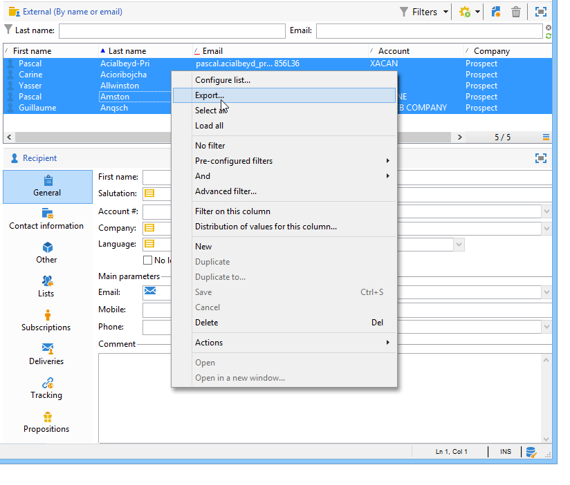
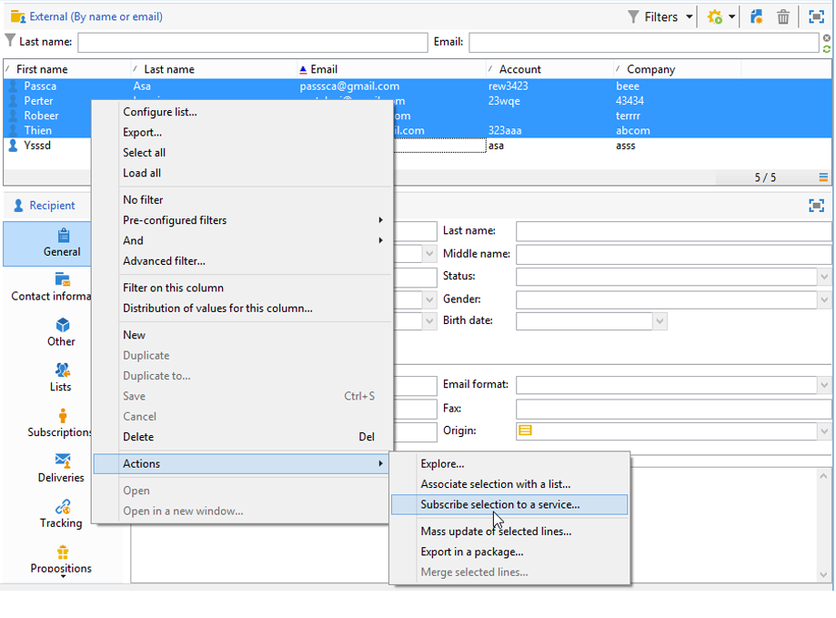

# 更新数据{#updating-data}

>[!NOTE]
>
>此页面仅适用于使用本机身份验证连接到Campaign的操作员。

可以手动或自动更新已链接至收件人用户档案的数据。

## 设置自动更新 {#setting-up-an-automatic-update}

可以通过工作流配置自动更新。 如需详细信息，请参阅[此小节](../../workflow/using/update-data.md)。

## 执行批量更新 {#performing-a-mass-update}

若要执行手动更新，请右键单击选定的收件人以使用&#x200B;**[!UICONTROL Actions]**&#x200B;快捷菜单，或使用&#x200B;**[!UICONTROL Actions]**&#x200B;图标。

有两种类型的更新：对一组收件人进行批量更新，以及在两个用户档案之间合并数据。 对于这两种操作，向导可帮助您配置更新工作。

### 大量更新 {#mass-update}

若要进行批量更新，请使用&#x200B;**[!UICONTROL Action > Mass update of selected lines...]**。 向导可帮助您配置并运行更新。

向导的第一步是指定要更新的字段。

向导的左侧部分显示可用字段列表。 使用&#x200B;**[!UICONTROL Find]**&#x200B;字段对这些字段进行搜索。 按&#x200B;**Enter**&#x200B;键浏览列表。 符合您所输入条件的字段名称会以粗体显示，如下所示。

双击要更新的字段，从而在向导的右侧显示它们。

发生错误时，使用&#x200B;**[!UICONTROL Delete]**&#x200B;按钮从要更新的字段列表中删除字段。

选择或输入值，从而将其应用到需更新的用户档案。

您可以单击&#x200B;**[!UICONTROL Distribution of values]**&#x200B;以显示当前文件夹中存在的收件人（不仅包括受更新影响的收件人）的选定字段值的分布情况。

您可以定义筛选器以显示此窗口中的值分布，或修改当前文件夹以显示另一个文件夹中的值分布。 这些操作都是只读的，不会影响所定义更新的配置。

关闭此窗口并单击&#x200B;**[!UICONTROL Next]**&#x200B;以显示第二个更新向导步骤。 在此步骤中，您可以通过单击&#x200B;**[!UICONTROL Start]**&#x200B;来启动更新。

有关更新执行的信息会显示在向导的上部。

**[!UICONTROL Stop]**&#x200B;允许您取消更新，但某些记录可能已更新，停止进程将不会取消这些更新。 进度条会显示目前操作的进度。

### 合并数据 {#merge-data}

选择&#x200B;**[!UICONTROL Merge selected lines...]**&#x200B;以启动两个收件人配置文件的合并。 在选择选项之前，必须选择要合并的配置文件。 使用向导来配置和开始合并操作。

向导显示在一个或其他源配置文件中完成的每个字段要检索的值。 如果要合并的用户档案中的一个或多个字段具有不同的值，则它们将显示在&#x200B;**[!UICONTROL List of conflicts]**&#x200B;部分中。 您可使用列表下方的单选按钮来选择默认的用户档案，如以下示例所示：

单击&#x200B;**[!UICONTROL Compute]**&#x200B;显示您选择的结果。

检查窗口两个部分的&#x200B;**[!UICONTROL Result]**&#x200B;列，然后单击&#x200B;**[!UICONTROL Finish]**&#x200B;运行合并。

## 导出数据 {#exporting-data}

列表的内容可以导出。 要配置并执行导出：

1. 选择要导出的记录。
1. 右键单击并选择&#x200B;**[!UICONTROL Export...]**。

   

1. 然后选择要提取的数据。 默认情况下，会将显示的所有列都添加到输出列中。

   

   有关如何配置导出向导的详细信息，请参阅[此部分](../../platform/using/executing-export-jobs.md)。

## 订阅服务 {#subscribing-to-a-service}

大多数情况下，收件人会通过专用的登陆页面订阅新闻稿，如[此部分](../../delivery/using/managing-subscriptions.md)中所述。 但是，可以手动订阅服务（新闻稿或病毒式服务）的已过滤收件人的用户档案。 操作步骤：

1. 选择您想要订阅的收件人，然后单击鼠标右键。
1. 选择 **[!UICONTROL Actions > Subscribe selection to a service]**。

   

1. 选择所需的服务并单击&#x200B;**[!UICONTROL Next]**：

   

   >[!NOTE]
   >
   >此编辑器允许您创建新服务：单击&#x200B;**[!UICONTROL Create]**&#x200B;按钮。

1. 您可以&#x200B;**[!UICONTROL Send a confirmation message]**&#x200B;给收件人。 可在链接到所选服务的订阅场景中配置此消息的內容。
1. 单击&#x200B;**[!UICONTROL Start]**&#x200B;按钮以运行订阅进程。

   

通过窗口的上半部分，您可以监视执行过程。 使用&#x200B;**[!UICONTROL Stop]**&#x200B;按钮可停止该进程。 但是，已处理的收件人将被订阅。

如果取消选中&#x200B;**[!UICONTROL Do not keep a trace of this job in the database]**&#x200B;选项，则可以选择（或创建）将存储此进程信息的执行文件夹。

要检查该流程，请转到此操作涉及的收件人配置文件上的&#x200B;**[!UICONTROL Subscriptions]**&#x200B;选项卡，或转到通过&#x200B;**[!UICONTROL Profiles and Targets > Services and Subscriptions]**&#x200B;节点访问的&#x200B;**[!UICONTROL Subscriptions]**&#x200B;选项卡。

>[!NOTE]
>
>如需有关创建和配置信息服务的详细信息，请参阅[此页面](../../delivery/using/managing-subscriptions.md)。
