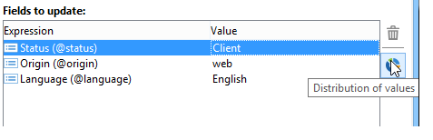
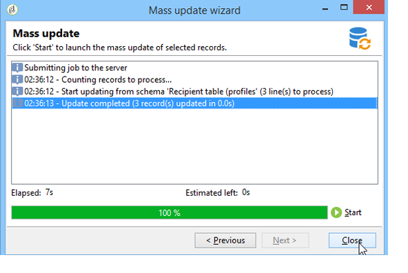

# 更新数据{#updating-data}

可以手动或自动更新已链接至收件人用户档案的数据。

## 设置自动更新 {#setting-up-an-automatic-update}

可通过工作流配置自动更新。如需详细信息，请参阅[此部分](../../workflow/using/update-data.md)。

## 执行批量更新 {#performing-a-mass-update}

要执行手动更新，请在所选的收件人上单击鼠标右键并使用 **[!UICONTROL Actions]** 快捷菜单，或使用 **[!UICONTROL Actions]** 图标。

更新类型有两种：大量更新一组收件人，以及两个用户档案之间的数据合并。对于这两种操作，向导可帮助您配置更新工作。

### 大量更新 {#mass-update}

要进行批量更新，请使用&#x200B;**[!UICONTROL Action > Mass update of selected lines...]**。 向导可帮助您配置并运行更新。

向导的第一步是指定要更新的字段。

向导的左侧会显示可用字段的列表。使用 **[!UICONTROL Find]** 可搜索字段。按下 **Enter** 键可浏览列表。符合您所输入条件的字段名称会以粗体显示，如下所示。

双击要更新的字段，从而在向导的右侧显示它们。

如果发生错误，可使用 **[!UICONTROL Delete]** 按钮从要更新的字段列表中删除某个字段。

选择或输入值，从而将其应用到需更新的用户档案。

可单击 **[!UICONTROL Distribution of values]** 显示当前文件夹中所含收件人（不只是受更新影响的收件人）的选定字段的各个值分布情况。

您可定义过滤器，以显示此窗口中的值分布，或改变当前文件夹，以显示另一个文件夹中的值分布。这些操作都是只读的，不会影响所定义更新的配置。

关闭此窗口，然后单击 **[!UICONTROL Next]**，显示第二个更新向导步骤。在此步骤中，可单击 **[!UICONTROL Start]** 开始更新。

有关更新执行的信息会显示在向导的上部。

您可以使用 **[!UICONTROL Stop]** 取消更新，但某些记录可能已更新，而且停止该过程并不会取消这些更新。进度条会显示目前操作的进度。

### 合并数据 {#merge-data}

选择&#x200B;**[!UICONTROL Merge selected lines...]**&#x200B;以启动两个收件人用户档案的合并。 选择该选项之前，必须选择要合并的用户档案。使用向导来配置和开始合并操作。

向导会显示一个或多个来源用户档案中每个已完成字段的提取內容。如果要合并的用户档案中的一个或多个字段具有不同的值，则会在 **[!UICONTROL List of conflicts]** 部分中显示这些值。您可使用列表下方的单选按钮来选择默认的用户档案，如以下示例所示：

单击 **[!UICONTROL Compute]** 显示您选择的结果。

检查窗口两个部分中的 **[!UICONTROL Result]** 列，然后单击 **[!UICONTROL Finish]** 执行合并。

## 导出数据 {#exporting-data}

可以导出列表的內容。要配置并执行导出：

1. 选择要导出的记录。
1. 右键单击并选择&#x200B;**[!UICONTROL Export...]**。

   

1. 然后选择要提取的数据。默认情况下，会将显示的所有列都添加到输出列中。

   

   有关如何配置导出向导的更多信息，请参阅[此部分](../../platform/using/executing-export-jobs.md)。

## 订阅服务 {#subscribing-to-a-service}

在大多数情況下，收件人可通过专用的登陆页来订阅新闻稿，如[本节所述](../../delivery/using/managing-subscriptions.md)。但是，过滤后的收件人用户档案可以手动订阅某个服务（新闻稿或传播服务）。操作步骤：

1. 选择您想要订阅的收件人，然后单击鼠标右键。
1. 选择 **[!UICONTROL Actions > Subscribe selection to a service]**。

   

1. 选择所需的服务，然后单击 **[!UICONTROL Next]**：

   

   >[!NOTE]
   >
   >此编辑器允许您创建新的服务：单击 **[!UICONTROL Create]** 按钮。

1. 您可以&#x200B;**[!UICONTROL Send a confirmation message]**&#x200B;发送给收件人。 可在链接到所选服务的订阅场景中配置此消息的內容。
1. 单击 **[!UICONTROL Start]** 按钮执行订阅过程。

   

可在窗口的上部监控该执行过程。可以通过 **[!UICONTROL Stop]** 按钮停止该过程。但是，已处理的收件人将被订阅。

如果取消选中&#x200B;**[!UICONTROL Do not keep a trace of this job in the database]**&#x200B;选项，则可以选择（或创建）将存储此过程信息的执行文件夹。

要检查该过程，请转到此操作所涉及收件人用户档案的&#x200B;**[!UICONTROL Subscriptions]**&#x200B;选项卡，或转到通过&#x200B;**[!UICONTROL Profiles and Targets > Services and Subscriptions]**&#x200B;节点访问的&#x200B;**[!UICONTROL Subscriptions]**&#x200B;选项卡。

>[!NOTE]
>
>如需有关创建和配置信息服务的详细信息，请参阅[此页面](../../delivery/using/managing-subscriptions.md)。
