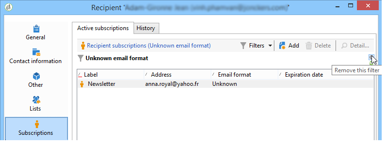

# 用例{#use-case}

## 创建订阅者电子邮件格式的过滤器 {#creating-a-filter-on-the-email-format-of-subscribers}

此用例将向您显示如何创建过滤器，以根据收件人电子邮件格式对新闻稿订阅进行排序。

为此，我们需要使用预定义的文件管理器：这些过滤器链接到文档类型，并可通过该节点访 **[!UICONTROL Administration > Configuration > Predefined filters]** 问。 这些数据过滤器可用于应用程序中的每种类型的编辑器（或文档）。

数据过滤器的创建方式与预定义过滤器相同，但还有一个额外的字段用于选择将应用过滤器的文档类型。

应用以下步骤：

1. 通过节点创建新的过 **[!UICONTROL Administration > Configuration > Predefined filters]** 滤器。
1. 单击图 **[!UICONTROL Select link]** 标以选择相关文档：

   

1. 选择订阅架构(nms:subscription)，然后单击 **[!UICONTROL OK]**。

   

1. 单 **[!UICONTROL Edit link]** 击以查看所选文档的字段。

   

   然后，您可以查看所选文档的内容：

   

   您可以访问这些字段以在筛选器编辑器的正文中定义筛选器条件。 应用程序过滤器的定义方式与高级过滤器完全相同。 请参 [阅创建高级过滤器](../../platform/using/creating-filters.md#creating-an-advanced-filter)。

1. 为订阅创建新的过滤器，以仅显示电子邮件格式未定义的订阅：

   

1. 单 **[!UICONTROL Save]** 击可向此类列表的预定义过滤器添加过滤器。
1. 您现在可以在收件人配置文件的选 **[!UICONTROL Subscriptions]** 项卡中使用此过滤器；单击该按钮即可访问“未知电子邮件格式”过滤 **[!UICONTROL Filters]** 器。

   

   当前过滤器的名称显示在列表上方。 要取消筛选器，请单击该 **[!UICONTROL Delete this filter]** 图标。

   

