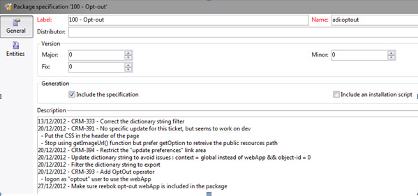

# 使用数据包{#working-with-data-packages}

## 关于数据包 {#about-data-packages}

使用 Adobe Campaign，您可以通过数据包系统导出或导入平台配置和数据。包可以包含不同类型的配置、元素、筛选或不筛选。

数据包支持以 XML 格式文件的形式显示 Adobe Campaign 数据库的实体。数据包中包含的每个实体由其全部数据表示。

The principle of **data packages** is to export a data configuration and integrate it into another Adobe Campaign system. 了解如何在本节中保持一组一致的 [数据包](#data-package-best-practices)。

### 包类型 {#types-of-packages}

有三种类型的可导出包： 用户包、平台包和管理员包。

* **用户包**: 它允许您选择要导出的图元的列表。 此类型的包管理依赖关系并验证错误。
* **平台包**: 它包括所有附加的技术资源（非标准）: 模式、JavaScript代码等。

   

* **管理程序包**: 它包括所有添加的模板和业务对象（非标准）: 模板、库等。

   

>[!CAUTION]
>
>平 **台和** 管理员 **类型包** 含要导出的实体的预定义列表。 每个实体都链接到过滤条件，这些条件允许您删除已创建包的现成资源。

## 数据结构 {#data-structure}

数据包的描述是符合xrk:navtree数据模式语法的结构 **化XML文档** 。

数据包示例：

```
<package>
  <entities schema="nms:recipient">
    <recipient email="john.smith@adobe.com" lastName="Smith" firstName="John">      
      <folder _operation="none" name="nmsRootFolder"/>      
      <company _operation="none" name="Adobe"/>
    </recipient>
  </entities>
  <entities schema="sfa:company">
    <company name="Adobe">
      location city="London" zipCode="W11 2BQ"/>
    </company>
  </entities>
</package>
```

XML文档必须以元素开头和结 **`<package>`** 尾。 随 **`<entities>`** 后的任何元素按文档类型分发数据。

元 **`<entities>`** 素以在模式属性中输入的模式格式包含包 **数据** 。

包中的数据不能包含基之间不兼容的内部密钥，如自动生成的密钥(autopk **选项** )。

在我们的示例中，“文件夹”和“公司”链接上的连接已被目标表上的所谓“高级”键所取代：

```
<recipient>
  <folder _operation="none" name="nmsRootFolder"/>
  <company _operation="none" name="Adobe"/>
</recipient>
```

值 **`operation`** 为“none”的属性定义对帐链接。

数据包可以从任何文本编辑器手动构建。 只需确保XML文档的结构符合“xtk:navtree”模式。 Adobe Campaign控制台具有数据包导出和导入模块。

## 导出包 {#exporting-packages}

### 关于包导出 {#about-package-export}

可以通过三种不同的方式导出包：

* 使 **[!UICONTROL Package Export Wizard]** 您能够导出单个包中的一组对象。 有关详细信息，请参 [阅导出包中的一组对象](#exporting-a-set-of-objects-in-a-package)
* 通过 **右键单击** 、选择，可以直接在包中导出单个对象 **[!UICONTROL Actions > Export in a package]**。
* **包定义** 允许您创建包结构，在该结构中，您将添加稍后在包中导出的对象。 有关此的详细信息，请参 [阅管理包定义](#managing-package-definitions)

导出包后，您将能够将它和所有添加的实体导入另一个活动实例。

### 导出包中的一组对象 {#exporting-a-set-of-objects-in-a-package}

包导出向导可通过Adobe Campaign客户端 **[!UICONTROL Tools > Advanced > Export package...]** 控制台的菜单访问。


对于三种类型的包，向导将优惠以下步骤：

1. 列表要按文档类型导出的实体：

   

   >[!CAUTION]
   >
   >如果导出文 **[!UICONTROL Offer category]**&#x200B;件夹 **[!UICONTROL Offer environment]**、文 **[!UICONTROL Program]** 件夹或文 **[!UICONTROL Plan]** 件夹，则不要选择xtk: **folder** ，因为您可能会丢失一些数据。 选择与文件夹对应的实体： **nms:offerCategory** for优惠 **类别,nms:offerEnv** for **优惠环境,nms:** 项目for项目 **, nms:** for plan for plan。

   列表管理允许您添加或删除要从配置中导出的实体。 单击 **[!UICONTROL Add]** 以选择新实体。

   该按 **[!UICONTROL Detail]** 钮可编辑选定的配置。

   >[!NOTE]
   >
   >依赖关系机制控制实体导出序列。 For more on this, refer to [Managing dependencies](#managing-dependencies).

1. 实体配置屏幕定义要提取的查询类型的筛选器文档。

   必须为数据提取配置过滤子句。

   

   >[!NOTE]
   >
   >查询编辑器显示在 [本节中](../../platform/using/about-queries-in-campaign.md)。

1. 单 **[!UICONTROL Next]** 击并选择排序列以在提取期间对数据进行排序：

   

1. 预览要提取的数据，然后运行导出。

   

1. 包导出向导的最后一页允许您开始导出。 数据将存储在字段中指示的文 **[!UICONTROL File]** 件中。

   

### 管理依赖项 {#managing-dependencies}

导出机制使Adobe Campaign能够跟踪各种导出元素之间的链接。

此机制由两个规则定义：

* 链接到链接的对象具有 **自己的** 或 **自带的** 复制类型完整性，这些对象将导出到与导出对象相同的包中。
* 链接到具有中性或定 **义类型** ( **定义链接** )的链接的对象必须单独导出。

>[!NOTE]
>
>链接到模式元素的完整性类型在本 [节中定义](../../configuration/using/database-mapping.md#links--relation-between-tables)。

#### 导出活动 {#exporting-a-campaign}

以下是如何导出活动的示例。 要导出的营销活动包含任务(标签： “MyTask”)和工作流(标签： “MyWorkflow”文件夹(节点： 管理／生产/技术工作流/活动流程/ MyWorkflow)。

任务和工作流将导出到与活动相同的包中，因为匹配模式通过具有“自己”类型完整性的链接连接。

打包内容：

```
<?xml version='1.0'?>
<package author="Administrator (admin)" buildNumber="7974" buildVersion="6.1" img=""
label="" name="" namespace="" vendor="">
 <desc></desc>
 <version buildDate="2013-01-09 10:30:18.954Z"/>
 <entities schema="nms:operation">
  <operation duration="432000" end="2013-01-14" internalName="OP1" label="MyCampaign"
  modelName="opEmpty" start="2013-01-09">
   <controlGroup>
    <where filteringSchema=""/>
   </controlGroup>
   <seedList>
    <where filteringSchema="nms:seedMember"></where>
    <seedMember internalName="SDM1"></seedMember>
   </seedList>
   <parameter useAsset="1" useBudget="1" useControlGroup="1" useDeliveryOutline="1"
   useDocument="1" useFCPValidation="0" useSeedMember="1" useTask="1"
   useValidation="1" useWorkflow="1"></parameter>
   <fcpSeed>
    <where filteringSchema="nms:seedMember"></where>
   </fcpSeed>
   <owner _operation="none" name="admin" type="0"/>
   <program _operation="none" name="nmsOperations"/>
   <task end="2013-01-17 10:07:51.000Z" label="MyTask" name="TSK2" start="2013-01-16 10:07:51.000Z"
   status="1">
    <owner _operation="none" name="admin" type="0"/>
    <operation _operation="none" internalName="OP1"/>
    <folder _operation="none" name="nmsTask"/>
   </task>
   <workflow internalName="WKF12" label="CampaignWorkflow" modelName="newOpEmpty"
   order="8982" scenario-cs="Notification of the workflow supervisor (notifySupervisor)"
   schema="nms:recipient">
    <scenario internalName="notifySupervisor"/>
    <desc></desc>
    <folder _operation="none" name="Folder4"/>
    <operation _operation="none" internalName="OP1"/>
   </workflow>
  </operation>
 </entities>
</package>   
```

在具有@pkgAdmin和@pkgPlatform属性的模式中 **定义与某类包的从属** 。 这两个属性都接收一个XTK表达式，它定义与包的从属关系条件。

```
<element name="offerEnv" img="nms:offerEnv.png" 
template="xtk:folder" pkgAdmin="@id != 0">
```

最后，@ **pkgStatus** 属性允许您定义这些元素或属性的导出规则。 根据属性的值，元素或属性将在导出的包中找到。 此属性的三个可能值是：

* **从不**: 不导出字段／链接
* **always**: 向这个领域出口
* **preCreate**: 授权创建链接的实体

>[!NOTE]
>
>preCreate **值仅** 适用于链接类型事件。 它授权您创建或指向尚未加载到导出包中的实体。

## 管理包定义 {#managing-package-definitions}

### 关于包定义 {#about-package-definitions}

包定义允许您创建包结构，在其中添加稍后将在单个包中导出的实体。 然后，您将能够将此包和所有添加的实体导入另一个活动实例。

**相关主题：**

* [创建包定义](#creating-a-package-definition)
* [将实体添加到包定义](#adding-entities-to-a-package-definition)
* [配置包定义生成](#configuring-package-definitions-generation)
* [从包定义导出包](#exporting-packages-from-a-package-definition)

### 创建包定义 {#creating-a-package-definition}

可从菜单访问包定 **[!UICONTROL Administration > Configuration > Package management > Package definitions]** 义。

要创建包定义，请单击 **[!UICONTROL New]** 按钮，然后填写包定义常规信息。


然后，可以向包定义中添加实体，并将其导出到XML文件包。

**相关主题：**

* [将实体添加到包定义](#adding-entities-to-a-package-definition)
* [配置包定义生成](#configuring-package-definitions-generation)
* [从包定义导出包](#exporting-packages-from-a-package-definition)

### 将实体添加到包定义 {#adding-entities-to-a-package-definition}

在选 **[!UICONTROL Content]** 项卡中，单 **[!UICONTROL Add]** 击按钮以选择要与包一起导出的实体。 在“导出包中的一组对象”部 [分中介绍了选择实体时的最佳实践](#exporting-a-set-of-objects-in-a-package) 。


实体可以直接从它们在实例中的位置添加到包定义。 为此请执行以下操作步骤：

1. 右键单击所需的实体，然后选择 **[!UICONTROL Actions > Export in a package]**。

   

1. 选 **[!UICONTROL Add to a package definition]**&#x200B;择，然后选择要添加实体的包定义。

   

1. 实体将添加到包定义中，它将随包一起导出(请参 [阅从包定义导出包](#exporting-packages-from-a-package-definition))。

   

### 配置包定义生成 {#configuring-package-definitions-generation}

可以从包定义选项卡中配置包 **[!UICONTROL Content]** 生成。 为此，请单击链 **[!UICONTROL Generation parameters]** 接。


* **[!UICONTROL Include the definition]**: 包括当前在包定义中使用的定义。
* **[!UICONTROL Include an installation script]**: 允许您添加要在包导入时执行的javascript脚本。 选中后，将 **[!UICONTROL Script]** 在包定义屏幕中添加一个选项卡。
* **[!UICONTROL Include default values]**: 向包中添加所有实体属性的值。

   为避免冗长的出口，默认情况下不选择此选项。 这意味着，具有默认值(“空字符串”、“0”和“false”(如果未在模式中另行定义)的实体属性不会添加到包中，因此不会导出。

   >[!CAUTION]
   >
   >取消选择此选项可能会导致合并本地版本和导入的版本。
   >
   >如果导入包的实例包含与包相同的实体（例如，具有相同的外部ID），则不会更新其属性。 如果前实例的属性具有默认值，则会发生这种情况，因为包中不包含这些属性。
   >
   >在这种情况下，选择该选 **[!UICONTROL Include default values]** 项将阻止版本合并，因为以前的实例的所有属性都将与包一起导出。

### 从包定义导出包 {#exporting-packages-from-a-package-definition}

要从包定义中导出包，请执行以下步骤：

1. 选择要导出的包定义，然后单击按 **[!UICONTROL Actions]** 钮并选择 **[!UICONTROL Export the package]**。
1. 默认情况下，将选择与导出的包对应的XML文件。 它根据包定义命名空间和名称命名。
1. 定义包名称和位置后，单击 **[!UICONTROL Start]** 按钮以启动导出。

   

## 导入包 {#importing-packages}

### 关于包导入 {#about-package-import}

包导入向导可通过Adobe Campaign客户端控制台 **[!UICONTROL Tools > Advanced > Package import...]** 的主菜单访问。

您可以从以前执行的导出导入包，例如，从其他Adobe Campaign实例或标准包导入包，具体取决于许可证条款。


### 从文件安装包 {#installing-a-package-from-a-file}

要导入现有数据包，请选择XML文件，然后单击 **[!UICONTROL Open]**。


随后，要导入的包的内容将显示在编辑器的中间部分。

单击 **[!UICONTROL Next]** 并 **[!UICONTROL Start]** 启动导入。


### 安装标准包 {#installing-a-standard-package}

配置Adobe Campaign时，将安装标准包。 根据您的权限和部署模型，如果您获得了新选项或加载项，或者升级到新优惠，则可以导入新的标准包。

请参阅您的许可协议，检查可以安装哪些包。

有关标准包的详细信息，请参 [阅本页](../../installation/using/installing-campaign-standard-packages.md)。

## 数据包最佳实践 {#data-package-best-practices}

本节介绍如何在项目的整个生命周期中以一致的方式组织数据包。

包可以包含不同类型的配置和元素，无论是否已过滤。 如果缺少某些元素或未按正确的顺序导入元素／包，平台配置可能会中断。

此外，由于同一平台上有多人工作，具有许多不同的功能，因此包装规范文件夹会很快变得复杂。

虽然这并非强制性要求，但本节优惠了一个解决方案，帮助在大型项目的Adobe Campaign中组织和使用包。

主要限制如下：
* 整理包并跟踪更改内容及更改时间
* 如果更新了配置，将破坏未直接链接到更新的内容的风险降至最低

>[!NOTE]
>
>有关设置工作流以自动导出包的详细信息，请参 [阅此页](https://helpx.adobe.com/campaign/kb/export-packages-automatically.html)。

### 建议 {#data-package-recommendations}

始终在平台的同一版本内导入。 必须检查是否在具有相同内部版本的两个实例之间部署包。 切勿强制导入并始终先更新平台（如果版本不同）。

>[!IMPORTANT]
>
>Adobe不支持在不同版本之间导入。
<!--This is not allowed. Importing from 6.02 to 6.1, for example, is prohibited. If you do so, R&D won’t be able to help you resolve any issues you encounter.-->

注意模式和数据库结构。 进口包装时必须模式，然后生成模式。

### 解决方案 {#data-package-solution}

#### 包类型 {#package-types}

开始。 只使用四种类型：

**实体**
* Adobe Campaign中的所有“xtk”和“nms”特定元素，如模式、表单、文件夹、投放模板等。
* 您可以将实体视为“管理员”和“平台”元素。
* 在包实例上传时，不应在包中包含多个实体。

<!--Nothing “works” alone. An entity package does not have a specific role or objective.-->

如果需要在新实例上部署配置，可以导入所有实体包。

**功能**

此类包：
* 回答客户需求／规范。
* 包含一个或多个功能。
* 应包含所有依赖项，以便能够在没有任何其他包的情况下运行该功能。

**活动**

此包不是强制的。 有时，为所有活动创建特定类型很有用，即使活动可以看作是功能。

**更新**

配置后，功能可导出到其他环境。 例如，可以将包从开发环境导出到测试环境。 在本试验中，发现了缺陷。 首先，它需要在开发环境上修复。 然后，应将该修补程序应用到测试平台。

第一个解决方案是再次导出整个功能。 但是，为了避免任何风险（更新不需要的元素），更安全的方法是只包含修正的包。

因此，我们建议创建一个“更新”包，它只包含一个功能实体类型。

更新不仅可以是修复，也可以是实体／功能/活动包的新元素。 要避免部署整个包，您可以导出更新包。

### 命名约定 {#data-package-naming}

既然已定义类型，我们应指定命名约定。 Adobe Campaign不允许为包规范创建子文件夹，这意味着数字是保持条理井然的最佳解决方案。 编号作为包名称前缀。 您可以使用以下约定：

* 实体： 从1到99
* 功能： 从100到199
* 活动: 从200到299
* 更新： 从5000到5999

### 包 {#data-packages}

>[!NOTE]
>
>最好设置规则来定义正确数量的包。

#### 实体包顺序 {#entity-packages-order}

为了帮助导入，实体包应按导入时的顺序进行排序。 例如：
* 001 -模式
* 002 —— 表单
* 003 —— 图像
* 等等。

>[!NOTE]
>
>表单只应在模式更新后导入。

#### 包200 {#package-200}

包编号“200”不应用于特定活动: 此数字将用于更新与所有活动相关的内容。

#### 更新包 {#update-package}

最后一点涉及更新包编号。 它是您的包编号(实体、功能或活动)，前缀为“5”。 例如：
* 5001更新一个模式
* 5200可更新所有活动
* 5101更新101功能

更新包应仅包含一个特定实体，以便能够轻松地重用。 要拆分它们，请添加一个新数字(开始自1)。 这些包没有特定的订购规则。 为了更好地了解情况，请设想我们有一个101功能，一个社交应用程序：
* 它包含webApp和外部帐户。
   * 包标签为： 101 —— 社交应用程序(socialApplication)。
* webApp存在缺陷。
   * 已更正wepApp。
   * 需要创建一个具有以下名称的修复包： 5101 - 1 —— 社交应用程序webApp(socialApplication_webApp)。
* 需要为社交功能添加新的外部帐户。
   * 外部帐户已创建。
   * 新包为： 5101 - 2 —— 社交应用程序外部帐户(socialApplication_extAccount)。
   * 并行更新101包以添加到外部帐户，但它未部署。
      

#### 包文档 {#package-documentation}

更新包时，您应始终在描述字段中添加注释以详细说明任何修改和原因(例如，“添加新模式”或“修复缺陷”)。



您还应该对评论进行日期设置。 始终将更新包的注释报告给“parent”（包不带5前缀）。

>[!IMPORTANT]
>
>描述字段最多只能包含2.000个字符。