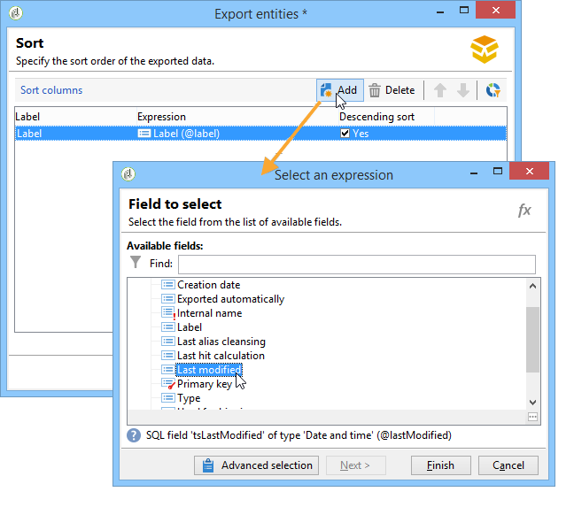
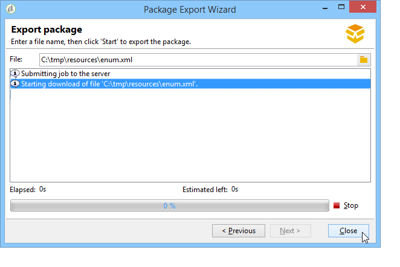

# 使用数据包{#working-with-data-packages}


## 关于数据包 {#about-data-packages}

使用 Adobe Campaign，您可以通过数据包系统导出或导入平台配置和数据。包可以包含不同类型的配置、元素，无论是否过滤。

数据包支持以 XML 格式文件的形式显示 Adobe Campaign 数据库的实体。数据包中包含的每个实体由其全部数据表示。

的原则 **数据包** 是导出数据配置并将其集成到另一个Adobe Campaign系统中。 请参阅本教程，了解如何保持数据包集的一致性 [部分](#data-package-best-practices).

### 程序包类型 {#types-of-packages}

有三种类型的可导出包：用户包、平台包和管理包。

* **用户包**：用于选择要导出的实体的列表。 这种类型的软件包管理依赖关系并验证错误。
* **平台包**：这包括所有添加的技术资源（非标准）：架构、JavaScript代码等。

  

* **管理包**：包括所有添加的模板和业务对象（非标准）：模板、库等。

  

>[!CAUTION]
>
>此 **平台** 和 **管理员** 类型包含要导出的预定义图元列表。 每个实体均链接到筛选条件，以便您删除已创建资源包的现成资源。

## 数据结构 {#data-structure}

数据包的描述是一个符合语法的结构化XML文档 **xrk：navtree** 数据架构。

数据包示例：

```
<package>
  <entities schema="nms:recipient">
    <recipient email="john.smith@adobe.com" lastName="Smith" firstName="John">      
      <folder _operation="none" name="nmsRootFolder"/>      
      <company _operation="none" name="Adobe"/>
    </recipient>
  </entities>
  <entities schema="sfa:company">
    <company name="Adobe">
      location city="London" zipCode="W11 2BQ"/>
    </company>
  </entities>
</package>
```

XML文档必须以 **`<package>`** 元素。 任何 **`<entities>`** 随后出现的元素按文档类型分布数据。

An **`<entities>`** 元素包含包的数据，格式为在以下位置输入的数据架构： **架构** 属性。

包中的数据不得包含基之间不兼容的内部键，例如自动生成的键(**autopk** 选项)。

在本例中，“文件夹”和“公司”链接上的联接已被目标表中所谓的“高级”键替换：

```
<recipient>
  <folder _operation="none" name="nmsRootFolder"/>
  <company _operation="none" name="Adobe"/>
</recipient>
```

此 **`operation`** 值为“none”的属性定义协调链接。

可以从任何文本编辑器手动构建数据包。 只需确保XML文档的结构符合“xtk：navtree”数据架构即可。 Adobe Campaign控制台具有数据包导出和导入模块。

## 导出资源包 {#exporting-packages}

### 关于资源包导出 {#about-package-export}

可通过三种不同的方式导出资源包：

* 此 **[!UICONTROL Package Export Wizard]** 使您能够在单个包中导出一组对象。 有关详细信息，请参阅 [导出资源包中的一组对象](#exporting-a-set-of-objects-in-a-package)
* A **单个对象** 可以直接导出到资源包中，方法是右键单击该资源包并选择 **[!UICONTROL Actions > Export in a package]**.
* **包定义** 允许您创建包结构，在其中添加稍后将在包中导出的对象。 有关详细信息，请参见 [管理包定义](#managing-package-definitions)

导出资源包后，您将能够将其和所有添加的实体导入到另一个Campaign实例中。

### 导出资源包中的一组对象 {#exporting-a-set-of-objects-in-a-package}

可通过访问资源包导出向导。 **[!UICONTROL Tools > Advanced > Export package...]** Adobe Campaign客户端控制台的菜单。


对于三种类型的包，向导提供了以下步骤：

1. 按文档类型列出要导出的实体：

   

   >[!CAUTION]
   >
   >如果导出 **[!UICONTROL Offer category]**， **[!UICONTROL Offer environment]**， **[!UICONTROL Program]** 或 **[!UICONTROL Plan]** 键入文件夹，永远不要选择 **xtk：folder** 因为您可能会丢失一些数据。 选择与文件夹对应的实体： **nms：offerCategory** 对于优惠类别， **nms：offerEnv** 对于选件环境， **nms：program** 适用于计划，以及 **nms：plan** 了解计划。

   列表管理允许您添加或删除要从配置中导出的实体。 单击 **[!UICONTROL Add]** 以选择新图元。

   此 **[!UICONTROL Detail]** 按钮编辑选定的配置。

   >[!NOTE]
   >
   >依赖关系机制控制实体导出顺序。 有关详细信息，请参见 [管理依赖关系](#managing-dependencies).

1. 实体配置屏幕定义有关要提取的文档类型的过滤器查询。

   必须为数据提取配置筛选子句。

   

   >[!NOTE]
   >
   >中介绍了查询编辑器 [本节](../../platform/using/about-queries-in-campaign.md).

1. 单击 **[!UICONTROL Next]** 并选择排序列以在提取期间对数据进行排序：

   

1. 在运行导出之前预览要提取的数据。

   

1. 资源包导出向导的最后一页允许您启动导出。 该数据将存储在 **[!UICONTROL File]** 字段。

   

### 管理依赖项 {#managing-dependencies}

导出机制使Adobe Campaign能够跟踪各种导出元素之间的链接。

此机制由两个规则定义：

* 链接到链接的对象 **所有者** 或 **owncopy** 类型完整性将在与导出的对象相同的包中导出。
* 链接到链接的对象 **中性** 或 **定义** 类型完整性（定义的链接）必须单独导出。

>[!NOTE]
>
>链接到架构元素的完整性类型在中定义 [本节](../../configuration/using/database-mapping.md#links--relation-between-tables).

#### 导出营销活动 {#exporting-a-campaign}

以下是如何导出营销活动的示例。 要导出的营销活动在“MyWorkflow”文件夹（节点：管理/生产/技术工作流/活动流程/MyWorkflow）中包含任务（标签：“MyTask”）和工作流（标签：“CampaignWorkflow”）。

任务和工作流将在与活动相同的资源包中导出，因为匹配的架构通过具有“自己的”类型完整性的链接进行连接。

包内容：

```
<?xml version='1.0'?>
<package author="Administrator (admin)" buildNumber="7974" buildVersion="7.1" img=""
label="" name="" namespace="" vendor="">
 <desc></desc>
 <version buildDate="2013-01-09 10:30:18.954Z"/>
 <entities schema="nms:operation">
  <operation duration="432000" end="2013-01-14" internalName="OP1" label="MyCampaign"
  modelName="opEmpty" start="2013-01-09">
   <controlGroup>
    <where filteringSchema=""/>
   </controlGroup>
   <seedList>
    <where filteringSchema="nms:seedMember"></where>
    <seedMember internalName="SDM1"></seedMember>
   </seedList>
   <parameter useAsset="1" useBudget="1" useControlGroup="1" useDeliveryOutline="1"
   useDocument="1" useFCPValidation="0" useSeedMember="1" useTask="1"
   useValidation="1" useWorkflow="1"></parameter>
   <fcpSeed>
    <where filteringSchema="nms:seedMember"></where>
   </fcpSeed>
   <owner _operation="none" name="admin" type="0"/>
   <program _operation="none" name="nmsOperations"/>
   <task end="2013-01-17 10:07:51.000Z" label="MyTask" name="TSK2" start="2013-01-16 10:07:51.000Z"
   status="1">
    <owner _operation="none" name="admin" type="0"/>
    <operation _operation="none" internalName="OP1"/>
    <folder _operation="none" name="nmsTask"/>
   </task>
   <workflow internalName="WKF12" label="CampaignWorkflow" modelName="newOpEmpty"
   order="8982" scenario-cs="Notification of the workflow supervisor (notifySupervisor)"
   schema="nms:recipient">
    <scenario internalName="notifySupervisor"/>
    <desc></desc>
    <folder _operation="none" name="Folder4"/>
    <operation _operation="none" internalName="OP1"/>
   </workflow>
  </operation>
 </entities>
</package>   
```

在架构中使用以下方式定义某个类型文件包的隶属关系： **@pkgAdmin和@pkgPlatform** 属性。 这两个属性都接收定义与包关联的条件的XTK表达式。

```
<element name="offerEnv" img="nms:offerEnv.png" 
template="xtk:folder" pkgAdmin="@id != 0">
```

最后， **@pkgStatus** 属性允许您定义这些元素或属性的导出规则。 根据属性的值，可在导出的资源包中找到元素或属性。 此属性的三个可能值是：

* **从不**：不导出字段/链接
* **始终**：强制导出此字段
* **preCreate**：授权创建链接的实体

>[!NOTE]
>
>此 **preCreate** 值仅允许用于链接类型事件。 它授权您创建或指向导出资源包中尚未加载的实体。

## 管理包定义 {#managing-package-definitions}

包定义允许您创建包结构，其中添加稍后将在单个包中导出的实体。 然后，您可以将此资源包和所有添加的实体导入另一个Campaign实例。

**相关主题：**

* [创建包定义](#creating-a-package-definition)
* [将实体添加到包定义](#adding-entities-to-a-package-definition)
* [配置包定义生成](#configuring-package-definitions-generation)
* [从资源包定义导出资源包](#exporting-packages-from-a-package-definition)

### 创建包定义 {#creating-a-package-definition}

可以从以下位置访问包定义： **[!UICONTROL Administration > Configuration > Package management > Package definitions]** 菜单。

要创建包定义，请单击 **[!UICONTROL New]** 按钮，然后填写包定义常规信息。


然后，可以将实体添加到包定义中，并将其导出到XML文件包中。

**相关主题：**

* [将实体添加到包定义](#adding-entities-to-a-package-definition)
* [配置包定义生成](#configuring-package-definitions-generation)
* [从资源包定义导出资源包](#exporting-packages-from-a-package-definition)

### 将实体添加到包定义 {#adding-entities-to-a-package-definition}

在 **[!UICONTROL Content]** 选项卡，单击 **[!UICONTROL Add]** 按钮以选择要与资源包一起导出的实体。 有关选择实体时的最佳实践，请参阅 [本节](#exporting-a-set-of-objects-in-a-package) 部分。


实体可以直接从其在实例中的位置添加到包定义中。 为此请执行以下操作步骤：

1. 右键单击所需的实体，然后选择 **[!UICONTROL Actions > Export in a package]**.

   

1. 选择 **[!UICONTROL Add to a package definition]**，然后选择要将实体添加到的包定义。

   

1. 实体将添加到资源包定义，它将与资源包一起导出(请参阅 [本节](#exporting-packages-from-a-package-definition))。

   

### 配置包定义生成 {#configuring-package-definitions-generation}

可以从包定义配置包生成 **[!UICONTROL Content]** 选项卡。 要执行此操作，请单击 **[!UICONTROL Generation parameters]** 链接。


* **[!UICONTROL Include the definition]**：包括当前在包定义中使用的定义。
* **[!UICONTROL Include an installation script]**：用于添加在导入资源包时执行的javascript脚本。 选中后， **[!UICONTROL Script]** 选项卡随即会添加到包定义屏幕中。
* **[!UICONTROL Include default values]**：将所有实体的属性的值添加到资源包中。

  为了避免过长的导出，默认情况下不选中此选项。 这意味着具有默认值（“空字符串”、“0”和“false”，如果未在架构中另外定义）的实体属性将不会添加到包中，因此将不会导出。

  >[!CAUTION]
  >
  >取消选择此选项可能会导致合并本地版本和导入的版本。
  >
  >如果导入资源包的实例包含与资源包实体相同的实体（例如，外部ID相同），则不会更新其属性。 如果前实例中的属性具有默认值，则可能会发生这种情况，因为它们未包含在程序包中。
  >
  >在这种情况下，选择 **[!UICONTROL Include default values]** 选项将阻止版本合并，因为前实例中的所有属性都将随包一起导出。

### 从资源包定义导出资源包 {#exporting-packages-from-a-package-definition}

要从资源包定义导出资源包，请执行以下步骤：

1. 选择要导出的资源包定义，然后单击 **[!UICONTROL Actions]** 按钮并选择 **[!UICONTROL Export the package]**.
1. 缺省情况下，将选择与导出的包相对应的XML文件。 它根据包定义命名空间和名称进行命名。
1. 定义包名称和位置后，单击 **[!UICONTROL Start]** 按钮以启动导出。

   

## 导入包 {#importing-packages}

可通过主菜单访问资源包导入向导 **[!UICONTROL Tools > Advanced > Import package]** Adobe Campaign客户端控制台的。

您可以从之前执行的导出导入资源包，例如，从另一个Adobe Campaign实例或 [内置包](../../installation/using/installing-campaign-standard-packages.md)，具体取决于您的许可条款。


### 从文件安装包 {#installing-a-package-from-a-file}

要导入现有的数据包，请选择XML文件并单击 **[!UICONTROL Open]**.


然后，要导入的包的内容将显示在编辑器的中间部分。

单击 **[!UICONTROL Next]** 和 **[!UICONTROL Start]** 以启动导入。


### 安装内置软件包 {#installing-a-standard-package}

标准包是内置包，在配置Adobe Campaign时安装。 根据您的权限和部署模式，如果您获取新选项或插件，或者如果您升级到新选件，则可以导入新的标准资源包。

请参阅您的许可协议，查看可以安装的软件包。

有关内置软件包的更多信息，请参阅 [此页面](../../installation/using/installing-campaign-standard-packages.md).

## 数据包最佳实践 {#data-package-best-practices}

本节介绍如何在项目的整个生命周期中以一致的方式组织数据包。

包可以包含不同类型的配置和元素，无论是否进行了过滤。 如果缺少某些元素或未按正确顺序导入元素/包，则平台配置可能会中断。

此外，如果多个人员在同一平台上工作，并且具有许多不同的功能，则包规范文件夹会快速变得复杂。

虽然此部分并不强制要求，但提供了一个解决方案，可帮助整理和使用Adobe Campaign中的包以用于大型项目。

主要限制因素如下：
* 组织包并跟踪更改的内容和更改时间
* 如果更新了配置，则将破坏未直接链接到更新的内容的风险降至最低

>[!NOTE]
>
>有关设置工作流以自动导出包的更多信息，请参阅 [此页面](https://helpx.adobe.com/campaign/kb/export-packages-automatically.html).

### 推荐 {#data-package-recommendations}

始终在同一平台版本中导入。 您必须检查是否在具有相同内部版本的两个实例之间部署包。 切勿强制导入，并始终先更新平台（如果内部版本不同）。

>[!IMPORTANT]
>
>Adobe不支持在不同版本之间导入。
<!--This is not allowed. Importing from 6.02 to 6.1, for example, is prohibited. If you do so, R&D won’t be able to help you resolve any issues you encounter.-->

注意架构和数据库结构。 导入带架构的包后必须生成架构。

### 解决方案 {#data-package-solution}

#### 包类型 {#package-types}

首先定义不同类型的资源包。 将只使用四种类型：

**实体**
* Adobe Campaign中的所有“xtk”和“nms”特定元素，如架构、表单、文件夹、投放模板等。
* 您可以将实体同时视为“管理员”和“平台”元素。
* 在Campaign实例上上传包时，包中不应包含多个实体。

<!--Nothing “works” alone. An entity package does not have a specific role or objective.-->

如果您需要在新实例上部署配置，则可以导入所有实体包。

**功能**

此类型的包：
* 回答客户端要求/规范。
* 包含一个或多个功能。
* 应包含所有依赖项，以便能够在没有任何其他包的情况下运行功能。

**营销活动**

此包不是强制性的。 有时，为所有营销活动创建特定类型会很有用，即使营销活动被视为一项功能也是如此。

**更新**

配置功能后，可将其导出到其他环境中。 例如，可以将包从开发环境导出到测试环境。 在此测试中，发现了一个缺陷。 首先，它需要在开发环境中进行修复。 然后，将修补程序应用到测试平台。

第一个解决方案是再次导出整个功能。 但是，为了避免任何风险（更新不需要的元素），只包含修正值的套餐更加安全。

因此，我们建议创建一个“更新”包，其中只包含该特征的一个图元类型。

更新不仅可以是修复，也可以是实体/功能/营销活动包的新元素。 要避免部署整个包，可以导出更新包。

### 命名约定 {#data-package-naming}

现在已定义了类型，我们应该指定命名约定。 Adobe Campaign不允许为包规范创建子文件夹，这意味着数字是保持有条不紊的最佳解决方案。 数字前缀包名称。 您可以使用以下约定：

* 实体：从1到99
* 功能：从100到199
* 促销活动：从200到299
* 更新：从5000到5999

### 包 {#data-packages}

>[!NOTE]
>
>最好设置规则来定义正确数量的资源包。

#### 实体包顺序 {#entity-packages-order}

为帮助导入，实体包应按照导入时的顺序排序。 例如：
* 001 — 架构
* 002 — 表单
* 003 — 图像
* 等等。

>[!NOTE]
>
>只有在更新架构后才能导入Forms。

#### 包200 {#package-200}

包编号“200”不应用于特定营销活动：此编号将用于更新涉及所有营销活动的内容。

#### 更新包 {#update-package}

最后一点涉及更新包的编号。 它是以“5”为前缀的程序包编号（实体、功能或营销活动）。 例如：
* 5001以更新一个架构
* 5200以更新所有营销活动
* 5101以更新101功能

更新包应仅包含一个特定实体，以便易于重用。 要拆分它们，请添加新数字（从1开始）。 这些软件包没有特定的排序规则。 为了更好地理解，假设我们有一个101功能，一个社交应用程序：
* 它包含一个webApp和一个外部帐户。
   * 包标签为： 101 — 社交应用程序(socialApplication)。
* webApp存在缺陷。
   * wepapp已更正。
   * 需要创建一个修复包，其名称为： 5101 - 1 — 社交应用程序webApp (socialApplication_webApp)。
* 需要为社交功能添加新的外部帐户。
   * 已创建外部帐户。
   * 新包为： 5101 - 2 — 社交应用程序外部帐户(socialApplication_extAccount)。
   * 同时，101包将更新以添加到外部帐户，但未部署。
     

#### 包文档 {#package-documentation}

更新包时，应始终在描述字段中添加注释以详细说明任何修改和原因（例如，“添加新架构”或“修复缺陷”）。


您还应设置评论的日期。 始终将您对更新包的注释报告给“父级”（不带5前缀的包）。

>[!IMPORTANT]
>
>描述字段最多只能包含2.000个字符。
