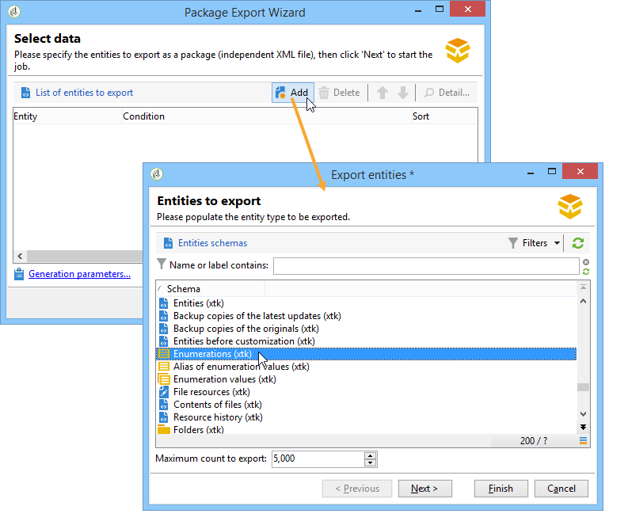
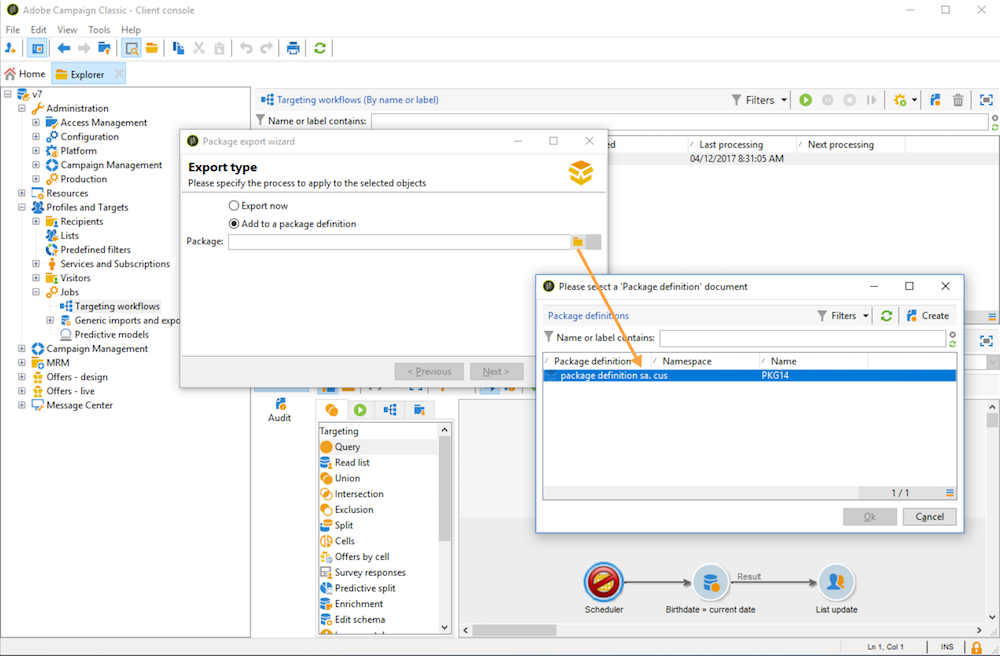

# 使用数据包{#working-with-data-packages}

## 关于数据包{#about-data-packages}

使用 Adobe Campaign，您可以通过数据包系统导出或导入平台配置和数据。包可以包含不同类型的配置、元素、过滤或不过滤。

数据包支持以 XML 格式文件的形式显示 Adobe Campaign 数据库的实体。数据包中包含的每个实体由其全部数据表示。

**数据包**&#x200B;的原理是导出数据配置并将其集成到另一个Adobe Campaign系统中。 了解如何在此[部分](#data-package-best-practices)中维护一组一致的数据包。

### 包类型{#types-of-packages}

可导出的包有三种类型：用户包、平台包和管理包。

* **用户包**:它允许您选择要导出的实体列表。此类包管理依赖关系并验证错误。
* **平台包**:它包括所有添加的技术资源（非标准）：架构、JavaScript代码等

   

* **管理包**:它包括所有添加的模板和业务对象（非标准）：模板、库等

   

>[!CAUTION]
>
>**platform**&#x200B;和&#x200B;**admin**&#x200B;类型包含要导出的预定义实体列表。 每个实体都链接到过滤条件，这些条件允许您删除已创建资源包的现成资源。

## 数据结构{#data-structure}

数据包的描述是符合&#x200B;**xrk:navtree**&#x200B;数据架构语法的结构化XML文档。

数据包示例：

```
<package>
  <entities schema="nms:recipient">
    <recipient email="john.smith@adobe.com" lastName="Smith" firstName="John">      
      <folder _operation="none" name="nmsRootFolder"/>      
      <company _operation="none" name="Adobe"/>
    </recipient>
  </entities>
  <entities schema="sfa:company">
    <company name="Adobe">
      location city="London" zipCode="W11 2BQ"/>
    </company>
  </entities>
</package>
```

XML文档必须以&#x200B;**`<package>`**&#x200B;元素开头和结尾。 随后的任何&#x200B;**`<entities>`**&#x200B;元素按文档类型分发数据。

**`<entities>`**&#x200B;元素包含包的数据，其格式为在&#x200B;**schema**&#x200B;属性中输入的数据架构。

资源包中的数据不得包含基之间不兼容的内部密钥，例如自动生成的密钥（**autopk**&#x200B;选项）。

在我们的示例中，“文件夹”和“公司”链接上的连接已被目标表上所谓的“高级别”键所替换：

```
<recipient>
  <folder _operation="none" name="nmsRootFolder"/>
  <company _operation="none" name="Adobe"/>
</recipient>
```

值为“none”的&#x200B;**`operation`**&#x200B;属性定义协调链接。

可以从任何文本编辑器手动构建数据包。 只需确保XML文档的结构符合“xtk:navtree”数据架构即可。 Adobe Campaign控制台具有一个数据包导出和导入模块。

## 导出包{#exporting-packages}

### 关于包导出{#about-package-export}

可以通过三种不同方式导出资源包：

* **[!UICONTROL Package Export Wizard]**&#x200B;允许您在单个包中导出一组对象。 有关更多信息，请参见[导出包](#exporting-a-set-of-objects-in-a-package)中的一组对象
* 通过右键单击&#x200B;**单个对象并选择&#x200B;**[!UICONTROL Actions > Export in a package]**，可直接在包中导出**。
* **包定** 义允许您创建包结构，在该结构中添加稍后将在包中导出的对象。有关更多信息，请参阅[管理包定义](#managing-package-definitions)

导出资源包后，您将能够将其和所有添加的实体导入另一个Campaign实例。

### 导出包{#exporting-a-set-of-objects-in-a-package}中的一组对象

可通过Adobe Campaign客户端控制台的&#x200B;**[!UICONTROL Tools > Advanced > Export package...]**&#x200B;菜单访问包导出向导。


对于三种类型的包，向导提供了以下步骤：

1. 按文档类型列出要导出的实体：

   

   >[!CAUTION]
   >
   >如果导出&#x200B;**[!UICONTROL Offer category]**、**[!UICONTROL Offer environment]**、**[!UICONTROL Program]**&#x200B;或&#x200B;**[!UICONTROL Plan]**&#x200B;类型文件夹，请勿选择&#x200B;**xtk:folder**，因为您可能会丢失一些数据。 选择与文件夹对应的实体：**nms:offerCategory**（选件类别）、**nms:offerEnv**（选件环境）、**nms:program**（程序）和&#x200B;**nms:plan**（计划）。

   列表管理允许您添加或删除要从配置中导出的实体。 单击&#x200B;**[!UICONTROL Add]**&#x200B;以选择新实体。

   **[!UICONTROL Detail]**&#x200B;按钮编辑所选配置。

   >[!NOTE]
   >
   >依赖关系机制控制实体导出序列。 有关更多信息，请参阅[管理依赖项](#managing-dependencies)。

1. 实体配置屏幕定义要提取的文档类型的过滤器查询。

   必须配置筛选子句才能提取数据。

   

   >[!NOTE]
   >
   >查询编辑器显示在[此部分](../../platform/using/about-queries-in-campaign.md)中。

1. 单击&#x200B;**[!UICONTROL Next]**&#x200B;并选择排序列以在提取期间对数据进行排序：

   

1. 在运行导出之前预览要提取的数据。

   

1. 利用资源包导出向导的最后一页，可开始导出。 数据将存储在&#x200B;**[!UICONTROL File]**&#x200B;字段中指示的文件中。

   

### 管理依赖项{#managing-dependencies}

导出机制使Adobe Campaign能够跟踪各种导出元素之间的链接。

此机制由两个规则定义：

* 链接到具有&#x200B;**own**&#x200B;或&#x200B;**owncopy**&#x200B;类型完整性的链接的对象将导出到与导出对象相同的包中。
* 链接到具有&#x200B;**netural**&#x200B;或&#x200B;**define**&#x200B;类型完整性（定义的链接）的链接的对象必须单独导出。

>[!NOTE]
>
>[此部分](../../configuration/using/database-mapping.md#links--relation-between-tables)中定义了链接到架构元素的完整性类型。

#### 导出营销活动{#exporting-a-campaign}

以下是如何导出营销活动的示例。 要导出的营销活动包含一个任务(标签：“MyTask”)和工作流(标签：“MyWorkflow”文件夹(节点：管理/生产/技术工作流/营销活动流程/ MyWorkflow)。

任务和工作流与营销活动的同一资源包中导出，因为匹配的架构通过具有“自己”类型完整性的链接进行连接。

包内容：

```
<?xml version='1.0'?>
<package author="Administrator (admin)" buildNumber="7974" buildVersion="6.1" img=""
label="" name="" namespace="" vendor="">
 <desc></desc>
 <version buildDate="2013-01-09 10:30:18.954Z"/>
 <entities schema="nms:operation">
  <operation duration="432000" end="2013-01-14" internalName="OP1" label="MyCampaign"
  modelName="opEmpty" start="2013-01-09">
   <controlGroup>
    <where filteringSchema=""/>
   </controlGroup>
   <seedList>
    <where filteringSchema="nms:seedMember"></where>
    <seedMember internalName="SDM1"></seedMember>
   </seedList>
   <parameter useAsset="1" useBudget="1" useControlGroup="1" useDeliveryOutline="1"
   useDocument="1" useFCPValidation="0" useSeedMember="1" useTask="1"
   useValidation="1" useWorkflow="1"></parameter>
   <fcpSeed>
    <where filteringSchema="nms:seedMember"></where>
   </fcpSeed>
   <owner _operation="none" name="admin" type="0"/>
   <program _operation="none" name="nmsOperations"/>
   <task end="2013-01-17 10:07:51.000Z" label="MyTask" name="TSK2" start="2013-01-16 10:07:51.000Z"
   status="1">
    <owner _operation="none" name="admin" type="0"/>
    <operation _operation="none" internalName="OP1"/>
    <folder _operation="none" name="nmsTask"/>
   </task>
   <workflow internalName="WKF12" label="CampaignWorkflow" modelName="newOpEmpty"
   order="8982" scenario-cs="Notification of the workflow supervisor (notifySupervisor)"
   schema="nms:recipient">
    <scenario internalName="notifySupervisor"/>
    <desc></desc>
    <folder _operation="none" name="Folder4"/>
    <operation _operation="none" internalName="OP1"/>
   </workflow>
  </operation>
 </entities>
</package>   
```

与包类型的从属关系在具有&#x200B;**和@pkgAdmin**&#x200B;属性的架构中定义。 这两个属性都会收到一个XTK表达式，该表达式定义与包的从属关系条件。

```
<element name="offerEnv" img="nms:offerEnv.png" 
template="xtk:folder" pkgAdmin="@id != 0">
```

最后，通过&#x200B;**@pkgStatus**&#x200B;属性，可定义这些元素或属性的导出规则。 根据属性的值，元素或属性将在导出的包中找到。 此属性的三个可能值是：

* **从不**:不导出字段/链接
* **始终**:此字段的强制导出
* **preCreate**:授权创建链接的实体

>[!NOTE]
>
>**preCreate**&#x200B;值仅允许用于链接类型事件。 它授权您创建或指向尚未加载到导出包中的实体。

## 管理包定义{#managing-package-definitions}

包定义允许您创建包结构，在该结构中添加稍后将在单个包中导出的实体。 然后，您将能够将此包和所有添加的实体导入另一个Campaign实例。

**相关主题：**

* [创建包定义](#creating-a-package-definition)
* [将实体添加到包定义](#adding-entities-to-a-package-definition)
* [配置包定义生成](#configuring-package-definitions-generation)
* [从包定义导出包](#exporting-packages-from-a-package-definition)

### 创建包定义{#creating-a-package-definition}

可以从&#x200B;**[!UICONTROL Administration > Configuration > Package management > Package definitions]**&#x200B;菜单访问包定义。

要创建包定义，请单击&#x200B;**[!UICONTROL New]**&#x200B;按钮，然后填写包定义常规信息。


然后，可以向包定义中添加实体，并将其导出到XML文件包。

**相关主题：**

* [将实体添加到包定义](#adding-entities-to-a-package-definition)
* [配置包定义生成](#configuring-package-definitions-generation)
* [从包定义导出包](#exporting-packages-from-a-package-definition)

### 将实体添加到包定义{#adding-entities-to-a-package-definition}

在&#x200B;**[!UICONTROL Content]**&#x200B;选项卡中，单击&#x200B;**[!UICONTROL Add]**&#x200B;按钮以选择要与包一起导出的实体。 [此部分](#exporting-a-set-of-objects-in-a-package)部分介绍了选择实体时的最佳实践。


可以直接从实体在实例中的位置将实体添加到包定义中。 为此请执行以下操作步骤：

1. 右键单击所需的实体，然后选择&#x200B;**[!UICONTROL Actions > Export in a package]**。

   

1. 选择&#x200B;**[!UICONTROL Add to a package definition]**，然后选择要向其添加实体的包定义。

   

1. 实体将添加到包定义中，随包一起导出（请参阅[此部分](#exporting-packages-from-a-package-definition)）。

   

### 配置包定义生成{#configuring-package-definitions-generation}

可以从包定义&#x200B;**[!UICONTROL Content]**&#x200B;选项卡中配置包生成。 为此，请单击&#x200B;**[!UICONTROL Generation parameters]**&#x200B;链接。


* **[!UICONTROL Include the definition]**:包括包定义中当前使用的定义。
* **[!UICONTROL Include an installation script]**:允许您添加要在包导入时执行的javascript脚本。选择后，将在包定义屏幕中添加&#x200B;**[!UICONTROL Script]**&#x200B;选项卡。
* **[!UICONTROL Include default values]**:将所有实体属性的值添加到包中。

   为避免冗长的导出，默认情况下未选择此选项。 这意味着具有默认值(“empty string”、“0”和“false”，如果架构中未另有定义，则不会将实体属性添加到包中，因此不会导出。

   >[!CAUTION]
   >
   >取消选择此选项可能会导致合并本地版本和导入的版本。
   >
   >如果导入资源包的实例包含与资源包的实体相同（例如，具有相同的外部ID），则不会更新其属性。 如果前个实例的属性具有默认值（因为它们未包含在包中），则可能会发生这种情况。
   >
   >在这种情况下，选择&#x200B;**[!UICONTROL Include default values]**&#x200B;选项将阻止版本合并，因为前实例的所有属性都将与包一起导出。

### 从包定义{#exporting-packages-from-a-package-definition}导出包

要从包定义导出包，请执行以下步骤：

1. 选择要导出的包定义，然后单击&#x200B;**[!UICONTROL Actions]**&#x200B;按钮并选择&#x200B;**[!UICONTROL Export the package]**。
1. 默认情况下，将选择与导出的包对应的XML文件。 它根据包定义命名空间和名称进行命名。
1. 定义包名称和位置后，单击&#x200B;**[!UICONTROL Start]**&#x200B;按钮以启动导出。

   

## 导入包{#importing-packages}

可通过Adobe Campaign客户端控制台的主菜单&#x200B;**[!UICONTROL Tools > Advanced > Package import...]**&#x200B;访问包导入向导。

您可以从以前执行的导出中导入包，例如从其他Adobe Campaign实例或[内置包](../../installation/using/installing-campaign-standard-packages.md)，具体取决于您的许可证条款。


### 从文件{#installing-a-package-from-a-file}安装包

要导入现有数据包，请选择XML文件，然后单击&#x200B;**[!UICONTROL Open]**。


然后，要导入的包的内容将显示在编辑器的中间部分。

单击&#x200B;**[!UICONTROL Next]**&#x200B;和&#x200B;**[!UICONTROL Start]**&#x200B;以启动导入。


### 安装内置软件包{#installing-a-standard-package}

标准包是内置包，在配置Adobe Campaign时进行安装。 根据您的权限和部署模型，如果您获取了新选项或加载项，或者升级到新选件，则可以导入新的标准包。

请参阅您的许可协议以检查可以安装的包。

有关内置软件包的更多信息，请参阅[此页](../../installation/using/installing-campaign-standard-packages.md)。

## 数据包最佳实践{#data-package-best-practices}

本节将介绍如何在项目的整个生命周期中以一致的方式组织数据包。

包可以包含不同类型的配置和元素（已筛选或未筛选）。 如果缺少某些元素或未按正确顺序导入元素/包，则平台配置可能会中断。

另外，由于同一平台上的多人工作具有许多不同的功能，因此，包规范文件夹会很快变得复杂。

尽管不强制执行此操作，但此部分提供了一个解决方案，可帮助在Adobe Campaign中组织和使用包以进行大型项目。

主要限制如下：
* 组织资源包并跟踪更改的内容和时间
* 如果更新了配置，请最大限度地减少损坏未直接链接到更新的内容的风险

>[!NOTE]
>
>有关设置自动导出资源包的工作流的更多信息，请参阅[此页](https://helpx.adobe.com/campaign/kb/export-packages-automatically.html)。

### 建议{#data-package-recommendations}

始终在平台的同一版本内导入。 您必须检查是否在具有相同内部版本的两个实例之间部署包。 切勿强制导入，并始终先更新平台（如果内部版本不同）。

>[!IMPORTANT]
>
>Adobe不支持在不同版本之间导入。
<!--This is not allowed. Importing from 6.02 to 6.1, for example, is prohibited. If you do so, R&D won’t be able to help you resolve any issues you encounter.-->

请注意模式和数据库结构。 必须在模式生成后导入具有模式的包。

### 解决方案 {#data-package-solution}

#### 包类型{#package-types}

首先，定义不同类型的包。 仅使用四种类型：

**实体**
* Adobe Campaign中所有“xtk”和“nms”特定元素，如模式、表单、文件夹、投放模板等。
* 您可以将实体视为“管理员”和“平台”元素。
* 在Campaign实例上传包时，一个包中不应包含多个实体。

<!--Nothing “works” alone. An entity package does not have a specific role or objective.-->

如果需要在新实例上部署配置，则可以导入所有实体包。

**功能**

此类包：
* 满足客户端要求/规范。
* 包含一个或多个功能。
* 应包含所有依赖项，以便能够在不使用任何其他包的情况下运行功能。

**活动**

此包不是强制包。 为所有营销活动创建特定类型有时非常有用，即使营销活动可被视为功能。

**更新**

配置后，功能即可导出到其他环境。 例如，可将包从开发环境导出到测试环境。 在本试验中，发现了缺陷。 首先，需要在开发环境中修复该问题。 然后，应将补丁应用于测试平台。

第一个解决方案是再次导出整个功能。 但是，为了避免任何风险（更新不需要的元素），更安全的做法是只包含修正。

因此，我们建议创建一个“更新”包，该包只包含该功能的一种实体类型。

更新不仅可以是修复，还可以是实体/功能/营销活动包的新元素。 要避免部署整个包，可导出更新包。

### 命名约定{#data-package-naming}

现在，已定义类型，我们应该指定命名约定。 Adobe Campaign不允许根据包规范创建子文件夹，这意味着数字是保持有条不紊的最佳解决方案。 前缀为包名称的数字。 您可以使用以下约定：

* 实体：从1到99
* 功能：从100到199
* 营销活动：从200到299
* 更新：从5000到5999

### 包{#data-packages}

>[!NOTE]
>
>最好设置规则以定义正确的包数量。

#### 实体包顺序{#entity-packages-order}

为帮助导入，实体包应按导入时的顺序进行排序。 例如：
* 001 — 模式
* 002 — 表单
* 003 — 图像
* 等。

>[!NOTE]
>
>只应在更新架构后导入Forms。

#### 软件包200 {#package-200}

包号“200”不应用于特定营销活动：此数字将用于更新与所有营销活动相关的内容。

#### 更新包{#update-package}

最后一点涉及更新包的编号。 它是以“5”作为前缀的包号（实体、功能或营销活动）。 例如：
* 5001更新一个模式
* 5200更新所有营销活动
* 5101更新101功能

更新包应仅包含一个特定实体，以便能够轻松重复使用。 要拆分它们，请添加新数字（从1开始）。 这些包没有特定的排序规则。 为了更好地理解，请想象我们有一个101功能，一个社交应用：
* 它包含一个WebApp和一个外部帐户。
   * 包标签为：101 — 社交应用(socialApplication)。
* webApp存在缺陷。
   * wepApp已更正。
   * 需要创建具有以下名称的修复包：5101 - 1 — 社交应用程序webApp(socialApplication_webApp)。
* 需要为社交功能添加新的外部帐户。
   * 已创建外部帐户。
   * 新包是：5101 - 2 - Social应用程序外部帐户(socialApplication_extAccount)。
   * 与此同时，101包将更新以添加到外部帐户，但不会进行部署。
      

#### 包文档{#package-documentation}

更新资源包时，应始终在描述字段中放置注释，以详细说明任何修改和原因（例如，“添加新架构”或“修复缺陷”）。


您还应将评论的日期设置为。 始终将您对更新包的评论报告给“父”（包中不含5前缀）。

>[!IMPORTANT]
>
>描述字段最多只能包含2.000个字符。
