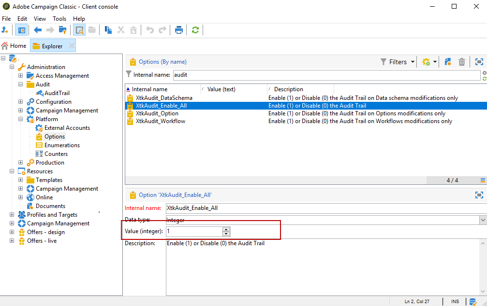

# 审核跟踪{#audit-trail}

在Adobe Campaign, **[!UICONTROL Audit trail]** 允许您访问实例中所做更改的完整历史记录。

**[!UICONTROL Audit trail]** 可实时捕获在Adobe Campaign实例内发生的操作和事件的完整列表。 它包括一种访问数据历史的自助方式，可帮助回答以下问题：工作流发生的事件、上次更新这些事件的人员或用户在实例中执行的操作。

>[!NOTE]
>
>Adobe Campaign不会审核在用户权限、模板、个性化或营销活动中所做的更改。\
>审核跟踪只能由实例的管理员管理。

审核记录包含三个组件：

* **架构审核跟踪**:检查活动和上次对架构所做的修改。

   有关模式的更多信息，请参阅此 [页面](../../configuration/using/data-schemas.md).

* **工作流审核跟踪**:检查活动和上次对工作流所做的修改，以及工作流的状态，例如：

   * 开始
   * 暂停
   * 停止
   * 重新启动
   * 清除 它等于清除历史记录操作
   * 在模拟模式下，模拟与“开始”(Start)操作相等的项
   * 唤醒，等同于操作立即执行挂起任务
   * 无条件停止

   有关工作流的更多信息，请参阅此 [页面](../../workflow/using/about-workflows.md).

   有关如何监控工作流的更多信息，请参阅 [专用部分](../../workflow/using/monitoring-workflow-execution.md).

* **选项审核跟踪**:检查活动和上次对选项所做的修改。

   有关选项的更多信息，请参阅此 [页面](../../installation/using/configuring-campaign-options.md).

## 访问审核跟踪 {#accessing-audit-trail}

访问实例的 **[!UICONTROL Audit trail]** :

1. 访问 **[!UICONTROL Explorer]** 菜单。
1. 在 **[!UICONTROL Administration]** 菜单，选择 **[!UICONTROL Audit]** .

   

1. 的 **[!UICONTROL Audit trail]** 窗口，其中包含实体列表。 Adobe Campaign将审核工作流、选项和架构的创建、编辑和删除操作。

   选择一个实体，以了解有关上次修改的更多信息。

   

1. 的 **[!UICONTROL Audit entity]** 窗口会为您提供有关所选实体的更详细信息，例如：

   * **[!UICONTROL Type]** :工作流、选项或架构。
   * **[!UICONTROL Entity]** :活动的内部名称。
   * **[!UICONTROL Modified by]** :上次修改此实体的最后一个人员的用户名。
   * **[!UICONTROL Action]** :对此实体执行的上次操作（“已创建”、“已编辑”或“已删除”）。
   * **[!UICONTROL Modification date]** :对此实体执行最后一次操作的日期。

   代码块会为您提供有关实体中确切更改了哪些内容的更多信息。

   

>[!NOTE]
>
>默认情况下，保留期设置为 **[!UICONTROL Audit logs]** . 要详细了解如何更改保留期，请参阅 [页面](../../production/using/database-cleanup-workflow.md#deployment-wizard).

## 启用/禁用审核跟踪 {#enable-disable-audit-trail}

例如，如果您想在数据库上节省一些空间，则可以轻松激活或停用特定活动的审核跟踪。

为实现此操作，请执行以下步骤：

1. 访问 **[!UICONTROL Explorer]** 菜单。
1. 在 **[!UICONTROL Administration]** 菜单，选择 **[!UICONTROL Platform]** then **[!UICONTROL Options]** .

   

1. 根据要激活/取消激活的实体，选择以下选项之一：

   * 对于工作流： **[!UICONTROL XtkAudit_Workflows]**
   * 对于架构： **[!UICONTROL XtkAudit_DataSchema]**
   * 对于选项： **[!UICONTROL XtkAudit_Option]**
   * 对于每个实体： **[!UICONTROL XtkAudit_Enable_All]**

   

1. 更改 **[!UICONTROL Value]** 如果要启用实体，则设置为1；如果要禁用实体，则设置为0。

   

1. 单击 **[!UICONTROL Save]**。
