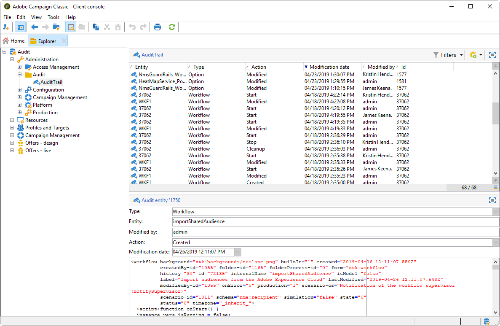

# 审核记录{#audit-trail}

>[!INFO]
>
>请参阅[Adobe Campaign v8文档](https://experienceleague.adobe.com/zh-hans/docs/campaign/campaign-v8/analytics/audit-trail)以了解有关审核记录功能的更多信息。

在Adobe Campaign中，**[!UICONTROL Audit trail]**&#x200B;可让您访问实例中所做更改的完整历史记录。

**[!UICONTROL Audit trail]**&#x200B;可实时捕获您的Adobe Campaign实例中发生的操作和事件的全面列表。 它提供了一种访问数据历史的自助方式，可帮助回答以下问题：您的工作流发生了什么情况、上次更新这些工作流的人员或者您的用户在实例中做了什么。

>[!NOTE]
>
>Adobe Campaign不会审核在用户权限、模板、个性化或营销活动中所做的更改。\
>审核记录只能由实例的管理员管理。

+++ 了解有关审核记录可用实体的更多信息

* **架构审核跟踪**：允许您浏览对架构所做的更改，并识别进行这些修改的人员和时间。

  有关架构的详细信息，请参阅此[页面](../../configuration/using/data-schemas.md)。

* **工作流审核跟踪**&#x200B;跟踪与您的工作流相关的所有操作，包括：

   * 开始
   * 暂停
   * 停止
   * 重新启动
   * 清除等于操作清除历史记录
   * 模拟在模拟模式下等于操作“开始”的项
   * 唤醒等于操作立即执行待处理任务
   * 无条件停止

  有关工作流的详细信息，请参阅此[页面](../../workflow/using/about-workflows.md)。

  有关如何监视工作流的详细信息，请参阅[专用部分](../../workflow/using/monitoring-workflow-execution.md)。

* **选项审核记录**&#x200B;允许您检查活动和对选项所做的最后修改。

  有关选项的更多信息，请参阅此[页面](../../installation/using/configuring-campaign-options.md)。

* **投放审核跟踪**&#x200B;允许您检查投放的活动和上次所做的修改。

  有关投放的详细信息，请参阅此[页面](../../delivery/using/communication-channels.md)。

* **外部帐户**&#x200B;允许您检查对外部帐户所做的修改，这些修改由技术工作流或活动工作流等技术流程使用。

  有关外部帐户的详细信息，请参阅此[页面](../../installation/using/external-accounts.md)。

* **投放映射**&#x200B;允许您监视活动以及最近对投放映射所做的修改。

  有关投放映射的详细信息，请参阅此[页面](../../configuration/using/target-mapping.md)。

* **Web应用程序**&#x200B;允许您检查Campaign V8中对Web窗体所做的修改，该窗体用于创建具有输入和选择字段的页面，并且可能包含来自数据库的数据。

  有关Web应用程序的详细信息，请参阅此[页面](../../web/using/about-web-applications.md)。

* **选件**&#x200B;允许您检查活动和对选件所做的最后修改。

  有关选件的详细信息，请参阅此[页面](../../interaction/using/interaction-and-offer-management.md)。

* 通过&#x200B;**操作员**，您可以监视操作员的活动和最近所做的修改。

  有关运算符的详细信息，请参阅此[页面](../../platform/using/access-management-operators.md)。

+++
