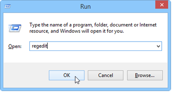

# 控制台更新{#console-update}

如果您选择了 **[!UICONTROL Do not request console update]** 选项，并要重新激活更新请求，请应用以下过程：

1. 使用 **regedit** 命令 **[!UICONTROL Start > Execute]** 菜单。

   

1. 在树中，显示 **[!UICONTROL HKEY_CURRENT_USERSoftwareneolaneNL_6nlclient]** 节点。
1. 删除 **[!UICONTROL confAdvisedUpgrade]** 并关闭注册表编辑器。

   
