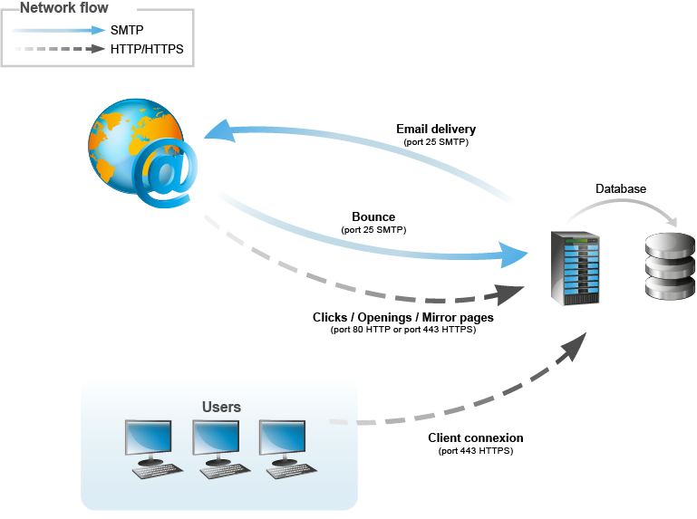

# 一般架构{#general-architecture}

## 最低架构 {#minimum-architecture}

在最低配置中，Adobe Campaign使用：

* Adobe Campaign应用程序服务器，
* 数据库。

   

此图表显示，最低架构上下文中仅涉及以下流量：

1. 通过Internet到Adobe Campaign服务器的HTTP协议流量，
1. 从Adobe Campaign服务器到Internet的SMTP协议流量。

## 分布式架构 {#distributed-architecture}

Adobe Campaign由多个模块组成，这些模块可以在多台计算机上划分。 此操作模式具有以下几个优点：

* 负载平衡，
* 设置模块冗余，
* 构建一个按多个服务提供商划分的架构（对所提供服务的分段）。

模块在多台机器上的分布提供了极大的使用灵活性，并提高了适应性。

>[!NOTE]
>
>有关各种体系结构的更多信息，请参见[此部分](../../installation/using/general-architecture.md)。

## 打开端口列表 {#list-of-open-ports}

| 端口号 | 相关的Adobe Campaign模块或应用程序 | 可配置 |
|---|---|---|
| 443/tcp或80/tcp | Web服务器(Apache/IIS) | 是 |
| 6666/udp（本地） | Adobe Campaign:叙洛格德 | 是 |
| 8005/tcp（本地） | Adobe Campaign:web模块 | 是 |
| 8080/tcp | Adobe Campaign:web模块(tomcat) | 是 |
| 7777 | 统计服务器（stat服务器） | 是 |
