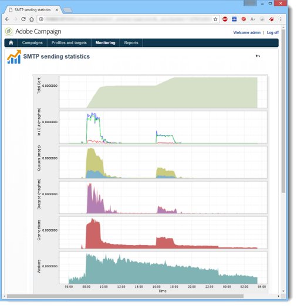
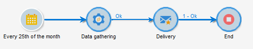

# 监控流程{#monitoring-processes}


应用程序服务器和重定向服务器(**跟踪**)可以手动或自动监视。

## 手动监测 {#manual-monitoring}

要访问“Adobe Campaign进程监视”页面，请浏览至 **[!UICONTROL Monitoring]** 选项卡，然后单击 **[!UICONTROL Overview]** 链接。


显示的页面允许您查看已连接实例的状态，即：

* 有关实例的信息：版本、名称、数据库引擎、已安装的包、服务器系统指示符、
* 缺少的进程和执行信息（开始日期、PID等）的列表，
* 工作流和投放的视图。

中介绍了监控Campaign流程的其他方法 [此页面](../../production/using/monitoring-guidelines.md).

### 日志记录 {#log-journal}

要显示与进程相关的日志日志，请单击该进程， **mta** 例如，然后选择 **[!UICONTROL Open the log journal]** .


### 系统指示器 {#system-indicators}

浏览到系统指示器列表，以显示有关计算机的信息，例如其物理和虚拟内存、活动进程和可用磁盘空间。 Linux和Windows操作系统的指示器不同。 转到 **[!UICONTROL Instance Monitoring]** 页面，然后单击 **[!UICONTROL Display]** 用于打开指标列表的链接。

#### Windows {#in-windows}

* **[!UICONTROL Pending events queued]**：特定于的指示器 **消息中心**. [了解详情](../../message-center/using/additional-configurations.md#monitoring-thresholds)

* **[!UICONTROL Memory]**：有关物理内存(RAM)的信息。

   **[!UICONTROL Current value]**：当前内存消耗。

   **[!UICONTROL Max Value]**：安装的内存总量。

   **[!UICONTROL Available]**：可用内存量。

   **[!UICONTROL Warning]**：当内存消耗达到总量的80%时，显示此指示器。

   **[!UICONTROL Alert]**：当内存消耗达到总量的90%时，显示此指示器。

   当 **[!UICONTROL Warning]** 和 **[!UICONTROL Alert]** 如果显示指示器，则可以通过将RAM添加到安装了Adobe Campaign服务器的计算机来解决此问题。 您还可以决定在专用计算机上安装Adobe Campaign服务器。

* **[!UICONTROL Swap Memory]**：与匹配分页文件的虚拟内存相关的信息：硬盘上Windows使用的区域，就像是RAM一样。

   **[!UICONTROL Current value]**：实际内存消耗。

   **[!UICONTROL Max Value]**：内存总量。

   **[!UICONTROL Available]**：可用内存量。

   **[!UICONTROL Warning]**：当内存消耗达到总量的80%时，显示此指示器。

   **[!UICONTROL Alert]**：当内存消耗达到总量的90%时，显示此指示器。

   当 **[!UICONTROL Warning]** 和 **[!UICONTROL Alert]** 指示器显示，可以通过在高级Windows设置中增加exchange文件的大小来解决此问题。

* **[!UICONTROL Disk XXX]**：有关机器阅读器的信息。

   **[!UICONTROL Current value]**：实际使用的磁盘空间。

   **[!UICONTROL Max Value]**：磁盘总容量。

   **[!UICONTROL Available]**：可用磁盘空间。

   **[!UICONTROL Used]**：已用磁盘的百分比。

   **[!UICONTROL Warning]**：当可用磁盘空间达到总容量的80%时显示此指示器。

   **[!UICONTROL Alert]**：当可用磁盘空间达到总容量的90%时显示此指示器。

* **[!UICONTROL Number of processes too old]**：有关已处于活动状态超过一天的Adobe Campaign进程的信息。

   **[!UICONTROL Current value]**：当前处于活动状态的进程数。

   **[!UICONTROL Max Value]**：最大授权进程数(1)。

   **[!UICONTROL Alert]**：如果进程数等于1，则显示此指示器。

   当 **[!UICONTROL Alert]** 指示符显示，可能是相关进程被SQL数据库引擎锁定，或陷入无限循环。 此 **监视程序** Adobe Campaign提供的流程每天自动重新启动所有流程，并使您能够解决此问题。 但是，您也可以自行停止相关进程以强制重新启动。

#### Linux {#in-linux}


* **[!UICONTROL Pending events queued]**：特定于的指示器 **消息中心**. 请参阅 [本节](../../message-center/using/additional-configurations.md#monitoring-thresholds) 了解更多信息。

* **[!UICONTROL Load average (1/5/15 minutes)]**：有关负载的信息，即最近5分钟或15分钟内计算机上运行的进程所使用的处理器

   **[!UICONTROL Current value]**：计算机的实际负载。

   **[!UICONTROL Max value]**：流程在计算机上的最大使用负载

   **[!UICONTROL Warning]**：当加载达到最大授权值的80%时（最近1分钟、5分钟或15分钟），将显示此标识符。

   **[!UICONTROL Alert]**：当负载达到最后1分钟、5分钟或15分钟的最大授权值的90%时，显示此标识符。

* **[!UICONTROL Memory]**  有关物理内存(RAM)的信息。

   **[!UICONTROL Current value]**：实际内存消耗。

   **[!UICONTROL Max Value]**：安装的内存总量。

   **[!UICONTROL Available]**：可用内存量。

   **[!UICONTROL Warning]**：当内存消耗达到总量的80%时，显示此指示器。

   **[!UICONTROL Alert]**：当内存消耗达到总量的90%时，显示此指示器。

   当 **[!UICONTROL Warning]** 和 **[!UICONTROL Alert]** 如果显示指示器，则可以通过将RAM添加到安装了Adobe Campaign服务器的计算机来解决此问题。 您还可以决定在专用计算机上安装Adobe Campaign服务器。

* **[!UICONTROL Swap Memory]**：与匹配分页文件的虚拟内存相关的信息：硬盘上Windows使用的区域，就像是RAM一样。

   **[!UICONTROL Current value]**：实际内存消耗。

   **[!UICONTROL Max Value]**：内存总量。

   **[!UICONTROL Available]**：可用内存量。

   **[!UICONTROL Warning]**：当内存消耗达到总量的80%时，显示此指示器。

   **[!UICONTROL Alert]**：当内存消耗达到总量的90%时，显示此指示器。

   当 **[!UICONTROL Warning]** 和 **[!UICONTROL Alert]** 指示器显示，您可以通过增加exchange文件的大小来解决问题。

* **[!UICONTROL Core Files]**：有关Adobe Campaign进程崩溃后生成的文件的信息。 这些文件使您能够诊断崩溃的原因。

   **[!UICONTROL Current Value]**：现有文件的数量。

   **[!UICONTROL Max Value]**：最大授权文件数(1)。

   **[!UICONTROL Warning]**：当文件数接近1时，显示此指示器。

   **[!UICONTROL Alert]**：当文件数等于1时，显示此指示器。

   当由于崩溃而缺少某个进程时，该进程会在进程列表中以红色显示，并且会由自动重新启动 **监视程序** Adobe Campaign提供的流程。

* **[!UICONTROL Number of shared memory segments]**：有关所有Adobe Campaign进程共享的内存区段的信息。

   **[!UICONTROL Current value]**：当前正在使用的内存段数。

   **[!UICONTROL Max Value]**：已授权的最大内存段数(2)。

   **[!UICONTROL Warning]**：当内存区段数达到1时，显示此指示器。

   **[!UICONTROL Alert]**：当内存区段数达到2时，显示此指示器。

* **[!UICONTROL Number of processes too old]**：有关已处于活动状态超过一天的进程的信息。

   **[!UICONTROL Current value]**：当前处于活动状态的进程数。

   **[!UICONTROL Max Value]**：最大授权进程数。

   **[!UICONTROL Warning]**：当进程数达到授权阈值的80%时，显示此标识符。

   **[!UICONTROL Alert]**：当进程数达到授权阈值的90%时，显示此标识符。

* **[!UICONTROL File Handles]**：有关文件描述符的信息，即每个进程打开的文件数。

   **[!UICONTROL Current value]**：当前文件描述符的数量。

   **[!UICONTROL Max Value]**：操作系统授权的最大文件描述符数。

   **[!UICONTROL Warning]**：当授权文件描述符的数量达到80%阈值时，显示此标识符。

   **[!UICONTROL Alert]**：当授权文件描述符的数量达到90%阈值时，显示此标识符。

* **[!UICONTROL Processes]**：有关机器处理的信息。

   **[!UICONTROL Current value]**：当前处于活动状态的进程数。

   **[!UICONTROL Max Value]**：最大授权进程数。

   **[!UICONTROL Active Processes]**：活动进程数。

   **[!UICONTROL Inactive Processes]**：不活动的进程数。

   **[!UICONTROL Warning]**：当授权进程数达到80%阈值时，将显示此标识符。

   **[!UICONTROL Alert]**：当授权进程数达到90%阈值时，将显示此标识符。

* **[!UICONTROL Zombie Processes]**：有关已停止但仍具有进程标识符(PID)且在进程表中保持可见的进程的信息。

   **[!UICONTROL Current value]**：当前处于活动状态的僵尸进程数。

   **[!UICONTROL Max Value]**：授权僵尸进程的最大数量(2)。

   **[!UICONTROL Warning]**：当僵尸进程数接近2时，显示此标识符。

   **[!UICONTROL Alert]**：当僵尸进程数达到2时，显示此标识符。

#### 自定义指标 {#customized-indicators}

Adobe Campaign允许您自定义指标，如下所述：

1. 创建 **.sh** 文件并为其命名 **[!UICONTROL cust_indicators.sh]** .
1. 将自定义指示器添加到此文件。 例如：

   ```
   #!/bin/bash 
   echo "<indicator name='Zombie Processes'>  
   <current label='Current Value' value='0' display=''/>  
   <warning value='2'/>  <alert value='2'/>  
   <max label='Max Value' value='2'/>
   </indicator>"
   ```

   或者

   ```
   #!/bin/bash 
   echo "<indicator name='Availability'>  
   <current label='Last update of data' display='2012-09-03 10:00'/>  
   <current label='Availability last month' display='100.00%'/>  
   <current label='Availability this month' display='100.00%'/> 
   <current label='Recent downtime periods' display='2012-07-04 11:10:00 - 11:19:59'/>
   </indicator>"
   ```

1. 将文件保存在 **[!UICONTROL usr/local/neolane/nl6]** 文件夹。

此文件由Adobe Campaign调用。

## SMTP报告 {#smtp-reports}

SMTP投放监视报告已集成到Adobe Campaign平台。 可以通过控制台或通过Web访问访问它们。

这些报告按域显示SMTP投放统计信息和SMTP错误。 要访问它们，操作员必须具有 **管理** 权限。

它们分组在 **监测** > “SMTP监控”。


>[!IMPORTANT]
>
>* 与SMTP监控相关的信息仅在电子邮件渠道激活后可用。
>* 此 **[!UICONTROL SMTP sending statistics]** 仅在实例上启动统计服务器时提供。
>


### SMTP发送统计信息 {#smtp-sending-statistics}

此 **[!UICONTROL SMTP sending statistics]** 通过报表，可控制服务器活动。 它显示每个匹配项的合成。



此报告的指标列表如下图所示。

1. 发送的消息总数.
1. 表示输入/输出消息：

   * 蓝线：通过Shaper到达的准备发送的消息，即发送SMTP之前的最后一个阶段（与传入数据一致）。

   * 绿线：消息已成功发送（与传出数据一致）。

   * 红线：由Shaper放弃的消息，返回到 **mta** （与此恢复中拒绝的数据一致）。

   这些值以每小时的消息数表示。

1. 表示映射器的两个队列：

   * 蓝色曲线：活动消息的队列。 将尽快发送这些消息。

   * Kaki曲线：“延迟”队列。 由于限制或无法连接到目标，此时无法返回这些消息。 重试将每5秒、10秒、20秒、40秒、2分钟等发生一次。 （对于定义的） **MaxAgeSec** 被抛弃之前的时间。

1. 此图表显示放弃的消息的详情（第2张图中的红色曲线）：它显示未重试放弃的消息(Mauve)与发送失败（红色）的消息之间的比例。 这样，您就可以查看由于统计服务器的限制（限制）或远程服务器不可用而在授权时间段内未处理的消息比例。
1. SMTP连接已打开或正在打开。
1. 预估数量 **matachild**.

>[!NOTE]
>
>此报表与电子邮件流量整形器组件的状态相关。

### 每个域的SMTP错误 {#smtp-errors-per-domain}

此报表允许您查看在设定的时间段内按域划分的投放错误。

>[!NOTE]
>
>此 **minConnectionsToLog**， **minErrorsToLog** 和 **minMessagesToLog** 的选项 **serverConf.xml** 文件定义阈值，超过该阈值将考虑连接统计信息。


本报告的指标清单见下表。

* 此 **域** 列包含消息发送到的域的名称(或真正的域名，例如yahoo.com代表yahoo.fr)，
* 此 **Cnx** 列显示此域打开的SMTP连接数，
* 此 **已发送** 列对应于发送到此域的消息数，
* 此 **音量** 列显示已尝试发送到此域的消息数量（近似值），
* 此 **错误** 列显示一段时间内此域上错误的卷指示器，
* 此 **上次响应** 列显示此域最后收到的SMTP响应消息，
* 此 **日期** 列显示上次收到此域的SMTP响应的日期。

>[!NOTE]
>
>中显示的值 **Cnx**， **已发送**、和 **音量** 列根据以下项中选择的时段进行计算： **[!UICONTROL Period]** 字段。

单击域名可查看其错误。

它们按PublicId进行分类：此标识符对应于由路由器后面的多个Adobe Campaign移动代理共享的IP地址。 统计信息服务器使用此标识符来记忆此起始点和目标服务器之间的连接和投放统计信息。


此 **[!UICONTROL Owner of domain]** 字段可让您将各种域名分组到同一标签下。 在初始报告视图中，所有MX域名都将与此所有者相关联。

单击PublicId标识符可查看更多详细信息。


>[!NOTE]
>
>错误百分比由两个图表表示。 第一个是黑色背景上的水平进度条。 第二个图表按时间顺序排列。 所选时段被分为12个时间间隔，每个时间间隔由垂直进度条表示。 在这两种表示法中，如果未检测到任何错误，则该条为黑色。 栏的颜色取决于遇到的错误百分比（黄色、橙色和红色）。 颜色灰色表示未找到显着的数据量。 通过将光标放在图表上，可以显示错误的准确百分比。

>[!NOTE]
>
>有关在Adobe Campaign中管理SMTP错误的更多信息，请查阅 [本节](../../installation/using/email-deliverability.md).

## 计费报告 {#billing-report}

此 **[!UICONTROL Billing]** 技术工作流会通过电子邮件将系统活动报告发送到“billing”操作员。 默认情况下，它会在营销实例上的每月25日触发。

可以在以下节点的子文件夹中找到技术工作流： **管理** > **生产** > **技术工作流**.



工作流在每月的25日启动后，账单操作员将在收件箱中收到以下报告。


以下量度可用于跟踪您的投放：

* **[!UICONTROL Start date]** ：投放开始日期。 请注意，该日期可以早于报表的“起始”日期。
* **[!UICONTROL Label]** ：投放的标签。 要发送消息数少于100的投放被视为太小，因此按开始日期聚合，在这种情况下，标签显示聚合的数量，例如。 [3个小型投放的聚合].
* **[!UICONTROL Total volume]** ：为投放传输的总字节数。
* **[!UICONTROL Avg volume]** ：传输的平均字节数。 这是以下公式的结果 **（总量/报文）**，此参数为 **[!UICONTROL Multiplier]** 量度。
* **[!UICONTROL Messages]** ：已发送消息的数量。 这包括成功发送的消息和重试（在收到来自所联系服务器的退回消息后）。
* **[!UICONTROL Multiplier (x)]** ：从消息的平均音量推导出倍增器的值。
* **[!UICONTROL Count]** ：消息和乘数相乘后的结果。

## 自动监测 {#automatic-monitoring}

Adobe Campaign提供了多种自动监控方法，具体如下所述。

### 命令行 {#command-line}

命令

**nlserver monitor**

允许您在Adobe Campaign模块和系统中列出一组指标。

它以易于处理的XML格式生成输出。

此命令也可以使用 **-missing** 参数，列出当配置文件表示它们应该执行时此实例中缺少的进程。

```
nlserver monitor -missing
HH:MM:SS > Application server for Adobe Campaign Classic (7.X YY.R build XXX@SHA1) of DD/MM/YYYY
mta@prod
stat@prod
wfserver@prod
```

### 服务器发布的信息 {#information-published-by-the-server}

#### /r/test {#r-test}

此 **http(s)：//`<application>`/r/test** 页面用于测试重定向服务器。 我们建议使用此相同的方法测试用于跟踪的前端服务器。 此页面还可用于测试负载Dispatcher。

它以XML格式显示如下行：

```
<redir status='OK' date='YYYY-MM-DD HH:MM:SS.112Z' build='XXXX' host='<hostname>' localHost='<servername>'/>
```

**频率**：此测试不使用任何负载，因此可以非常频繁地运行（例如，每秒运行一次）。

#### /nl/jsp/ping.jsp {#nl-jsp-ping-jsp}

此 **http(s)：//`<Application server url>`/nl/jsp/ping.jsp**  page的工作方式与对应的网络相同：它测试通过apache/tomcat/web module/database并上传到客户端的完整查询。 如果一切运行正常，则返回“OK”。 我们建议在具有数据库（例如，mta和调查）访问权限的计算机上运行此测试。

**使用情况**：与操作员登录关联的会话令牌必须作为参数传递，才能远程登录(请参阅 [通过Adobe Campaign脚本进行自动监控](#automatic-monitoring-via-adobe-campaign-scripts))。

例如：


操作员名称和登录名需要预先在Adobe Campaign客户端控制台中通过数据库权限进行配置。


**频率**：这是一项占用很少带宽的测试。 因此，它可以相当频繁地运行，尽管不会超过每分钟一次。

#### /nl/jsp/monitor.jsp {#nl-jsp-monitor-jsp}

这是一项测试，用于检查操作员是否可以通过网页访问Adobe Campaign服务器；该网页与通过客户端控制台菜单访问的网页相同。 您可以从监视工具（Tivoli、Nagios等）中调用此页面。


**使用情况**：与允许您连接到实例的操作员登录关联的会话令牌需要用作参数(请参阅 [通过Adobe Campaign脚本进行自动监控](#automatic-monitoring-via-adobe-campaign-scripts))。

操作员及其登录名需要以前在Adobe Campaign客户端控制台中配置相应的数据库权限和限制。

**频率**：这是一次完整的服务器测试，不需要经常运行（例如，可以每十分钟执行一次）。

#### /nl/jsp/soaprouter.jsp {#nl-jsp-soaprouter-jsp}

此 **jsp** 表示Adobe Campaign应用程序API的入口点。 因此，它可以提供对应用程序的详细监视。 它还可用于监视Adobe Campaign Web服务。 它在我们的监控脚本中使用，但请注意，它仅供高级用户使用。

### 基于部署类型的监控 {#monitoring-based-on-deployment-types}

Adobe Campaign支持各种部署配置(有关更多信息，请参阅 [本节](../../installation/using/hosting-models.md))。 本节详细介绍各种根据安装类型应用的自动监控技术。

<table> 
 <thead> 
  <tr> 
   <th> 部署类型 </th> 
   <th> 监测 </th> 
  </tr> 
 </thead> 
 <tbody> 
  <tr> 
   <td> 独立 </td> 
   <td> 
    <ul> 
     <li><p> <span class="uicontrol">/r/test</span> 和 <span class="uicontrol">/nl/jsp/monitor.jsp</span> 在Adobe Campaign服务器上</p> </li> 
    </ul> </td> 
  </tr> 
  <tr> 
   <td> 标准 </td> 
   <td> 
    <ul> 
     <li><p> <span class="uicontrol">/r/test</span> 和 <span class="uicontrol">/nl/jsp/ping.jsp</span> 在前端服务器上</p> </li> 
     <li><p> <span class="uicontrol">/nl/jsp/monitor.jsp</span> 在应用程序服务器上</p> </li> 
    </ul> </td> 
  </tr> 
  <tr> 
   <td> 企业 </td> 
   <td> 
    <ul> 
     <li><p> <span class="uicontrol">/r/test</span> 和 <span class="uicontrol">/nl/jsp/ping.jsp</span> 在前端服务器上</p> </li> 
     <li><p> <span class="uicontrol">/r/test</span> 和 <span class="uicontrol">/nl/jsp/monitor.jsp</span> 在应用程序服务器上</p> </li> 
    </ul> </td> 
  </tr> 
  <tr> 
   <td> 中间源 </td> 
   <td> 
    <ul> 
     <li><p> <span class="uicontrol">/nl/jsp/monitor.jsp</span> 在应用程序服务器上</p> </li> 
    </ul> </td> 
  </tr> 
 </tbody> 
</table>

## 通过Adobe Campaign脚本进行自动监控 {#automatic-monitoring-via-adobe-campaign-scripts}

Adobe Campaign可以提供实例监控工具(netreport)，让您通过电子邮件发送有关检测到的异常的报告。


>[!IMPORTANT]
>
>此工具可用于监控实例，但Adobe Campaign不支持此工具。 有关更多信息，请与Campaign管理员联系。

### 必需元素 {#required-elements}

自动监控需要以下安装前预防措施：

* 您必须拥有 **netreport.tgz** （Linux安装）或 **netreport.zip** （Windows安装）文件、
* 我们强烈建议您不要在要监视的计算机上安装监视，
* 它必须安装在具有JRE或JDK的计算机上，
* 在Linux中，要监视的计算机必须具有 **bc** 包。 如需详细信息，请参阅[此部分](../../installation/using/installing-packages-with-linux.md#distribution-based-on-rpm--packages)。

### 安装过程 {#installation-procedure}

安装过程如下：

1. 在控制台中，根据需要创建一个新运算符（“监控”用户已存在），但不分配任何权限。
1. 运行存档提取。
1. 阅读 **自述文件** 文件。
1. 更新 **netconf.xml** 配置文件。
1. 更新 **netreport.bat** (Windows)或 **netreport.sh** (Linux)文件。

### 配置netconf.xml文件 {#configuring-the-netconf-xml-file}

XML配置文件包含以下元素：

* [“属性”元素](#properties--element)
* [“实例”元素](#instance--element)
* [“主机”元素](#host--element)
* [子元素](#sub-elements)

以下是配置示例：

```
<?xml version="1.0" encoding="ISO-8859-1"?>
<netconf>
  <properties mailServer="mail.adobe.net" mailFrom="mail@adobe.com" recipientList="recipient@adobe.com">
    <nightMode start="00:00 am" end="07:00 am"/>
    <buildRange minimum="7829" maximum="8180"/>
    <buildRange minimum="8300" maximum="8400"/>
    <sla/>
  </properties>

  <instance name="dev" recipientList="mail@mail.com,mail2@mail.com">
                <host name="devrd.domain.com" alias="devrd" sessiontoken="monitoring" criticalLevel="1" filter="wkf;new">
                                <ncs instance="devrd" url="/nl/jsp/soaprouter.jsp" includeDead="false" isSecure="false"/>
                                <redir url="/r/test"/>
                                <http url="/nl/jsp/ping.jsp"/>
                </host>
                <host name="devtrk.domain.com" alias="devtrk" sessiontoken="monitoring" criticalLevel="0" filter="wkf;new">
                                <ncs instance="devrd" url="/nl/jsp/soaprouter.jsp" includeDead="true" isSecure="false"/>
                </host>
  </instance>
  <host name="dev-test" alias="dev-test" sessiontoken="monitoring" criticalLevel="2">
                <ncs instance="dev" url="/nl/jsp/soaprouter.jsp" includeDead="false"/>
  </host>
</netconf>
```

>[!NOTE]
>
>您可以通过向添加后缀来指定各种配置 **netconf.xml** 文件，例如， **netconf-dev.xml**， **netconf-prod.xml**&#x200B;等。 然后，指定用于执行netreport的配置 **netreport.bat** 或 **netreport.sh** 通过添加文件 **$JAVA_HOME/bin/java netreport dev** 或 **@%JAVA_HOME%binjava netreport prod** 例如。

>[!IMPORTANT]
>
>对于 **监测** 操作员的工作，执行netreport的计算机必须位于以下安全区域中 **sessionTokenOnly** 模式。 如果没有为此运算符指定受信任的IP掩码，则安全区域也必须位于 **allowEmptyPassword** 和 **allowUserPassword** 模式。

#### “属性”元素 {#properties--element}

此元素用于填充电子邮件的配置，即

* **mailServer**：用于发送电子邮件的SMTP服务器(例如：smtp.domain.net)。
* **mailFrom**：报表发件人的电子邮件地址(例如：monitoring@domain.net)。
* **recipientList**：监控收件人的电子邮件地址列表。 地址必须以逗号分隔（无空格）。
* ‘**夜晚**&#39;模式（可选）用于避免在指定的时间段之间发送电子邮件。 相反，会合并数据，并在结束时间（默认为7:00）后发送有关夜间活动的电子邮件。
* 此 **buildRange** 子元素（可选）允许您指定最小和最大内部版本号。 对于其内部版本号不在此范围内的所有计算机将生成错误

   ```
   <buildRange minimum="0000" maximum="9999"/>
   ```

* 您可以添加 **`<sla>`** （可选）中的子元素 **属性** 元素。 每次执行netreport时都会生成一个日志文件。 文件的名称包含配置名称以及日期和时间，例如 **dev_06_12_13_16_47_05.tmp**. 该文件包含以下信息：实例名称、计算机名称、严重性级别、（0到3，从最低临界到最严重）、日期（时间戳格式）、查询和响应之间所用的时间（以毫秒为单位）、使用的服务(http、ncs、ncsex、redir)。 此信息由每个服务末尾的制表符和换行符分隔。

>[!NOTE]
>
>此 **persistHtmlFile** 属性上具有“true”值 **`<property>`** 元素用于在文件中记录最新的监视状态 **netreport.md**. 此文件将保存在安装目录中。

#### “实例”元素 {#instance--element}

通过此元素，可将多台计算机（主机）重新分组到同一个实例中。 实例名称显示在监控电子邮件的第一部分。 您可以单击实例的名称来访问有关每台计算机的详细信息。

```
instance name="instance-name" recipientList="mail@mail.com,mail2@mail.com">
                <host name="devcamp.domain.com" ...>
                       ...
                </host>
                <host name="devtrack.domain.com" ...>
                       ...
                </host>
</instance
```

* **name**：将显示在电子邮件第一部分的实例名称。
* **recipientList** （可选）：用于通过电子邮件发送有关特定实例的监控报告。

#### “主机”元素 {#host--element}

此元素配置对主机上给定服务器的监控，即

* **name**：要监控的计算机的名称。
* **别名** （可选）：报表中显示的受监视计算机的名称。
* **sessionToken**：通过授权的会话令牌提供登录身份验证。

   要配置会话令牌，请选择 **监测** Adobe Campaign运算符。 在 **访问权限** 选项卡，指定有权监视此实例的计算机的IP地址。 然后，您将能够使用从这些计算机连接到监视页面 **监测** 标识符，无需指定密码。

   

* **critionallevel** （可选）：用于按严重性级别对要显示的错误进行排序。 可能的值包括“0”（显示所有级别）、“1”（仅显示高度错误和严重错误）和“2”（仅显示严重错误）。 如果未提供此属性，则会显示所有错误级别。
* **过滤器** （可选）：用于排除某些工作流错误，例如 **filter=&quot;wkf；wkf1&quot;**. 工作流标签必须以分号分隔。

#### 子元素 {#sub-elements}

* **tcp**：检查服务器是处于打开状态还是关闭状态。 必须输入端口号。
* **http**：检查Web服务器是否存在（应用程序服务器正在运行）。
* **ncs**：检查在“实例”属性中输入的实例上的进程（工作流错误、内存使用情况等）。 此 **已包括** （必需）属性为您提供了显示无效进程（“true”或“false”值）的选项。
* **redir**：检查跟踪。

在大多数情况下，仅 **ncs** 和 **redir** 可以保留子元素。

在任何情况下，某些节点都可能在子元素中过载(例如，节点 **端口=75** 重载用于http、ncs或redir连接的端口)：

```
<ncs instance="clap40" url="/nl/jsp/soaprouter.jsp" includeDead="false" port="80"/>
```

在 **ncs**， **redir** 和 **http** 子元素，则可以添加 **isSecure** 属性（可选）来选择是否使用https协议（“true”或“false”值）。 如果未提供此属性，则使用http协议。

### 配置netreport.bat或netreport.sh文件 {#configuring-the-netreport-bat-or-netreport-sh--file}

要对其进行配置，请编辑此文件并指示JRE或JDK安装在哪个目录中。

### 正在启动监测 {#launching-monitoring}

要启动监视，请执行 **netreport.bat** 或 **netreport.sh** 通过脚本定期发送文件。 在第一次执行后发送报告，然后仅在状态更改时发送报告。

### 测试监控 {#testing-monitoring}

要测试监控，请执行 **netreport.bat** 或 **netreport.sh** 文件。

电子邮件将发送给中指定的收件人 **recipientList** 的 **netconf.xml** 文件。
