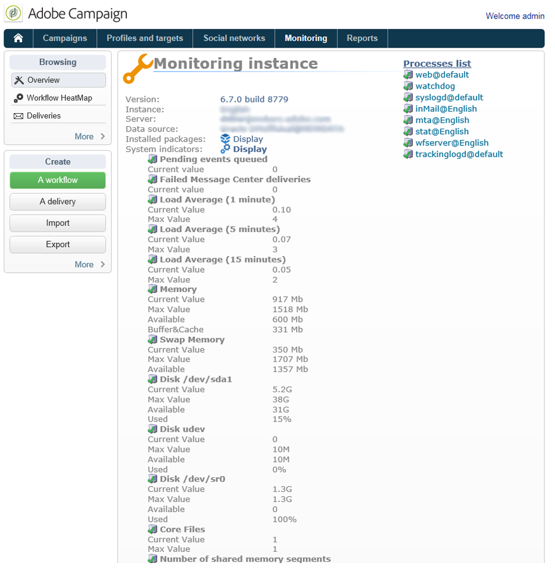

# 监控流程{#monitoring-processes}

可以手动或自动地监视应用服&#x200B;**务器和**&#x200B;重定向服务器（跟踪）。

## 手动监控 {#manual-monitoring}

转到并 **[!UICONTROL Monitoring]** 单击链接以 **[!UICONTROL Overview]** 显示Adobe Campaign流程监视页面。


显示的页面可让您查看连接的实例的状态，例如：

* 有关实例的信息：版本，名称，数据库引擎，已安装的包，服务器系统指示器，
* 缺少进程和执行信息（开始日期、PID等）的列表，
* 工作流和交付的视图。

本页介绍了其他监视不同营销活动流程 [的方法](https://helpx.adobe.com/campaign/kb/acc-maintenance.html)。

### 日志日志 {#log-journal}

可以显示与进程相关的日志日志。 为此，请单击该过程(例如 **mta** )，然后单击 **[!UICONTROL Open the log journal]** 。


### 系统指示器 {#system-indicators}

系统指示器列表允许您显示与计算机相关的信息，例如其物理和虚拟内存、活动进程和可用磁盘空间。 Linux和Windows操作系统的指示器不同。 转到页 **[!UICONTROL Instance Monitoring]** 面并单击链 **[!UICONTROL Display]** 接以打开指示器列表

#### 在Windows中 {#in-windows}

* **[!UICONTROL Pending events queued]** :消息中心特 **定的指示符**。 Refer to [this section](../../message-center/using/monitoring-thresholds.md) for more information.
* **[!UICONTROL Memory]** :关于物理存储器(RAM)的信息。

   **[!UICONTROL Current value]** :实际内存消耗。

   **[!UICONTROL Max Value]** :已安装的内存总量。

   **[!UICONTROL Available]** :可用内存量。

   **[!UICONTROL Warning]** :当内存消耗达到总量的80%时，将显示此指示器。

   **[!UICONTROL Alert]** :当内存消耗达到总量的90%时，将显示此指示器。

   显示 **[!UICONTROL Warning]** 和指 **[!UICONTROL Alert]** 示符后，您可以通过向安装Adobe Campaign服务器的计算机添加RAM来解决问题。 您还可以决定在专用计算机上安装Adobe Campaign服务器。

* **[!UICONTROL Swap Memory]** :与与寻呼文件匹配的虚拟内存相关的信息：Windows使用的硬盘区域与RAM一样。

   **[!UICONTROL Current value]** :实际内存消耗。

   **[!UICONTROL Max Value]** :内存总量。

   **[!UICONTROL Available]** :可用内存量。

   **[!UICONTROL Warning]** :当内存消耗达到总量的80%时，将显示此指示器。

   **[!UICONTROL Alert]** :当内存消耗达到总量的90%时，将显示此指示器。

   当显示 **[!UICONTROL Warning]** 和指 **[!UICONTROL Alert]** 示器时，您可以通过在高级Windows设置中增加交换文件的大小来解决问题。

* **[!UICONTROL Disk XXX]** :关于机器阅读器的信息。

   **[!UICONTROL Current value]** :实际使用的磁盘空间。

   **[!UICONTROL Max Value]** :磁盘总容量。

   **[!UICONTROL Available]** :可用磁盘空间

   **[!UICONTROL Used]** :已使用磁盘的百分比。

   **[!UICONTROL Warning]** :当可用磁盘空间达到总容量的80%时，将显示此指示器。

   **[!UICONTROL Alert]** :当可用磁盘空间达到总容量的90%时，将显示此指示器。

* **[!UICONTROL Number of processes too old]** :有关Adobe Campaign流程的信息，这些流程已激活超过一天。

   **[!UICONTROL Current value]** :当前处于活动状态的进程数。

   **[!UICONTROL Max Value]** :最大授权进程数(1)。

   **[!UICONTROL Alert]** :如果进程数等于1，则显示此指示符。

   当显 **[!UICONTROL Alert]** 示指示符时，可能是相关进程被SQL数据库引擎锁定，或者它被卡在无限循环中。 Adobe **Campaign提供的** “监视程序”流程每天自动重新启动所有流程，使您能够解决此问题。 但是，您也可以自行停止相关过程以强制重新启动。

#### 在Linux中 {#in-linux}



* **[!UICONTROL Pending events queued]** :消息中心特 **定的指示符**。 Refer to [this section](../../message-center/using/monitoring-thresholds.md) for more information.
* **[!UICONTROL Load average (1/5/15 minutes)]** :有关负载的信息，即在最后一分钟、五分钟或十五分钟内在机器上运行的进程对处理器的使用率

   **[!UICONTROL Current value]** :机器的实际负载。

   **[!UICONTROL Max value]** :机器上进程的最大使用负载

   **[!UICONTROL Warning]** :当负载在最后一分钟、五分钟或十五分钟内达到最大授权值的80%时，将显示此指示器。

   **[!UICONTROL Alert]** :当负载达到最后一分钟、五分钟或十五分钟的最大授权值的90%时，将显示此指示器。

* **[!UICONTROL Memory]** :关于物理存储器(RAM)的信息。

   **[!UICONTROL Current value]** :实际内存消耗。

   **[!UICONTROL Max Value]** :已安装的内存总量。

   **[!UICONTROL Available]** :可用内存量。

   **[!UICONTROL Warning]** :当内存消耗达到总量的80%时，将显示此指示器。

   **[!UICONTROL Alert]** :当内存消耗达到总量的90%时，将显示此指示器。

   显示 **[!UICONTROL Warning]** 和指 **[!UICONTROL Alert]** 示符后，您可以通过向安装Adobe Campaign服务器的计算机添加RAM来解决问题。 您还可以决定在专用计算机上安装Adobe Campaign服务器。

* **[!UICONTROL Swap Memory]** :与与寻呼文件匹配的虚拟内存相关的信息：Windows使用的硬盘区域与RAM一样。

   **[!UICONTROL Current value]** :实际内存消耗。

   **[!UICONTROL Max Value]** :内存总量。

   **[!UICONTROL Available]** :可用内存量。

   **[!UICONTROL Warning]** :当内存消耗达到总量的80%时，将显示此指示器。

   **[!UICONTROL Alert]** :当内存消耗达到总量的90%时，将显示此指示器。

   当显示 **[!UICONTROL Warning]** 和指 **[!UICONTROL Alert]** 示器时，您可以通过增加交换文件的大小来解决问题。

* **[!UICONTROL Core Files]** :与Adobe Campaign流程崩溃后生成的文件相关的信息。 这些文件使您能够诊断崩溃的原因。

   **[!UICONTROL Current Value]** :现有文件的数量。

   **[!UICONTROL Max Value]** :最大授权文件数(1)。

   **[!UICONTROL Warning]** :当文件数量接近1时，将显示此指示器。

   **[!UICONTROL Alert]** :当文件数等于1时，将显示此指示器。

   当因崩溃而缺少进程时，该进程在进程列表中以红色显示，并由Adobe Campaign提供的监视程序自 **动重新启动** 。

* **[!UICONTROL Number of shared memory segments]** :与所有Adobe Campaign进程共享的内存区段相关的信息。

   **[!UICONTROL Current value]** :当前使用的内存段数。

   **[!UICONTROL Max Value]** :已授权的最大内存段数(2)。

   **[!UICONTROL Warning]** :当内存段数达到1时，将显示此指示器。

   **[!UICONTROL Alert]** :当内存段数达到2时，将显示此指示器。

* **[!UICONTROL Number of processes too old]** :有关已激活一天以上的进程的信息。

   **[!UICONTROL Current value]** :当前处于活动状态的进程数。

   **[!UICONTROL Max Value]** :最大授权进程数。

   **[!UICONTROL Warning]** :当进程数达到授权阈值的80%时，显示此指示符。

   **[!UICONTROL Alert]** :当进程数达到授权阈值的90%时，显示此指示符。

* **[!UICONTROL File Handles]** :关于文件描述符的信息，即每个进程打开的文件数。

   **[!UICONTROL Current value]** :文件描述符的当前数量。

   **[!UICONTROL Max Value]** :操作系统授权的文件描述符的最大数量。

   **[!UICONTROL Warning]** :当授权文件描述符的数量达到80%阈值时，将显示此指示符。

   **[!UICONTROL Alert]** :当授权文件描述符的数量达到90%阈值时，将显示此指示符。

* **[!UICONTROL Processes]** :关于机器进程的信息。

   **[!UICONTROL Current value]** :当前处于活动状态的进程数。

   **[!UICONTROL Max Value]** :最大授权进程数。

   **[!UICONTROL Active Processes]** :活动进程数。

   **[!UICONTROL Inactive Processes]** :非活动进程数。

   **[!UICONTROL Warning]** :当授权进程数达到80%阈值时，将显示此指示符。

   **[!UICONTROL Alert]** :当授权进程数达到90%阈值时，将显示此指示符。

* **[!UICONTROL Zombie Processes]** :关于已停止但仍具有进程标识符(PID)且在进程表中仍可见的进程的信息。

   **[!UICONTROL Current value]** :当前处于活动状态的僵尸进程数。

   **[!UICONTROL Max Value]** :授权僵尸进程的最大数量(2)。

   **[!UICONTROL Warning]** :当僵尸进程的数量接近2时，将显示此指示器。

   **[!UICONTROL Alert]** 当僵尸进程数达到2时，将显示此指示器。

#### 自定义指示器 {#customized-indicators}

Adobe Campaign可让您自定义指标。 操作步骤：

1. 创建。 **sh文件** ，并命名它 **[!UICONTROL cust_indicators.sh]** 。
1. 将您的自定义指示器添加到此文件。 例如：

   ```
   #!/bin/bash 
   echo "<indicator name='Zombie Processes'>  
   <current label='Current Value' value='0' display=''/>  
   <warning value='2'/>  <alert value='2'/>  
   <max label='Max Value' value='2'/>
   </indicator>"
   ```

   或

   ```
   #!/bin/bash 
   echo "<indicator name='Availability'>  
   <current label='Last update of data' display='2012-09-03 10:00'/>  
   <current label='Availability last month' display='100.00%'/>  
   <current label='Availability this month' display='100.00%'/> 
   <current label='Recent downtime periods' display='2012-07-04 11:10:00 - 11:19:59'/>
   </indicator>"
   ```

1. 将文件放入文 **[!UICONTROL usr/local/neolane/nl6]** 件夹。

此文件将由Adobe Campaign调用。

## SMTP报告 {#smtp-reports}

SMTP交付监控报告已集成到Adobe Campaign平台中。 可以通过控制台或使用Web访问访问访问它们。

这些报告按域显示SMTP发送统计信息和SMTP错误。

要访问它们，运营商必须具有“管理”权限。

它们分组在“监 **视** ”>“SMTP监视”下。


>[!CAUTION]
>
>* 与SMTP监视相关的信息仅在电子邮件通道被激活时才可用。
>* 只有 **[!UICONTROL SMTP sending statistics]** 在实例上启动了统计信息服务器时，才会提供。
>


### SMTP发送统计信息 {#smtp-sending-statistics}

报告 **[!UICONTROL SMTP sending statistics]** 允许您控制服务器活动。 它显示每个匹配子的合成。


此报告的指标列表显示在图表下方。

1. 发送的消息总数。
1. 
   * 蓝线：已准备好发送的消息已到达Shaper，即在发送SMTP之前的最后一阶段（与传入数据一致）。

   * 绿线：消息已成功发送（与传出数据一致）。

   * 红线：由Shaper放弃的消息，返回到 **mta** （与此恢复中拒绝的数据一致）。
   这些值以每小时的消息数表示。

1. 表示Shaper的两个队列：

   * 蓝色曲线：活动消息队列。 这些消息将尽快发送。

   * Kaki曲线：&quot;推迟&quot;队列。 由于限制或与目标的连接不可用，暂时无法返回这些消息。 重试次数为每5秒、10秒、20秒、40秒、2分钟等。 在被放弃 **之前的MaxAge** Sec时间。

1. 此图表显示了已放弃消息的详细信息（第2个图表上的红色曲线）:与发送失败的消息（红色）相比，它显示未重试放弃的消息的比例。 这样，您就可以查看由于统计服务器的限制（限制）或由于远程服务器不可用而未在授予的期限内处理的消息的比例。
1. 打开或正在打开SMTP连接。
1. 估计母 **体数**。

>[!NOTE]
>
>此报告与Email Traffic Shaper组件的状态相关。

### 每个域的SMTP错误 {#smtp-errors-per-domain}

通过此报告，您可以查看按域划分的在指定时间段内的交付错误。

>[!NOTE]
>
>服 **务器的minConnectionsToLog**、 **minErrorsToLog** 和 **minMessagesToLog****** 选项Conf.xml文件的minConnectionsToLog选项定义了超过的阈值，其中考虑了连接统计数据。


此报告的指标列表如下。

* “ **域** ”列包含要向其发送消息的域的名称（或实际域名，例如yahoo.fr的yahoo.com）,
* “ **Cnx** ”列显示此域打开的SMTP连接数，
* “已 **发送** ”列与发送到此域的消息数相对应，
* “ **卷** ”列显示已尝试发送到此域（近似值）的消息量，
* “错 **误** ”列显示该域在该时间段内的错误的卷指示符，
* “最 **后一个响应** ”列显示该域收到的最后一个SMTP响应消息，
* “日 **期** ”列显示该域上次收到的SMTP响应的日期。

>[!NOTE]
>
>Cnx **、** Sent **、** Volume **列中显示的值将根据字段中选定的时间段****[!UICONTROL Period]** 计算。

单击域名可查看其错误。

它们按PublicId分类：此标识符与路由器后的多个Adobe Campaign MTA共享的IP地址相对应。 统计服务器使用该标识符来存储该起始点和目标服务器之间的连接和传送统计数据。


该字 **[!UICONTROL Owner of domain]** 段允许您在同一标签下对各种域名进行分组。 在初始报告视图中，所有MX域名都将与此所有者关联。

单击PublicId标识符可查看更多详细信息。


>[!NOTE]
>
>错误百分比由两个图表表示。 第一个是黑色背景上的水平进度条。 第二张图表按时间顺序排列。 所选时间段被分为十二个时间间隔，每个时间间隔由垂直进度条表示。 在这两个表示中，如果未检测到任何错误，则条为黑色。 条的颜色取决于遇到的错误百分比（黄色、橙色和最后是红色）。 颜色灰色表示未找到任何显着的数据量。 通过将光标放在图表上，可以显示错误的精确百分比。

>[!NOTE]
>
>有关SMTP错误以及在Adobe Campaign中管理这些错误的详细信息，请参 [阅此部分](../../installation/using/email-deliverability.md)。

## 帐单报告 {#billing-report}

技术 **[!UICONTROL Billing]** 工作流通过电子邮件将系统活动报告发送给“付费”运营商。 默认为每月廿五日触发。

技术工作流程位于以下节点的子文件夹中：“管 **理** ”>“ **生产** ” **>“**&#x200B;技术工作流”。


每月25日开始该工作后，您的计费操作员将在其收件箱中收到以下报告。


可以使用以下指标跟踪您的交付：

* **[!UICONTROL Start date]** :交货的开始日期。 请注意，该日期可能早于报表的“开始”日期。
* **[!UICONTROL Label]** :交付的标签。 如果要发送的消息少于100条，则发送被视为过小，并因此按开始日期进行汇总，在这种情况下，标签会显示汇总的数量，例如3个小的发送的 [汇总]。
* **[!UICONTROL Total volume]** :传送的总字节数。
* **[!UICONTROL Avg volume]** :传输的平均字节数。 这是以下公式(总体 **量／消息)的结果**，它是度量的计算基 **[!UICONTROL Multiplier]** 础。
* **[!UICONTROL Messages]** :已发送消息的数量。 这包括成功发送的消息和重试（在从联系的服务器收到弹回消息后）。
* **[!UICONTROL Multiplier (x)]** :从消息的平均体积推导出乘法器的值。
* **[!UICONTROL Count]** :消息和乘数的乘法结果。

## 自动监控 {#automatic-monitoring}

Adobe Campaign提供多种自动监控方法，如下所示。

### 命令行 {#command-line}

命令

**nlserver监视器**

允许您在Adobe Campaign模块和系统中列出一组指标。

它以易于处理的XML格式生成输出。

此命令也可以与 **-missing** 参数一起运行，该参数列出当配置文件指示应执行这些进程时，此实例中缺少的进程。

```
nlserver monitor -missing
HH:MM:SS > Application server for Adobe Campaign Classic (7.X YY.R build XXX@SHA1) of DD/MM/YYYY
mta@prod
stat@prod
wfserver@prod
```

### 服务器发布的信息 {#information-published-by-the-server}

#### /r/test {#r-test}

使 **用http://`<application>`** /r/test页测试重定向服务器。 我们建议使用相同的方法来测试用于跟踪的前端服务器。 此页还可用于测试加载调度程序。

它以XML格式显示如下行：

```
<redir status='OK' date='YYYY-MM-DD HH:MM:SS.112Z' build='XXXX' host='<hostname>' localHost='<servername>'/>
```

**频率**:此测试不使用任何负载，因此可以经常运行它（例如，每秒运行一次）。

#### /nl/jsp/ping.jsp {#nl-jsp-ping-jsp}

此 **http(s)://`<Application server url>`/nl/jsp/ping.jsp** (s)页的操作方式与其网络对应方相同：它测试一个完整的查询，该查询通过apache/tomcat/web模块／数据库并上传到客户端。 如果一切正常，则返回“OK”。 我们建议在具有数据库访问权限的计算机上运行此测试（例如，mta和调查）。

**用法**:要远程登录，必须将与操作员登录关联的会话令牌作为参数进行传递(请参阅通过Adobe Campaign脚本进行 [自动监视中的提示](#automatic-monitoring-via-adobe-campaign-scripts))。

例如：


运营商名称和登录名需要先前在Adobe Campaign客户端控制台中配置数据库权限。


**频率**:这是一个使用很少带宽的测试。 因此，它可以相当频繁地运行，但每分钟不超过一次。

#### /nl/jsp/monitor.jsp {#nl-jsp-monitor-jsp}

这是一项测试，旨在检查运营商是否可以通过网页访问Adobe Campaign服务器；与通过客户端控制台菜单访问的网页相同。 我们建议将其包含在您的监视工具（Tivoli、Nagios等）中。


**用法**:与操作符登录关联的会话令牌，允许您连接到实例，该令牌需要用作参数(请参阅通过Adobe Campaign脚本进行自动监 [视中的提示](#automatic-monitoring-via-adobe-campaign-scripts))。

操作员及其登录名需要先前在Adobe Campaign客户端控制台中配置相应的数据库权限和限制。

**频率**:这是一个完整的服务器测试，不需要经常运行（例如，每十分钟可以执行一次）。

#### /nl/jsp/soaprouter.jsp {#nl-jsp-soaprouter-jsp}

此 **jsp** 表示Adobe Campaign应用程序API的入口点。 因此，它可以提供对应用的详细监控。 它还可用于监控Adobe Campaign web服务。 它用于我们的监视脚本中，但请注意，它仅用于高级用户。

### 基于部署类型进行监控 {#monitoring-based-on-deployment-types}

Adobe Campaign支持各种部署配置(有关详细信息，请参阅 [本节](../../installation/using/hosting-models.md))。 本节详细介绍了根据您的安装类型应用的各种自动监视技术。

<table> 
 <thead> 
  <tr> 
   <th> 部署类型 </th> 
   <th> 监控 </th> 
  </tr> 
 </thead> 
 <tbody> 
  <tr> 
   <td> 独立 </td> 
   <td> 
    <ul> 
     <li><p> <span class="uicontrol">/r/test</span> and <span class="uicontrol">/nl/jsp/monitor.jsp</span> on Adobe Campaign server</p> </li> 
    </ul> </td> 
  </tr> 
  <tr> 
   <td> 标准 </td> 
   <td> 
    <ul> 
     <li><p> <span class="uicontrol">/r/test</span> and <span class="uicontrol">/nl/jsp/ping.jsp</span> on the freal servers</p> </li> 
     <li><p> <span class="uicontrol">/nl/jsp/monitor.jsp</span> on the application server</p> </li> 
    </ul> </td> 
  </tr> 
  <tr> 
   <td> 企业 </td> 
   <td> 
    <ul> 
     <li><p> <span class="uicontrol">/r/test</span> and <span class="uicontrol">/nl/jsp/ping.jsp</span> on the freal servers</p> </li> 
     <li><p> <span class="uicontrol">/r/test和/nl/jsp/monitor.jsp</span> (在应 <span class="uicontrol">用程序服务器上</span> )</p> </li> 
    </ul> </td> 
  </tr> 
  <tr> 
   <td> 中部采购 </td> 
   <td> 
    <ul> 
     <li><p> <span class="uicontrol">/nl/jsp/monitor.jsp</span> on the application server</p> </li> 
    </ul> </td> 
  </tr> 
 </tbody> 
</table>

## 通过Adobe Campaign脚本进行自动监视 {#automatic-monitoring-via-adobe-campaign-scripts}

Adobe Campaign可以提供实例监视工具（网络），允许您通过电子邮件发送有关检测到的异常的报告。


>[!CAUTION]
>
>此工具可用于监视您的实例，但Adobe Campaign不支持此工具。 有关详细信息，请与营销活动管理员联系。

### 所需元素 {#required-elements}

自动监控需要以下预安装预防措施：

* 您必须拥有**netreport.tgz **（Linux安装）或 **netreport.zip** （Windows安装）文件，
* 我们强烈建议您不要在要监视的计算机上安装监视程序，
* 它必须安装在具有JRE或JDK的计算机上，
* 在Linux中，要监视的计算机必须具有 **bc** 包。 如需详细信息，请参阅[此部分](../../installation/using/installing-packages-with-linux.md#distribution-based-on-rpm--packages)。

### 安装过程 {#installation-procedure}

安装过程如下：

1. 在控制台中，根据需要创建一个新的运算符（“监视”用户已存在），但不分配任何权限。
1. 运行存档提取。
1. 阅读自 **述文件** 。
1. 更新 **netconf.xml配置文件** 。
1. 更新 **netreport.bat** (Windows)或**netreport.sh **(Linux)文件。

### 配置netconf.xml文件 {#configuring-the-netconf-xml-file}

XML配置文件包含以下元素：

* [“属性”元素](#properties--element)
* [“实例”元素](#instance--element)
* [“主机”元素](#host--element)
* [子元素](#sub-elements)

以下是配置示例：

```
<?xml version="1.0" encoding="ISO-8859-1"?>
<netconf>
  <properties mailServer="mail.adobe.net" mailFrom="mail@adobe.com" recipientList="recipient@adobe.com">
    <nightMode start="00:00 am" end="07:00 am"/>
    <buildRange minimum="7829" maximum="8180"/>
    <buildRange minimum="8300" maximum="8400"/>
    <sla/>
  </properties>

  <instance name="dev" recipientList="mail@mail.com,mail2@mail.com">
                <host name="devrd.domain.com" alias="devrd" sessiontoken="monitoring" criticalLevel="1" filter="wkf;new">
                                <ncs instance="devrd" url="/nl/jsp/soaprouter.jsp" includeDead="false" isSecure="false"/>
                                <redir url="/r/test"/>
                                <http url="/nl/jsp/ping.jsp"/>
                </host>
                <host name="devtrk.domain.com" alias="devtrk" sessiontoken="monitoring" criticalLevel="0" filter="wkf;new">
                                <ncs instance="devrd" url="/nl/jsp/soaprouter.jsp" includeDead="true" isSecure="false"/>
                </host>
  </instance>
  <host name="dev-test" alias="dev-test" sessiontoken="monitoring" criticalLevel="2">
                <ncs instance="dev" url="/nl/jsp/soaprouter.jsp" includeDead="false"/>
  </host>
</netconf>
```

>[!NOTE]
>
>可以通过向 **netconf.xml文件添加后缀来指定各种配置** ，例如， **netconf-dev.xml**、 **netconf-prod.xml**，等等。 然后，通过添加 **$JAVA_HOME/bin/java netreport dev** 或 **@%JAVA_HOME%BINTREPORTprod示例，指定用于在netreport.bat或********** netreport.sh文件中执行netreport的配置。

>[!CAUTION]
>
>要使监 **视操作** 员正常工作，执行Netreport的计算机必须位于处于sessionTokenOnly模式的安 **全区中** 。 如果尚未为此操作符指定受信任的IP掩码，则安全区域还必须处于 **allowEmptyPassword** 和 **allowUserPassword模式** 。

#### “属性”元素 {#properties--element}

此元素用于填充电子邮件的配置，即

* **mailServer**:用于发送电子邮件的SMTP服务器(例如：smtp.domain.net)。
* **mailFrom**:报告发送者的电子邮件地址(例如：monitoring@domain.net)。
* **recipientList**:监视收件人的电子邮件地址列表。 地址必须用逗号分隔（无空格）。
* “**夜**”模式（可选）用于避免在指定时间段之间发送电子邮件。 相反，数据会合并，并在结束时间（默认为7:00）后发送一封有关夜间活动的电子邮件。
* 使用 **buildRange子元素** （可选）可指定最小和最大内部版本号。 将为内部版本号不在此范围内的所有计算机生成错误

   ```
   <buildRange minimum="0000" maximum="9999"/>
   ```

* 您可以在属 **`<sla>`** 性元素中添加（可选）子 **元素** 。 每次执行Netreport时都会生成日志文件。 文件的名称包含配置名称以及日期和时间，例如 **dev_06_12_13_16_47_05.tmp**。 该文件包含以下信息：实例名称、机器名称、严重性级别（0到3，从最不严重到最严重）、日期（时间戳格式）、查询和响应之间经过的时间（以毫秒为单位）、使用的服务(http、ncs、ncsex、redir)。 此信息在每项服务结束时由表格标记和换行符分隔。

>[!NOTE]
>
>元 **素上值为“true”的persistHtmlFile** 属性用于在文件netreport.md中记录最新的监 **`<property>`** 视状态 ****。 此文件保存在安装目录中。

#### “实例”元素 {#instance--element}

通过此元素，可将多台计算机（主机）重新分组到同一实例中。 实例名称显示在监视电子邮件的第一部分中。 您可以单击实例的名称来访问有关每台计算机的详细信息。

```
instance name="instanceName" recipientList="mail@mail.com,mail2@mail.com">
                <host name="devcamp.domain.com" ...>
                       ...
                </host>
                <host name="devtrack.domain.com" ...>
                       ...
                </host>
</instance
```

* **name**:将在电子邮件第一部分中显示的实例名称。
* **recipientList** （可选）:允许您通过电子邮件发送有关特定实例的监视报告。

#### “主机”元素 {#host--element}

此元素配置主机上给定服务器的监视，即

* **name**:要监视的计算机的名称。
* **alias** （可选）:被监视计算机的名称，该名称将显示在报告中。
* **sessionToken**:通过授权会话令牌提供登录身份验证。

   要配置会话令牌，请在Adobe Campaign控制 **台中** ，选择监视操作符。 在“访 **问权限** ”选项卡中，指定授权监视此实例的计算机的IP地址。 然后，您将能够使用监视标识符从这些计算机连接到监 **视页** ，而无需指定密码。

   

* **criticalLevel** （可选）:允许您按严重性级别对要显示的错误进行排序。 可能的值为“0”（显示所有级别）、“1”（仅显示高错误和严重错误）和“2”（仅显示严重错误）。 如果未提供此属性，则显示所有错误级别。
* **filter** （可选）:允许您排除某些工作流错误， **例如filter=&quot;wkf;wkf1&quot;**。 工作流标签必须用分号分隔。

#### 子元素 {#sub-elements}

* **tcp**:检查服务器是打开还是关闭。 必须输入端口号。
* **http**:检查Web服务器是否存在（应用程序服务器可运行）。
* **ncs**:检查在“instance”属性中输入的实例上的进程（工作流错误、内存使用情况等）。 includead **** (mandatory)属性为您提供了显示无效进程（“true”或“false”值）的选项。
* **redir**:检查跟踪。

在大多数情况下，只 **能保留****ncs和redir** 子元素。

无论如何，某些节点都可能在子元素中过载(例如，节点 **port=75** ，以使用于http、ncs或redir连接的端口过载):

```
<ncs instance="clap40" url="/nl/jsp/soaprouter.jsp" includeDead="false" port="80"/>
```

在 **cs**、 **redir** 和 ******** http子元素中，可以添加isSecureAdobe属性（可选）来选择是否使用https协议（“true”或“false”值）。 如果未提供此属性，则使用http协议。

### 配置netreport.bat或netreport.sh文件 {#configuring-the-netreport-bat-or-netreport-sh--file}

要配置它，请编辑此文件并指明JRE或JDK安装在哪个目录中。

### 启动监视 {#launching-monitoring}

要启动监视，请通 **过脚本定期间隔执** 行netreport.bat **** 或netreport.sh文件。 在第一次执行之后发送报告，然后仅在状态发生变化时发送。

### 测试监控 {#testing-monitoring}

要测试监视，请执 **行netreport.bat****或netreport.sh文件** 。

将向netconf.xml文件的recipientList中指 **定的收件人发送****电子邮件** 。
