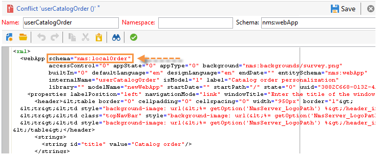

# 升级到新内部版本（内部部署）{#upgrading}


在开始升级过程之前，请确定并确认要升级到哪个Adobe Campaign版本，并参阅 [发行说明](../../rn/using/latest-release.md) .

>[!IMPORTANT]
>
>* Adobe强烈建议在更新之前对每个实例进行数据库备份。 有关更多信息，请参见[此章节](../../production/using/backup.md)。
>* 要执行升级，请确保您有权访问实例和日志。
>* 读取 [本节](../../installation/using/general-architecture.md) 和 [内部版本升级](https://helpx.adobe.com/cn/campaign/kb/acc-build-upgrade.html) 章节开始之前。
>

## Windows {#in-windows}

在Windows环境中，执行以下步骤以将Adobe Campaign更新到新内部版本：

* [关闭服务](#shut-down-services)，
* [升级应用程序服务器](#upgrade-the-adobe-campaign-server-application)，
* [同步资源](#synchronize-resources)，
* [重新启动服务](#restart-services).

要了解如何更新客户端控制台，请参阅 [本节](../../installation/using/client-console-availability-for-windows.md).

### 关闭服务 {#shut-down-services}

要使用新版本替换所有文件，您需要关闭nlserver服务的所有实例。

1. 关闭以下服务：

   * Web服务(IIS)：

     **iisreset /stop**

   * Adobe Campaign服务： **网络停止nlserver6**

   >[!IMPORTANT]
   >
   >您还需要确保重定向服务器(webmdl)已停止，以便 **nlsrvmod.dll** IIS使用的文件可以使用新版本替换。

1. 通过运行 **nlserver pdump** 命令。 应出现以下内容：

   ```
   C:<installation path>Adobe Campaign v7bin>nlserver pdump
   HH:MM:SS > Application Server for Adobe Campaign Classic (7.X YY.R build XXX@SHA1) of DD/MM/YYYY
   No tasks
   ```

   您可以使用Windows任务管理器确保所有进程都已停止。

### 升级Adobe Campaign服务器应用程序 {#upgrade-the-adobe-campaign-server-application}

要运行升级文件，请应用以下步骤：

1. 运行 **setup.exe**.

   要下载此文件，请连接到 [软件分发门户](https://experience.adobe.com/#/downloads/content/software-distribution/cn/campaign.html) 使用您的用户凭据。 在中了解有关软件分发的更多信息 [此页面](https://experienceleague.adobe.com/docs/experience-cloud/software-distribution/home.html?lang=zh-Hans).

1. 选择安装模式：选择 **[!UICONTROL Update or repair]**
1. 单击 **[!UICONTROL Next]** .
1. 单击 **[!UICONTROL Finish]** .

   然后，安装程序将复制新文件。

1. 操作完成后，单击 **[!UICONTROL Finish]** .

### 同步资源 {#synchronize-resources}

使用以下命令行：

**nlserver配置 — postupgrade -allinstances**

这样，您就可以执行以下操作：

* 同步资源
* 更新架构
* 更新数据库

>[!NOTE]
>
>此操作只应执行一次，并且仅在(**nlserver web**)应用程序服务器。

然后检查同步是否生成了错误或警告。 有关详细信息，请参见 [解决升级冲突](#resolving-upgrade-conflicts).

### 重新启动服务 {#restart-services}

要重新启动的服务包括：

* Web服务(IIS)：

  **iisreset /start**

* Adobe Campaign服务： **网络启动nlserver6**

## Linux {#in-linux}

在Linux环境中，执行以下步骤以将Adobe Campaign更新到新内部版本：

* [下载更新的包](#obtain-updated-packages)，
* [执行更新](#perform-an-update)，
* [重新启动Web服务器](#reboot-the-web-server).

[了解有关客户端控制台可用性的更多信息](../../installation/using/client-console-availability-for-windows.md).

>[!NOTE]
>
>从Build 8757开始，不再需要第三方库。

### 获取更新的包 {#obtain-updated-packages}

首先恢复Adobe Campaign的两个更新包：连接到 [软件分发门户](https://experience.adobe.com/#/downloads/content/software-distribution/cn/campaign.html) 使用您的用户凭据。 在中了解有关软件分发的更多信息 [此页面](https://experienceleague.adobe.com/docs/experience-cloud/software-distribution/home.html?lang=zh-Hans).

文件为 **nlserver6-v7-XXX.rpm**

### 执行更新 {#perform-an-update}

* 基于RPM的分发(RedHat、SuSe)

  要安装它们，请以root身份执行：

  ```
  $rpm -Uvh nlserver6-v7-XXXX.rpm
  ```

  其中XXX是文件的版本。

  rpm文件依赖于可在CentOS/Red Hat分发中找到的软件包。 如果不想使用某些依赖关系，则可能需要使用rpm的“nodeps”选项：

  ```
  rpm --nodeps -Uvh nlserver6-v7-XXXX-0.x86_64.rpm
  ```

* 基于DEB的分发(Debian)

  要安装它们，请以root身份执行：

  ```
  dpkg -i nlserver6-v7-XXXX-amd64_debX.deb
  ```

>[!NOTE]
>
>有关完整安装过程的详情，请参见 [本节](../../installation/using/installing-campaign-standard-packages.md). 资源会自动同步，但您需要确保没有发生错误。 有关详细信息，请参见 [解决升级冲突](#resolving-upgrade-conflicts).

### 重新启动Web服务器 {#reboot-the-web-server}

您必须关闭Apache才能使新库适用。

为此，请执行以下命令：

```
/etc/init.d/apache stop
```

>[!IMPORTANT]
>
>* 您的脚本可能会被调用 **httpd** 而不是 **apache**.
>* 必须执行此命令，直到获得以下回复为止：
>
>   Apache需要此操作才能应用新库。

然后重新启动Apache：

```
/etc/init.d/apache start
```

## 解决升级冲突 {#resolving-upgrade-conflicts}

在资源同步过程中， **升级后** 命令可以检测同步是否生成了错误或警告。

### 查看同步结果 {#view-the-synchronization-result}

查看同步结果的方法有两种：

* 在命令行界面中，错误以三个V形符号具体化 **>>>** 并且同步会自动停止。 警告以双V形标记具体化 **>>** 同步完成后必须解析和。 升级后结束时，命令提示符中会显示摘要。 它看上去可能如下所示：

  ```
  2013-04-09 07:48:39.749Z 00002E7A 1 info log =========Summary of the update==========
  2013-04-09 07:48:39.749Z 00002E7A 1 info log <instance name> instance, 6 warning(s) and 0 error(s) during the update.
  2013-04-09 07:48:39.749Z 00002E7A 1 warning log The document with identifier 'mobileAppDeliveryFeedback' and type 'xtk:report' is in conflict with the new version.
  2013-04-09 07:48:39.749Z 00002E7A 1 warning log The document with identifier 'opensByUserAgent' and type 'xtk:report' is in conflict with the new version.
  2013-04-09 07:48:39.750Z 00002E7A 1 warning log The document with identifier 'deliveryValidation' and type 'nms:webApp' is in conflict with the new version.
  2013-04-09 07:48:39.750Z 00002E7A 1 warning log Document of identifier 'nms:includeView' and type 'xtk:srcSchema' updated in the database and found in the file system. You will have to merge the two versions manually.
  ```

  如果警告与资源冲突有关，则需要用户注意才能解决该问题。

* 此 **升级后_`<server version number>_<time of postupgrade>`.log** 日志文件包含同步结果。 默认情况下，它位于以下目录中： **`<installation directory>/var/<instance/postupgrade`**. 错误和警告属性表示错误和警告。

### 解决冲突 {#resolving-conflicts}

要解决冲突，请应用以下流程：

1. 在Adobe Campaign树中，转到 **[!UICONTROL Administration > Configuration > Package management > Edit conflicts]** .
1. 在列表中选择要解决的冲突。

解决冲突的方法有三种：

* **[!UICONTROL Declare as resolved]** ：需要用户提前干预。
* **[!UICONTROL Accept the new version]** ：如果用户未更改随Adobe Campaign提供的资源，则建议这样做。
* **[!UICONTROL Keep the current version]** ：表示更新被拒绝。

  >[!IMPORTANT]
  >
  >如果选择此解决模式，您可能无法受益于新版本中的更正。

如果您选择手动解决冲突，请按以下步骤操作：

1. 在窗口的下部，搜索 **_冲突_** 用于查找存在冲突的实体的字符串。 使用新版本安装的实体包含 **新建** 参数，与先前版本匹配的实体包含 **cus** 参数。

   

1. 删除您不想保留的版本。 删除 **_conflict_argument_** 要保留的实体的字符串。

   

1. 转到您已解决的冲突。 单击 **[!UICONTROL Actions]** 图标并选择 **[!UICONTROL Declare as resolved]** .
1. 保存更改：冲突现已解决。

### 最佳实践 {#best-practices}

更新失败可能会链接到数据库配置。 确保技术管理员和数据库管理员执行的配置兼容。

例如，Unicode数据库不仅必须授权存储LATIN1数据等，

## 警告客户端控制台有可用的更新 {#warn-the-client-consoles-of-the-available-update}

### Windows {#in-windows-1}

在安装Adobe Campaign应用程序服务器的计算机上(**nlserver web**)，下载并复制文件  **setup-client-6.XXXX.exe** i n **[应用程序的路径]/datakit/nl/eng/jsp**.

下次连接客户端控制台时，将显示一个窗口，通知用户是否有更新，并允许用户下载和安装更新。

>[!NOTE]
>
>确保IIS_XPG用户对此安装文件具有适当的读取权限，并参阅 [安装指南](../../installation/using/general-architecture.md) 以了解更多信息。

### Linux {#in-linux-1}

在Adobe Campaign应用程序服务器(**nlserver web**)已安装，请检索  **setup-client-6.XXXX.exe** 打包并复制，另存为 **/usr/local/neolane/nl6/datakit/nl/eng/jsp**：

```
 cp setup-client-6.XXXX.exe /usr/local/neolane/nl6/datakit/nl/eng/jsp
```

下次连接客户端控制台时，将显示一个窗口，通知用户是否有更新，并允许用户下载和安装更新。

>[!NOTE]
>
>确保Apache用户对此安装文件具有适当的读取权限，并参阅 [安装指南](../../installation/using/general-architecture.md) 以了解更多信息。
