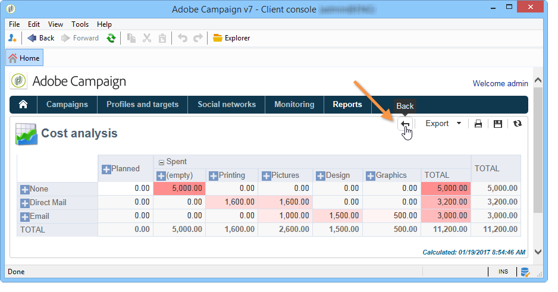

# 关于 Campaign 内置报告{#about-campaign-built-in-reports}

本章提供Adobe Campaign内置报表的列表、其内容和上下文。 利用以下信息，可避免创建平台中已有的报表。

>[!NOTE]
>
>您还可以了解如何将自己的报表添加到 **[!UICONTROL Reports]** 选项卡。 有关更多信息，请参阅 [页面](../../reporting/using/configuring-access-to-the-report.md#defining-the-filtering-options).

这些报告及其内容在与其所涉功能有关的文档中作了详细介绍。

Adobe Campaign提供多种类型的报表，可通过客户控制台或internet浏览器访问。

提供了以下类型的报表：

* 有关整个平台的报表，请参阅 [全局报告](../../reporting/using/global-reports.md).
* 投放报告，请参阅 [投放报告](../../reporting/using/delivery-reports.md).
* 累积报表，请参阅 [累积报告](../../reporting/using/cumulative-reports.md).

您可以从客户端控制台主页、报表仪表板或投放列表访问报表。 报表的显示模式取决于其上下文。 主页上提供了主要报表列表，可让您快速访问投放数据。 您可以根据需要更改此列表。 请参阅 [此部分](../../reporting/using/about-reports-creation-in-campaign.md) 以了解更多信息。

要访问Campaign内置报告，请执行以下操作：

1. 选择 **[!UICONTROL Reports]** 选项卡。

   

1. 使用搜索字段过滤显示的报表。

1. 然后，单击要显示的报表。

   

1. 单击 **[!UICONTROL Back]** 屏幕顶部的链接会将您返回到报表列表。

   

有关正在编辑的报表的其他可能操作详情，请参阅 [本页](../../reporting/using/actions-on-reports.md).

特定于营销活动或投放的报表可通过其各自的功能板访问。

列表、服务、选件等的原则是相同的。 如下所示：

