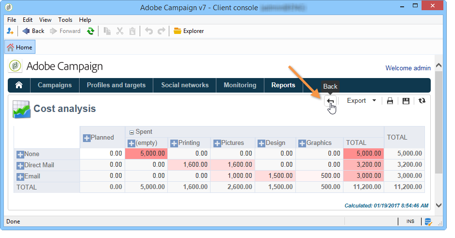

# 关于Campaign内置报告{#about-campaign-built-in-reports}

本章列出了Adobe Campaign内置的报告、其内容和上下文。 下面的信息使您能够避免创建平台中已提供的报告。

>[!NOTE]
>
>您还可以了解如何将自己的报告添加到&#x200B;**[!UICONTROL Reports]**&#x200B;选项卡。 有关详细信息，请参阅此[页面](../../reporting/using/configuring-access-to-the-report.md#defining-the-filtering-options)。

这些报告及其内容在与其所关注的功能相关的文档中详细介绍。

Adobe Campaign提供了多种类型的报表，可通过客户控制台或Internet浏览器访问。

可以使用以下类型的报表：

* 有关整个平台的报告，请参阅[全局报告](../../reporting/using/global-reports.md)。
* 传递报告，请参阅[传递报告](../../reporting/using/delivery-reports.md)。
* 累积报告，请参阅[累积报告](../../reporting/using/cumulative-reports.md)。

您可以从客户端控制台主页、报告仪表板或投放列表访问报告。 报告的显示模式取决于其上下文。 主报告的列表可在主页上找到，并允许您快速访问投放数据。 此列表可以根据您的需求进行更改。 有关详细信息，请参阅[此部分](../../reporting/using/about-reports-creation-in-campaign.md)。

要访问Campaign内置报告，请执行以下操作：

1. 选择Adobe Campaign界面的&#x200B;**[!UICONTROL Reports]**&#x200B;选项卡。

   

1. 使用搜索字段筛选显示的报表。

1. 然后，单击要显示的报表。

   

1. 单击屏幕顶部的&#x200B;**[!UICONTROL Back]**&#x200B;链接可返回到报告列表。

   

有关对正在编辑的报告的其他可能操作，请参见[此页面](../../reporting/using/actions-on-reports.md)。

特定于活动或投放的报告可通过其各自的仪表板访问。

列表、服务、选件等的原理相同，如下所示：

