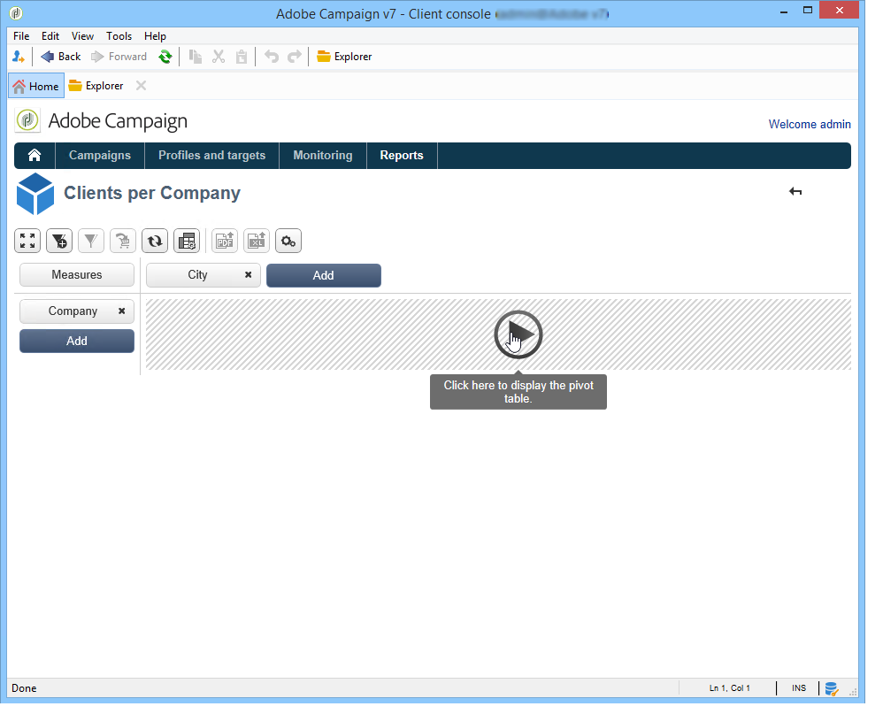

# 多维数据集入门{#about-cubes}

## 术语 {#terminology}

使用多维数据集时的具体术语如下所列。

* **多维数据集**  — 多维数据集是多维信息的表示形式：它向最终用户提供为交互式数据分析而设计的结构。

* **事实表/模式**  — 事实表（或事实模式）包含分析所依据的原始数据或基本数据。 这些表格主要是大型卷表（可能带有链接表），其计算时间可能会很长。 例如，事实表可以是：broadlog表、purchase表等。

* **Dimension**  — 通过Dimension可将数据分成几组：创建维后，这些维即用作分析轴。 在大多数情况下，将为给定维度定义多个级别。 例如，对于临时维度，级别将为月、日、小时、分钟等。 这组级别表示维层次并支持各种级别的数据分析。

* **量化**  — 对于某些字段，您可以定义对值进行分组，使其更易于阅读信息。 量化应用于级别。 我们建议您在可能存在许多不同值时定义量化。

* **衡量**  — 最常用的指标是总和、平均值、最大值、最小值、标准差等。 可以计算度量：例如，优惠的接受率是提供优惠的次数与接受优惠的次数之比。

## 多维数据集工作区 {#cube-workspace}

多维数据集存储在 **[!UICONTROL Administration > Configuration > Cubes]** 节点。

多维数据集的主要使用上下文如下：

* 可以在报告中直接执行数据导出，该报告的设计方式为 **[!UICONTROL Reports]** Adobe Campaign选项卡。

   要实现此目的，请创建新报告并选择要使用的多维数据集。

   

   多维数据集看起来像模板，它们基于创建报告的方式创建。 选择模板后，单击 **[!UICONTROL Create]** 以配置和查看匹配报表。

   您可以调整测量、更改显示模式或配置表，然后使用主按钮显示报表。

   

* 您还可以引用多维数据集中的 **[!UICONTROL Query]** 框以使用报告中的指示器，如下所示：

   

* 还可以将基于多维数据集的透视表插入报表的任何页中。 要执行此操作，请引用要在以下位置使用的多维数据集： **[!UICONTROL Data]** 页上的数据透视表的选项卡。

   

   有关更多信息，请参阅 [在报表中浏览数据](../../reporting/using/using-cubes-to-explore-data.md#exploring-the-data-in-a-report).
