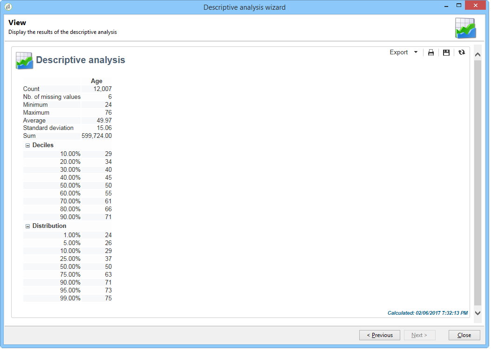

# 什么是描述性分析 {#about-descriptive-analysis}

为了生成关于数据库中数据的统计数据，请使用专用助理创建描述性分析报告，并根据您的需要调整其内容和演示。

这些报告涉及人口，应当仅用于分析小数据量。

可生成定量或定性分析报告。 定性分析允许您按以下方式表示数据：

* 表和直方图：

  

* 累加值，不含表：

  

* 按业务线细分

  

定量分析提供了关于选定数字数据的总体统计数字，如下所示：

这些报告通过描述性分析助手创建，该助手基于各种步骤，可让您选择要创建的报告类型以及数据和布局。 报表将显示在最后一步。 如有必要，可以以Excel、PDF或OpenDocument格式打印、导出报告并与其他操作员发布和共享。

描述性分析向导不如Adobe Campaign报表强大，但它们可以快速概述数据库内容或数据选择。

>[!CAUTION]
>
>描述性分析不能让您浏览大数据量。
