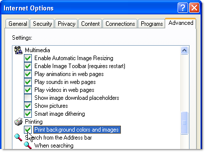

# 对报告执行操作{#actions-on-reports}


查看报告时，您可以通过工具栏执行特定数量的操作。 下文将详细介绍这些内容。


例如，您可以通过工具栏在Web浏览器中导出、打印、存档或显示报表。


## 导出报告 {#exporting-a-report}

从下拉列表中选择要将报表导出到的格式。 (.xls、.pdf或.ods)。


当报表包含多个页面时，您需要对每个页面重复此操作。

您可以配置报表，以将其导出为PDF、Excel或OpenOffice格式。 打开Adobe Campaign资源管理器并选择相关报表。

导出选项可通过 **[!UICONTROL Page]** 报告活动，在 **[!UICONTROL Advanced]** 选项卡。

更改设置 **[!UICONTROL Paper]** 和 **[!UICONTROL Margins]** 以满足您的需求。 您还可以仅授权以PDF格式导出页面。 要执行此操作，请取消选中 **[!UICONTROL Activate OpenOffice/Microsoft Excel export]** 选项。


### 导出到Microsoft Excel {#exporting-into-microsoft-excel}

对象 **[!UICONTROL List with group]** 键入要导出到Excel的报告，以下建议和限制适用：

* 这些报表不得包含任何空行。

   

* 列表的图例必须隐藏。

   

* 报表不必使用在单元格级别定义的特定格式。 优选使用 **[!UICONTROL Form rendering]** 定义表格中单元格的格式。 此 **[!UICONTROL Form rendering]** 可通过 **[!UICONTROL Administration > Configuration > Form rendering]**.
* 我们不建议插入HTML内容。
* 如果报告包含多个表、图表等， 类型元素，它们将被导出一个元素在另一个元素之下。
* 您可以在单元格中强制回车：此配置将保留在Excel中。 如需详细信息，请参阅[此部分](../../reporting/using/creating-a-table.md#defining-cell-format)。

### 延迟导出 {#postpone-the-export}

您可以推迟导出报表，例如，等待异步调用。 要执行此操作，请在页面的初始化脚本中输入以下参数：

```
document.nl_waitBeforeRender = true;
```

要激活导出并开始转换为PDF，请使用 **document.nl_renderToPdf()** 函数中没有任何参数。

### 内存分配 {#memory-allocation}

导出某些大型报告时，可能会发生内存分配错误。

在某些情况下，默认值 **maxMB** (**SKMS** （对于托管实例）。 **serverConf.xml** 配置文件设置为64 MB。 如果在导出报告时遇到内存不足错误，建议将此数字增加到512 MB：

```
<javaScript maxMB="512" stackSizeKB="8"/>
```

要应用对配置所做的更改，请 **nlserver** 需要重新启动服务。

欲了解关于 **serverConf.xml** 文件，请参阅 [本节](../../production/using/configuration-principle.md).

欲了解关于 **nlserver** 服务，请参阅 [本节](../../production/using/administration.md).

## 打印报表 {#printing-a-report}

可以打印报告：要执行此操作，请单击打印机图标：这将打开对话框。

为了获得更好的结果，请编辑浏览器打印选项并选择 **[!UICONTROL Print background colors and images]**.



## 创建报告存档 {#creating-report-archives}

通过存档报告，您可以创建不同时段的报告视图，例如，显示给定时段的统计信息。

要创建存档，请打开相关报告，然后单击相应的图标。


要显示或隐藏现有存档，请单击显示/隐藏图标。


存档日期显示在显示/隐藏图标下。 单击存档以查看它。


可以删除报告存档。 为此，请转到存储报告的Adobe Campaign节点。 单击 **[!UICONTROL Archives]** 选项卡，选择要删除的选项卡，然后单击 **[!UICONTROL Delete]**.


