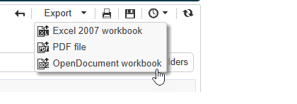

# 对报告执行操作{#actions-on-reports}

当您查看报表时，工具栏允许您执行某些操作。 详情如下。


工具栏允许您导出、打印、存档或在Web浏览器中显示报表。


## 导出报告 {#exporting-a-report}

从下拉列表中选择要将报表导出到的格式。 （.xls、.pdf或。ods）。



当报表包含多个页面时，您需要对每个页面重复此操作。

您可以在以PDF、Excel或OpenOffice格式导出报表的视图下配置报表。 打开Adobe Campaign浏览器并选择相关报告。

导出选项通过报 **[!UICONTROL Page]** 表的活动在选项卡中 **[!UICONTROL Advanced]** 访问。

更改和的设 **[!UICONTROL Paper]** 置 **[!UICONTROL Margins]** 以满足您的需求。 您还可以仅授权以PDF格式导出页面。 要执行此操作，请取消选中 **[!UICONTROL Activate OpenOffice/Microsoft Excel export]** 选项。


### 导出到Microsoft Excel {#exporting-into-microsoft-excel}

对于 **[!UICONTROL List with group]** 要导出到Excel的类型报表，适用以下建议和限制：

* 这些报告不得包含任何空行。

   

* 列表的传说必须隐藏。

   

* 报告不必使用在单元格级别定义的特定格式。 最好使用表 **[!UICONTROL Form rendering]** 中单元格的格式。 可 **[!UICONTROL Form rendering]** 以通过访问 **[!UICONTROL Administration > Configuration > Form rendering]**。
* 我们不建议插入HTML内容。
* 如果报表包含多个表、图表等。 类型元素，它们将在另一个下导出。
* 可以强制单元格中的回车符：此配置将保留在Excel中。 有关此的详细信息，请参阅此定 [义单元格格式](../../reporting/using/creating-a-table.md#defining-cell-format)。

### 推迟出口 {#postpone-the-export}

您可以推迟导出报告，例如等待异步调用。 为此，请在页面的初始化脚本中输入以下参数：

```
document.nl_waitBeforeRender = true;
```

要激活转换为PDF的导出和开始，请使 **用不带任何参数的** 文档.nl_renderToPdf()函数。

### 内存分配 {#memory-allocation}

导出某些大型报告时，可能会发生内存分配错误。

在某些情况下， serverConf.xml **配置文件** 中指示的JavaScript的&#x200B;**默认值** maxMB(托管实例的SKMS **)将** 设置为64 MB。 如果在导出报告时遇到内存不足的错误，建议将此数字增加到512 MB:

```
<javaScript maxMB="512" stackSizeKB="8"/>
```

要对配置应用所做的更改， **需要重** 新启动nlserver服务。

要进一步了解 **serverConf.xml文件** ，请参 [阅本节](../../production/using/configuration-principle.md)。

要进一步了解nlserver **服务** ，请参 [阅本节](../../production/using/administration.md)。

## 打印报告 {#printing-a-report}

您可以打印报表：要执行此操作，请单击打印机图标：这将打开对话框。

为获得更好的效果，请编辑Internet Explorer打印选项并选择 **[!UICONTROL Print background colors and images]**。


## 创建报告存档 {#creating-report-archives}

通过存档报表，您可以创建报表在不同时段的视图，例如显示给定时段的统计信息。

要创建存档，请打开相关报告并单击相应的图标。


要显示或隐藏现有存档，请单击显示／隐藏图标。


存档日期显示在显示／隐藏图标下。 单击存档以视图它。


可以删除报表存档。 为此，请转到存储报告的Adobe Campaign节点。 单击选 **[!UICONTROL Archives]** 项卡，选择要删除的选项卡，然后单击 **[!UICONTROL Delete]**。


