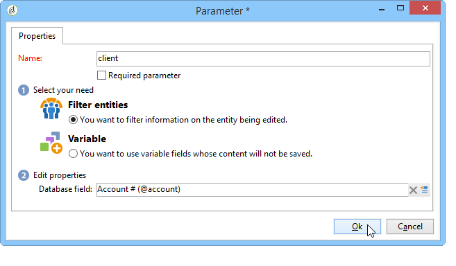

# 高级功能{#advanced-functionalities}


作为技术用户，除了[常规属性](../../reporting/using/properties-of-the-report.md)之外，您还可以利用高级功能来配置您的报表，例如：

* 创建复杂查询以处理&#x200B;**Script**&#x200B;活动中的数据。 [了解详情](#script-activity)

* 添加要在服务器或客户端上执行的外部脚本。 [了解详情](#external-script)

* 通过&#x200B;**Jump**&#x200B;活动调用报表。 [了解详情](#calling-up-another-report)

* 向报表中添加URL参数以使其更易访问。 [了解详情](#calling-up-another-report)

* 添加要在报表上下文中使用的变量。 [了解详情](#adding-variables)

## 使用脚本 {#adding-a-script}

### 引用外部脚本 {#external-script}

您可以引用将在调用报表页面时在客户端和/或服务器端执行的JavaScript代码。

操作步骤：

1. 编辑[报表属性](../../reporting/using/properties-of-the-report.md)并单击&#x200B;**[!UICONTROL Scripts]**。
1. 单击&#x200B;**[!UICONTROL Add]**&#x200B;并选择要引用的脚本。
1. 然后选择执行模式。

   如果添加多个脚本，请使用工具栏的箭头定义其执行顺序。

   

要在客户端正常执行，引用的脚本必须使用JavaScript编写，并且需要与常用浏览器兼容。 如需详细信息，请参阅[此部分](../../web/using/web-forms-answers.md)。

### 添加脚本活动 {#script-activity}

在[设计报表](../../reporting/using/creating-a-new-report.md#modelizing-the-chart)时，请使用&#x200B;**[!UICONTROL Script]**&#x200B;活动来处理数据并轻松创建不启用SQL语言的复杂查询。 您可以在脚本窗口中直接输入查询。

使用&#x200B;**[!UICONTROL Texts]**&#x200B;选项卡可定义文本字符串。 然后，可以将它们与以下语法一起使用：**$（标识符）**。 有关使用文本的更多信息，请参阅[添加页眉和页脚](../../reporting/using/element-layout.md#adding-a-header-and-a-footer)。

>[!CAUTION]
>
>我们不建议使用JavaScript代码创建聚合。

要创建报表的历史记录，请将以下行添加到JavaScript查询中，以保存已存档的数据：

```
if( ctx.@_historyId.toString().length == 0 )
```

否则，将仅显示当前数据。

## 添加URL参数 {#defining-additional-settings}

通过[报表属性](../../reporting/using/properties-of-the-report.md)的&#x200B;**[!UICONTROL Parameters]**&#x200B;选项卡，您可以为报表定义其他设置：这些设置将在调用期间传递到URL。

>[!CAUTION]
>
>出于安全考虑，必须非常谨慎地使用这些参数。

要创建新设置，请执行以下操作：

1. 单击&#x200B;**[!UICONTROL Add]**&#x200B;按钮并输入设置的名称。

   

1. 如有必要，请指定是否强制设置。

1. 选择要创建的设置类型：**[!UICONTROL Filter]**&#x200B;或&#x200B;**[!UICONTROL Variable]**。

   **[!UICONTROL Filter entities]**&#x200B;选项允许您将数据库的字段用作参数。

   

   数据将直接在实体级别恢复：**ctx/recipient/@account**。

   利用&#x200B;**[!UICONTROL Variable]**&#x200B;选项，可创建或选择一个变量，该变量将作为URL的参数传递，并可在过滤器中使用。

**[!UICONTROL Response HTTP headers]**&#x200B;允许在使用iframe将报表页面包含在HTML页面中时阻止点击劫持。 要避免点击劫持，您可以选择&#x200B;**[!UICONTROL X-Frame-options header]**&#x200B;行为：

* **[!UICONTROL None]**:报告将没有 **[!UICONTROL X-Frame-options header]**。
* **[!UICONTROL Same as origin]**:默认情况下，为新报表和重新发布的报表设置。主机名与报表的URL相同。
* **[!UICONTROL Deny]**:使用iFrame的HTML页面中不能包含报表。


## 添加变量 {#adding-variables}

**[!UICONTROL Variables]**&#x200B;选项卡包含报表中配置的变量列表。 这些变量在报表上下文中显示，并可用于计算。

单击&#x200B;**[!UICONTROL Add]**&#x200B;按钮以创建新变量。

要查看变量的定义，请选择它并单击&#x200B;**[!UICONTROL Detail...]**&#x200B;按钮。


## 用例：在报表中使用变量和参数

在以下视频示例中，您将了解如何添加“_type”参数，以根据此属性的值创建报表的不同视图。

 [在视频中发现此功能](https://helpx.adobe.com/campaign/classic/how-to/add-url-parameter-in-acv6.html?playlist=/ccx/v1/collection/product/campaign/classic/segment/business-practitioners/explevel/intermediate/applaunch/how-to-4/collection.ccx.js&amp;ref=helpx.adobe.com)


## 调用另一个报表 {#calling-up-another-report}

**Jump**&#x200B;活动类似于无箭头的过渡：它允许您从一个活动转到另一个活动或访问其他报表。
