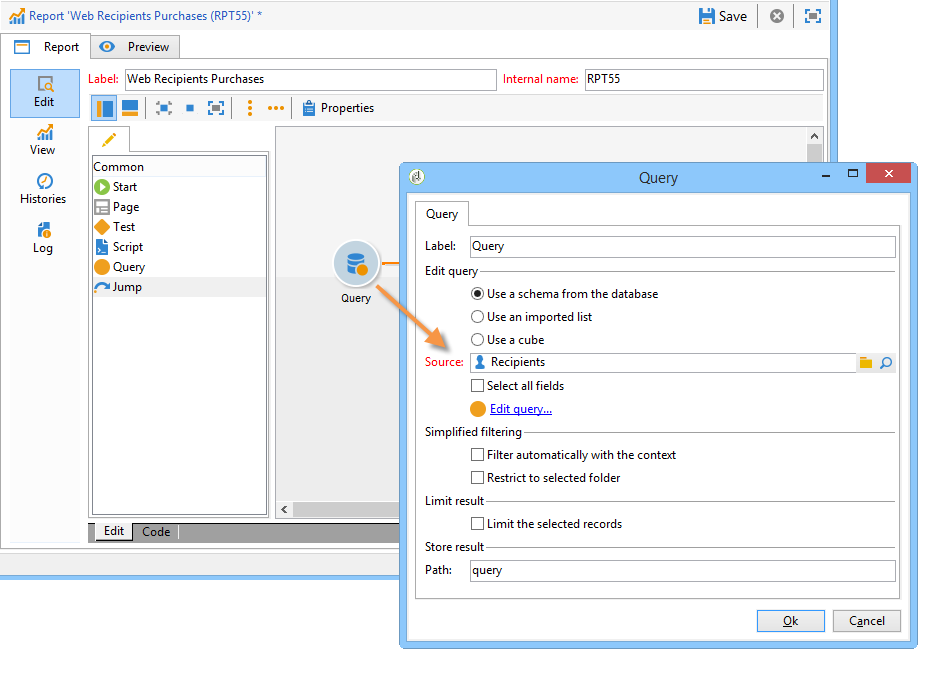
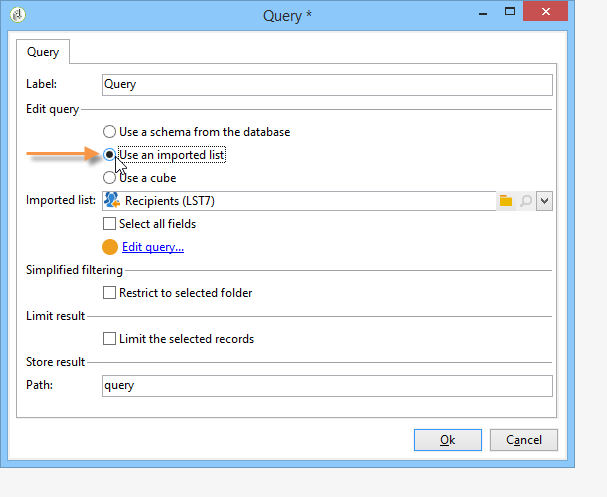

# 收集数据进行分析{#collecting-data-to-analyze}

要用于构建报表的数据可直接在报表页面中选择(有关更多信息，请参阅 [使用上下文](../../reporting/using/using-the-context.md))或通过一个或多个查询收集。

此活动提供了三种不同的方法：

1. 使用数据库中的数据构建查询。
1. 处理列表中包含的数据。
1. 使用现有多维数据集中包含的数据。

方法的选择取决于计算类型、数据量及其耐久性等。 必须仔细检查所有这些参数，以避免Adobe Campaign数据库过载，并优化所创建报告的生成和操作。 有关详细信息，请参见[此页面](../../reporting/using/best-practices.md#optimizing-report-creation)。

在所有情况下，都会通过 **[!UICONTROL Query]** 键入活动。

当需要使用数据库中的数据收集或构建报告中的数据时，此数据选择模式是相关的。 在某些情况下，您还可以直接从报表中使用的元素中选择数据。 例如，在插入图表时，您可以直接选择源数据。 有关更多信息，请参阅 [使用上下文](../../reporting/using/using-the-context.md).

## 使用架构中的数据 {#using-the-data-from-a-schema}

要使用链接到数据库模式的数据，请在查询编辑器中选择相应的选项，然后配置要应用的查询。

通过以下示例，您可以在数据库中的用户档案中收集每个国家/地区的收件人数量。 然后，它们可以以表格形式显示在报表中。

## 使用导入的列表 {#using-an-imported-list}

要创建报表，您可以使用导入数据列表中的数据。

为此，请选择 **[!UICONTROL Use an imported list]** ，然后选择相关列表。

单击 **[!UICONTROL Edit query...]** 链接以定义要在此列表中用于构建报表的元素之间收集的数据。

## 使用多维数据集 {#using-a-cube}

可以选择用于定义查询的多维数据集。

多维数据集可扩展数据库的探索和分析能力，同时为最终用户更轻松地配置报告和表：只需选择一个已完全配置的现有多维数据集并使用其计算、度量和统计信息即可。 有关创建多维数据集的更多信息，请参阅 [此部分](../../reporting/using/about-cubes.md).

单击 **[!UICONTROL Edit query...]** 链接，然后选择要在报表中显示或使用的指标。

## 查询中的筛选选项 {#filtering-options-in-the-queries}

为了避免对整个数据库运行查询，需要过滤数据。

### 简化的过滤器 {#simplified-filter}

您可以选择 **[!UICONTROL Filter automatically with the context]** 选项，以使报表可通过树中的特定节点（如列表、收件人或投放）访问。

的 **[!UICONTROL Filter with the folder]** 选项允许您指定文件夹并仅考虑其内容。 这允许您过滤报表数据，以仅显示树中某个文件夹的数据，如下所示：

### 限制收集的数据量 {#limiting-the-amount-of-data-collected}

使用结果限制选项配置要通过查询提取的记录数：

* **[!UICONTROL Limit to first record]** 提取一个结果，
* **[!UICONTROL Size]** 来提取一组记录。
