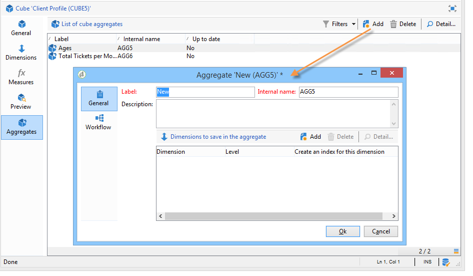
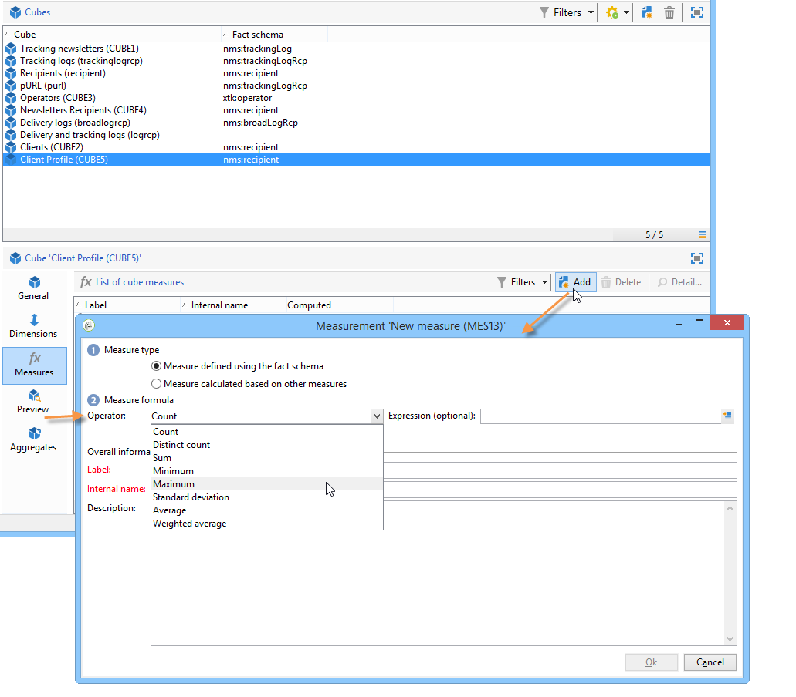

# 立方体的最佳实践{#concepts-and-methodology}

## 数据绑定 {#data-binning}

绑定使您能够根据条件对值进行分组以简化数据显示。 根据您可用的信息，您可以定义年龄组、将电子邮件域分组到一起、限制为值枚举、显式限制显示数据并将所有其他数据分组到专用行或列中等。

总的来说，有三种类型的绑定可用：

1. 使用手动定义的值范围。 例如，年龄、平均购物车、已开发的交货数等。) 有关详细信息，请参阅定 [义每个素材箱](#defining-each-bin)。
1. 根据枚举的值动态地：只显示枚举中包含的值，所有其他值都分组在“其他”中。 有关详细信息，请参阅动态 [管理素材箱](#dynamically-managing-bins)。
1. 使用值范围，所有其他组合在一起。 例如，18到25岁，26到59岁，以及其他人。 有关详细信息，请参阅创 [建值范围](#creating-value-ranges)。

要启用绑定，请在创建维时选中相应的框。

您可以手动创建素材箱，也可以将它们链接到现有枚举。

Adobe Campaign还为自动绑定提供助手：值可分为N个组，或根据数据库中最频繁的值进行分组。

### 定义每个素材箱 {#defining-each-bin}

要单独创建每个素材箱，请选 **[!UICONTROL Define each bin]** 择选项，然后使用表格创建各种素材箱。

单击 **[!UICONTROL Add]** 按钮可创建新素材箱，并列出将分组到素材箱中的值。

在以下示例中，语言分为三个类别：英语／德语／荷兰语、法语／意大利语／西班牙语和其他语种。

您可以使用SQL掩码将多个值合并到筛选器中。 为此，请检 **[!UICONTROL Yes]** 查列， **[!UICONTROL Use an SQL mask]** 然后输入要在列中应用的SQL过滤 **[!UICONTROL Value or expression]** 器。

在以下示例中，所有以 **yahoo** （yahoo.fr、yahoo.com、yahoo.be等）或 **ymail** （ymail.com、ymail.eu等）开头的电子邮件域将分组到 **YAHOO！标签下**，以及rocketmail.com域 **的地址** 。

### 动态管理素材箱 {#dynamically-managing-bins}

值可以通过枚举进行动态管理。 这意味着只显示枚举中包含的值。 当枚举值发生更改时，立方的内容会自动调整。

要创建此类型的值绑定，请应用以下步骤：

1. 创建新维并启用绑定。
1. 选择选 **[!UICONTROL Dynamically link the values to an enumeration]** 项，然后选择匹配的枚举。

   

   只要更新枚举值，匹配素材箱就会自动调整。

### 创建值范围 {#creating-value-ranges}

您可以根据所需的间隔将值分组到多个范围内。

要手动定义范围，请单击按 **[!UICONTROL Add]** 钮并选择 **[!UICONTROL Define a range]** :

然后指定下限和上限，并单 **[!UICONTROL Ok]** 击以确认。

### 自动生成素材箱 {#generating-bins-automatically}

还可以自动生成素材箱。 要执行此操作，请单击链 **[!UICONTROL Generate bins...]** 接。

您可以：

* 恢复最常用的值

   在以下示例中，将显示4个最常使用的值，而其他值将被计数并分组在“其他”类别中。

* 以槽形式生成素材箱

   在以下示例中，Adobe Campaign自动创建4个大小相同的值槽，以在数据库中显示值。

在这种情况下，将忽略事实架构中选定的筛选器。

### 枚举 {#enumerations}

为了提高报表的相关性和可读性，Adobe Campaign允许您创建特定枚举，以将不同的值重新组合到同一素材箱中。 这些为绑定而保留的枚举在多维数据集中引用，然后显示在报告中。

Adobe Campaign还在域上提供了一个枚举，通过该枚举，您可以显示数据库中所有联系人的电子邮件域的列表，该列表按ISP重新分组，如下例所示：

它使用以下模板构建：

要使用此枚举创建报表，请使用维创建立方 **[!UICONTROL Email domain]** 体。 然后，选 **[!UICONTROL Enable binning]** 择选项 **[!UICONTROL Dynamically link the values to an enumeration]**。 然后，选择 **Domains** 枚举，如上所示。 没有指定别名的所有值将重新分组在“其 **他** ”标签下。

然后，创建基于此立方的报表以显示值。

您只需修改枚举即可更新相关报告。 例如，创建 **Adobe** 值并添加 **** adobe.com别名，报表将在枚举级别自动更新为Adobe值。

枚 **[!UICONTROL Domains]** 举用于生成显示域列表的内置报告。 要调整这些报告的内容，您可以编辑此列表。

您可以创建保留用于绑定的其他枚举，并将其用于其他多维数据集：所有别名值将在第一个枚举选项卡中指定的素材箱中重新分组。

## 计算和使用聚合 {#calculating-and-using-aggregates}

可以在聚合中计算最大的数据卷。

在处理大量数据时，聚合很有用。 它们会根据专用工作流框中定义的设置自动更新，以将最近收集的数据集成到指示器中

聚合在每个立方的相关选项卡中进行定义。

>[!NOTE]
>
>更新聚合计算的工作流可以在聚合本身中配置，或者可以通过链接到相关立方的外部工作流更新聚合。

要创建新聚合，请应用以下步骤：

1. 单击 **[!UICONTROL Aggregates]** 立方的选项卡，然后单击按 **[!UICONTROL Add]** 钮。

   

1. 为聚合输入标签，然后添加要计算的维。

   

1. 选择维和级别。 对每个维和每个级别重复此过程。
1. 单击选 **[!UICONTROL Workflow]** 项卡以创建聚合工作流。

   

   * 该活 **[!UICONTROL Scheduler]** 动允许您定义计算更新的频率。 本节详细介绍了 [调度程序](../../workflow/using/scheduler.md)。
   * 通过 **[!UICONTROL Aggregate update]** 该活动，您可以选择要应用的更新模式：完整或部分。

      默认情况下，在每次计算期间都会执行完全更新。 要启用部分更新，请选择相关选项并定义更新条件。

      

## 定义度量 {#defining-measures}

度量类型在立方的选 **[!UICONTROL Measures]** 项卡中定义。 您可以计算和、平均值、偏差等。

您可以创建所需数量的度量：然后，选择要在表格中显示或隐藏的度量。 For more on this, refer to [Displaying measures](#displaying-measures).

要定义新度量，请应用以下步骤：

1. 单击 **[!UICONTROL Add]** 度量列表上方的按钮，然后选择度量类型和要计算的公式。

   

1. 如果需要，并根据运算符选择操作所关注的表达式。

   通过 **[!UICONTROL Advanced selection]** 该按钮可创建复杂的计算公式。 如需详细信息，请参阅[此部分](../../platform/using/about-queries-in-campaign.md)。

   

1. 该链 **[!UICONTROL Filter the measure data...]** 接允许您限制计算字段，并仅将其应用于数据库中的特定数据。

   

1. 输入度量的标签并添加说明，然后单击以 **[!UICONTROL Finish]** 创建它。

## 显示度量 {#displaying-measures}

您可以根据需要配置表中度量的显示：

* 度量的显示顺序(请参阅 [显示顺序](#display-sequence)),
* 要在报表中显示／隐藏的信息(请参阅 [配置显示](#configuring-the-display))
* 显示哪些度量：百分比、总数、小数位数等。 (请参阅 [更改显示的度量类型](#changing-the-type-of-measure-displayed))。

### 显示序列 {#display-sequence}

立方中计算的度量通过按钮进行配 **[!UICONTROL Measures]** 置。

移动线以更改显示序列。 在以下示例中，法语数据被移到列表底部：这意味着它将显示在最后一列中。

### 配置显示 {#configuring-the-display}

可针对每个测量或整个测量单独执行测量、线和列的配置。 通过特定图标可访问显示模式选择窗口。

* 单击该 **[!UICONTROL Edit the configuration of the pivot table]** 图标以访问配置窗口。

   您可以选择是否显示度量的标签以及配置其布局（行或列）。

使用颜色选项可以突出显示重要值以便轻松阅读。

### 更改显示的度量类型 {#changing-the-type-of-measure-displayed}

在每个度量中，您可以定义要应用的单位和格式。

## 共享报告 {#sharing-a-report}

配置报告后，您可以保存报告并与其他操作员共享它。

为此，请单击图 **[!UICONTROL Show the report properties]** 标并启用选 **[!UICONTROL Share this report]** 项。

指定报表所属的类别及其相关性。 有关详细信息，请参阅本页 [中的](../../reporting/using/configuring-access-to-the-report.md#report-display-context) “显示序 **列”和“**&#x200B;定义筛选选项 **** ”部分。

要确认这些更改，您需要保存报告。

## 创建滤镜 {#creating-filters}

可以创建用于查看数据某个部分的过滤器。

操作步骤：

1. 单击该 **[!UICONTROL Add a filter]** 图标。

   

1. 选择过滤器所关注的维

   

1. 选择滤镜的类型及其精度级别。

   

1. 创建过滤器后，过滤器将显示在报告上方。

   

   单击过滤器以编辑它。

   单击叉号以删除它。

   您可以根据需要组合任意数量的过滤器：它们都将显示在此区域。

   

每次修改过滤器（添加、删除、更改）时，都必须重新计算报告。

还可以根据选择创建过滤器。 为此，请选择源单元格、行和列，然后单击图 **[!UICONTROL Add a filter]** 标。

要选择行、列或单元格，请左键单击它。 要取消选择，请再次单击。

该过滤器会自动应用并添加到报告上方的过滤器区域。

