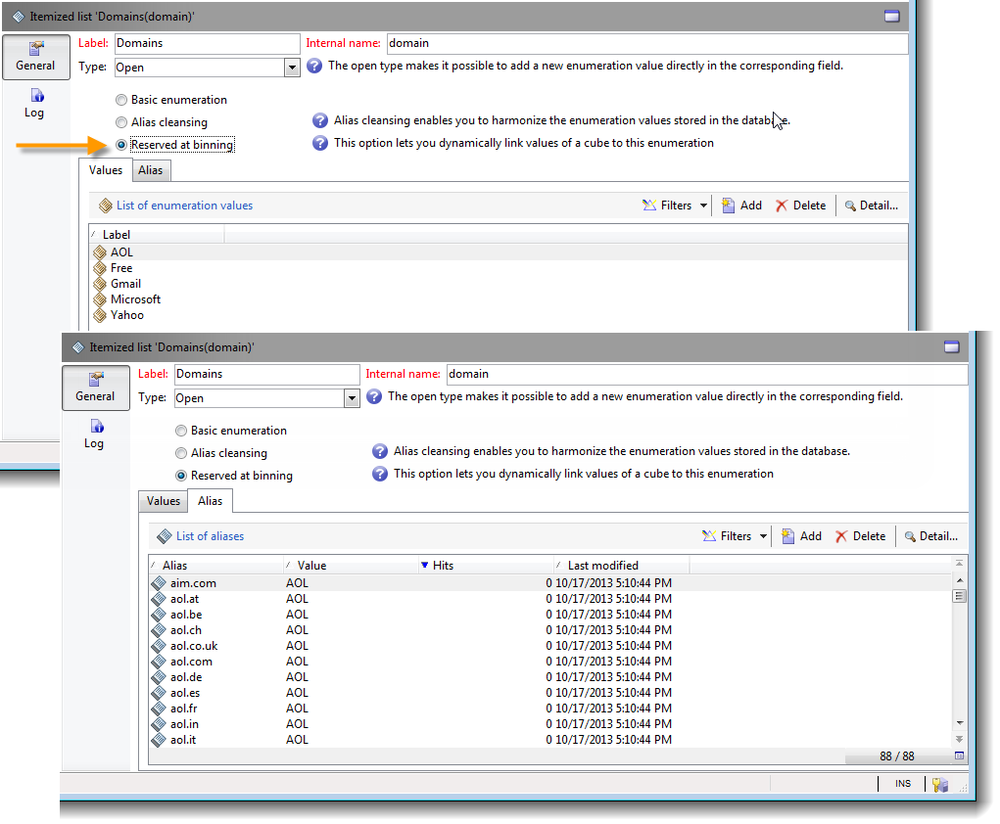

# 多维数据集的最佳实践{#concepts-and-methodology}

## 数据绑定 {#data-binning}

通过“绑定”，您可以根据条件对值进行分组，从而简化数据显示。 根据您可用的信息，您可以定义年龄组、将电子邮件域分组到一起、限制为值枚举、明确限制要显示的数据以及将所有其他数据分组到专用行或列中等。

总体而言，可使用三种类型的绑定：

1. 使用手动定义的值范围。 例如，年龄、平均购物车、已投放的次数等)。 有关更多信息，请参阅 [定义每个站](#defining-each-bin).
1. 动态地，取决于枚举的值：只显示枚举中包含的值，所有其他值将分组到“其他”中。 有关更多信息，请参阅 [动态管理箱](#dynamically-managing-bins).
1. 使用值范围，将所有其他值分组在一起。 例如，18至25岁、26至59岁的人，以及其他人。 有关更多信息，请参阅 [创建值范围](#creating-value-ranges).

要启用绑定，请在创建维度时选中相应的框。

您可以手动创建框，或将其链接到现有枚举。

Adobe Campaign还为自动绑定提供了助手：值可以划分为N组，或根据数据库中最频繁的值进行分组。

### 定义每个站 {#defining-each-bin}

要单独创建每个站，请选择 **[!UICONTROL Define each bin]** 选项，然后使用表创建各种箱。

单击 **[!UICONTROL Add]** 按钮来创建新站点，并列出将分组到站点中的值。

在以下示例中，语言分为三类：英语/德语/荷兰语、法语/意大利语/西班牙语和其他语种。

您可以使用SQL掩码将多个值合并到过滤器中。 要执行此操作，请检查 **[!UICONTROL Yes]** 在 **[!UICONTROL Use an SQL mask]** 列，并输入要在 **[!UICONTROL Value or expression]** 列。

在以下示例中，所有以 **yahoo** （yahoo.fr、yahoo.com、yahoo.be等），或 **ymail** （ymail.com、ymail.eu等） 将分组到标签下 **YAHOO!**，以及 **rocketmail.com** 域。

### 动态管理箱 {#dynamically-managing-bins}

值可以通过枚举进行动态管理。 这意味着将仅显示枚举中包含的值。 当枚举值发生更改时，立方的内容会自动进行修改。

要创建此类型的值绑定，请应用以下步骤：

1. 创建新维度并启用绑定。
1. 选择 **[!UICONTROL Dynamically link the values to an enumeration]** 选项，然后选择匹配的枚举。

   

   每当枚举值被更新时，匹配的素材箱都被自动地调整。

### 创建值范围 {#creating-value-ranges}

您可以根据所需的间隔将值分组为多个范围。

要手动定义范围，请单击 **[!UICONTROL Add]** 按钮，选择 **[!UICONTROL Define a range]** :

然后，指定下限和上限并单击 **[!UICONTROL Ok]** 确认。

### 自动生成箱 {#generating-bins-automatically}

也可以自动生成垃圾桶。 为此，请单击 **[!UICONTROL Generate bins...]** 链接。

您可以：

* 恢复最常用的值

   在以下示例中，将显示4个最常用的值，而其他值将被计入“其他”类别并分组。

* 以槽形式生成箱

   在以下示例中，Adobe Campaign自动创建4个大小相同的值槽，以在数据库中显示值。

在这种情况下，将忽略事实架构中选择的过滤器。

### 明细列表 {#enumerations}

为了提高报表的相关性和可读性，Adobe Campaign允许您创建特定的枚举以将不同的值重组到同一个框中。 这些为绑定而保留的枚举在多维数据集中引用，然后显示在报告中。

Adobe Campaign还提供了域的枚举，用于显示数据库中所有联系人的电子邮件域的列表（按ISP重组），如以下示例所示：

它使用以下模板构建：

要使用此枚举创建报告，请使用 **[!UICONTROL Email domain]** 维度。 选择 **[!UICONTROL Enable binning]** 选项，然后 **[!UICONTROL Dynamically link the values to an enumeration]**. 然后，选择 **域** 如上所示。 没有指定别名的所有值都将重组到 **其他** 标签。

接下来，创建基于此多维数据集的报告以显示值。

您只需修改枚举即可更新相关报告。 例如，创建 **Adobe** 值并添加 **adobe.com** 别名和报表将自动更新为枚举级别的Adobe值。

的 **[!UICONTROL Domains]** 枚举用于生成显示域列表的内置报告。 要调整这些报表的内容，您可以编辑此列表。

您可以创建保留用于绑定的其他枚举，并将其用于其他多维数据集：所有别名值都将重组到第一个枚举选项卡中指定的区段中。

## 计算和使用聚合 {#calculating-and-using-aggregates}

可以在聚合中计算最大的数据卷。

处理大量数据时，聚合非常有用。 系统会根据专用工作流框中定义的设置自动更新这些参数，以便将最近收集的数据集成到指标中

聚合在每个多维数据集的相关选项卡中定义。

>[!NOTE]
>
>用于更新聚合计算的工作流可以在聚合本身中进行配置，或者可以通过链接到相关多维数据集的外部工作流来更新聚合。

要创建新聚合，请应用以下步骤：

1. 单击 **[!UICONTROL Aggregates]** 选项卡，然后单击 **[!UICONTROL Add]** 按钮。

   

1. 输入聚合的标签，然后添加要计算的维度。

   

1. 选择维度和级别。 对每个维度和每个级别重复此过程。
1. 单击 **[!UICONTROL Workflow]** 选项卡，以创建聚合工作流。

   

   * 的 **[!UICONTROL Scheduler]** 活动可让您定义计算更新的频率。 有关调度程序的详细信息，请参见 [此部分](../../workflow/using/scheduler.md).
   * 的 **[!UICONTROL Aggregate update]** 活动允许您选择要应用的更新模式：完整或部分。

      默认情况下，会在每次计算期间执行完整更新。 要启用部分更新，请选择相关选项并定义更新条件。

      

## 定义度量 {#defining-measures}

度量类型在 **[!UICONTROL Measures]** 选项卡。 您可以计算和、平均值、偏差等。

您可以创建所需数量的度量：然后，选择要在表格中显示或隐藏的度量。 有关更多信息，请参阅 [显示度量](#displaying-measures).

要定义新测量，请应用以下步骤：

1. 单击 **[!UICONTROL Add]** 按钮，并选择要计算的度量类型和公式。

   

1. 如有必要，并根据运算符，选择操作所关注的表达式。

   的 **[!UICONTROL Advanced selection]** 按钮可创建复杂的计算公式。 如需详细信息，请参阅[此部分](../../platform/using/about-queries-in-campaign.md)。

   

1. 的 **[!UICONTROL Filter the measure data...]** 链接允许您限制计算字段，并仅将其应用于数据库中的特定数据。

   

1. 输入度量的标签并添加描述，然后单击 **[!UICONTROL Finish]** 来创建它。

## 显示度量 {#displaying-measures}

您可以根据需要在表格中配置度量的显示：

* 度量的显示顺序(请参阅 [显示序列](#display-sequence))、
* 要在报表中显示/隐藏的信息(请参阅 [配置显示内容](#configuring-the-display))
* 显示哪些度量：百分比、总数、小数位数等。 (请参阅 [更改显示的度量类型](#changing-the-type-of-measure-displayed))。

### 显示序列  {#display-sequence}

多维数据集中计算的度量通过 **[!UICONTROL Measures]** 按钮。

移动线条以更改显示顺序。 在以下示例中，法语数据被移动到列表底部：这表示它将显示在最后一列中。

### 配置显示内容 {#configuring-the-display}

可以单独为每个测量或整体执行测量、行和列的配置。 使用特定图标可访问显示模式选择窗口。

* 单击 **[!UICONTROL Edit the configuration of the pivot table]** 图标以访问配置窗口。

   您可以选择是否显示度量的标签，并配置其布局（行或列）。

使用颜色选项可突出显示重要值，以便轻松阅读。

### 更改显示的度量类型 {#changing-the-type-of-measure-displayed}

在每个度量内，您可以定义要应用的单位和格式。

## 共享您的报表 {#sharing-a-report}

配置报表后，您可以保存该报表并与其他运算符共享该报表。

为此，请单击 **[!UICONTROL Show the report properties]** 图标并启用 **[!UICONTROL Share this report]** 选项。

指定报表所属的类别及其相关性。 有关更多信息，请参阅 [本页](../../reporting/using/configuring-access-to-the-report.md#report-display-context) 到 **显示序列**&#x200B;和 **定义筛选选项** 中。

要确认这些更改，您需要保存报表。

## 创建过滤器 {#creating-filters}

可以创建过滤器以查看数据的某个部分。

操作步骤：

1. 单击 **[!UICONTROL Add a filter]** 图标。

   

1. 选择过滤器关注的维度

   

1. 选择滤镜的类型及其精度级别。

   

1. 创建过滤器后，该过滤器会显示在报表上方。

   

   单击过滤器以对其进行编辑。

   单击交叉点以将其删除。

   您可以根据需要组合多个过滤器：这些内容都将显示在此区域中。

   

每次修改过滤器（添加、删除、更改）时，都必须重新计算报告。

也可以根据选定的内容创建过滤器。 要执行此操作，请选择源单元格、行和列，然后单击 **[!UICONTROL Add a filter]** 图标。

要选择行、列或单元格，请左键单击该行、列或单元格。 要取消选择，请再次单击。

过滤器会自动应用并添加到报表上方的过滤器区域。

