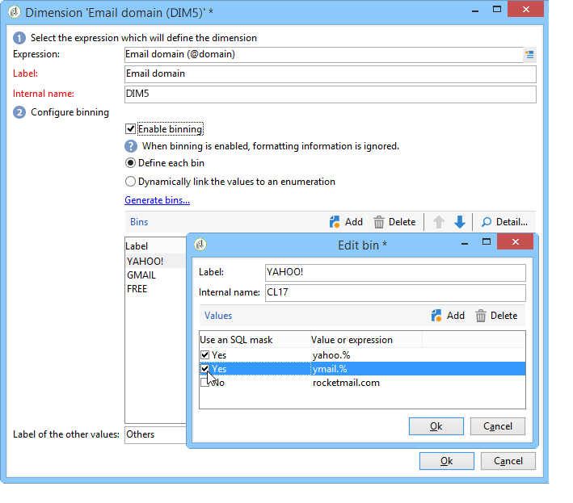

# 多维数据集的最佳实践{#concepts-and-methodology}

## 数据量化 {#data-binning}

量化允许您通过根据条件对值进行分组来简化数据显示。 根据可用的信息，您可以定义年龄组、将电子邮件域分组到一起、限制为值枚举、明确将数据限制为在专用行或列中显示和分组所有其他数据，等等。

总体而言，提供了三种类型的量化：

1. 使用手动定义的值范围。 例如，年龄、平均购物车、打开的投放数量等)。 有关详细信息，请参阅[定义每个bin](#defining-each-bin)。
1. 根据枚举的值，动态地：仅显示枚举中包含的值，所有其他值都将分组到“其他”中。 有关详细信息，请参阅[动态管理回收站](#dynamically-managing-bins)。
1. 使用值范围，将所有其他字段组合在一起。 例如，18至25岁、26至59岁和其他人。 有关详细信息，请参阅[创建值范围](#creating-value-ranges)。

要启用量化，请在创建尺寸时选中相应的复选框。

您可以手动创建二进制文件或者将其链接到现有枚举。

Adobe Campaign还提供了自动绑定的助手：可以将值划分为N组，或根据数据库中最常见的值分组。

### 定义每个量化 {#defining-each-bin}

要单独创建每个bin，请选择&#x200B;**[!UICONTROL Define each bin]**&#x200B;选项，然后使用该表创建各个bin。

单击&#x200B;**[!UICONTROL Add]**&#x200B;按钮以创建新量化，并列出将分组到量化量化指标中的值。

在下列例子中，语文分为三类：英语/德语/荷兰语、法语/意大利语/西班牙语和其他语。

可以使用SQL掩码将多个值组合到一个过滤器中。 为此，请检查&#x200B;**[!UICONTROL Use an SQL mask]**&#x200B;列中的&#x200B;**[!UICONTROL Yes]**&#x200B;并输入要应用于&#x200B;**[!UICONTROL Value or expression]**&#x200B;列的SQL筛选器。

在下面的示例中，所有以&#x200B;**yahoo**(yahoo.fr、yahoo.com、yahoo.be等)开头或以&#x200B;**ymail**(ymail.com、ymail.eu等)开头的电子邮件域 将分组到标签&#x200B;**YAHOO！下**&#x200B;以及具有&#x200B;**rocketmail.com**&#x200B;域的地址。

### 动态管理回收站 {#dynamically-managing-bins}

可以通过枚举动态管理值。 这意味着仅显示枚举中包含的值。 当枚举值发生变化时，将自动调整多维数据集的内容。

要创建此类值量化，请应用以下步骤：

1. 创建新维度并启用量化。
1. 选择&#x200B;**[!UICONTROL Dynamically link the values to an enumeration]**&#x200B;选项并选择匹配的枚举。

   

   每当更新枚举值时，将自动调整匹配的量化。

### 创建值范围 {#creating-value-ranges}

您可以根据所需的间隔将值分组到多个范围中。

要手动定义范围，请单击&#x200B;**[!UICONTROL Add]**&#x200B;按钮并选择&#x200B;**[!UICONTROL Define a range]** ：

然后指定下限和上限，并单击&#x200B;**[!UICONTROL Ok]**&#x200B;进行确认。

### 自动生成二进制文件 {#generating-bins-automatically}

也可以自动生成二进制文件。 为此，请单击&#x200B;**[!UICONTROL Generate bins...]**&#x200B;链接。

您可以：

* 恢复最常用的值

  在以下示例中，将显示4个最常用的值，而其他值将被计数并分组到“其他”类别中。

* 以插槽形式生成二进制文件

  在以下示例中，Adobe Campaign自动创建4个大小相同的值槽以在数据库中显示值。

在这种情况下，将忽略在事实架构中选择的过滤器。

### 明细列表 {#enumerations}

为了提高报表的相关性和可读性，您可以使用Adobe Campaign创建特定的明细列表，将不同的值重组到同一个框中。 这些枚举保留用于量化，在多维数据集中引用，然后显示在报表中。

Adobe Campaign还提供了域枚举，用于显示数据库中按ISP重组的所有联系人的电子邮件域列表，如以下示例所示：

它是使用以下模板构建的：

若要使用此枚举创建报告，请使用&#x200B;**[!UICONTROL Email domain]**&#x200B;维度创建多维数据集。 选择&#x200B;**[!UICONTROL Enable binning]**&#x200B;选项，然后选择&#x200B;**[!UICONTROL Dynamically link the values to an enumeration]**。 然后选择如上所示的&#x200B;**域**&#x200B;枚举。 所有没有指定别名的值都将重新分组到&#x200B;**其他**&#x200B;标签下。

接下来，基于此多维数据集创建一个报告以显示值。

您只需修改枚举即可更新相关报告。 例如，创建&#x200B;**Adobe**&#x200B;值并添加&#x200B;**adobe.com**&#x200B;别名，报表将自动更新为枚举级别的Adobe值。

**[!UICONTROL Domains]**&#x200B;枚举用于生成显示域列表的内置报告。 要调整这些报表的内容，可以编辑此列表。

您可以创建为量化保留的其他枚举，并在其他多维数据集中使用它们：所有别名值将在第一个枚举选项卡中指定的二进制文件中重新分组。

## 计算和使用聚合 {#calculating-and-using-aggregates}

最大数据量可以按聚合计算。

在处理大量数据时，聚合很有用。 它们会根据专用工作流框中定义的设置自动更新，以将最近收集的数据集成到指标中

聚合在每个多维数据集的相关选项卡中定义。

>[!NOTE]
>
>可以在聚合本身中配置用于更新聚合计算的工作流，也可以通过链接到相关多维数据集的外部工作流更新聚合。

要创建新的聚合，请应用以下步骤：

1. 单击多维数据集的&#x200B;**[!UICONTROL Aggregates]**&#x200B;选项卡，然后单击&#x200B;**[!UICONTROL Add]**&#x200B;按钮。

   

1. 输入聚合的标签，然后添加要计算的维度。

   

1. 选择维和级别。 对每个维度和每个级别重复此过程。
1. 单击&#x200B;**[!UICONTROL Workflow]**&#x200B;选项卡以创建聚合工作流。

   

   * **[!UICONTROL Scheduler]**&#x200B;活动允许您定义计算更新的频率。 计划程序在[此部分](../../workflow/using/scheduler.md)中有详细说明。
   * **[!UICONTROL Aggregate update]**&#x200B;活动允许您选择要应用的更新模式：全部或部分。

     默认情况下，在每次计算期间都会执行完全更新。 要启用部分更新，请选择相关选项并定义更新条件。

     

## 定义测量 {#defining-measures}

度量类型在多维数据集的&#x200B;**[!UICONTROL Measures]**&#x200B;选项卡中定义。 您可以计算总和、平均值、偏差等。

您可以根据需要创建任意数量的测量：然后选择要显示在表格中或隐藏的测量。 有关详细信息，请参阅[显示度量](#displaying-measures)。

要定义新度量，请应用以下步骤：

1. 单击度量列表上方的&#x200B;**[!UICONTROL Add]**&#x200B;按钮，然后选择要计算的度量类型和公式。

   

1. 如有必要，根据运算符选择操作涉及的表达式。

   **[!UICONTROL Advanced selection]**&#x200B;按钮允许您创建复杂的计算公式。 如需详细信息，请参阅[此小节](../../platform/using/about-queries-in-campaign.md)。

   

1. **[!UICONTROL Filter the measure data...]**&#x200B;链接允许您限制计算字段，并仅将其应用于数据库中的特定数据。

   

1. 输入度量的标签并添加说明，然后单击&#x200B;**[!UICONTROL Finish]**&#x200B;以创建该标签。

## 显示度量 {#displaying-measures}

您可以根据需要配置表格中测量的显示：

* 测量的显示顺序（请参阅[显示顺序](#display-sequence)），
* 要在报告中显示/隐藏的信息（请参阅[配置显示](#configuring-the-display)）
* 要显示的度量：百分比、总计、小数位数等。 （请参阅[更改显示的度量值类型](#changing-the-type-of-measure-displayed)）。

### 显示序列  {#display-sequence}

多维数据集中计算的度量是通过&#x200B;**[!UICONTROL Measures]**&#x200B;按钮配置的。

移动线条以更改显示顺序。 在以下示例中，将法语数据移动到列表底部：这意味着它将显示在最后一列。

### 配置显示 {#configuring-the-display}

可以针对每个测量或整体单独执行测量、线和列的配置。 通过特定图标可访问显示模式选择窗口。

* 单击&#x200B;**[!UICONTROL Edit the configuration of the pivot table]**&#x200B;图标以访问配置窗口。

  您可以选择是否显示度量的标签以及配置其布局（行或列）。

利用颜色选项，可突出显示重要值以方便阅读。

### 更改显示的度量类型 {#changing-the-type-of-measure-displayed}

在每个度量中，您可以定义要应用的单位和格式。

## 共享报告 {#sharing-a-report}

配置报告后，您可以保存报告并与其他操作员共享。

为此，请单击&#x200B;**[!UICONTROL Show the report properties]**&#x200B;图标并启用&#x200B;**[!UICONTROL Share this report]**&#x200B;选项。

指定报告所属的类别及其相关性。 有关详细信息，请参阅[此页面](../../reporting/using/configuring-access-to-the-report.md#report-display-context)中的&#x200B;**显示顺序**&#x200B;和&#x200B;**定义筛选选项**&#x200B;节。

要确认这些更改，您需要保存报告。

## 创建过滤器 {#creating-filters}

可以创建用于查看数据部分的过滤器。

操作步骤：

1. 单击&#x200B;**[!UICONTROL Add a filter]**&#x200B;图标。

   

1. 选择过滤器涉及的维度

   

1. 选择过滤器的类型及其精度级别。

   

1. 创建过滤器后，该过滤器将显示在报表上方。

   

   单击过滤器可对其进行编辑。

   单击该十字可将其删除。

   您可以合并所需数量的过滤器：它们全部将显示在此区域中。

   

每次修改过滤器（添加、删除、更改）时，必须重新计算报表。

也可以根据选定的内容创建过滤器。 为此，请选择源单元格、行和列，然后单击&#x200B;**[!UICONTROL Add a filter]**&#x200B;图标。

要选择行、列或单元格，请左键单击它。 要取消选择，请再次单击。

过滤器将自动应用并添加到报表上方的过滤器区域。

