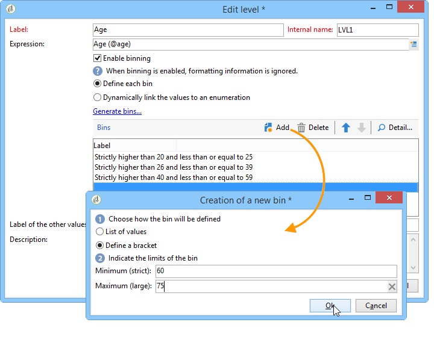

# 多维数据集的最佳实践{#concepts-and-methodology}

## 数据绑定{#data-binning}

绑定使您能够通过根据条件对值分组来简化数据显示。 根据您可用的信息，您可以定义年龄组、将电子邮件域分组到一起、限制为值明细列表、明确限制显示数据以及将专用行或列中的所有其他数据分组在一起，等等。

总的来说，有三种类型的绑定：

1. 使用手动定义的值范围。 例如，年龄、平均购物车、已打开的投放数等。) 有关详细信息，请参阅[定义每个素材箱](#defining-each-bin)。
1. 根据明细列表的值动态调整：仅显示明细列表中包含的值，所有其他值将分组在“其他”中。 有关详细信息，请参阅[动态管理素材箱](#dynamically-managing-bins)。
1. 使用值范围，将所有其他组合在一起。 例如，18至25岁，26至59岁，以及其他人。 有关详细信息，请参阅[创建值范围](#creating-value-ranges)。

要启用绑定，请在创建维时选中相应的框。

您可以手动创建素材箱或将其链接到现有明细列表。

Adobe Campaign还提供自动绑定的助手：可将值划分为N个组，或根据数据库中最频繁的值进行分组。

### 定义每个素材箱{#defining-each-bin}

要单独创建每个素材箱，请选择&#x200B;**[!UICONTROL Define each bin]**&#x200B;选项并使用表创建各种素材箱。

单击&#x200B;**[!UICONTROL Add]**&#x200B;按钮可创建新素材箱，并列表将分组到素材箱中的值。

在下面的示例中，语言分为三种类别:英语/德语/荷兰语、法语/意大利语/西班牙语和其他语种。

可以使用SQL掩码将多个值合并到筛选器中。 要执行此操作，请检查&#x200B;**[!UICONTROL Use an SQL mask]**&#x200B;列中的&#x200B;**[!UICONTROL Yes]**，并输入要在&#x200B;**[!UICONTROL Value or expression]**&#x200B;列中应用的SQL过滤器。

在以下示例中，所有与&#x200B;**yahoo**（yahoo.fr、yahoo.com、yahoo.be等）或&#x200B;**ymail**（ymail.com、ymail.eu等）开始的电子邮件域 将在标签&#x200B;**YAHOO！下进行分组**，以及rocketmail.comdomain **的地** 址。

### 动态管理素材箱{#dynamically-managing-bins}

值可以通过明细列表动态管理。 这意味着只显示明细列表中包含的值。 当明细列表值更改时，多维数据集的内容会自动调整。

要创建此类型的值绑定，请应用以下步骤：

1. 创建新维度并启用绑定。
1. 选择&#x200B;**[!UICONTROL Dynamically link the values to an enumeration]**&#x200B;选项，然后选择匹配明细列表。

   

   每当明细列表值被更新时，匹配素材箱被自动调整。

### 创建值范围{#creating-value-ranges}

您可以根据所需的间隔将这些值分组到多个范围内。

要手动定义范围，请单击&#x200B;**[!UICONTROL Add]**&#x200B;按钮并选择&#x200B;**[!UICONTROL Define a range]** :

然后指定下限和上限，并单击&#x200B;**[!UICONTROL Ok]**&#x200B;进行确认。

### 自动生成素材箱{#generating-bins-automatically}

还可以自动生成素材箱。 为此，请单击&#x200B;**[!UICONTROL Generate bins...]**&#x200B;链接。

您可以：

* 恢复最常用的值

   在以下示例中，将显示4个最常用的值，而其他值将被计数并分组到“其他”类别中。

* 以槽形式生成素材箱

   在下面的示例中，Adobe Campaign自动创建4个大小相同的值槽，以在数据库中显示值。

在这种情况下，将忽略在事实模式中选择的筛选器。

### 明细列表{#enumerations}

为了提高报表的相关性和可读性，Adobe Campaign允许您创建特定明细列表，将不同值重新分组到同一素材箱中。 这些为绑定而保留的明细列表在多维数据集中引用，然后显示在报表中。

Adobe Campaign还对域进行优惠，这样您就可以显示列表库中所有联系人的电子邮件域，按ISP重新分组，如下例所示：

它使用以下模板构建：

要使用此明细列表创建报表，请使用&#x200B;**[!UICONTROL Email domain]**&#x200B;维创建多维数据集。 选择&#x200B;**[!UICONTROL Enable binning]**&#x200B;选项，然后选择&#x200B;**[!UICONTROL Dynamically link the values to an enumeration]**。 然后选择&#x200B;**域**&#x200B;明细列表，如下所示。 没有指定别名的所有值将在&#x200B;**其他**&#x200B;标签下重新分组。

然后，根据此多维数据集创建报告以显示值。

您只需修改明细列表即可更新相关报表。 例如，创建&#x200B;**Adobe**&#x200B;值并添加&#x200B;**adobe.com**&#x200B;别名，报表将自动更新为明细列表级别的Adobe值。

**[!UICONTROL Domains]**&#x200B;明细列表用于生成显示域列表的内置报表。 要调整这些报表的内容，您可以编辑此列表。

您可以创建保留用于绑定的其他明细列表，并在其他多维数据集中使用它们：所有别名值将重新组合到第一个明细列表选项卡中指定的素材箱中。

## 计算和使用聚合{#calculating-and-using-aggregates}

可以用聚合计算最大的数据卷。

聚合在处理大量数据时很有用。 系统会根据在专用工作流框中定义的设置自动更新这些设置，以将最近收集的数据集成到指标中

聚合在每个多维数据集的相关选项卡中定义。

>[!NOTE]
>
>用于更新聚合计算的工作流可以在聚合本身中配置，或者可以通过链接到相关多维数据集的外部工作流来更新聚合。

要创建新聚合，请应用以下步骤：

1. 单击多维数据集的&#x200B;**[!UICONTROL Aggregates]**&#x200B;选项卡，然后单击&#x200B;**[!UICONTROL Add]**&#x200B;按钮。

   

1. 输入聚合的标签，然后添加要计算的维度。

   

1. 选择维度和级别。 对每个维度和每个级别重复此过程。
1. 单击&#x200B;**[!UICONTROL Workflow]**&#x200B;选项卡以创建聚合工作流。

   

   * **[!UICONTROL Scheduler]**&#x200B;活动允许您定义计算更新的频率。 此调度程序详见[本节](../../workflow/using/scheduler.md)。
   * **[!UICONTROL Aggregate update]**&#x200B;活动允许您选择要应用的更新模式：完全或部分。

      默认情况下，在每次计算期间都会执行完整更新。 要启用部分更新，请选择相关选项并定义更新条件。

      

## 定义度量{#defining-measures}

度量类型在多维数据集的&#x200B;**[!UICONTROL Measures]**&#x200B;选项卡中定义。 您可以计算和、平均值、偏差等。

您可以根据需要创建任意数量的度量：然后，选择要在表格中显示或隐藏的度量。 有关详细信息，请参阅[显示度量](#displaying-measures)。

要定义新度量，请应用以下步骤：

1. 单击度量列表上方的&#x200B;**[!UICONTROL Add]**&#x200B;按钮，并选择度量类型和要计算的公式。

   

1. 如有必要，并根据操作符选择操作所关注的表达式。

   使用&#x200B;**[!UICONTROL Advanced selection]**&#x200B;按钮可创建复杂的计算公式。 如需详细信息，请参阅[此部分](../../platform/using/about-queries-in-campaign.md)。

   

1. **[!UICONTROL Filter the measure data...]**&#x200B;链接允许您限制计算字段，并仅将其应用于数据库中的特定数据。

   

1. 输入度量的标签并添加说明，然后单击&#x200B;**[!UICONTROL Finish]**&#x200B;创建。

## 显示度量{#displaying-measures}

您可以根据需要在表中配置度量的显示：

* 度量的显示顺序（参见[显示顺序](#display-sequence)），
* 要在报表中显示/隐藏的信息（请参阅[配置显示屏](#configuring-the-display)）
* 显示哪些度量：百分比、总数、小数位数等。 （请参阅[更改显示的度量类型](#changing-the-type-of-measure-displayed)）。

### 显示序列{#display-sequence}

在多维数据集中计算的度量是通过&#x200B;**[!UICONTROL Measures]**&#x200B;按钮配置的。

移动行以更改显示序列。 在以下示例中，法语数据将移至列表底部：这意味着它将显示在最后一列中。

### 配置显示屏{#configuring-the-display}

可针对每个测量或整体单独执行测量、行和列的配置。 通过特定图标可访问显示模式选择窗口。

* 单击&#x200B;**[!UICONTROL Edit the configuration of the pivot table]**&#x200B;图标以访问配置窗口。

   您可以选择是否显示度量的标签以及配置其布局（行或列）。

使用颜色选项可以突出显示重要值以便于阅读。

### 更改显示的{#changing-the-type-of-measure-displayed}度量类型

在每个度量中，您可以定义要应用的单位和格式。

## 共享报告{#sharing-a-report}

配置报表后，您可以保存报表并与其他操作员共享。

要执行此操作，请单击&#x200B;**[!UICONTROL Show the report properties]**&#x200B;图标并启用&#x200B;**[!UICONTROL Share this report]**&#x200B;选项。

指定报表所属的类别及其相关性。 有关详细信息，请参阅[本页](../../reporting/using/configuring-access-to-the-report.md#report-display-context)中的&#x200B;**显示序列**&#x200B;和&#x200B;**定义筛选选项**&#x200B;部分。

要确认这些更改，您需要保存报表。

## 创建过滤器 {#creating-filters}

可以创建过滤器来查看数据的某个部分。

操作步骤：

1. 单击&#x200B;**[!UICONTROL Add a filter]**&#x200B;图标。

   

1. 选择筛选器所关注的维

   

1. 选择滤镜的类型及其精度级别。

   

1. 创建过滤器后，过滤器将显示在报表上方。

   

   单击过滤器以对其进行编辑。

   单击叉形以将其删除。

   您可以根据需要组合任意数量的过滤器:这些画面都将显示在这个区域。

   

每次修改过滤器（添加、删除、更改）时，都必须重新计算报告。

过滤器也可基于选择创建。 为此，请选择源单元格、行和列，然后单击&#x200B;**[!UICONTROL Add a filter]**&#x200B;图标。

要选择行、列或单元格，请左键单击它。 要取消选择，请再次单击。

过滤器将自动应用并添加到报表上方的过滤器区域。

