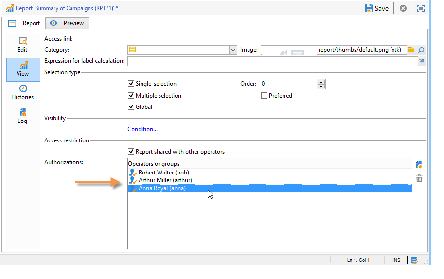
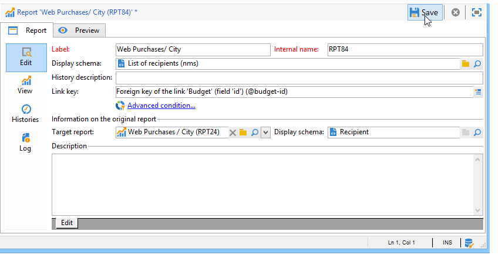

# 配置对报告的访问权限{#configuring-access-to-the-report}

## 报表显示上下文 {#report-display-context}

在Adobe Campaign平台中，使用 **[!UICONTROL Display]** 选项卡。 报表的访问权限取决于其选择类型、显示条件和访问权限。

### 选择类型 {#selection-type}

对报表的访问权限可以限制为特定的上下文或选件空间，例如投放、收件人、选择的收件人等。 此访问权限在 **[!UICONTROL Selection type]** 部分 **[!UICONTROL Display]** 选项卡。

* **[!UICONTROL Single selection]** :仅当选择特定实体时，才可访问报表。
* **[!UICONTROL Multiple selection]** :选择多个实体后，将访问报告。
* **[!UICONTROL Global]** :可通过 **[!UICONTROL Reports]** 选项卡。

### 显示序列  {#display-sequence}

的 **[!UICONTROL Sequence]** 字段中，您可以输入一个数字值，以指定列表中报表的显示顺序。

默认情况下，报表按相关性显示：在此字段中输入的值允许您将报表从最高值（最高值）排序到最低值（最小值）相关。

您可以根据需要选择要使用的比例尺：1到10、0到100、-10到10等

### 显示条件 {#display-conditions}

您还可以通过查询对报表的显示设置条件。

在以下示例中，如果主营销活动渠道是电子邮件，则会显示报表。

这意味着，如果营销活动的主渠道是直邮，则营销活动报表中将不提供该报表。

### 访问授权 {#access-authorization}

可以与其他运算符共享该报表。

要使报表可访问，请选择 **[!UICONTROL Report shared with other operators]** 选项。 如果未选择此选项，则只有创建报表的操作员才能访问报表。

还可以与通过授权窗口添加的特定操作员或操作员组共享报表。

### 定义筛选选项 {#defining-the-filtering-options}

的 **[!UICONTROL Reports]** 选项卡显示平台中所有可用的报表，连接的操作员对这些报表具有访问权限。

默认情况下，这些过滤器按相关性排序，但您可以应用其他类型的过滤器：按字母顺序、年龄等

您还可以根据报表类别过滤显示内容：

要定义报表的类别，请通过 **[!UICONTROL Display]** 选项卡，如下所示：

您可以在此处输入新类别，并将其添加到可用类别列表。 匹配的枚举会自动更新。

## 创建指向报表的链接 {#creating-a-link-to-a-report-}

可以通过树的特定节点（如列表、收件人、投放等）访问报表。 要实现此目的，只需创建一个指向相关报告的链接，并指定要将其提供到的实体即可。

例如，我们将创建一个指向报表的链接，以便通过收件人列表访问该报表。

1. 单击 **[!UICONTROL New]** 选择 **[!UICONTROL Create a link to an existing report]** 中。

   

1. 从下拉列表中选择要创建链接的报表。 在本例中，我们将选择 **按国家/地区划分** 报表。

   

1. 输入标签并选择架构。 在本例中，我们将选择收件人列表表。

   

   这意味着可通过任何收件人列表访问报告，并且统计信息将与选定列表中的收件人有关。

1. 保存和显示您的报表。
1. 输入链接键。 在这种情况下，“文件夹”链接的外键。

   

1. 发布报表。
1. 转到收件人列表之一，然后单击 **[!UICONTROL Reports]** 链接：您可以访问刚刚创建的报表。

   

## 报表预览 {#preview-of-the-report}

在发布报表之前，请确保在 **[!UICONTROL Preview]** 选项卡。

要显示报表的预览，请选择 **[!UICONTROL Global]** 或 **[!UICONTROL Selection]** 选项。

这两个选项是根据报表的显示设置选择的。 如果显示设置为 **[!UICONTROL Global]**，您需要选择 **[!UICONTROL Global]** 预览选项。 如果显示设置为 **[!UICONTROL Single selection]** 或 **[!UICONTROL Multiple selection]**, **[!UICONTROL Selection]** 必须选择预览选项。

有关更多信息，请参阅 [报表显示上下文](#report-display-context).

通过特定设置，您可以控制错误。 的 **_uuid** 设置。 您可以将 **&amp;_preview** 或 **&amp;_debug** 设置。

要了解有关这些设置的更多信息，请参阅 **定义Web窗体属性** 部分 [Web窗体](../../web/using/about-web-forms.md) 章节。

## 发布报表 {#publishing-the-report}

必须发布报表，才能与其他运算符共享并在可用报表列表中显示它们(另请参阅 [报表显示上下文](#report-display-context))。 每次更改报表时，必须再次执行此操作。

1. 通过单击 **[!UICONTROL Publish]** 中。

   

1. 单击 **[!UICONTROL Start]** 。

   

1. 单击 **[!UICONTROL Enlarge]** 图标以在Web浏览器中打开报表。
