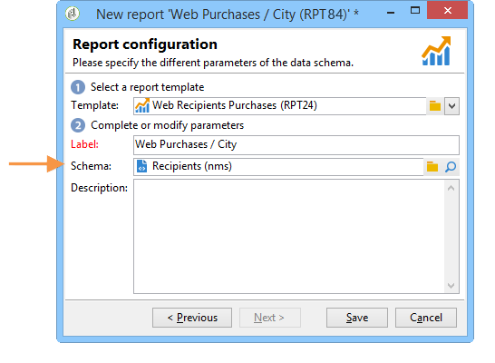

# 配置对报告的访问权限{#configuring-access-to-the-report}

## 报告显示上下文 {#report-display-context}

在Adobe Campaign平台中使用定义报告的显示上下文 **[!UICONTROL Display]** 选项卡。 对报告的访问取决于其选择类型、显示条件和访问权限。

### 选择类型 {#selection-type}

可将报表的访问限制为特定上下文或选件空间，例如投放、收件人、选定的收件人等。 此访问权限配置于 **[!UICONTROL Selection type]** 的部分 **[!UICONTROL Display]** 选项卡。

* **[!UICONTROL Single selection]** ：仅当选择特定实体时，报表才可访问。
* **[!UICONTROL Multiple selection]** ：选择多个实体后可访问报表。
* **[!UICONTROL Global]** ：通过中的可用报告列表访问报告 **[!UICONTROL Reports]** 选项卡。

### 显示序列  {#display-sequence}

此 **[!UICONTROL Sequence]** 字段可让您输入数字值，该值指定报表在列表中的显示顺序。

默认情况下，报表按相关性显示：通过在此字段中输入的值，可将报表从相关的最大（最大值）排序到最小（最小值）排序。

您可以根据需要选择要使用的比例：1到10、0到100、-10到10等。

### 显示条件 {#display-conditions}

您还可以通过查询来设置报表的显示条件。

在以下示例中，如果主要营销活动渠道是电子邮件，则会显示报表。

这意味着如果促销活动的主要渠道是直邮，则这些报表将无法在促销活动报表中使用。

### 访问授权 {#access-authorization}

该报表可以与其他操作员共享。

要使报告可访问，请选择 **[!UICONTROL Report shared with other operators]** 选项。 如果未选择此选项，则只有创建报告的操作员才能访问报告。

还可以通过授权窗口与特定的操作员或操作员组共享该报告。

### 定义筛选选项 {#defining-the-filtering-options}

此 **[!UICONTROL Reports]** 选项卡显示平台中所有可用的报告，并且已连接的操作员对其具有访问权限。

默认情况下，这些过滤器按相关性排序，但您可以应用其他类型的过滤器：按字母顺序、按年龄等。

您还可以根据报告类别筛选显示：

要定义报告的类别，请通过 **[!UICONTROL Display]** 选项卡，如下所示：

您可以在此处输入新类别，并将其添加到可用类别列表。 将自动更新匹配的明细列表。

## 创建指向报告的链接 {#creating-a-link-to-a-report-}

可以通过树的特定节点（如列表、收件人、投放等）访问报告。 要实现此目的，只需创建指向相关报告的链接，并指定您想在其中提供该链接的实体。

例如，我们将创建指向报告的链接，以便通过收件人列表访问该链接。

1. 单击 **[!UICONTROL New]** 并选择 **[!UICONTROL Create a link to an existing report]** 在报告创建向导中。

   

1. 使用下拉列表选择要创建链接的报告。 在本例中，我们将选择 **按国家细分** 报告。

   

1. 输入标签并选择架构。 在本例中，我们将选择收件人列表表。

   

   这意味着该报表可通过任何收件人列表访问，并且该统计信息将涉及所选列表中的收件人。

1. 保存并显示报告。
1. 输入链接键。 在本例中，为“文件夹”链接的外键。

   

1. 发布报表。
1. 转到您的某个收件人列表，然后单击 **[!UICONTROL Reports]** 链接：您刚刚创建的报告可供访问。

   

## 报告预览 {#preview-of-the-report}

在发布报告之前，请确保该报告在 **[!UICONTROL Preview]** 选项卡。

要显示报告预览，请选择 **[!UICONTROL Global]** 或 **[!UICONTROL Selection]** 选项。

这两个选项将根据报表的显示设置进行选择。 如果显示设置为 **[!UICONTROL Global]**，您需要选择 **[!UICONTROL Global]** 预览选项。 如果显示设置为 **[!UICONTROL Single selection]** 或 **[!UICONTROL Multiple selection]**， **[!UICONTROL Selection]** 必须选择“预览”选项。

有关详细信息，请参见 [报告显示上下文](#report-display-context).

通过特定设置，您可以控制错误。 此 **_uuid** 设置可在报表的URL中找到。 您可以添加 **&amp;预览** 或 **&amp;_debug** 设置。

要了解有关这些设置的更多信息，请参阅 **定义Web窗体属性** 的部分 [Web窗体](../../web/using/about-web-forms.md) 章节。

## 发布报告 {#publishing-the-report}

要与其他操作员共享这些区段并在可用报表列表中显示它们，必须发布报表(另请参阅 [报告显示上下文](#report-display-context))。 每次更改报告时必须再次执行此操作。

1. 通过单击打开发布向导 **[!UICONTROL Publish]** 工具栏中。

   

1. 单击 **[!UICONTROL Start]** 以发布。

   

1. 单击 **[!UICONTROL Enlarge]** 图标以在Web浏览器中打开报表。
