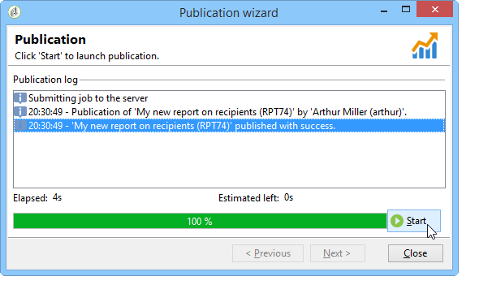

# 配置对报告的访问权限{#configuring-access-to-the-report}

## 报告显示上下文 {#report-display-context}

使用选项卡在Adobe Campaign平台中定义报表的显示上 **[!UICONTROL Display]** 下文。 对报告的访问取决于报告的选择类型、显示条件和访问授权。

### 选择类型 {#selection-type}

对报告的访问可限于特定上下文或选件空间，例如分发、收件人、选择的收件人等。 此访问权限在选项卡 **[!UICONTROL Selection type]** 的部分中进行 **[!UICONTROL Display]** 配置。

* **[!UICONTROL Single selection]** :只有在选择特定实体时，才能访问报告。
* **[!UICONTROL Multiple selection]** :选择多个实体后，将访问报告。
* **[!UICONTROL Global]** :可通过“报告”(Reports)范围中的可用报告列表访问报告。

### 显示序列 {#display-sequence}

该字 **[!UICONTROL Sequence]** 段允许您输入一个数值，它指定列表中报表的显示顺序。

默认情况下，报告按相关性显示：在此字段中输入的值允许您将报表从最高（最高值）排序到最低（最小值）相关。

您可以根据需要选择要使用的比例：1到10,0到100,-10到10，等等。

### 显示条件 {#display-conditions}

您还可以通过查询对报告的显示进行条件设置。

在以下示例中，如果主营销活动渠道是电子邮件，则显示报表。

这意味着，如果营销活动的主渠道是直接邮寄，则营销活动报告中将不提供该报告。

### 访问授权 {#access-authorization}

报告可以与其他操作符共享。

要使报表可访问，请选择相应 **[!UICONTROL Report shared with other operators]** 选项。 如果未选择此选项，则只有创建报告的操作员才能访问报告。

还可以与通过授权窗口添加的特定操作符或操作符组共享报告。

### 定义筛选选项 {#defining-the-filtering-options}

The universe **[!UICONTROL Reports]** displays all available reports in the platform and which connected operator an access rights.

默认情况下，这些过滤器按相关性排序，但您可以应用其他类型的过滤器：字母顺序，按年龄等

您还可以根据报告类别筛选显示内容：

要定义报表的类别，请通过选项卡选择该报 **[!UICONTROL Display]** 表，如下所示：

您可以在此处输入新类别，并将其添加到可用类别列表。 匹配的枚举会自动更新。

## 创建指向报告的链接 {#creating-a-link-to-a-report-}

可以通过树的特定节点（如列表、收件人、分发等）访问报表。 为此，只需创建一个指向相关报告的链接并指定要将其用于的实体。

例如，我们将创建一个指向报表的链接，以便通过收件人列表访问该报表。

1. 单击 **[!UICONTROL New]** 并在报 **[!UICONTROL Create a link to an existing report]** 表创建向导中选择。

   

1. 选择要使用下拉列表创建链接的报表。 在此示例中，我们将选择按国家／地区 **划分的报表** 。

   

1. 输入标签，然后选择架构。 在此示例中，我们将选择收件人列表表。

   

   这意味着报告可以通过任何收件人列表访问，并且统计信息将与所选列表中的收件人相关。

1. 保存和显示报表。
1. 输入链接键。 在这种情况下，“文件夹”链接的外键。

   

1. 发布报告。
1. 转到某个收件人列表并单击该 **[!UICONTROL Reports]** 链接：您刚刚创建的报告可访问。

   

## 报告预览 {#preview-of-the-report}

在发布报告之前，请确保报告在选项卡中正确显 **[!UICONTROL Preview]** 示。

要显示报表的预览，请选择或 **[!UICONTROL Global]** 选择选 **[!UICONTROL Selection]** 项。

根据报告的显示设置选择这两个选项。 如果显示设置 **[!UICONTROL Global]**&#x200B;为，则需要选择预览 **[!UICONTROL Global]** 选项。 如果显示设置为或， **[!UICONTROL Single selection]** 则必 **[!UICONTROL Multiple selection]**&#x200B;须选择 **[!UICONTROL Selection]** 预览选项。

有关详细信息，请参阅报 [告显示上下文](#report-display-context)。

通过特定设置，您可以控制错误。 报 **表的URL中有** _uuid设置。 您可以向 **其添加&amp;_preview****或&amp;_debug** 设置。

要进一步了解这些设置，请参阅 **Web表单一章的** “定义Web表 [单属性](../../web/using/about-web-forms.md) ”一节。

## 发布报告 {#publishing-the-report}

必须发布报告，才能与其他操作员共享报告并在可用报告列表中显示它们(也请参阅 [报告显示上下文](#report-display-context))。 每次更改报告时，都必须再次执行此操作。

1. 单击工具栏中的，打开 **[!UICONTROL Publish]** 发布向导。

   

1. 单击 **[!UICONTROL Start]** 以发布。

   

1. 单击图 **[!UICONTROL Enlarge]** 标以在Web浏览器中打开报表。

