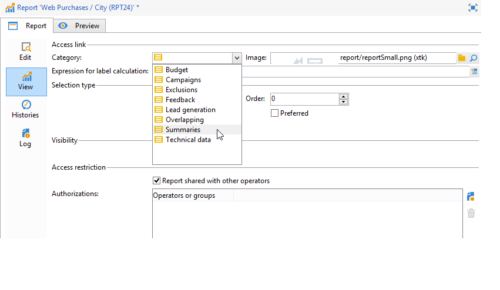

# 配置对报告的访问权限{#configuring-access-to-the-report}

## 报告显示上下文 {#report-display-context}

使用&#x200B;**[!UICONTROL Display]**&#x200B;选项卡在Adobe Campaign平台中定义报告的显示上下文。 对报告的访问取决于其选择类型、显示条件和访问权限。

### 选择类型 {#selection-type}

可将报表的访问限制为特定上下文或选件空间，例如投放、收件人、选定的收件人等。 此访问在&#x200B;**[!UICONTROL Display]**&#x200B;选项卡的&#x200B;**[!UICONTROL Selection type]**&#x200B;部分中配置。

* **[!UICONTROL Single selection]** ：仅当选择特定实体时，才能访问报表。
* **[!UICONTROL Multiple selection]** ：在选择了多个实体时访问报告。
* **[!UICONTROL Global]** ：通过&#x200B;**[!UICONTROL Reports]**&#x200B;选项卡中的可用报告列表访问该报告。

### 显示序列  {#display-sequence}

**[!UICONTROL Sequence]**&#x200B;字段允许您输入数字值，该值指定报表在列表中的显示顺序。

默认情况下，报表按相关性显示：通过在此字段中输入的值，可将报表从相关的最大（最大值）排序到最小（最小值）排序。

您可以根据需要选择要使用的比例：1到10、0到100、-10到10等。

### 显示条件 {#display-conditions}

您还可以通过查询来设置报表的显示条件。

在以下示例中，如果主要营销活动渠道是电子邮件，则会显示报表。

这意味着如果促销活动的主要渠道是直邮，则这些报表将无法在促销活动报表中使用。

### 访问授权 {#access-authorization}

该报表可以与其他操作员共享。

要使报告可访问，请选择&#x200B;**[!UICONTROL Report shared with other operators]**&#x200B;选项。 如果未选择此选项，则只有创建报告的操作员才能访问报告。

还可以通过授权窗口与特定的操作员或操作员组共享该报告。

### 定义筛选选项 {#defining-the-filtering-options}

**[!UICONTROL Reports]**&#x200B;选项卡显示平台中所有可用的报告，并且连接的操作员具有这些报告的访问权限。

默认情况下，这些过滤器按相关性排序，但您可以应用其他类型的过滤器：按字母顺序、按年龄等。

您还可以根据报告类别筛选显示：

要定义报告的类别，请通过&#x200B;**[!UICONTROL Display]**&#x200B;选项卡选择它，如下所示：

您可以在此处输入新类别，并将其添加到可用类别列表。 将自动更新匹配的明细列表。

## 创建指向报告的链接 {#creating-a-link-to-a-report-}

可以通过树的特定节点（如列表、收件人、投放等）访问报告。 要实现此目的，只需创建指向相关报告的链接，并指定您想在其中提供该链接的实体。

例如，我们将创建指向报告的链接，以便通过收件人列表访问该链接。

1. 单击&#x200B;**[!UICONTROL New]**&#x200B;并在报告创建助手中选择&#x200B;**[!UICONTROL Create a link to an existing report]**。

   

1. 使用下拉列表选择要创建链接的报告。 在此示例中，我们将选择&#x200B;**按国家/地区划分**&#x200B;报表。

   

1. 输入标签并选择架构。 在本例中，我们将选择收件人列表表。

   

   这意味着该报表可通过任何收件人列表访问，并且该统计信息将涉及所选列表中的收件人。

1. 保存并显示报告。
1. 输入链接键。 在本例中，为“文件夹”链接的外键。

   

1. Publish您的报表。
1. 转到您的某个收件人列表并单击&#x200B;**[!UICONTROL Reports]**&#x200B;链接：您刚刚创建的报告可供访问。

   

## 报告预览 {#preview-of-the-report}

在发布报告之前，请确保报告在&#x200B;**[!UICONTROL Preview]**&#x200B;选项卡中正确显示。

要显示报告预览，请选择&#x200B;**[!UICONTROL Global]**&#x200B;或&#x200B;**[!UICONTROL Selection]**&#x200B;选项。

这两个选项将根据报表的显示设置进行选择。 如果显示设置为&#x200B;**[!UICONTROL Global]**，则需要选择&#x200B;**[!UICONTROL Global]**&#x200B;预览选项。 如果显示设置是&#x200B;**[!UICONTROL Single selection]**&#x200B;或&#x200B;**[!UICONTROL Multiple selection]**，则必须选择&#x200B;**[!UICONTROL Selection]**&#x200B;预览选项。

有关详细信息，请参阅[报告显示上下文](#report-display-context)。

通过特定设置，您可以控制错误。 在报告的URL中找到&#x200B;**_uuid**&#x200B;设置。 您可以将&#x200B;**&amp;_preview**&#x200B;或&#x200B;**&amp;_debug**&#x200B;设置添加到其中。

要了解有关这些设置的更多信息，请参阅[Web窗体](../../web/using/about-web-forms.md)章节的&#x200B;**定义Web窗体属性**&#x200B;部分。

## Publish报表 {#publishing-the-report}

必须发布报告，以便与其他操作员共享报告并在可用报告列表中显示它们（另请参阅[报告显示上下文](#report-display-context)）。 每次更改报告时必须再次执行此操作。

1. 单击工具栏中的&#x200B;**[!UICONTROL Publish]**&#x200B;打开发布助手。

   

1. 单击&#x200B;**[!UICONTROL Start]**&#x200B;以发布。

   

1. 单击&#x200B;**[!UICONTROL Enlarge]**&#x200B;图标以在Web浏览器中打开报告。
