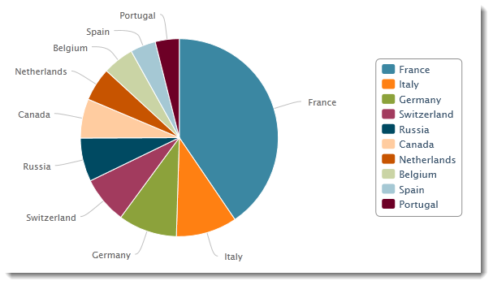
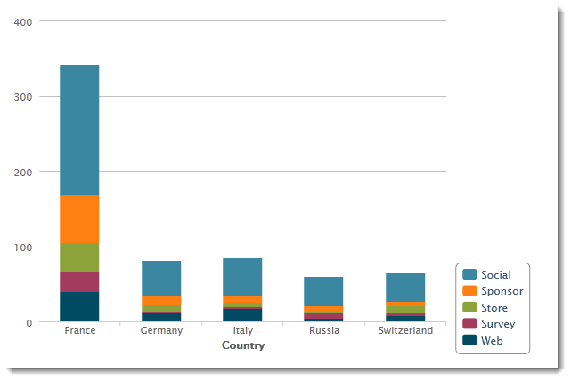

# 创建图表{#creating-a-chart}

数据库中的数据也可以收集并显示在图表中。 Adobe Campaign提供了一组图形表示法。 其配置详见下文。

图表通过右键单击菜单或工具栏直接插入报表页面。

## 创建步骤 {#creation-steps}

要在报表中创建图表，请应用以下步骤：

1. 编辑要在其中显示图表的页面，然后在工具栏中选择图表类型。

   

1. 输入名称和标题。 如有必要，您可以使用下拉列表更改题注的位置。

   

1. 单击&#x200B;**[!UICONTROL Data]**&#x200B;选项卡以定义要计算的数据源和系列。

   要显示在图表中的统计信息可根据查询或上下文数据计算，即当前页面的集客过渡提供的数据（有关更多信息，请参阅[使用上下文数据](../../reporting/using/using-the-context.md#using-context-data)）。

   * 单击&#x200B;**[!UICONTROL Filter data...]**&#x200B;链接以定义数据库中数据的过滤条件。

     

   * 要使用上下文数据，请从&#x200B;**[!UICONTROL Source]**&#x200B;下拉列表中选择&#x200B;**[!UICONTROL Context data]**，然后单击&#x200B;**[!UICONTROL Advanced settings...]**&#x200B;链接。 然后，选择统计数据将涉及的数据。

     

     然后，您将能够访问上下文数据以定义要在图表中显示的值：

     

## 图表类型和变量 {#chart-types-and-variants}

Adobe Campaign提供各种类型的图形表示。 详情见下文。

将图表类型插入到页面中时，会选择此图表类型。

也可以通过图表中&#x200B;**[!UICONTROL General]**&#x200B;选项卡的&#x200B;**[!UICONTROL Chart type]**&#x200B;部分更改它。

变量取决于所选的图表类型。 它们通过&#x200B;**[!UICONTROL Variants...]**&#x200B;链接选择。

### 划分：饼图 {#breakdown--pie-charts}

通过这种类型的图形表示，可显示测量元素的概述。

饼图仅允许您分析一个变量。

**[!UICONTROL Variants]**&#x200B;链接允许您个性化图表的整体呈现。

饼图允许您在相应的字段中输入内半径的值。

例如：

0.00跟踪一个完整的圆圈。

0.40跟踪半径为40%的圆。

1.00只跟踪圆圈的外部。

### 演变：曲线和区域 {#evolution--curves-and-areas}

通过这种图形表示，可及时了解一个或多个度量的演变。

### 比较：直方图 {#comparison--histograms}

直方图允许您比较一个或多个变量的值。

对于这些类型的图表，**[!UICONTROL Variants]**&#x200B;窗口中提供了以下选项：

选中&#x200B;**[!UICONTROL Display caption]**&#x200B;选项以在图表中显示标题，并选择其位置：

在适当时，您可以将值栈叠在一起。

如有必要，您可以反转值显示顺序。 为此，请选择&#x200B;**[!UICONTROL Reverse stacking]**&#x200B;选项。

### 转化：漏斗 {#conversion--funnel}

通过此类图表，您可以跟踪测量元素的对话率。

## 与图表的交互 {#interaction-with-the-chart}

您可以定义用户单击图表时的操作。 打开&#x200B;**[!UICONTROL Interaction events]**&#x200B;窗口并选择要执行的操作。

[此部分](../../web/using/static-elements-in-a-web-form.md#inserting-html-content)中详细介绍了可能的交互类型及其配置。

## 计算统计信息 {#calculating-statistics}

图表可显示收集数据的统计信息。

这些统计信息是通过&#x200B;**[!UICONTROL Data]**&#x200B;选项卡的&#x200B;**[!UICONTROL Series parameters]**&#x200B;部分定义的。

要创建新统计信息，请单击&#x200B;**[!UICONTROL Add]**&#x200B;图标并配置相应的窗口。 可用的计算类型详见下文。

如需详细信息，请参阅[此小节](../../reporting/using/using-the-descriptive-analysis-wizard.md#statistics-calculation)。
